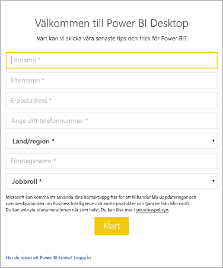

# <a name="administrators-manage-the-power-bi-desktop-sign-in-form"></a>Administratörer: Hantera inloggningsformuläret för Power BI Desktop
Första gången Power BI Desktop startas visas ett inloggningsformulär. Informationen kan vara ifylld. Annars loggar du in i Power BI för att fortsätta. Administratörer kan hantera det här formuläret med hjälp av en registernyckel. 



Administratörer använder följande registernyckel för att inaktivera inloggningsformuläret. Åtgärden kan även tillämpas i hela företaget med hjälp av globala principer.

```
Key: HKEY_CURRENT_USER\SOFTWARE\Policies\Microsoft\Microsoft Power BI Desktop
valueName: ShowLeadGenDialog
```
Du kan även prova följande nyckel, som har fungerat för vissa kunder baserat på deras konfigurationer:

```
Key: HKEY_CURRENT_USER\SOFTWARE\Microsoft\Microsoft Power BI Desktop
valueName: ShowLeadGenDialog
```

Värdet 0 inaktiverar dialogrutan.


Har du fler frågor? [Fråga Power BI Community](https://community.powerbi.com/)

