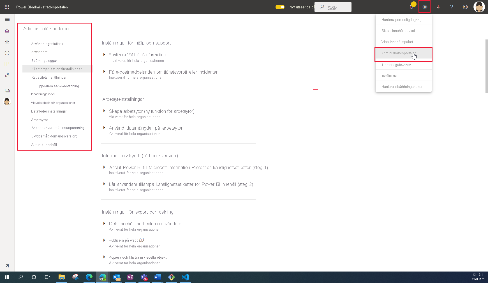

# Vad är Power BI-administration?

Power BI-administration syftar på hanteringen av organisationsomfattande inställningar som styr hur Power BI fungerar. Användare som tilldelas administratörsroller konfigurerar, övervakar och etablerar organisationsresurser. Den här artikeln ger en översikt över administrationsrollerna, uppgifterna och verktygen så att du snabbt kommer igång.

## Administratörsroller relaterade till Power BI

Flera roller används tillsammans för att administrera Power BI för din organisation. De flesta administratörsroller tilldelas i Administrationscenter för Microsoft 365 eller via PowerShell. Administratörsroller för kapaciteten Power BI Premium och kapaciteten Power BI Embedded tilldelas när kapaciteten skapas. Mer information om de olika administratörsrollerna finns i [Om administratörsroller](https://docs.microsoft.com/microsoft-365/admin/add-users/about-admin-roles?view=o365-worldwide). Mer information om hur du tilldelar administratörsroller finns i [Tilldela administratörsroller](https://docs.microsoft.com/microsoft-365/admin/add-users/assign-admin-roles?view=o365-worldwide).

| **Typ av administratör** | **Administrativ omfattning** | **Power BI-uppgifter** |
| --- | --- | --- |
| Global administratör | Microsoft 365 | Har obegränsad åtkomst till alla hanteringsfunktioner för organisationen |
| | | Tilldelar roller till andra användare |
| Faktureringsadministratör | Microsoft 365 | Hantera prenumerationer |
| | | Köpa licenser |
| Licensadministratör | Microsoft 365 | Tilldela eller ta bort licenser för användare |
| Användaradministratör | Microsoft 365 | Skapa och hantera användare och grupper |
| | | Återställa användarlösenord |
| Power BI-administratör | Power BI-tjänst | Fullständig åtkomst till Power BI-hanteringsuppgifter|
| | | Aktivera och inaktivera Power BI-funktioner |
| | | Rapportera om användning och prestanda |
| | | Undersöka och hantera granskning |
| Administratör för Power BI Premium-kapacitet | En enda Premium-kapacitet | Tilldela arbetsytor till kapaciteten|
| | | Hantera användarbehörighet för kapaciteten |
| | | Hantera arbetsbelastningar för att konfigurera minnesanvändning |
| | | Starta om kapaciteten |
| Administratör för Power BI Embedded-kapacitet | En enda Embedded-kapacitet | Tilldela arbetsytor till kapaciteten|
| | | Hantera användarbehörighet för kapaciteten |
| | | Hantera arbetsbelastningar för att konfigurera minnesanvändning |
| | | Starta om kapaciteten |

## Administrativa uppgifter och verktyg

Power BI-administratörer arbetar huvudsakligen på Power BI-administrationsportalen. Du bör dock bekanta dig med relaterade verktyg och administrationscenter. Titta i tabellen ovan och se vilken roll som krävs för att utföra uppgifter med hjälp av verktygen som anges här.

| **Verktyg** | **Vanliga uppgifter** |
| --- | --- |
| [Power BI-administratörsportalen](https://app.powerbi.com/admin-portal) | Anskaffa och arbeta med Premium-kapacitet |
| | Säkra servicekvaliteten |
| | Hantera arbetsytor |
| | Publicera visuella Power BI-objekt |
| | Kontrollera koder som används för att bädda in Power BI i andra program |
| | Felsöka dataåtkomst och andra problem |
| [Administrationscenter för Microsoft 365](https://admin.microsoft.com) | Hantera användare och grupper |
| | Köpa och tilldela licenser |
| | Blockera användare från att få åtkomst till Power BI |
| [Säkerhets- och efterlevnadscenter i Microsoft 365](https://protection.office.com) | Undersöka och hantera granskning |
| | Dataklassificering och dataspårning |
| | Principer för dataförlustskydd |
| | Informationsstyrning |
| [Azure Active Directory (AAD) på Azure-portalen](https://aad.portal.azure.com) | Konfigurera villkorlig åtkomst till Power BI-resurser |
| | Tillhandahålla Power BI Embedded-kapacitet |
| [PowerShell-cmdletar](https://docs.microsoft.com/powershell/power-bi/overview) | Hantera arbetsytor och andra aspekter av Power BI via skript |
| [Administrativa API:er och SDK](service-admin-reference.md) | Utveckla anpassade administrationsverktyg. Power BI Desktop kan till exempel använda dessa API:er för att skapa rapporter som bygger på administrationsrelaterade data. |

## Nästa steg

Nu när du kan grunderna i Power BI-administration rekommenderar vi att du läser följande artiklar för att lära dig mer:

- [Använda Power BI-administratörsportalen](service-admin-portal.md)
- [Guide till administratörsinställningar för klientorganisationer](../guidance/admin-tenant-settings.md)
- [Använda PowerShell-cmdletar](https://docs.microsoft.com/powershell/power-bi/overview)
- [Vanliga frågor om Power BI-administration](service-admin-faq.md)
- [Licensiera tjänsten Power BI för användare i din organisation](service-admin-licensing-organization.md)
- Har du några frågor? [Fråga Power BI Community](https://community.powerbi.com/)
- Har du förslag? [Bidra till att förbättra Power BI](https://ideas.powerbi.com/)
