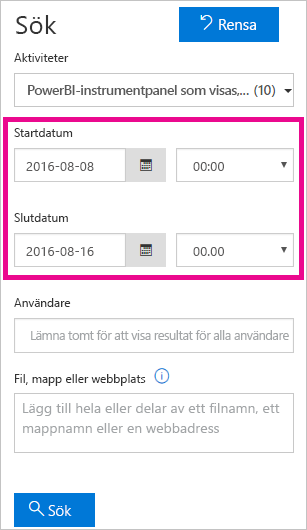
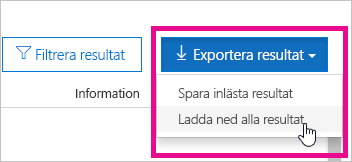

# <a name="track-user-activities-in-power-bi"></a>Spåra användaraktiviteter i Power BI

Att veta vem som har vidtagit en viss åtgärd för ett visst objekt i din Power BI-klientorganisation kan vara av avgörande betydelse när det gäller att hjälpa organisationen att uppfylla olika krav, till exempel regelefterlevnad och posthantering. Med Power BI har du två alternativ för att spåra användaraktivitet: [Power BI-aktivitetslogg](#use-the-activity-log) och [enhetlig spårningslogg](#use-the-audit-log). Båda dessa loggar innehåller en fullständig kopia av [Power BI-granskningsdata](#operations-available-in-the-audit-and-activity-logs), men det finns flera viktiga skillnader som sammanfattas i följande tabell.

| **Enhetlig spårningslogg** | **Power BI-aktivitetslogg** |
| --- | --- |
| Innehåller händelser från SharePoint Online, Exchange Online, Dynamics 365 och andra tjänster utöver Power BI-granskningshändelserna. | Innehåller endast Power BI-granskningshändelserna. |
| Endast användare med behörigheter för skrivskyddade granskningsloggar eller granskningsloggar, till exempel globala administratörer och granskare, har åtkomst. | Globala administratörer och Power BI-tjänstadministratörer har åtkomst. |
| Globala administratörer och granskare kan söka i den enhetliga spårningsloggen i Microsoft 365 Säkerhetscenter och Microsoft 365 Efterlevnadscenter. | Det finns inget användargränssnitt för att söka i aktivitetsloggen ännu. |
| Globala administratörer och granskare kan ladda ned granskningsloggposter med hjälp av API:er och cmdletar för Microsoft 365-hantering. | Globala administratörer och Power BI-tjänstadministratörer kan ladda ned aktivitetsloggposter med hjälp av ett Power BI REST API och en cmdlet för hantering. |
| Behåller granskningsdata i 90 dagar | Behåller aktivitetsdata i 30 dagar (offentlig förhandsversion). |
| Behåller granskningsdata, även om klientorganisationen flyttas till en annan Azure-region. | Behåller inte aktivitetsdata när klientorganisationen flyttas till en annan Azure-region. |


## <a name="use-the-activity-log"></a>Använd aktivitetsloggen

Som Power BI-tjänstadministratör kan du analysera användningen för alla Power BI-resurser på klientorganisationsnivå genom att använda anpassade rapporter som baseras på Power BI-aktivitetsloggen. Du kan ladda ned aktiviteterna med hjälp av ett REST API eller en PowerShell-cmdlet. Du kan även filtrera aktivitetsdata efter datumintervall, användare och aktivitetstyp.

### <a name="activity-log-requirements"></a>Krav för aktivitetslogg

Du måste uppfylla följande krav för att komma åt Power BI-aktivitetsloggen:

- Du måste vara antingen en global administratör eller Power BI-tjänstadministratör.
- Du har installerat [Power BI Management-cmdletarna](https://www.powershellgallery.com/packages/MicrosoftPowerBIMgmt) lokalt eller använder Power BI-cmdletarna för hantering i Azure Cloud Shell.

### <a name="activityevents-rest-api"></a>ActivityEvents REST API

Du kan använda ett administrativt program baserat på Power BI REST-API:erna för att exportera aktivitetshändelser till ett blob-lager eller en SQL-databas. Sedan kan du skapa en anpassad användningsrapport ovanpå exporterade data. I REST API-anropet **ActivityEvents** måste du ange ett startdatum och slutdatum samt eventuellt ett filter för att välja aktiviteter efter aktivitetstyp eller användar-ID. Eftersom aktivitetsloggen kan innehålla stora mängder data stöder **ActivityEvents**-API:et för närvarande endast nedladdning av upp till en dag med data per begäran. Med andra ord måste startdatumet och slutdatumet ange samma dag, som i följande exempel. Se till att du anger DateTime-värdena i UTC-format.

```
https://api.powerbi.com/v1.0/myorg/admin/activityevents?startDateTime='2019-08-31T00:00:00'&endDateTime='2019-08-31T23:59:59'
```

Om antalet poster är stort returnerar **ActivityEvents**-API:et bara cirka 5 000 till 10 000 poster samt en fortsättningstoken. Anropa **ActivityEvents**-API:et igen med en fortsättningstoken för att hämta nästa batch med poster och så vidare tills du har hämtat alla poster och inte längre får en fortsättningstoken. I följande exempel visas hur du använder fortsättningstoken.

```
https://api.powerbi.com/v1.0/myorg/admin/activityevents?continuationToken='%2BRID%3ARthsAIwfWGcVAAAAAAAAAA%3D%3D%23RT%3A4%23TRC%3A20%23FPC%3AARUAAAAAAAAAFwAAAAAAAAA%3D'
```

Om resultatet innehåller en fortsättningstoken så ska du anropa API:et igen med denna token för att hämta återstående data. Fortsätt göra detta tills det inte längre returneras någon fortsättningstoken, oavsett hur många poster som returneras. Det kan hända att ett anrop till och med returnerar en fortsättningstoken utan några händelseposter. I följande exempel visas hur du loopar med en fortsättningstoken som returneras i svaret:

```
while(response.ContinuationToken != null)
{
   // Store the activity event results in a list for example
    completeListOfActivityEvents.AddRange(response.ActivityEventEntities);

    // Make another call to the API with continuation token
    response = GetPowerBIActivityEvents(response.ContinuationToken)
}
completeListOfActivityEvents.AddRange(response.ActivityEventEntities);
```
> [!NOTE]
> Det kan ta upp till 24 timmar för alla händelser att visas, men fullständiga data görs vanligtvis tillgängliga snabbare än så.
>
>
### <a name="get-powerbiactivityevent-cmdlet"></a>Cmdleten Get-PowerBIActivityEvent

Ladda ned aktivitetshändelser med hjälp av cmdletar för hantering av Power BI för PowerShell. Cmdleten **Get-PowerBIActivityEvent** hanterar automatiskt fortsättningstoken åt dig. Cmdleten **get-PowerBIActivityEvent** tar en StartDateTime-parameter och en EndDateTime-parameter med samma begränsningar som **ActivityEvents** REST-API:et. Med andra ord måste startdatumet och slutdatumet referera till samma datumvärde eftersom du bara kan hämta aktivitetsdata för en dag i taget.

Följande skript visar hur du laddar ned alla Power BI-aktiviteter. Kommandot konverterar resultatet från JSON till .NET-objekt för enkel åtkomst till enskilda aktivitetsegenskaper. De här exemplen visar de minsta och största tidsstämplarna för en dag som är möjliga för att se till att inga händelser missas.

```powershell
Login-PowerBI

$activities = Get-PowerBIActivityEvent -StartDateTime '2019-08-31T00:00:00' -EndDateTime '2019-08-31T23:59:59' | ConvertFrom-Json

$activities.Count
$activities[0]

```

### <a name="filter-activity-data"></a>Filtrera aktivitetsdata

Du kan filtrera aktivitetshändelser efter aktivitetstyp och användar-ID. Följande skript visar hur du bara laddar ned händelsedata för aktiviteten **ViewDashboard**. Om du vill ha mer information om parametrar som stöds använder du kommandot `Get-Help Get-PowerBIActivityEvent`.

```powershell
Login-PowerBI

$activities = Get-PowerBIActivityEvent -StartDateTime '2019-08-31T00:00:00' -EndDateTime '2019-08-31T23:59:59' -ActivityType 'ViewDashboard' | ConvertFrom-Json

$activities.Count
$activities[0]

```

## <a name="use-the-audit-log"></a>Använda granskningsloggen

Om din uppgift är att spåra användaraktiviteter i Power BI och Microsoft 365 arbetar du med granskning i Säkerhets- och efterlevnadscenter för Office 365 eller använder PowerShell. Granskningen förlitar sig på funktioner i Exchange Online, som etableras automatiskt som stöd för Power BI.

Du kan filtrera granskningsdata efter datumintervall, användare, instrumentpanel, rapport, datamängd och aktivitetstyp. Du kan även ladda ned aktiviteterna till en CSV-fil för att analysera dem offline.

### <a name="audit-log-requirements"></a>Krav för granskningslogg

Du måste uppfylla följande krav för att komma åt granskningsloggar:

- Du måste antingen vara global administratör eller ha tilldelats rollen Spårningsloggar eller Visa enbart spårningsloggar i Exchange Online för att få åtkomst till spårningsloggen. För rollgrupperna Efterlevnadshantering och Organisationsledning är de här rollerna som standard tilldelade på sidan **Behörigheter** i administrationscentret för Exchange.

    Lägg till användaren som en medlem i någon av dessa rollgrupper om du vill ge åtkomst till granskningsloggen till icke-administratörskonton. Om du vill göra det på ett annat sätt kan du skapa en anpassad rollgrupp i administrationscentret för Exchange, tilldela gruppen någon av rollerna Spårningsloggar eller Visa enbart spårningsloggar, och sedan lägga till icke-administratörskontot till den nya rollgruppen. Mer information finns i [Hantera rollgrupper i Exchange Online](/Exchange/permissions-exo/role-groups).

    Om du inte får åtkomst till administrationscentret för Exchange från administrationscenter för Microsoft 365 går du till https://outlook.office365.com/ecp och loggar in med dina autentiseringsuppgifter.

- Om du har åtkomst till granskningsloggen men inte är global administratör eller administratör för Power BI-tjänsten kan du inte få åtkomst till Power BI-administratörsportalen. I det här fallet använder du en direktlänk till [Säkerhets- och efterlevnadscenter för Office 365](https://sip.protection.office.com/#/unifiedauditlog).

### <a name="access-your-audit-logs"></a>Komma åt dina granskningsloggar

För att komma åt loggar ska du först aktivera loggning i Power BI. Mer information finns i [Granskningsloggar](service-admin-portal.md#audit-logs) i dokumentationen för administratörsportalen. Det kan dröja upp till 48 timmar från att du aktiverar granskning till att du kan visa granskningsdata. Om du inte ser data omedelbart kontrollerar du granskningsloggarna senare. Det kan förekomma en liknande fördröjning mellan hämtning av behörighet för att visa granskningsloggar och att komma åt loggarna.

Granskningsloggar för Power BI är tillgängliga direkt via [säkerhets- och efterlevnadscenter för Office 365](https://sip.protection.office.com/#/unifiedauditlog). Det finns även en länk från Power BI-administratörsportalen:

1. I Power BI väljer du **kugghjulsikonen** i det övre högra hörnet och väljer sedan **Administratörsportalen**.

   

1. Välj **Granskningsloggar**.

1. Välj att **Gå till administrationscenter för Microsoft 365**.

   

### <a name="search-only-power-bi-activities"></a>Sök endast efter Power BI-aktiviteter

Du kan begränsa resultaten till enbart Power BI-aktiviteter genom att utföra följande steg. En lista över aktiviteter finns i [listan med aktiviteter som granskas av Power BI](#operations-available-in-the-audit-and-activity-logs) längre fram i den här artikeln.

1. På sidan **Sök i granskningslogg** går du till **Sök** och väljer listrutan för **Aktiviteter**.

2. Välj **PowerBI-aktiviteter**.

   

3. Stäng markeringsrutan genom att klicka någonstans utanför den.

Dina sökningar returnerar endast Power BI-aktiviteter.

### <a name="search-the-audit-logs-by-date"></a>Sök efter datum i granskningsloggarna

Du kan söka i loggarna efter datumintervall med hjälp av fälten **Startdatum** och **Slutdatum**. Standardvalet är de sju senaste dagarna. Datum och tid visas i UTC-format (Coordinated Universal Time). Det maximala datumintervall som du kan ange är 90 dagar. 

Ett felmeddelande visas om det valda datumintervallet är längre än 90 dagar. Om du använder det maximala datumintervallet 90 dagar, så välj den aktuella tiden som **Startdatum**. I annat fall får du ett felmeddelande som säger att startdatumet är senare än slutdatumet. Om du har aktiverat granskning under de senaste 90 dagarna, kan datumintervallet inte starta före det datum då granskningen aktiverades.



### <a name="search-the-audit-logs-by-users"></a>Sök i granskningsloggarna efter användare

Du kan söka efter granskningsloggposter för aktiviteter som utförts av specifika användare. Ange ett eller flera användarnamn i fältet **Användare**. Användarnamnet ser ut som en e-postadress. Det är det konto som användarna loggar in på Power BI med. Om du lämnar den här rutan tom returneras poster för alla användare (och tjänstkonton) i organisationen.


### <a name="view-search-results"></a>Visa sökresultat

När du har valt **Sök** läses sökresultatet in. Efter en liten stund visas det under **Resultat**. När sökningen är klar visas antalet funna träffar. **Sök i granskningsloggs** visar högst 1000 händelser. Om fler än 1000 händelser uppfyller sökkriterierna visar appen de senaste 1000 händelserna.

#### <a name="view-the-main-results"></a>Visa de viktigaste resultaten

Området **Resultat** innehåller följande information om varje händelse som returneras av sökningen. Sortera resultaten genom att välja en kolumnrubrik under **Resultat**.

| **Kolumn** | **Definition** |
| --- | --- |
| Datum |Datum och tid (i UTC-format) när händelsen inträffade. |
| IP-adress |IP-adressen för den enhet som användes för den loggade aktiviteten. Appen visar IP-adressen i antingen IPv4- eller IPv6-adressformat. |
| Användare |Den användare (eller det tjänstkonto) som utförde den åtgärd som utlöste händelsen. |
| Aktivitet |Den aktivitet som utfördes av användaren. Det här värdet motsvarar de aktiviteter som du har markerat i listrutan **Aktiviteter**. Värdet i den här kolumnen är en Exchange-cmdlet för en händelse från Exchange-administratörens granskningslogg. |
| Objekt |Det objekt som skapades eller ändrades till följd av motsvarande aktivitet. Det kan till exempel vara den visade eller ändrade filen, eller det uppdaterade användarkontot. Alla aktiviteter har inte något värde i den här kolumnen. |
| Information |Ytterligare information om en aktivitet. Som redan nämnts har inte alla aktiviteter något värde. |

#### <a name="view-the-details-for-an-event"></a>Visa information om en händelse

Om du vill visa mer information om en händelse väljer du händelseposten i listan med sökresultat. Sidan **Information** visas med detaljerade egenskaper från händelseposten. På sidan **Information** visas egenskaper som beror på vilken Microsoft 365-tjänst händelsen inträffar i.

Om du vill visa denna information väljer du **Mer information**. Alla Power BI-poster har värdet 20 för egenskapen RecordType (typ av post). Information om andra egenskaper finns i [detaljerade egenskaper i granskningsloggen](/office365/securitycompliance/detailed-properties-in-the-office-365-audit-log/).

   

### <a name="export-search-results"></a>Exportera sökresultat

Du kan exportera Power BI-granskningsloggen till en CSV-fil med dessa steg.

1. Välj **Exportera resultat**.

1. Välj **Spara inlästa resultat** eller **Hämta alla resultat**.

    

### <a name="use-powershell-to-search-audit-logs"></a>Använd PowerShell för att söka igenom granskningsloggar

Du kan också använda PowerShell för att få åtkomst till granskningsloggarna utifrån din inloggning. I följande exempel visas hur du ansluter till Exchange Online PowerShell och sedan använder kommandot [Search-UnifiedAuditLog](/powershell/module/exchange/policy-and-compliance-audit/search-unifiedauditlog?view=exchange-ps/) för att hämta granskningsloggsposter i Power BI. Om du vill köra skriptet måste en administratör ge dig rätt behörigheter, så som beskrivs i avsnittet [Krav för granskningslogg](#audit-log-requirements).

```powershell
Set-ExecutionPolicy RemoteSigned

$UserCredential = Get-Credential

$Session = New-PSSession -ConfigurationName Microsoft.Exchange -ConnectionUri https://outlook.office365.com/powershell-liveid/ -Credential $UserCredential -Authentication Basic -AllowRedirection

Import-PSSession $Session
Search-UnifiedAuditLog -StartDate 9/11/2018 -EndDate 9/15/2018 -RecordType PowerBI -ResultSize 1000 | Format-Table | More
```

### <a name="use-powershell-to-export-audit-logs"></a>Använd PowerShell för att exportera granskningsloggar

Du kan också använda PowerShell till att exportera resultatet av din granskningsloggsökning. I följande exempel visas hur du skickar från kommandot [Search-UnifiedAuditLog](/powershell/module/exchange/policy-and-compliance-audit/search-unifiedauditlog?view=exchange-ps/) och exporterar resultatet med hjälp av cmdleten [Export-Csv](/powershell/module/microsoft.powershell.utility/export-csv). Om du vill köra skriptet måste en administratör ge dig rätt behörigheter, så som beskrivs i avsnittet [Krav för granskningslogg](#audit-log-requirements).

```powershell
$UserCredential = Get-Credential

$Session = New-PSSession -ConfigurationName Microsoft.Exchange -ConnectionUri https://outlook.office365.com/powershell-liveid/ -Credential $UserCredential -Authentication Basic -AllowRedirection

Import-PSSession $Session
Search-UnifiedAuditLog -StartDate 9/11/2019 -EndDate 9/15/2019 -RecordType PowerBI -ResultSize 5000 |
Export-Csv -Path "c:\temp\PowerBIAuditLog.csv" -NoTypeInformation

Remove-PSSession $Session
```

Mer information om hur du ansluter till Exchange Online finns i [Anslut till Exchange Online PowerShell](/powershell/exchange/exchange-online/connect-to-exchange-online-powershell/connect-to-exchange-online-powershell/). Ett annat exempel hur PowerShell används med granskningsloggar finns i [Använda Power BI-granskningsloggen och PowerShell för att tilldela Power BI Pro-licenser](https://powerbi.microsoft.com/blog/using-power-bi-audit-log-and-powershell-to-assign-power-bi-pro-licenses/).

## <a name="operations-available-in-the-audit-and-activity-logs"></a>Tillgängliga åtgärder i granskningsloggar och aktivitetsloggar

Följande åtgärder är tillgängliga i både granskningsloggar och aktivitetsloggar.

| Eget namn                                     | Åtgärdsnamn                              | Anteckningar                                  |
|---------------------------------------------------|---------------------------------------------|------------------------------------------|
| Använda aktuella Power BI-tabeller i Excel | AnalyzedByExternalApplication |    |
| En datakälla lades till i Power BI-gatewayen             | AddDatasourceToGateway                      |                                          |
| Power BI-mappåtkomst har lagts till                      | AddFolderAccess                             | Används inte för närvarande                       |
| Power BI-gruppmedlemmar har lagts till                      | AddGroupMembers                             |                                          |
| Administratören anslöt ett lagringskonto för dataflöde till klientorganisationen | AdminAttachedDataflowStorageAccountToTenant | Används inte för närvarande                       |
| Power BI-datauppsättning analyserades                         | AnalyzedByExternalApplication               | Genereras när användare interagerar med tjänsten                                         |
| Power BI-datarapport analyserades                          | AnalyzeInExcel                              |                                          |
| Tilldelade en distributionspipeline en arbetsyta                          | AssignWorkspaceToPipeline                              |                                          |
| Lagringskonto för dataflöden anslöts                 | AttachedDataflowStorageAccount              |                                          |
| Power BI-datamängd har bundits till gateway                | BindToGateway                               |                                          |
| Uppdatering av dataflöde avbröts                        | CancelDataflowRefresh                       |                                          |
| Kapacitetsstatus ändrades                            | ChangeCapacityState                         |                                          |
| Användartilldelning för kapacitet ändrades                  | UpdateCapacityUsersAssignment               |                                          |
| Anslutningar för Power BI-datauppsättning ändrades              | SetAllConnections                           |                                          |
| Power BI gateway-administratörer ändrades                   | ChangeGatewayAdministrators                 |                                          |
| Användare av Power BI-gatewayens datakälla ändrades        | ChangeGatewayDatasourceUsers                |                                          |
| Skapade ett anpassat visuellt objekt i en organisation                          | InsertOrganizationalGalleryItem                                |                                          |
| Organisationens Power BI-innehållspaket ändrades      | CreateOrgApp                                |                                          |
| Skapade en distributionspipeline      | CreateAlmPipeline                                |                                          |
| Power BI-app skapades                              | CreateApp                                   |                                          |
| Power BI-instrumentpanel skapades                        | CreateDashboard                             |                                          |
| Power BI-dataflöde skapades                         | CreateDataflow                              |                                          |
| Power BI-datauppsättning skapades                          | CreateDataset                               |                                          |
| E-postprenumeration för Power BI skapades               | CreateEmailSubscription                     |                                          |
| Power BI-mapp skapades                           | CreateFolder                                |                                          |
| Power BI-gateway skapades                          | CreateGateway                               |                                          |
| Power BI-grupp skapades                            | CreateGroup                                 |                                          |
| Power BI-rapport skapades                           | CreateReport <sup>1</sup>                                |                                          |
| Anpassat visuellt objekt begärde Azure AD-åtkomsttoken                           | GenerateCustomVisualAADAccessToken                                |                                          |
| Anpassat visuellt objekt begärde Azure Web Apps-åtkomsttoken                           | GenerateCustomVisualWACAccessToken                                |                                          |
| Dataflöde migrerades till externt lagringskonto     | DataflowMigratedToExternalStorageAccount    | Används inte för närvarande                       |
| Dataflödesbehörigheter har lagts till                        | DataFlowPermissionsAdded                    | Används inte för närvarande                       |
| Dataflödesbehörigheter har tagits bort                      | DataflowPermissionsRemoved                  | Används inte för närvarande                       |
| Tog bort ett anpassat visuellt objekt i en organisation     | DeleteOrganizationalGalleryItem                                |                                          |
| Tog bort en distributionspipeline      | DeleteAlmPipeline                                |                                          |
| Organisationens Power BI-innehållspaket har tagits bort      | DeleteOrgApp                                |                                          |
| Power BI-kommentar togs bort                          | DeleteComment                               |                                          |
| Power BI-instrumentpanel togs bort                        | DeleteDashboard                             | Används inte för närvarande                       |
| Power BI-dataflöde togs bort                         | DeleteDataflow                              | Används inte för närvarande                       |
| Power BI-datauppsättning togs bort                          | DeleteDataset                               |                                          |
| E-postprenumeration för Power BI togs bort               | DeleteEmailSubscription                     |                                          |
| Power BI-mapp togs bort                           | DeleteFolder                                |                                          |
| Power BI-mappåtkomst togs bort                    | DeleteFolderAccess                          | Används inte för närvarande                       |
| Power BI-gateway togs bort                          | DeleteGateway                               |                                          |
| Power BI-grupp togs bort                            | DeleteGroup                                 |                                          |
| Power BI-rapport togs bort                           | DeleteReport                                |                                          |
| Distribuerade till en pipelinefas                           | DeleteAlmPipeline                                |                                          |
| Datakällor för Power BI-datauppsättning identifierades          | GetDatasources                              |                                          |
| Power BI-rapport hämtades                        | DownloadReport                              |                                          |
| Egenskaper för dataflöde redigerades                        | EditDataflowProperties                      |                                          |
| Behörighet för Power BI-certifiering redigerades          | EditCertificationPermission                 | Används inte för närvarande                       |
| Power BI-instrumentpanel redigerades                         | EditDashboard                               | Används inte för närvarande                       |
| Power BI-datauppsättning redigerades                           | EditDataset                                 |                                          |
| Egenskaper för Power BI-datauppsättning redigerades                | EditDatasetProperties                       | Används inte för närvarande                       |
| Power BI-rapport redigerades                            | EditReport                                  |                                          |
| Power BI-dataflöde exporterades                        | ExportDataflow                              |                                          |
| Visuella data för Power BI-rapport exporterades              | ExportReport                                |                                          |
| Power BI-paneldata exporterades                       | ExportTile                                  |                                          |
| Det gick inte att lägga till behörigheter för dataflöde                | FailedToAddDataflowPermissions              | Används inte för närvarande                       |
| Det gick inte att ta bort behörigheter för dataflöde             | FailedToRemoveDataflowPermissions           | Används inte för närvarande                       |
| SAS-token för Power BI dataflöde genererades             | GenerateDataflowSasToken                    |                                          |
| Inbäddningstoken för Power BI genererades                    | GenerateEmbedToken                          |                                          |
| Fil importerades till Power BI                         | Importera                                      |                                          |
| Power BI-appen installerades                            | InstallApp                                  |                                          |
| Arbetsytan migrerades till en kapacitet                  | MigrateWorkspaceIntoCapacity                |                                          |
| Power BI-kommentar lades upp                           | PostComment                                 |                                          |
| Power BI-instrumentpanel skrevs ut                        | PrintDashboard                              |                                          |
| Power BI-rapportsida skrevs ut                      | PrintReport                                 |                                          |
| Power BI-rapport publicerades på webben                  | PublishToWebReport <sup>2</sup>                         |                                          |
| Publicerade eller uppdaterade aktuella tabeller | UpdateFeaturedTables <sup>3</sup>   | |
| Power BI-dataflödeshemlighet togs emot från Key Vault  | ReceiveDataflowSecretFromKeyVault           |                                          |
| Tog bort en distributionspipeline från en arbetsyta         | UnassignWorkspaceFromPipeline                 |                                          |
| En datakälla togs bort från Power BI-gatewayen         | RemoveDatasourceFromGateway                 |                                          |
| Power BI-gruppmedlemmar togs bort                    | DeleteGroupMembers                          |                                          |
| Arbetsyta togs bort från en kapacitet                 | RemoveWorkspacesFromCapacity                |                                          |
| Power BI-instrumentpanel döptes om                        | RenameDashboard                             |                                          |
| Uppdatering av Power BI-dataflöde begärdes               | RequestDataflowRefresh                      | Används inte för närvarande                       |
| Uppdatering av Power BI-datauppsättning begärdes                | RefreshDataset                              |                                          |
| Power BI-arbetsytor hämtades                     | GetWorkspaces                               |                                          |
| Lagringsplats för dataflöden för en arbetsyta angavs     | SetDataflowStorageLocationForWorkspace      |                                          |
| Schemalagd uppdatering i Power BI-dataflödet konfigurerades        | SetScheduledRefreshOnDataflow               |                                          |
| Schemalagd uppdatering i Power BI-datauppsättningen konfigurerades         | SetScheduledRefresh                         |                                          |
| Power BI-instrumentpanel delades                         | ShareDashboard                              |                                          |
| Power BI-rapport delades                            | ShareReport                                 |                                          |
| En utökad utvärderingsversion av Power BI har startats                   | OptInForExtendedProTrial                    | Används inte för närvarande                       |
| Power BI-utvärderingsversion startades                            | OptInForProTrial                            |                                          |
| Datakälla för Power BI togs över                   | TakeOverDataset                          |                                          |
| Datauppsättning för Power BI togs över                        | TakeOverDataset                             |                                          |
| Ett dataflöde i Power BI togs över                     | TookOverDataflow                             |                                          |
| Power BI-appen avpublicerades                          | UnpublishApp                                |                                          |
| Kapacitetens resursstyrningsinställningar uppdaterades      | UpdateCapacityResourceGovernanceSettings    | För närvarande inte i administrationscenter för Microsoft 365 |
| Uppdaterade ett anpassat visuellt objekt i en organisation                     | UpdateOrganizationalGalleryItem                   |                                          |
| Kapacitetsadministratörer uppdaterades                            | UpdateCapacityAdmins                        |                                          |
| Kapacitetens visningsnamn uppdaterades                     | UpdateCapacityDisplayName                   |                                          |
| Behörigheter för tilldelning av dataflödeslagring uppdaterades   | UpdatedDataflowStorageAssignmentPermissions |                                          |
| Uppdaterade en distributionspipeline   | UpdateAlmPipelineAccess |                                          |
| Uppdaterade en konfiguration av pipelinedistribution   | SetConfigurationAlmPipeline |                                          |
| Organisationens Power BI-inställningar uppdaterades          | UpdatedAdminFeatureSwitch                   |                                          |
| Power BI-appen uppdaterades                              | UpdateApp                                   |                                          |
| Power BI-dataflödet uppdaterades                         | UpdateDataflow                              |                                          |
| Datakällor för Power BI-datauppsättning uppdaterades             | UpdateDatasources                           |                                          |
| Parametrar för Power BI-datauppsättning uppdaterades               | UpdateDatasetParameters                     |                                          |
| E-postprenumeration för Power BI uppdaterades               | UpdateEmailSubscription                     |                                          |
| Power BI-mapp uppdaterades                           | UpdateFolder                                |                                          |
| Power BI-mappåtkomst uppdaterades                    | UpdateFolderAccess                          |                                          |
| Inloggningsuppgifter för Power BI-gatewayens datakälla uppdaterades  | UpdateDatasourceCredentials                 |                                          |
| Power BI-instrumentpanelen visades                         | ViewDashboard                               |                                          |
| Power BI-dataflödet visades                          | ViewDataflow                                |                                          |
| Power BI-rapporten visades                            | ViewReport                                  |                                          |
| Power BI-panelen visades                              | ViewTile                                    |                                          |
| Användningsstatistik för Power BI visades                     | ViewUsageMetrics                            |                                          |
|                                                   |                                             |                                          |

<sup>1</sup> Publicering från Power BI Desktop till tjänsten är en CreateReport-händelse i tjänsten.

<sup>2</sup> PublishtoWebReport refererar till funktionen [Publicera på webben](../collaborate-share/service-publish-to-web.md).

<sup>3</sup> UpdateFeaturedTables refererar till [aktuella Power BI-tabeller i Excel](../collaborate-share/service-excel-featured-tables.md).

## <a name="next-steps"></a>Nästa steg

[Vad är Power BI-administration?](service-admin-administering-power-bi-in-your-organization.md)  

[Power BI-administratörsportalen](service-admin-portal.md)  

Har du fler frågor? [Fråga Power BI Community](https://community.powerbi.com/)
