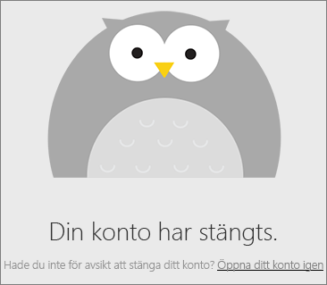

# Stänga ditt Power BI-konto

Om du inte vill använda Power BI längre, kan du avsluta ditt Power BI-konto.  När du har stängt ditt konto kan du inte logga in på Power BI. Dessutom raderar Power BI all kundinformation som du laddat upp eller skapat enligt principen för datakvarhållning i användningsvillkoren för Power BI. De bevaras inte.

## Enskilda Power BI-användare

Om du har registrerat dig för Power BI som individ kan du avsluta ditt konto från skärmen **Inställningar**.

1. Välj kugghjulsikonen i det övre högra hörnet i Power BI och välj sedan **Inställningar**.

    

1. På fliken **Allmänt** väljer du **Stäng konto**.

    

1. Välj ett skäl för att stänga kontot (1). Alternativt så kan du ge mer information (2). Välj sedan **avsluta kontot**.

    

1. Bekräfta att du vill avsluta ditt konto.

    

    Det bör visas en bekräftelse på att Power BI har stängt ditt konto. Du kan återaktivera ditt konto här om det behövs.

    

## Hanterade klientanvändare

Om din organisation har registrerat dig för Power BI kan du kontakta din klientadministratör. Be dem att ta bort licensen från ditt konto.

Har du fler frågor? [Fråga Power BI Community](https://community.powerbi.com/)