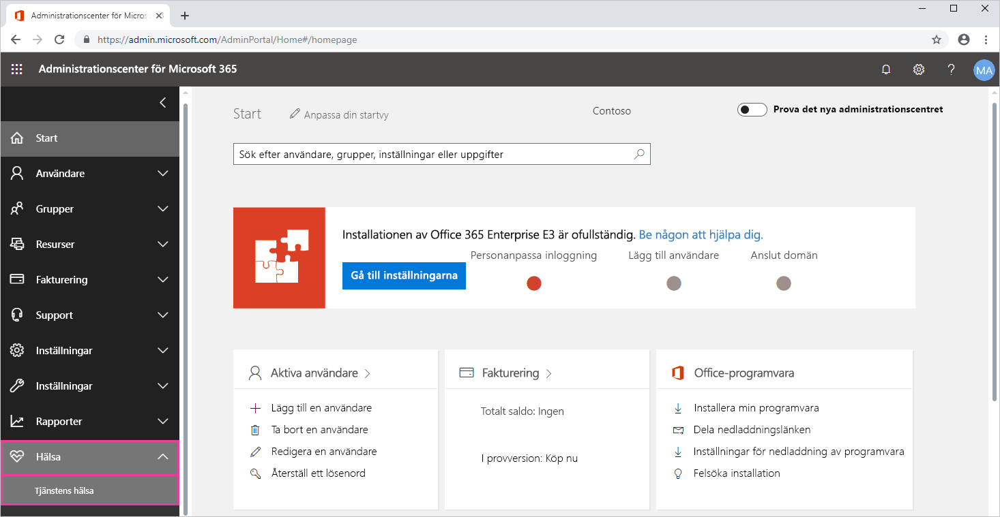
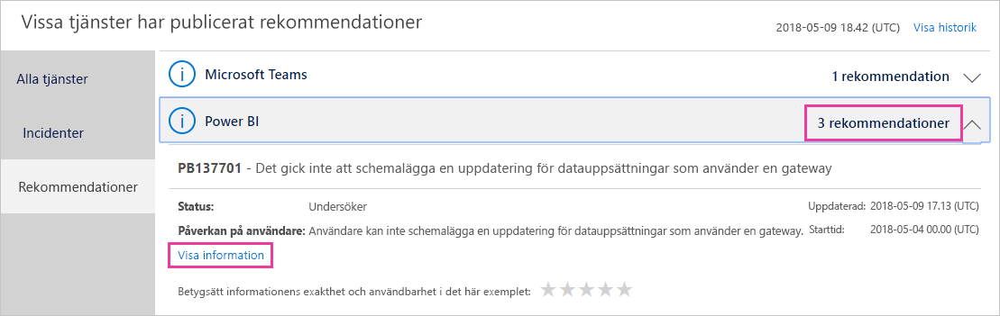

# Spåra Power BI-tjänstens hälsa i Microsoft 365

Administrationscentret för Microsoft 365 innehåller viktiga verktyg för Power BI-administratörer. Verktygen innehåller aktuell och historisk information om tjänstens hälsa. För att komma information om tjänstens hälsa måste du ha någon av följande roller:

* Power BI-tjänstadministratör

* Global administratör

Mer information om roller finns i [Administratörsroller relaterade till Power BI](service-admin-administering-power-bi-in-your-organization.md#administrator-roles-related-to-power-bi).

1. Logga in på [Administrationscenter för Microsoft 365](https://portal.office.com/adminportal).

1. I navigeringsfönstret väljer du **Visa alla** > **Hälsa** > **Tjänstens hälsa**. Panelen Tjänstens hälsa visas:

    

1. I listan **Alla tjänster** väljer du **Rekommendationer** eller **Incidenter** och granskar resultatet. I skärmbilden nedan ser du en av tre aktiva rekommendationer.

    

1. Om du vill se mer information, väljer du **Visa information** för ett objekt. I skärmbilden nedan visas ytterligare information, däribland de senaste statusuppdateringarna.

    

    Bläddra nedåt för att se mer information och stäng sedan fönstret när du är klar.

1. Om du vill visa historisk information för alla tjänster går du till det övre högra hörnet på sidan **Tjänstens hälsa** och väljer **Visa historik**. Välj sedan **Senaste 7 dagarna** eller **Senaste 30 dagarna**. 

1. Om du vill återgå till den aktuella tjänstens hälsa, väljer du **Visa aktuell status**.