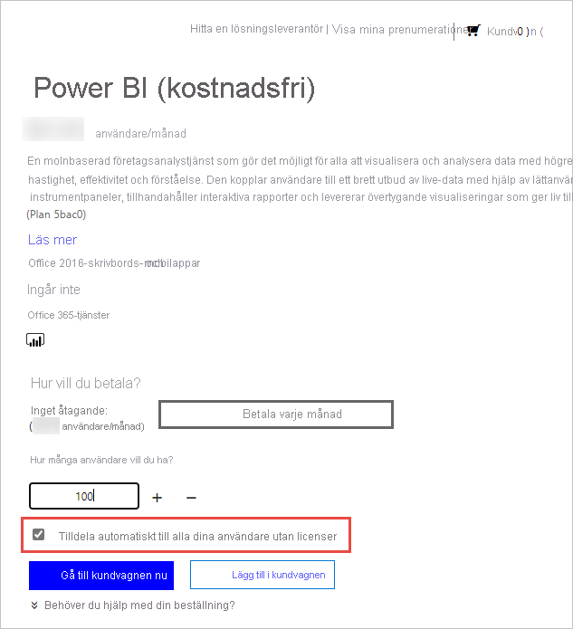

# Licensiera tjänsten Power BI för användare i din organisation

Vad användare kan göra i Power BI-tjänsten beror på vilken typ av ”per användare”-licens de har. Vilken åtkomstnivå de får med deras licens beror på om arbetsytan i fråga har tilldelats Power BI Premium-kapacitet. Alla användare av Power BI-tjänsten måste ha en licens.

Det finns två sätt för användare att få en licens. Användare kan skaffa en egen kostnadsfri licens eller Pro-licens med hjälp av funktioner för registrering via självbetjäning och ett arbets- eller skolkonto. Alternativt kan administratörer skaffa en Power BI-prenumeration och tilldela licenser till användare.

Den här artikeln fokuserar på inköp av tjänster och licensiering per användare från en administratörs perspektiv. Mer information om hur användare kan hämta sin egen licens finns i [Registrera dig själv som enskild individ för Power BI](../fundamentals/service-self-service-signup-for-power-bi.md).

## Vem kan köpa och tilldela licenser?

Du måste tilldelas en administratörsroll för att köpa eller tilldela licenser för din organisation. Administratörsroller tilldelas via administrationscentret för Azure Active Directory eller administrationscentret för Microsoft 365. Följande tabell visar vilken roll som krävs för att utföra uppgifter som rör inköp och licensiering. Mer information om administratörsroller i Azure Active Directory finns i [Visa och tilldela administratörsroller i Azure Active Directory](https://docs.microsoft.com/azure/active-directory/users-groups-roles/directory-manage-roles-portal). Mer information om administratörsroller i Microsoft 365, inklusive bästa praxis, finns i [Om administratörsroller](https://docs.microsoft.com/microsoft-365/admin/add-users/about-admin-roles?view=o365-worldwide).

| Vem kan köpa tjänster och licenser? | Vem kan hantera användarlicenser? |
| --------------- | --------------- |
| Faktureringsadministratör | Licensadministratör |
| Global administratör | Användaradministratör |
|  | Global administratör |

Dessa roller sköter hantering av organisationen. Mer information om administratörsroller för Power BI-tjänsten finns i [Förstå Power BI-tjänstadministratörsroller](service-admin-role.md).

## Få Power BI för din organisation

Information om prissättning finns i [Prissättning och produktjämförelse](https://powerbi.microsoft.com/pricing/).

En global administratör eller en faktureringsadministratör kan registrera sig för Power BI-tjänsten och köpa licenser för användarna i organisationen. Om du inte är redo att köpa väljer du utvärderingsversionen för Power BI Pro. Du får 25 licenser som du kan använda i en månad. Stegvisa instruktioner för hur du registrerar dig finns i [Skaffa en Power BI-prenumeration för din organisation](service-admin-org-subscription.md).

## Om registrering via självbetjäning

Enskilda användare kan få sin egen Power BI-licens genom att registrera sig med sitt arbets- eller skolkonto. Med en kostnadsfri licens kan användarna utforska Power BI för personlig dataanalys och visualisering med hjälp av Min arbetsyta, men de kan inte dela med andra användare. En Power BI Pro-licens krävs för delning av innehåll. Användarna kan uppgradera sin licenstyp till Pro eller registrera sig för Pro direkt om organisationen använder det kommersiella molnet. Köp av eller uppgradering till Pro är inte tillgängligt för utbildningsorganisationer eller organisationer som distribuerats till molnen Azure Government, Azure Tyskland eller Azure China 21Vianet.

Om du inte vill att självbetjäningsregistrering ska vara tillgängligt för användare i din organisation läser du [Aktivera eller inaktivera självbetjäningsregistrering](service-admin-disable-self-service.md) för att lära dig hur du inaktiverar funktionen.

Genom att inaktivera självanmälan så kan användare inte utforska Power BI för visualisering och analys av data. Om du blockerar individuell registrering så kan du behöva skaffa Power BI-licenser (kostnadsfria) för din organisation och tilldela dem till alla användare. Följ dessa steg om du vill tilldela en Power BI-licens (kostnadsfri) automatiskt till alla befintliga användare:

1. Logga in på [Administrationscenter för Microsoft 365](https://admin.microsoft.com) med dina autentiseringsuppgifter för global administratör eller faktureringsadministratör.
1. I den vänstra navigeringsmenyn väljer du **Fakturering** > **Köp tjänster**.
1. Sök eller bläddra för att hitta Power BI-erbjudandet (kostnadsfritt). Välj erbjudandet och välj sedan **Hämta nu**.
1. Ange antalet licenser som behövs för att omfatta alla dina användare.
1. Välj **Tilldela automatiskt till alla dina användare utan licenser** och checka ut.

  

Om du vill se vilka användare i din organisation som kanske redan har en licens kan du läsa [Visa och hantera användarlicenser](service-admin-manage-licenses.md) för att lära dig hur det går till.

## Licenstyper och funktioner

Det finns två typer av Power BI-licenser per användare: kostnadsfri och Pro. Den typ av licens som användare behöver beror på var innehållet lagras och hur de interagerar med innehållet. Var innehåll kan lagras bestäms av din organisations [prenumerationstyp](#subscription-types).

En typ av prenumeration, [Power BI Premium](service-admin-premium-purchase.md), gör att användare med en kostnadsfri licens kan interagera med innehåll på arbetsytor som har tilldelats till en Premium-kapacitet. Användare utan Premium-kapacitet som har en kostnadsfri licens kan endast använda Power BI-tjänsten för att ansluta till data samt för att skapa rapporter och instrumentpaneler på **Min arbetsyta**. De kan inte dela innehåll med andra eller publicera innehåll till andra arbetsytor. Mer information om typer av arbetsytor finns i [Typer av arbetsytor](../consumer/end-user-workspaces.md#types-of-workspaces).

Standardprenumerationer på Power BI använder delad kapacitet. Om innehåll lagras i delad kapacitet kan användare som har tilldelats en Power BI Pro-licens endast samarbeta med andra Power BI Pro-användare. De kan använda innehåll som delas av andra användare, publicera innehåll på arbetsytor, dela instrumentpaneler samt prenumerera på instrumentpaneler och rapporter.  Om arbetsytor har Premium-kapacitet kan Pro-användare distribuera innehåll till användare som inte har en Power BI Pro-licens.

I tabellen nedan sammanfattas de grundläggande funktionerna för varje licenstyp. En detaljerad analys av tillgängliga funktioner per licenstyp finns i [Funktioner per licenstyp](../fundamentals/service-features-license-type.md).

| Licenstyp | Funktioner när arbetsytan är i delad kapacitet | Ytterligare funktioner när arbetsytan är i Premium-kapacitet |
| --------- | ----------- | ----------- |
| Power BI (kostnadsfri) | Åtkomst till innehåll på Min arbetsyta | Använda innehåll som delas med dem |
| Power BI Pro | Publicera innehåll på andra arbetsytor, dela instrumentpaneler, prenumerera på instrumentpaneler eller rapporter och dela med användare som har en Pro-licens | Distribuera innehåll till användare som har kostnadsfria licenser |

## Prenumerationstyper

Alla användarbaserade prenumerationer med kommersiell licens från Microsoft baseras på Azure Active Directory-identiteter. Om du vill använda Power BI-tjänsten måste du logga in med en identitet som Azure Active Directory stöder för kommersiella licenser. Du kan lägga till Power BI till valfri Microsoft-prenumeration som använder Azure Active Directory för identitetstjänster. Vissa prenumerationer, till exempel Office 365 E5, innehåller en Power BI Pro-licens, och då behövs ingen separat registrering för Power BI.

Det finns två typer av Power BI-prenumerationer för organisationer: Standard och Premium.

Med en standardmässig Power BI Pro-självbetjäningsprenumeration tilldelar administratörer licenser per användare. Power BI Pro-licenser har en månatlig avgift per användare. Med den här licenstypen kan du samarbeta, publicera, dela och köra ad hoc-analyser. Innehållet sparas i den delade lagringskapaciteten, som helt och hållet hanteras av Microsoft.

En Power BI Premium-prenumeration allokerar dedikerad kapacitet till en organisation. Premium passar för BI i företagsklass, stordataanalys samt molnbaserad och lokal rapportering. Det tillhandahåller avancerade administrations- och distributionskontroller. Dedikerade beräknings- och lagringsresurser hanteras av kapacitetsadministratörer i din organisation. Det finns en månatlig kostnad för den här dedikerade miljön. Utöver andra Premium-fördelar kan innehåll som lagras i Premium-kapacitet nås av och distribueras till användare som inte har Power BI Pro-licenser. Minst en användare måste ha en Power BI Pro-licens tilldelad för att kunna använda Premium, och innehållsskapare och utvecklare behöver en Power BI Pro-licens.

De två prenumerationstyperna är inte ömsesidigt uteslutande. Du kan ha både Power BI Premium och Power BI Pro. I den här konfigurationen kan innehåll som lagras i Premium-kapacitet delas med alla användare, och delad kapacitet är också tillgängligt. Information om kapacitetsgränser finns i [Hantera datalagring på Power BI-arbetsytor](service-admin-manage-your-data-storage-in-power-bi.md).

Information om hur du jämför produktfunktioner och priser finns i [Power BI-prissättning](https://powerbi.microsoft.com/pricing).

## Gästanvändaråtkomst

Du vill kanske distribuera innehåll till användare som är utanför organisationen. Det går att dela innehåll med externa användare genom att bjuda in dem att titta på innehåll som gäster. Azure Active Directory Business-to-business (Azure AD B2B) möjliggör delning med externa gästanvändare. Följande krav måste uppfyllas för att det ska gå att dela med externa användare:

- Möjligheten att dela innehåll med externa användare måste vara aktiverad

- Gästanvändare måste ha korrekt licensiering för att se det delade innehållet

Mer information om gästanvändaråtkomst finns i [Distribuera Power BI-innehåll till externa gästanvändare med Azure AD B2B](service-admin-azure-ad-b2b.md).

## Köpa Power BI Pro-licenser

Som administratör kan du köpa Power BI Pro-licenser via Microsoft 365 eller en Microsoft-partner. När du har köpt licenserna kan du tilldela dem till enskilda användare. Mer information finns i avsnittet [Köpa och tilldela Power BI Pro-licenser](service-admin-purchasing-power-bi-pro.md).

### Power BI Pro-licensens upphörande

Det finns en respitperiod efter att en Power BI Pro-licens har gått ut. För licenser som är en del av ett volymlicensköp är respitperioden 90 dagar. Om du har köpt licensen direkt är respitperioden 30 dagar.

Power BI Pro har samma prenumerationslivscykel som Microsoft 365. Mer information finns i [Vad händer med mina data och min åtkomst när Microsoft 365 för företag-prenumerationen går ut?](/microsoft-365/commerce/subscriptions/what-if-my-subscription-expires)

## Nästa steg

- [Köpa och tilldela Power BI Pro-licenser](service-admin-purchasing-power-bi-pro.md)
- [Dokumentation om Business-prenumerationer och fakturering](/microsoft-365/commerce/?view=o365-worldwide)
- [Hitta Power BI-användare som har loggat in](service-admin-access-usage.md)
- Har du fler frågor? [Fråga Power BI Community](https://community.powerbi.com/)
