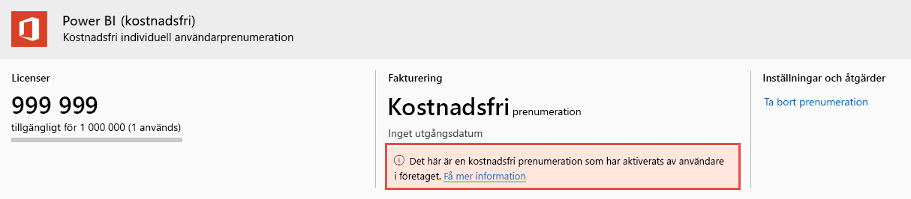

# Visa och hantera Power BI-användarlicenser

Den här artikeln förklarar hur administratörer kan använda Administrationscenter för Microsoft 365 eller Azure-portalen för att visa och hantera användarlicenser.

> [!NOTE]
>
>En användare kan ha både en Power BI-licens (kostnadsfri) och en Power BI Pro-licens tilldelad. Detta kan inträffa när en användare registrerar sig för en kostnadsfri licens och senare tilldelas en Power BI Pro-licens. Den högsta licensieringsnivån börjar gälla i det här fallet.
>

## Visa dina prenumerationer

Följ dessa steg om du vill se vilka Power BI-prenumerationer din organisation har.

1. Logga in på [Administrationscenter för Microsoft 365](https://admin.microsoft.com).
2. I navigeringsmenyn väljer du **Fakturering** > **Produkter och tjänster**.

Dina aktiva Power BI-prenumerationer visas tillsammans med andra prenumerationer som du har. Du ser kanske en oväntad prenumeration på Power BI (kostnadsfri), såsom det visas här.

  

Den här typen av prenumeration skapas åt dig när användare drar nytta av självbetjäningsregistrering. Läs mer i [Power BI i din organisation](https://docs.microsoft.com/microsoft-365/admin/misc/power-bi-in-your-organization?view=o365-worldwide).

## Hantera licenser i Microsoft 365

Om du vill använda Administrationscenter för Microsoft 365 för att hantera användarlicenser läser du [dokumentationen om Business-prenumerationer och fakturering](https://docs.microsoft.com/microsoft-365/commerce/?view=o365-worldwide).

## Hantera licenser i Azure-portalen

Följ dessa steg om du vill visa och tilldela Power BI-licenser med hjälp av Azure-portalen.

1. Logga in på [Azure-portalen](https://portal.azure.com).

2. Sök efter och välj **Azure Active Directory**.

3. Under **Hantera** i Azure Active Directory-resursmenyn väljer du **Licenser**.

4. Välj **Alla produkter** i resursmenyn, och välj sedan en Power BI-licenstyp för att se listan med licensierade användare.

5. Du tilldelar en licens från kommandofältet genom att välja **+ Tilldela**. På sidan **Tilldela licens** väljer du en användare och sedan **Tilldelningsalternativ** för att aktivera en Power BI-licens för det valda användarkontot.

6. Om du vill ta bort en licens markerar du kryssrutan intill användarens namn och väljer sedan **Ta bort licens**.

## Nästa steg

- [Köpa Power BI Pro](../service-admin-purchasing-power-bi-pro.md)
- [Licensiering för din organisation](../service-admin-licensing-organization.md)
