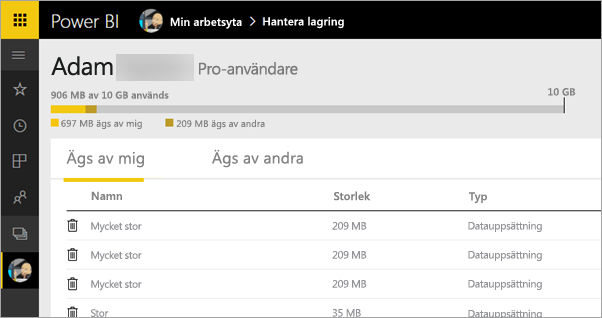
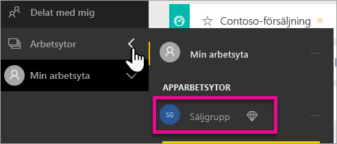
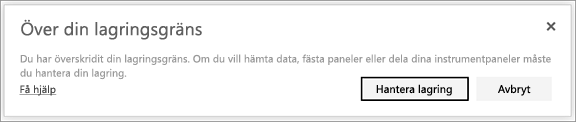

# Hantera datalagring i Power BI-arbetsytor

Läs hur du hanterar datalagring individuellt eller på arbetsytan så att du kan fortsätta publicera rapporter och datamängder.

## Kapacitetsbegränsningar

Lagringsgränser för arbetsytan, vare sig det gäller min arbetsyta eller en apparbetsyta, beror på om arbetsytan har [delad eller premiumkapacitet](../fundamentals/service-basic-concepts.md#capacities).

### Begränsningar för delad kapacitet
För arbetsytor i delad kapacitet: 

- Det finns en lagringsgräns per arbetsyta på 100 GB.
- För app-arbetsytor får den totala användningen inte överskrida klientlagringsgränsen på 10 GB multiplicerat med antalet Pro-licenser i klienten.

### Begränsningar för premiumkapacitet
För arbetsytor med premiumkapacitet:
- Det finns en gräns på 100 TB per Premium-kapacitet.
- Det finns ingen lagringsgräns per användare.

Läs om andra funktioner i [Power BI-prismodellen](https://powerbi.microsoft.com/pricing).

## Vad som ingår i lagringen

Din datalagring inkluderar dina egna datauppsättningar och Excel-rapporter och de objekt som någon har delat med dig. Datauppsättningar är alla datakällor du har laddat upp eller anslutit till. Dessa datakällor omfattar Power BI Desktop-filer och Excel-arbetsböcker du använder. Följande ingår även i din datakapacitet.

* Excel-intervall fästa på en instrumentpanel.
* Reporting Services lokala visualiseringar fästa på en Power BI-instrumentpanel.
* Överförda bilder.

Storleken på en instrumentpanel som du delar varierar beroende på vad som är fäst på den. Om du till exempel fäster objekt från två rapporter som ingår i två olika datauppsättningar, kommer storleken att inkludera bägge datauppsättningarna.

## Hantera objekt du äger

Se hur mycket lagringsutrymme du använder i ditt Power BI-konto och hantera ditt konto.

1. Om du vill hantera din lagring går du till **Min arbetsyta** i navigeringsfönstret.
   
    

2. Välj kugghjulsikonen uppe till höger  **Hantera personlig lagring**.
   
    Det översta fältet visar hur mycket av din lagringsgräns som du har använt.
   
    
   
    Datauppsättningarna och rapporterna avgränsas på två flikar:
   
    **Ägs av mig:** Du har laddat upp dessa rapporter och datauppsättningar till ditt Power BI-konto, inklusive tjänstedatauppsättningar som Salesforce och Dynamics CRM.  

    **Ägs av andra:** Andra har delat dessa rapporter och datauppsättningar med dig.
1. Om du vill ta bort en datauppsättning eller rapport, väljer du papperskorgsikonen .

Tänk på att du eller någon annan kan ha rapporter och instrumentpaneler baserade på en datauppsättning. Om du tar bort datauppsättningen, fungerar dessa rapporter och instrumentpaneler inte längre.

## Hantera din arbetsyta
1. Välj pilen bredvid **Arbetsytor** och välj namnet på arbetsytan.
   
    
2. Välj kugghjulsikonen uppe till höger  **Hantera grupplagring**.
   
    Det översta fältet visar hur mycket av din lagringsgräns som du har använt.
   
    
   
    Datauppsättningarna och rapporterna avgränsas på två flikar:
   
    **Ägs av oss:** Du eller någon annan har laddat upp dessa rapporter och datauppsättningar till gruppens Power BI-konto, inklusive tjänstedatauppsättningar som Salesforce och Dynamics CRM.

    **Ägs av andra:** Andra har delat dessa rapporter och datauppsättningar med din grupp.

3. Om du vill ta bort en datauppsättning eller rapport, väljer du papperskorgsikonen .
   
   > [!NOTE]
   > Tänk på att du eller någon annan i gruppen kan ha rapporter och instrumentpaneler baserade på en datauppsättning. Om du tar bort datauppsättningen, fungerar dessa rapporter och instrumentpaneler inte längre.
   
   Alla medlemmar i en arbetsyta med rollen administratör, medlem eller deltagare har behörighet att ta bort datamängder och rapporter från arbetsytan.

## Datauppsättningsgränser
Det finns en gräns på 1 GB, per datauppsättning som importeras till Power BI. Om du har valt att behålla Excel-upplevelsen istället för att importera data, är gränsen 250 MB för datauppsättningen.

## Vad händer när du når en gräns?
När du når datakapacitetsgränsen för vad du kan göra, får du meddelanden i tjänsten. 

När du väljer kugghjulsikonen , ser du ett rött streck som anger att du har överskridit din datakapacitetsgräns.

Den här gränsen visas också i **Hantera personlig lagring**.

 

 När du försöker utföra en åtgärd som når någon av gränserna visas ett meddelande om att du är över gränsen. Du kan [hantera din lagring](#manage-items-you-own) för att minska ditt lagringsutrymme och komma förbi gränsen.

 

 ## Nästa steg

 Har du fler frågor? [Fråga Power BI Community](https://community.powerbi.com/)
