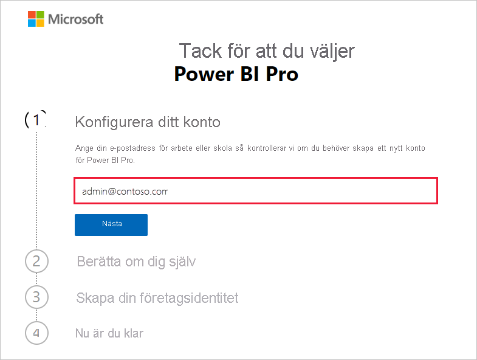
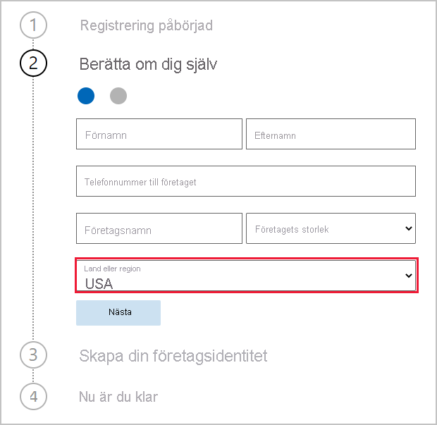
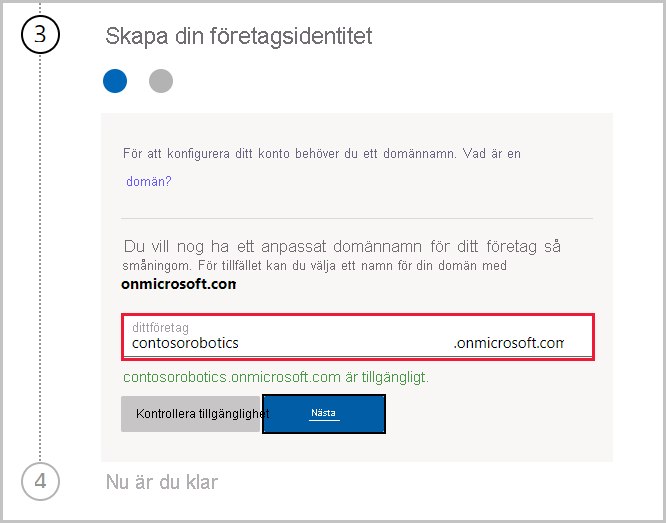

# Skaffa en prenumeration på tjänsten Power BI för din organisation

Administratörer kan registrera sig för Power BI-tjänsten via sidan **Köptjänster** på administrationscentret för Microsoft 365. När administratörer registrerar sig för Power BI kan de tilldela licenser till användare som ska ha åtkomst.

Användare i din organisation kan registrera sig för Power BI via Power BI-webbplatsen. När en användare i din organisation registrerar sig för Power BI, tilldelas användaren automatiskt en licens för Power BI. Om du vill inaktivera de här självbetjäningsfunktionerna följer du stegen i [Aktivera eller inaktivera registrering och inköp via självbetjäning](service-admin-disable-self-service.md).

## Registrera sig via Microsoft 365

Om du är global administratör eller faktureringsadministratör kan du skaffa en Power BI-prenumeration för din organisation. Mer information finns i [Vem kan köpa och tilldela licenser?](service-admin-licensing-organization.md#who-can-purchase-and-assign-licenses).

> [!NOTE]
>
> En Microsoft 365 E5-prenumeration innehåller redan Power BI Pro-licenser. Information om hur du hanterar licenser finns i [Visa och hantera användarlicenser](service-admin-manage-licenses.md).
>
>

Så här köper du Power BI Pro-licenser i administrationscentret för Microsoft 365:

1. Logga in på [Administrationscenter för Microsoft 365](https://admin.microsoft.com).

2. I navigeringsmenyn väljer du **Fakturering** > **Köptjänster**.
  
   

3. Sök eller bläddra för att hitta den prenumeration som du vill köpa. Du hittar **Power BI** under **Andra kategorier som kan intressera dig** nästan längst ned på sidan. Välj länken om du vill se de Power BI-prenumerationer som är tillgängliga för din organisation.

4. Välj ett erbjudande, till exempel Power BI Pro.

5. På sidan **Köptjänster** väljer du **Köp**. Om du inte har använt den tidigare kan du starta en prenumeration på en kostnadsfri Power BI Pro-utvärdering. Den omfattar 25 licenser och upphör att gälla efter en månad.

   

6. Välj **Betala varje månad** eller **Betala för ett helt år**.

7. Under **Hur många användare vill du ha?** anger du önskat antal licenser och väljer sedan **Checka ut nu** för att slutföra transaktionen.

8. Bekräfta ditt köp genom att gå till **Fakturering** > **Produkter och tjänster** och leta efter **Power BI Pro**.

Mer information om hur din organisation kan kontrollera och skaffa Power BI-tjänsten finns i [Power BI i din organisation](https://docs.microsoft.com/microsoft-365/admin/misc/power-bi-in-your-organization?view=o365-worldwide).

## Fler sätt att skaffa Power BI för din organisation

Om du inte redan prenumererar på Microsoft 365 kan du använda stegen nedan för att få en Power BI Pro-utvärderingsversion för din organisation. Eller så kan du [registrera dig för en ny Microsoft 365-utvärderingsversion](service-admin-signing-up-for-power-bi-with-a-new-office-365-trial.md) och sedan lägga till Power BI genom att följa stegen i föregående avsnitt.

Du behöver ett arbets- eller skolkonto för att registrera dig för en Power BI-prenumeration. Vi stöder inte e-postadresser som tillhandahålls av e-posttjänster för konsumenter eller telekomoperatörer. Om du inte har något arbets- eller skolkonto kan du skapa ett under registreringen.

Följ de här stegen för att registrera dig:

1. Gå till [Power BI Pro-registrering](https://signup.microsoft.com/create-account/signup?OfferId=d59682f3-3e3b-4686-9c00-7c7c1c736085&ali=1&products=d59682f3-3e3b-4686-9c00-7c7c1c736085). 

2. Ange e-postadressen för ditt arbete eller skola och välj sedan **Nästa**. Det är ok att ange en e-postadress som inte är en arbets- eller skoladress. Vi skapar ett nytt konto åt dig när du skapar din företagsidentitet.

   

3. Vi gör en snabbkontroll för att se om du behöver skapa ett nytt konto. Välj **Konfigurera konto** för att fortsätta med registreringsprocessen.

   > [!NOTE]
   >Om du redan använder e-postadressen för en annan Microsoft-tjänst kan du **Logga in** eller **Skapa ett nytt konto i stället**. Om du väljer att skapa ett nytt konto fortsätter du att följa de här stegen.
>
>
 
4. Fyll i formuläret och berätta om dig själv. Se till att välja rätt land eller region. Landet du väljer bestämmer var dina data lagras. Mer information finns i [Så här fastställer du var Power BI-klient finns](service-admin-where-is-my-tenant-located.md#how-to-determine-where-your-power-bi-tenant-is-located).

   

5. Välj **Nästa**. Vi måste skicka en verifieringskod för att verifiera din identitet. Ange ett telefonnummer som vi kan skicka ett sms till eller ringa dig på. Välj sedan **Skicka verifieringskoden**.

6. Ange verifieringskoden och fortsätt sedan till **Skapa din företagsidentitet**.

   

    Ange ett kort namn för ditt företag så kontrollerar vi om det är tillgängligt. Vi använder det här korta namnet för att skapa ditt organisationsnamn i datacentret som en underdomän till onmicrosoft.com. Du kan lägga till en egen företagsdomän senare. Oroa dig inte om det korta namnet du vill ha är upptaget. Troligtvis har någon med ett liknande företagsnamn valt samma namn – prova en annan variant. Välj **Nästa**.
    
7. Skapa ditt användar-ID och lösenord för att logga in på ditt konto. Välj **Registrera dig**. Sedan är du klar.

Kontot som du har skapat är nu global administratör i den nya klientorganisationen för Power BI Pro-utvärderingsversionen. Du kan logga in på [administrationscentret för Microsoft 365](https://admin.microsoft.com) om du vill lägga till fler användare, konfigurera en egen domän, köpa fler tjänster och hantera din Power BI-prenumeration.

## Nästa steg

- [Visa och hantera användarlicenser](service-admin-manage-licenses.md)
- [Aktivera eller inaktivera registrering och inköp via självbetjäning](service-admin-disable-self-service.md)
- [Dokumentation om Business-prenumerationer och fakturering](https://docs.microsoft.com/microsoft-365/commerce/?view=o365-worldwide)
