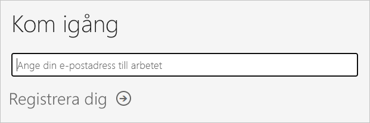
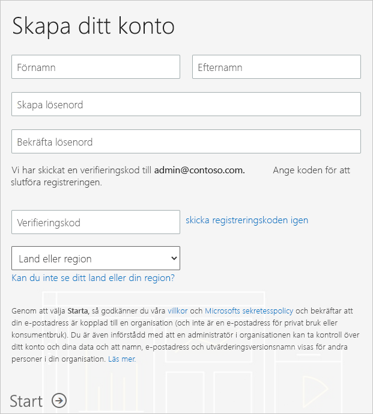
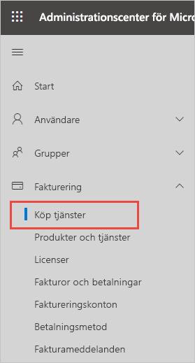
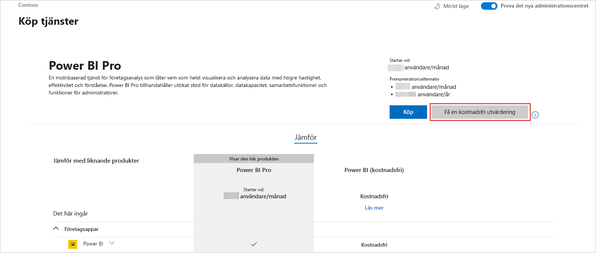

# Skaffa en Power BI-prenumeration för din organisation

Som administratör kan du registrera dig för Power BI via [Power BI-webbplatsen](https://powerbi.microsoft.com). Du kan även registrera dig via försäljningssidan för tjänster i administrationscentret för Microsoft 365. När administratörer registrerar sig för Power BI kan de tilldela licenser till användare som ska ha åtkomst.

Dessutom kan enskilda användare i din organisation kanske registrera sig för Power BI via Power BI-webbplatsen. När en användare i din organisation registrerar sig för Power BI, tilldelas som användaren en licens för Power BI automatiskt. Om du vill inaktivera den här funktionen följer du stegen i [Aktivera eller inaktivera registrering och inköp via självbetjäning](service-admin-disable-self-service.md).

## Registrera sig via Power BI

Du behöver ett arbets- eller skolkonto för att registrera dig för en Power BI-prenumeration. Vi stöder inte e-postadresser som tillhandahålls av e-posttjänster för konsumenter eller telekomoperatörer.

Följ de här stegen för att registrera dig:

1. Gå till [Power BI-webbplatsen](https://powerbi.microsoft.com). Välj **Prova kostnadsfritt**.
2. Ange din e-postadress för arbete och välj sedan **Registrera**.

   

3. Verifiera din identitet. Vi ringer eller SMS:ar dig en verifieringskod som ska användas.
4. Välj **Ja** för att bekräfta att du använder en e-postadress som du har fått från ditt företag.
5. Skapa ditt konto. Vi skickar en verifieringskod till din e-postadress för att slutföra registreringen.

   

## Registrera sig via Microsoft 365

Om du är global administratör eller faktureringsadministratör i Microsoft 365 kan du skaffa en Power BI-prenumeration för din organisation. Mer information finns i [Vem kan köpa och tilldela licenser?](../service-admin-licensing-organization.md#who-can-purchase-and-assign-licenses).

> [!NOTE]
>
> En Microsoft 365 E5-prenumeration innehåller redan Power BI Pro-licenser. Information om hur du hanterar licenser finns i [Visa och hantera användarlicenser](service-admin-manage-licenses.md).
>
>

Så här köper du Power BI Pro-licenser i administrationscentret för Microsoft 365:

1. Logga in på [Administrationscenter för Microsoft 365](https://admin.microsoft.com).

2. I navigeringsmenyn väljer du **Fakturering** > **Köptjänster**.
  
   

3. Sök eller bläddra för att hitta den prenumeration som du vill köpa. Du hittar **Power BI** under **Andra kategorier som kan intressera dig** nästan längst ned på sidan. Välj länken om du vill se de Power BI-prenumerationer som är tillgängliga för din organisation.

4. Välj ett erbjudande, till exempel Power BI Pro.

5. På sidan **Köptjänster** väljer du **Köp**. Om du inte har använt den tidigare kan du starta en prenumeration på en kostnadsfri Power BI Pro-utvärdering. Den omfattar 25 licenser och upphör att gälla efter en månad.

   

6. Välj **Betala varje månad** eller **Betala för ett helt år**.

7. Under **Hur många användare vill du ha?** anger du önskat antal licenser och väljer sedan **Checka ut nu** för att slutföra transaktionen.

8. Bekräfta ditt köp genom att gå till **Fakturering** > **Produkter och tjänster** och leta efter **Power BI Pro**.

Mer information om hur din organisation skaffar Power BI-tjänsten finns i [Power BI i din organisation](https://docs.microsoft.com/microsoft-365/admin/misc/power-bi-in-your-organization?view=o365-worldwide).

## Nästa steg

- [Visa och hantera användarlicenser](service-admin-manage-licenses.md)
- [Aktivera eller inaktivera registrering och inköp via självbetjäning](service-admin-disable-self-service.md)
- [Dokumentation om Business-prenumerationer och fakturering](https://docs.microsoft.com/microsoft-365/commerce/?view=o365-worldwide)
