# Administrera Power BI i Admin-portalen

Med Admin-portalen kan du använda en Power BI-*klient* för din organisation. Portalen innehåller sådant som användningsstatistik för åtkomst till Microsoft 365-administrationscenter och inställningar.

Hela administrationsportalen är tillgänglig för alla användare som är globala administratörer eller som har tilldelats rollen administratör i Power BI-tjänsten. Om du inte är någon av dessa roller kan du bara se **kapacitetsinställningarna** i portalen. Läs mer om administratörsrollen för Power BI-tjänsten i [Förstå administratörsrollen för Power BI](service-admin-role.md).

## Navigera till administrationsportalen

Ditt konto måste vara markerat som **Global administratör** i Microsoft 365 eller Azure Active Directory (Azure AD), eller ha tilldelats administratörsrollen för Power BI-tjänsten, för att ha åtkomst till Power BI-administratörsportalen. Läs mer om administratörsrollen för Power BI-tjänsten i [Förstå administratörsrollen för Power BI](service-admin-role.md). Gör följande för att gå till Power BI-administratörsportalen.

1. Välj kugghjulet längst upp till höger i Power BI-tjänsten.

1. Välj **Administratörsportalen**.

    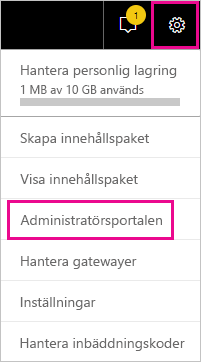

Det finns nio flikar i portalen. Resten av den här artikeln innehåller information om var och en av dessa flikar.

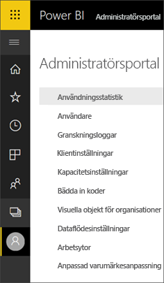

* [Användningsstatistik](#usage-metrics)
* [Användare](#users)
* [Granskningsloggar](#audit-logs)
* [Klientinställningar](#tenant-settings)
* [Kapacitetsinställningar](#capacity-settings)
* [Bädda in koder](#embed-codes)
* [Visuella organisationsobjekt](organizational-visuals.md#organizational-visuals)
* [Dataflödeslagring (förhandsversion)](#dataflow-storage-preview)
* [Arbetsytor](#workspaces)
* [Anpassad varumärkesanpassning](#custom-branding)

## Användningsstatistik

Med **användningsstatistik** kan du övervaka Power BI-användningen för din organisation. Det ger också möjlighet att se vilka användare och grupper som är mest aktiva i Power BI för din organisation. 

> [!NOTE]
> Första gången du använder instrumentpanelen eller när du kommer tillbaka efter en lång tid utan att visa instrumentpanelen visas antagligen en skärm för inläsning medan vi läser in instrumentpanelen.

När instrumentpanelerna har lästs in kan du se två områden med fönster. Det första området innehåller användningsdata för enskilda användare och det andra avsnittet har liknande information för grupper i din organisation.

Här är en uppdelning av vad du kan se i varje panel:

* Tydlig räkning av alla instrumentpaneler, rapporter och datamängder på användararbetsytan.
  
    

* Med använd instrumentpanel enligt antal användare med åtkomst till den. Om du t.ex. har en instrumentpanel som du har delat med tre användare och du även har lagt till den i ett innehållspaket som två olika användare är anslutna till, skulle antalet vara 6 (1 + 3 + 2).
  
    

* Det mest populära innehåll som användare är anslutna till. Det är något användarna kan nå genom processen Hämta data, det vill säga innehållspaket från SaaS, organisationsinnehållspaket, filer eller databaser.
  
    

* En vy över toppanvändarna baserat på hur många instrumentpaneler de har, såväl instrumentpaneler de skapat själva som instrumentpaneler som någon har delat med dem.
  
    

* En vy över toppanvändarna baserat på hur många rapporter de har.
  
    

Det andra avsnittet visar samma typ av information, men baserat på grupper. Här kan du se vilka grupper i din organisation som är mest aktiva och vilken sorts innehåll de använder.

Med den här informationen kommer du att kunna hämta verkliga insikter om hur personer använder Power BI inom organisationen och identifiera de användare och grupper som är mest aktiva i din organisation.

## Kontrollera användningsstatistik

Användningsstatistikrapporter är en funktion som Power BI-administratören eller den globala administratören kan aktivera eller inaktivera. Administratörerna har detaljerad kontroll över vilka användare som har åtkomst till användningsstatistik. De är **På** som standard för alla användare i organisationen.

Administratörer kan också bestämma om skapare av innehåll kan se data per användare i användningsmått. 

Se [Övervaka användningsstatistik för Power BI-instrumentpaneler och rapporter](../collaborate-share/service-usage-metrics.md) för mer information om själva rapporterna.

### Användningsstatistik för innehållsskapare

1. Från Administratörsportalen väljer du **Klientinställningar** > **Användningsstatistik för skapare av innehåll**.

    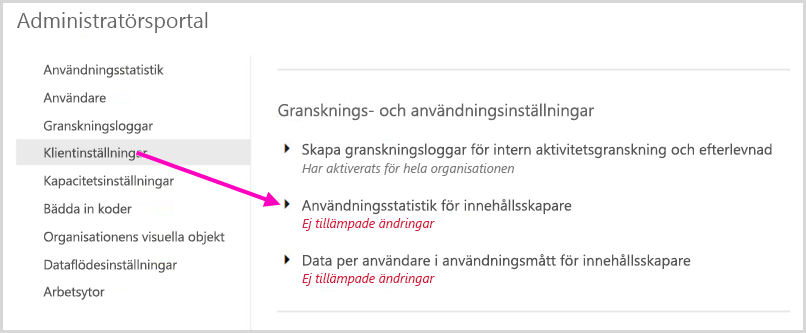

1. Aktivera (eller inaktivera) användningsstatistik > **Tillämpa**.

    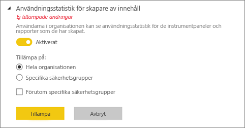

### Data per användare i användningsmått

Som standard är data per användare aktiverat för användningsstatistik och kontoinformation om konsumenter av innehåll ingår i statistikrapporten. Om du inte vill inkludera den här informationen för vissa eller alla användare kan du inaktivera funktionen för specifika säkerhetsgrupper eller hela organisationen. Kontoinformation visas sedan i rapporten som *Namnlös*.

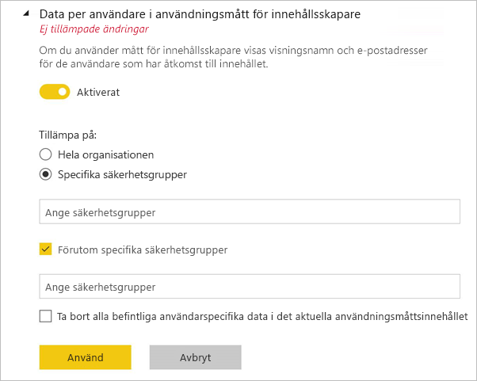

### Ta bort allt befintligt innehåll för måttet

När du inaktiverar användningsstatistik för hela organisationen kan administratörer också välja ett eller båda alternativ:

- **Ta bort allt befintligt innehåll för användningsstatistik** för att ta bort alla befintliga rapporter och instrumentpaneler som har skapats med användningsstatistikrapporter och datauppsättningar. Det här alternativet tar bort all åtkomst till användningsstatistiken för alla användare i organisationen som kanske redan använder den. 
- **Ta bort alla befintliga användarspecifika data i den aktuella användningsstatistiken** Det här alternativet tar bort all åtkomst till användningsstatistiken för alla användare i organisationen som kanske redan använder den. 

Var försiktig, eftersom det inte går att ångra när du har tagit bort befintligt användarspecifikt användningsstatistikinnehåll.

## Användare

Du kan hantera Power BI-användare, grupper och administratörer i Microsoft 365 Administrationscenter. Fliken **Användare** innehåller en länk till administrationscentret för din klient.

## Granskningsloggar

Du kan hantera Power BI-granskningsloggar i Säkerhets- och efterlevnadscenter för Office 365. Fliken **Granskningsloggar** innehåller en länk till din klients Säkerhets- och efterlevnadscenter. [Läs mer](service-admin-auditing.md)

Om du vill använda granskningsloggar, se till att inställningen [**Skapa granskningsloggar för intern aktivitetsgranskning och efterlevnad**](#create-audit-logs-for-internal-activity-auditing-and-compliance) är aktiverad.

## Klientinställningar

Fliken **Klientinställningar** möjliggör kontroll i minsta detalj över de funktioner som är tillgängliga för din organisation. Om du har frågor kring känsliga data, vissa av våra funktioner inte är lämpliga för din organisation eller om du bara vill att en viss funktion ska vara tillgänglig för en särskild grupp.

> [!NOTE]
> Klientinställningar som styr tillgängligheten för funktioner i Power BI-användargränssnittet kan hjälpa dig att upprätta styrningsprinciper, men de är inte en säkerhetsåtgärd. Till exempel begränsar inställningen **Exportera data** inte behörigheterna för en Power BI-användare för en datamängd. Power BI-användare med läsbehörighet till en datamängd har behörighet att köra frågor på den här datamängden och kan spara resultaten utan att använda funktionen **Exportera data** i Power BI-användargränssnittet.

Följande bild visar flera inställningar på fliken **Klientorganisationsinställningar**.

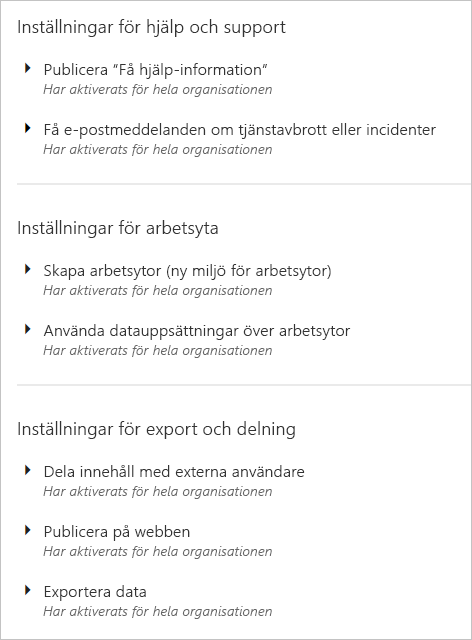

> [!NOTE]
> Det kan ta upp till 10 minuter för att inställningen ska gälla för alla i din klient.

Inställningarna kan ha tre tillstånd:

* **Har inaktiverats för hela organisationen**: Ingen i din organisation kan använda den här funktionen.

    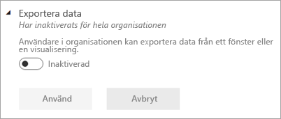

* **Har aktiverats för hela organisationen**: Alla i din organisation kan använda den här funktionen.

    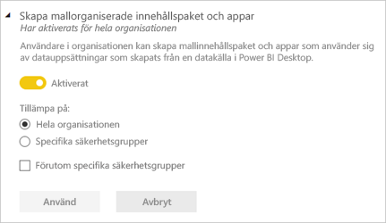

* **Har aktiverats för en undergrupp i organisationen**: En specifik delmängd av användare eller grupper i din organisation kan använda den här funktionen.

    Du kan aktivera funktionen för hela din organisation, utom för en specifik användargrupp.

    

    Du kan också endast aktivera funktionen för en viss grupp av användare och även inaktivera den för en grupp av användare. Med denna metod har vissa användare inte åtkomst till funktionen även om de finns i en tillåten grupp.

    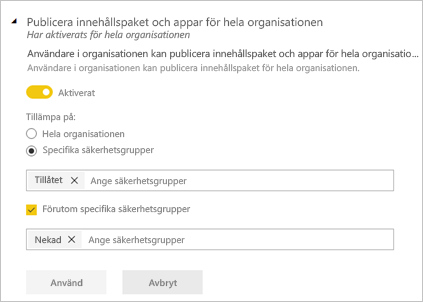

Följande avsnitt ger en översikt över de olika typerna av inställningar för klientorganisation.

## Inställningar för hjälp och support

### Publicera Få hjälp-information

Användare i organisationen kan gå till intern hjälp och ta del av supportresurser i Power BI:s Hjälp-meny. Mer specifikt ändrar parametrarna beteendet för menyalternativen Läs, Community och Få hjälp.

Genom att ange en URL för licensieringsbegäranden kan du dessutom anpassa mål-URL:en för knappen **Uppgradera konto**. Användare utan Power BI Pro-licens ser den här knappen i dialogrutan **Uppdatera till Power BI Pro** samt på sidan **Hantera personlig lagring**. Dessutom erbjuder Power BI inte längre knappen **Testa Pro kostnadsfritt** i den här dialogrutan eller på lagringssidan. Detta säkerställer att Power BI vägleder dina användare på ett tillförlitligt sätt genom de processer som definierats i din organisation via din licenshanteringslösning.

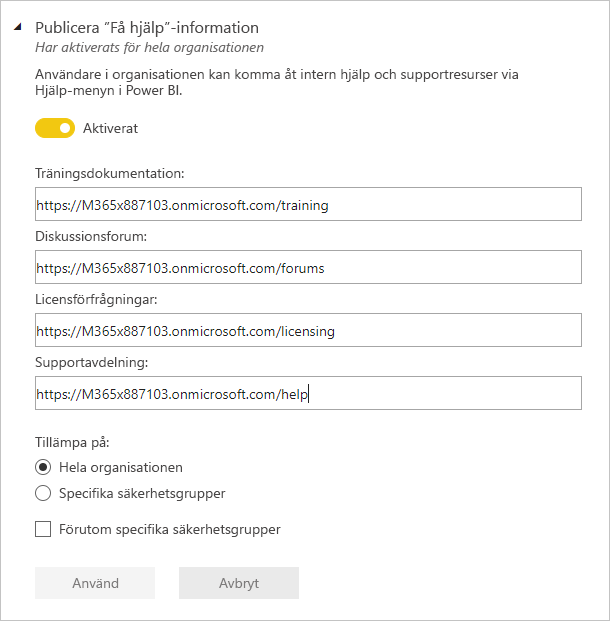

### Få e-postmeddelanden om tjänstavbrott eller incidenter

E-postaktiverade säkerhetsgrupper får e-postmeddelanden om den här klientorganisationen påverkas av ett avbrott i tjänsten eller en incident. Lär dig mer om [Aviseringar om tjänstavbrott](service-interruption-notifications.md).

## Arbetsyteinställningar

Administrationsportalen har två avsnitt för att kontrollera arbetsytor i **Klientinställningar**:

- Skapa nya arbetsyteupplevelser.
- Använd datamängder på arbetsytor.
- Blockera skapande av klassisk arbetsyta.

### Skapa nya arbetsytor

Arbetsytor är platser där användarna kan samarbeta kring instrumentpaneler, rapporter och annat innehåll. Administratörer använder inställningen **Skapa arbetsytor (ny arbetsyteupplevelse)** till att indikera vilka användare i organisationen som kan skapa arbetsytor. Administratörer kan tillåta alla eller ingen i en organisation att skapa arbetsytor för nya arbetsyteupplevelser. De kan även begränsa skapandet till medlemmar eller vissa säkerhetsgrupper. Läs mer om [arbetsytor](../collaborate-share/service-new-workspaces.md).

:::image type="content" source="media/service-admin-portal/power-bi-admin-workspace-settings.png" alt-text="Skapa de nya arbetsyteupplevelserna":::

För klassiska arbetsytor baserade på Microsoft 365-grupper, sker administrationen även fortsatt i administrationsportalen och Azure Active Directory.

> [!NOTE]
> Inställningen **Skapa arbetsytor (ny arbetsyteupplevelse)** tillåter som standard endast användare som kan skapa Microsoft 365-grupper att skapa nya Power BI-arbetsytor. Glöm inte att ange ett värde i Power BI-administratörsportalen och därmed säkerställa att lämpliga användare kan skapa dem.

**Lista med arbetsytor**

Administratörsportalen har ett annat avsnitt med inställningar för arbetsytorna i din klient. I det avsnittet kan du sortera och filtrera listan över arbetsytor och visa information för varje arbetsyta. Mer information finns i [Arbetsytor](#workspaces) i den här artikeln.

**Publicera innehållspaket och appar**

I administrationsportalen styr du också vilka användare som har behörighet att distribuera appar i organisationen. Se [Publicera innehållspaket och appar för hela organisationen](#publish-content-packs-and-apps-to-the-entire-organization) i den här artikeln för mer information.

### Använda datamängder på arbetsytor

Administratörer kan styra vilka användare i organisationen som kan använda datauppsättningar på flera arbetsytor. När den här inställningen är aktiverad behöver användarna fortfarande den nödvändiga versionsbehörigheten för en speciell datauppsättning.

:::image type="content" source="media/service-admin-portal/power-bi-admin-datasets-workspaces.png" alt-text="Använda datamängder på arbetsytor":::

Mer information finns i [Introduktion till datamängder på olika arbetsytor](../connect-data/service-datasets-across-workspaces.md).

### Blockera skapande av klassisk arbetsyta

Administratörer kan styra om organisationen kan skapa klassiska arbetsytor. När inställningen är aktiverad kan användare som skapar en arbetsyta bara skapa arbetsytor för den nya arbetsyteupplevelsen. 

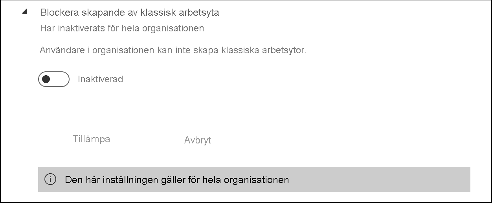

När inställningen är aktiverad visas inte nya skapade Office 365-grupper i listan över arbetsytor i Power BI. Befintliga klassiska arbetsytor visas fortfarande i listan. När inställningen är inaktiverad visas alla Office 365-grupper som användaren är medlem av i listan över arbetsytor. Läs mer om [arbetsytor för den nya arbetsyteupplevelsen](../collaborate-share/service-new-workspaces.md).

## Inställningar för export och delning

### Dela innehåll med externa användare

Användare i organisationen kan dela instrumentpaneler, rapporter och appar med användare utanför organisationen. Läs mer om att [dela externt](../collaborate-share/service-share-dashboards.md#share-a-dashboard-or-report-outside-your-organization).

Följande bild visar meddelandet som visas när du delar med en extern användare.

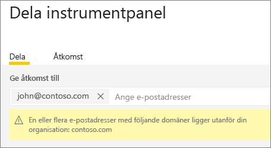  

> [!IMPORTANT]
> Det här alternativet styr huruvida användare i Power BI kan bjuda in externa användare att bli Azure Active Directory B2B (Azure AD B2B)-gästanvändare i din organisation via Power BI. När funktionen är aktiverad kan användare som har rollen gästanvändare i Azure AD lägga till externa e-postadresser när de delar rapporter, instrumentpaneler och Power BI-appar. Den externa mottagaren uppmanas att ansluta till din organisation som en Azure AD B2B-gästanvändare. Observera att när den här inställningen inaktiveras fortsätter externa användare som redan är Azure AD B2B-gästanvändare i din organisation att visas i användargränssnitt med personväljaren i Power BI och kan ges åtkomst till objekt, arbetsytor och appar.

### Publicera på webben

Som administratör för en Power BI-klientorganisation ger inställningen **Publicera på webben** alternativ för vilka användare som kan skapa inbäddningskoder för att publicera rapporter på webben. Den här funktionen gör rapporten och dess data tillgängliga för alla på webben. Mer information om att [publicera på webben](../collaborate-share/service-publish-to-web.md).

> [!NOTE]
> Endast Power BI-administratörer kan tillåta att nya inbäddningskoder för publicering på webben skapas. Organisationer kan ha befintliga inbäddningskoder. Se avsnittet [Inbäddningskoder](service-admin-portal.md#embed-codes) i administrationsportalen för att granska aktuella publicerade rapporter.

Följande bild visar menyn **Fler alternativ (...)** för en rapport när inställningen **Publicera på webben** är aktiverad.

Inställningen **Publicera på webben** i administratörsportalen tillhandahåller alternativ för vilka användare kan skapa inbäddningskoder.

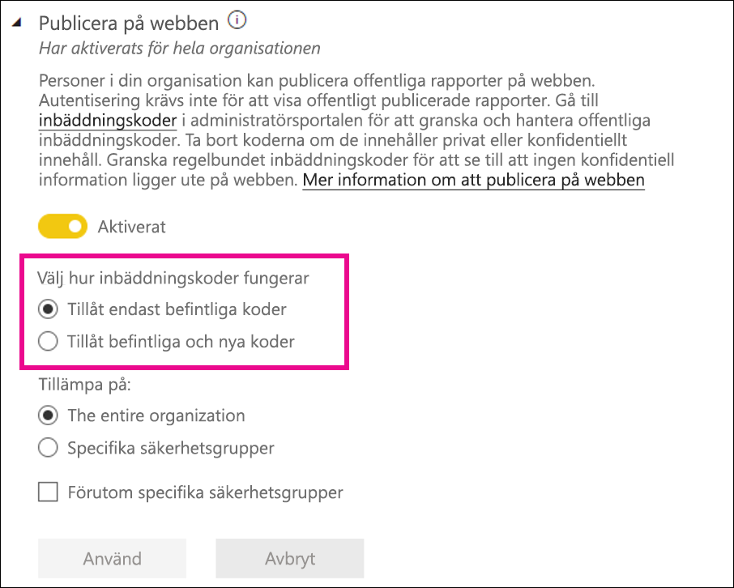

Administratörer kan ställa in **Publicera på webben** till **Aktiverad** och **Välj hur inbäddningskoder fungerar** till **Tillåt endast befintliga inbäddningskoder**. I detta fall kan användarna skapa inbäddningskoder, men de måste kontakta Power BI-administratören som kan tillåta dem att göra det.

Användarna ser olika alternativ i användargränssnittet baserat på vad inställningen för **Publicering på webben** är.

|Funktion |Aktiverad för hela organisationen |Inaktiverad för hela organisationen |Specifika säkerhetsgrupper   |
|---------|---------|---------|---------|
|**Publicera på webben** under rapportens **Fler alternativ (...)** -meny|Aktiverad för alla|Inte synlig för alla|Endast synlig för behöriga användare eller grupper.|
|**Hantera inbäddade koder** under **Inställningar**|Aktiverad för alla|Aktiverad för alla|Aktiverad för alla  Alternativet * **Ta bort** endast för behöriga användare eller grupper. * **Hämta koder** aktiverat för alla.|
|**Inbäddade koder** i administrationsportalen|Statusen visar något av följande: * Aktiv * Stöds ej * Blockerad|Statusen visar **Inaktiverad**|Statusen visar något av följande: * Aktiv * Stöds ej * Blockerad  Om en användare inte har behörighet baserat på klientinställningen visas statusen **Intrång**.|
|Befintliga publicerade rapporter|Alla aktiverade|Alla inaktiverade|Rapporter fortsätta att visas för alla.|

### Exportera data

Användare i organisationen kan exportera data från ett fönster eller en visualisering. Det här styr även funktionerna Analysera i Excel, exportera till .CSV, datamängdsnedladdningar och Power BI-tjänstens Live Connect-funktioner. Läs mer om hur du [exporterar data från en panel eller ett visuellt objekt](../visuals/power-bi-visualization-export-data.md).

>[!NOTE]
> Innan inställningen Exportera till Excel introducerades styrde den här inställningen även export av data till Excel-filer. Mer information finns i [anteckning om Exportera till Excel](#export-to-excel).

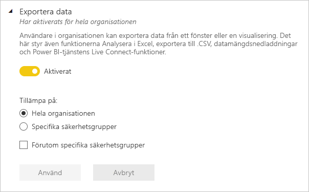

Följande bild visar alternativet för att exportera data från en panel.

> [!NOTE]
> När du inaktiverar **Exportera data** kan användare inte heller använda funktionen [Analysera i Excel](../collaborate-share/service-analyze-in-excel.md) eller live-anslutning till Power BI-tjänsten.

### Exportera till Excel

Användare i organisationen kan exportera data från en visualisering till en Excel-fil.

>[!IMPORTANT]
> Innan inställningen Exportera till Excel introducerades styrdes export till en Excel-fil av inställningen export av data. Första gången administratörer för klientorganisationer i klientorganisationer som fanns före introduktionen av inställningen Exportera till Excel ser inställningen kommer de därför se att den har *Ej tillämpade ändringar*. De måste tillämpa dessa ändringar för att den nya inställningen ska börja gälla. Annars kommer exportering till en Excel-fil även fortsättningsvis att kontrolleras av inställningen Exportera data.

### Exportera rapporter som PowerPoint-presentationer eller PDF-dokument

Användare i organisationen kan exportera Power BI-rapporter som PowerPoint-filer eller PDF-dokument. [Läs mer](../consumer/end-user-powerpoint.md)

Följande bild visar menyn **Arkiv** för en rapport när inställningen **Exportera rapporter som PowerPoint-presentationer eller PDF-dokument** är aktiverad.

### Skriva ut instrumentpaneler och rapporter

Användare i organisationen kan skriva ut instrumentpaneler och rapporter. [Läs mer](../consumer/end-user-print.md)

Följande bild visar alternativet för att skriva ut en instrumentpanel.

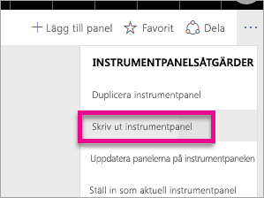

Följande bild visar menyn **Arkiv** för en rapport när inställningen **Skriv ut instrumentpaneler och rapporter** är aktiverad.

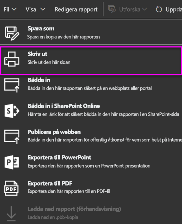

### Tillåt externa gästanvändare att redigera och hantera innehåll i organisationen

Azure AD B2B-gästanvändare kan redigera och hantera innehåll i organisationen. [Läs mer](service-admin-azure-ad-b2b.md)

I följande bild visas alternativet Tillåt externa gästanvändare att redigera och hantera innehåll i organisationen.

I administrationsportalen styr du också vilka användare som har behörighet att bjuda in externa användare till organisationen. Mer information finns i [Dela innehåll med externa användare](#export-and-sharing-settings) i den här artikeln.

### E-postprenumerationer
Användare i organisationen kan skapa e-postprenumerationer. Läs mer om [prenumerationer](../collaborate-share/service-publish-to-web.md).

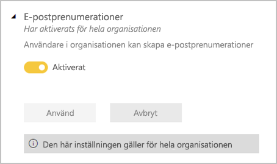

### Aktuellt innehåll

Tillåt att vissa eller alla rapportförfattare i din organisation kan ha innehåll i avsnittet Aktuellt på Power BI-startsidan. Nya användare ser aktuellt innehåll överst på sin Power BI-startsida. Aktuellt innehåll flyttas ned på startsidan när användarna lägger till **favoriter**, **ofta använda**och **nya**. 

Vi rekommenderar att du börjar med en liten uppsättning kampanjdeltagare först. Att låta hela organisationen lägga upp innehåll på startsidan kan göra det svårt att hålla koll på allt aktuellt innehåll. 

När du har aktiverat aktuellt innehåll kan du också hantera det i administrationsportalen. I [Hantera aktuellt innehåll](#manage-featured-content) i den här artikeln kan du läsa om hur du styr aktuellt innehåll i din domän.

## Inställningar för innehållspaket och appar

### Publicera innehållspaket och appar för hela organisationen

Administratörer använder den här inställningen för att bestämma vilka användare som får publicera innehållspaket och appar för hela organisationen snarare än specifika grupper. Läs mer om att [publicera appar](../collaborate-share/service-create-distribute-apps.md).

Följande bild visar alternativet **Hela min organisation** när du skapar ett innehållspaket.

### Skapa mallappar och organisationsinnehållspaket

Användare i organisationen kan skapa mallappar och organisationsinnehållspaket som använder datamängder som bygger på en datakälla i Power BI Desktop. Läs mer om [mallappar](../connect-data/service-template-apps-create.md).

### Pusha appar till slutanvändare

Rapportskapare kan dela appar direkt med slutanvändare utan att det krävs någon installation från [AppSource](https://appsource.microsoft.com). Läs mer om [installera appar automatiskt för slutanvändare](../collaborate-share/service-create-distribute-apps.md#automatically-install-apps-for-end-users).

## Inställningar för integrering

### Analysera i Excel med lokala datauppsättningar

Användare i organisationen kan använda Excel för att visa och interagera med lokala Power BI-datauppsättningar. [Läs mer](../collaborate-share/service-analyze-in-excel.md)

> [!NOTE]
> När du inaktiverar **Exportera data** kan användare inte heller använda funktionen **Analysera i Excel**.

### Använd ArcGIS Maps for Power BI

Användare i organisationen kan använda ArcGIS Maps for Power BI-visualiseringen som tillhandahålls av Esri. [Läs mer](../visuals/power-bi-visualization-arcgis.md)

### Använda global sökning för Power BI (förhandsversion)

Användare i organisationen kan använda externa sökfunktioner som förlitar sig på Azure Search.

## Aktuella tabellinställningar

Under **Klientinställningar** kan Power BI-administratörer med hjälp av klientinställningen **Tillåt anslutningar till aktuella tabeller** styra vem i organisationen som kan använda aktuella tabeller i galleriet för Excel-datatyper. 

:::image type="content" source="media/service-admin-portal/admin-allow-connections-featured-tables.png" alt-text="Alla anslutningar till aktuella tabeller":::

Anslutningar till aktuella tabeller inaktiveras också om klientinställningen **Exportera data** är inställd på **Inaktiverad**.

Läs mer om [aktuella Power BI-tabeller i Excel](../collaborate-share/service-excel-featured-tables.md).

## Dela till Teams-klientinställning

Inställningen **Dela till Teams** finns i avsnittet **Klientinställningar** i Power BI-administratörsportalen. Med den här inställningen kan organisationer dölja knapparna för **Dela till Teams** i Power BI-tjänsten. När inställningen är inaktiverad visas inte **Dela till Teams**-knappar i åtgärdsfältet eller i snabbmenyer när de visar rapporter och instrumentpaneler i Power BI-tjänsten.

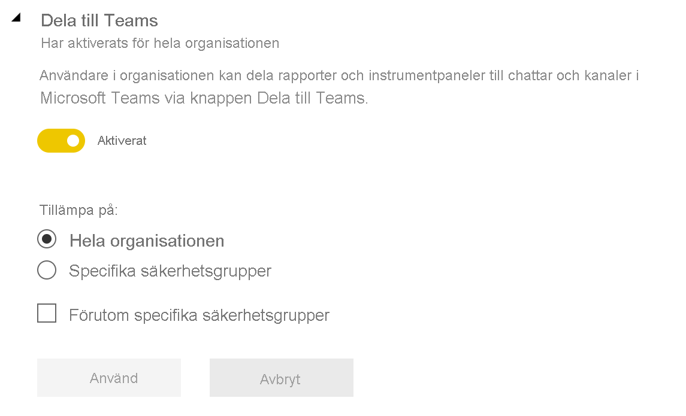

Läs mer om [delning av Power BI-innehåll till Teams](../collaborate-share/service-share-report-teams.md).

## Inställningar för R-visualisering

### Interagera med och dela visuell R-information

Användare i organisationen kan interagera med och dela visuella objekt som skapats med R-skript. [Läs mer](../visuals/service-r-visuals.md)

> [!NOTE]
> Den här inställningen gäller för hela organisationen och kan inte begränsas till specifika grupper.

## Gransknings- och användningsinställningar

### Skapa granskningsloggar för intern aktivitetsgranskning och efterlevnad

Användare i organisationen kan använda granskning för att övervaka åtgärder som vidtas i Power BI av andra användare i organisationen. [Läs mer](service-admin-auditing.md)

Den här inställningen måste vara aktiverad för att registrera granskningsloggposter. Det kan förekomma en fördröjning på upp till 48 timmar mellan det att granskning aktiveras och att granskningsdata kan visas. Om du inte ser data omedelbart kontrollerar du granskningsloggarna senare. Det kan förekomma en liknande fördröjning mellan hämtning av behörighet för att visa granskningsloggar och att komma åt loggarna.

> [!NOTE]
> Den här inställningen gäller för hela organisationen och kan inte begränsas till specifika grupper.

### Användningsstatistik för innehållsskapare

Användarna i organisationen kan se användningsstatistik för de instrumentpaneler och rapporter som de har skapat. [Läs mer](../collaborate-share/service-usage-metrics.md)

### Data per användare i användningsmått för innehållsskapare

Om du använder mått för innehållsskapare visas visningsnamn och e-postadresser för de användare som har åtkomst till innehållet. [Läs mer](../collaborate-share/service-usage-metrics.md)

Data per användare är aktiverat för användningsstatistik som standard, och kontoinformation om innehållsskapare ingår i statistikrapporten. Om du inte vill samla in den här informationen för alla användare kan du inaktivera funktionen för specifika säkerhetsgrupper eller hela organisationen. Kontoinformationen för de exkluderade användarna visas då i rapporten som *Namnlös*.

## Inställningar för instrumentpanelen

### Klassificering av instrumentpanelsdata

Användare i organisationen kan tagga instrumentpaneler med klassificeringar som anger instrumentpanelens säkerhetsnivåer. [Läs mer](../create-reports/service-data-classification.md)

> [!NOTE]
> Den här inställningen gäller för hela organisationen och kan inte begränsas till specifika grupper.

## Inställningar för utvecklare

### Bädda in innehåll i appar

Användare i organisationen kan bädda in Power BI-instrumentpaneler och rapporter i SaaS-program (programvara som en tjänst). När du inaktiverar den här inställningen kan användare inte använda REST-API: er för att bädda in Power BI-innehåll i sina program. [Läs mer](../developer/embedded/embedding.md)

### Tillåt att tjänsters huvudnamn att använda Power BI API:er

Webbappar som är registrerade i Azure Active Directory (Azure AD) använder en ett huvudnamn för tjänsten som tilldelas i syfte att få åtkomst till Power BI:s API:er utan en inloggad användare. För att tillåta en app att använda autentisering med tjänstens huvudnamn, måste tjänstens huvudnamn ingå i en godkänd säkerhetsgrupp. [Läs mer](../developer/embedded/embed-service-principal.md)

> [!NOTE]
> Tjänsthuvudnamn ärver behörigheterna för alla Power BI-klientinställningar för deras säkerhetsgrupp. Begränsa behörigheter genom att skapa en dedikerad säkerhetsgrupp för tjänstens huvudkonton och lägg till i listan Förutom vissa säkerhetsgrupper för de relevanta, aktiverade Power BI-inställningarna.

## Dataflödesinställningar

### Skapa och använda dataflöden

Användare i organisationen kan skapa och använda dataflöden. I [Dataförberedelser med självbetjäning i Power BI](../transform-model/service-dataflows-overview.md) finns en översikt över dataflöden. Information om hur du aktiverar dataflöden i en Premium-kapacitet finns i [Konfigurera arbetsbelastningar](service-admin-premium-workloads.md).

> [!NOTE]
> Den här inställningen gäller för hela organisationen och kan inte begränsas till specifika grupper.

## Inställningar för mallappar

Tre inställningar styr mallapparnas förmåga att publicera eller installera mallappar.

### Publicera mallappar

Användare i organisationen kan skapa arbetsytor för mallappar. Kontrollera vilka användare som kan publicera mallappar eller distribuera dem till klienter utanför organisationen via [AppSource](https://appsource.microsoft.com) eller något annat distributionssätt.

### Installera mallappar som finns i AppSource

Användare i organisationen kan **bara** ladda ned och installera mallappar från [AppSource](https://appsource.microsoft.com). Kontrollera vilka specifika användare eller säkerhetsgrupper som kan installera mallappar från AppSource.

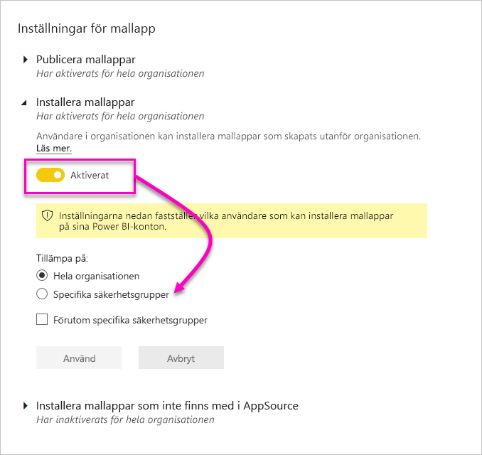

### Installera mallappar som inte finns i AppSource

Kontrollera vilka användare i organisationen som kan ladda ned och installera mallappar **som inte finns i [AppSource](https://appsource.microsoft.com)** .

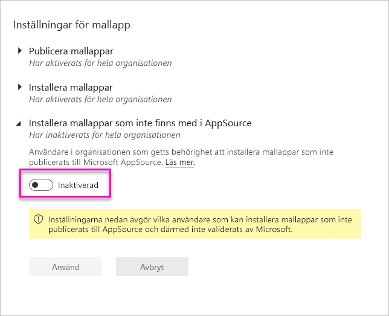

## Kapacitetsinställningar

### Power BI Premium

På fliken **Power BI Premium** kan du hantera alla premiumfunktioner för Power BI (Em eller P SKU) som har köpts för din organisation. Alla användare inom din organisation ser fliken **Power BI Premium** men kan endast se innehåll om de har angetts som antingen *kapacitetadministratör* eller en användare som har tilldelningsbehörighet. Om en användare inte har några behörigheter visas följande meddelande.

### Power BI Embedded

På fliken för **Power BI Embedded** kan du visa de Power BI Embedded-kapaciteter (A SKU) som du har köpt för din kund. Eftersom du bara kan köpa SKU:er från Azure, [hanterar du inbäddade kapaciteter i Azure](../developer/embedded/azure-pbie-create-capacity.md) från **Azure-portalen**.

Mer information om hur du hanterar inställningar för Power BI Embedded (A SKU) finns i [Vad är Power BI Embedded](../developer/embedded/azure-pbie-what-is-power-bi-embedded.md).

## Bädda in koder

Som administratör kan du visa de inbäddningskoder som har genererats för din klient för att dela rapport offentligt. Du kan även återkalla eller ta bort koder. [Läs mer](../collaborate-share/service-publish-to-web.md)

## Dataflödeslagring (förhandsversion)

Som standard lagras data som används med Power BI i intern lagring som tillhandahålls av Power BI. Med integreringen av dataflöden och Azure Data Lake Storage Gen2 (ADLS Gen2) kan du lagra dina dataflöden på din organisations Azure Data Lake Storage Gen2 konto. Mer information finns i [Dataflöden och Azure Data Lake-integrering (förhandsversion)](../transform-model/service-dataflows-azure-data-lake-integration.md).

## Arbetsytor

Som administratör kan visa du de arbetsytor som finns i din klientorganisation. Du kan sortera och filtrera listan över arbetsytor och visa information för varje arbetsyta. Tabellkolumnerna motsvarar egenskaperna som returneras av [Power BI Admin Rest-API:et](/rest/api/power-bi/admin) för arbetsytor. Personliga arbetsytor är av typen **PersonalGroup**, klassiska arbetsytor är av typen **Grupp** och arbetsytorna för den nya arbetsyteupplevelsen är av typen **Arbetsyta**. Mer information finns i [Organisera arbetet på de nya arbetsytorna](../collaborate-share/service-new-workspaces.md).

Administratörerna kan även hantera och återställa arbetsytor med hjälp av administratörsportalen eller PowerShell-cmdletar. 

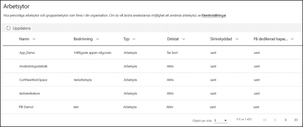

På fliken **Arbetsytor** visas *tillståndet* för varje arbetsyta. Följande tabell innehåller mer information om innebörden av dessa tillstånd.

|Stat  |Beskrivning  |
|---------|---------|
| Aktiv | En normal arbetsyta. Det indikerar ingenting om användning eller innehåll, bara att själva arbetsytan är ”normal”. |
| Frånkopplad | En arbetsyta utan administratörsanvändare. |
| Borttagen | En borttagen arbetsyta. I upp till 90 dagar behåller vi tillräckligt mycket metadata för att återställa arbetsytan om du vill. |
| Tar bort | En arbetsyta som håller på att tas bort men som inte är borta än. Användare kan ta bort sina egna arbetsytor, och placera saker i Tar bort och slutligen i Borttagen. |

## Anpassad varumärkesanpassning

Som administratör kan du anpassa utseendet på Power BI för hela organisationen. Det finns för närvarande tre huvudalternativ:

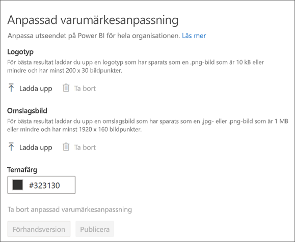

* **Ladda upp logotyp**: För bästa resultat laddar du upp en logotyp som har sparats som en .png-bild som är 10 kB eller mindre och har minst 200 x 30 bildpunkter.

* **Ladda upp omslagsbild**: För bästa resultat laddar du upp en omslagsbild som har sparats som en .jpg- eller .png-bild som är 1 MB eller mindre och har minst 1920 x 160 bildpunkter.

* **Välj temafärg**: Du kan välja tema baserat på ett hex-nummer eller RGB-värde eller från färgpaletten.

Mer information finns i [Anpassad varumärkesanpassning för din organisation](https://aka.ms/orgBranding).

## Hantera aktuellt innehåll

Som innehavaradministratör kan du hantera alla rapporter, instrumentpaneler och appar som har lagts upp i avsnittet Aktuellt innehåll på startsidan för Power BI i hela organisationen.

- I administratörsportalen väljer du **Hantera aktuellt innehåll**.

Här visas en översikt över vem som har tillgång till innehållet, när det lades upp som aktuellt samt alla relevanta metadata. Om något ser misstänkt ut eller om du vill rensa avsnittet Aktuellt innehåll kan du ta bort aktuellt innehåll efter behov.

I [Aktuellt innehåll](#featured-content) i den här artikeln kan du läsa om hur du aktiverar aktuellt innehåll.

## Nästa steg

[Administrera Power BI i din organisation](service-admin-administering-power-bi-in-your-organization.md)  
[Förstå Power BI-administratörsrollen](service-admin-role.md)  
[Granska Power BI i din organisation](service-admin-auditing.md)  

Har du fler frågor? [Fråga Power BI Community](https://community.powerbi.com/)
