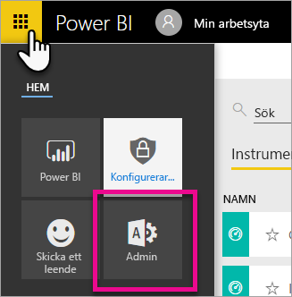
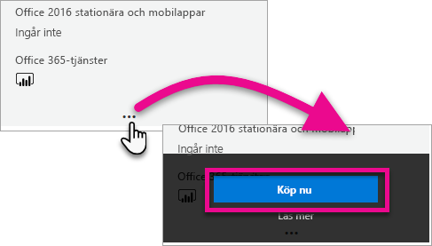
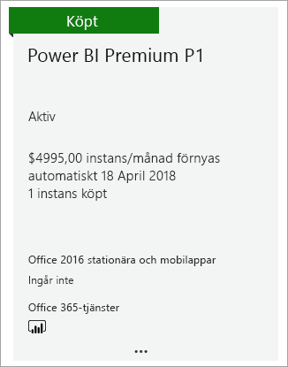
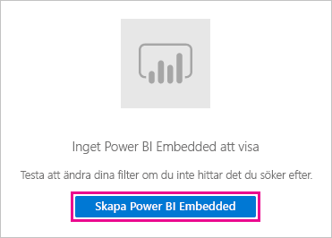
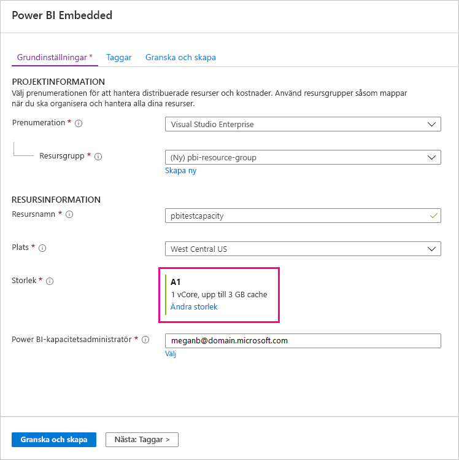
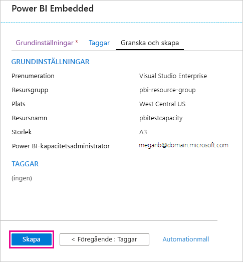
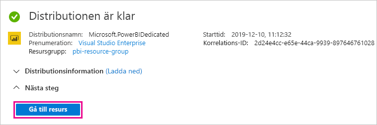
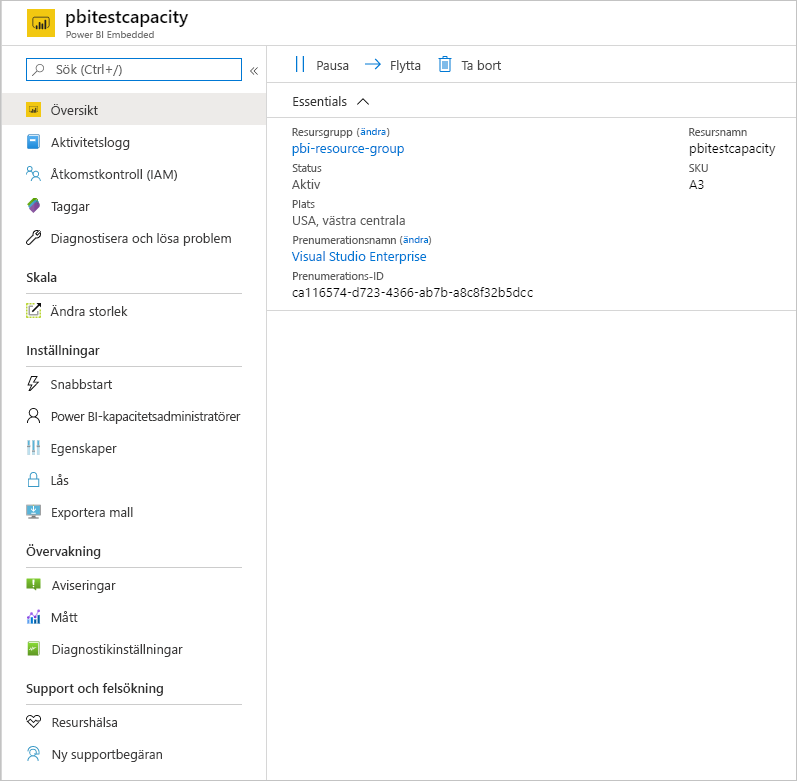

# Så här köper du Power BI Premium

Den här artikeln beskriver hur du köper Power BI Premium-kapacitet till din organisation. Artikeln omfattar två scenarier:

- Användning av P-SKU:er för vanliga produktionsscenarier. P-SKU:er kräver ett månatligt eller årligt åtagande och faktureras per månad.

- Användning av A-SKU:er för testningsscenarier och för de fall där du inte har de behörigheter som krävs för att köpa P-SKU:er (rollen som global Microsoft 365-administratör eller faktureringsadministratör). A-SKU:er kräver inget tidsåtagande och faktureras per timme. Du kan köpa A-SKU:er i [Azure-portalen](https://portal.azure.com).

Mer information om Power BI Premium finns i [Vad är Power BI Premium?](service-premium-what-is.md). Aktuell information om prissättning och planering finns på [prissättningssidan för Power BI](https://powerbi.microsoft.com/pricing/) och [Power BI Premium-kalkylatorn](https://powerbi.microsoft.com/calculator/). Innehållsskapare behöver fortfarande en [Power BI Pro-licens](service-admin-purchasing-power-bi-pro.md), även om organisationen använder Power BI Premium. Se till att du köper minst en Power BI Pro-licens för din organisation. Med A-SKU:er behöver _alla användare_ som använder innehåll även Pro-licenser.

> [!NOTE]
> Om en Premium-prenumeration upphör att gälla har du 30 dagar med fullständig åtkomst till din kapacitet. Efter det återgår innehållet till en delad kapacitet. Det finns inte stöd för modeller större än 1 GB i delade kapaciteter.

## Köpa P-SKU:er för vanliga produktionsscenarier

Du kan skapa en ny klientorganisation med en Power BI Premium P1-SKU konfigurerad, eller så kan du köpa en Power BI Premium-kapacitet för en befintlig organisation. I båda fallen kan du sedan lägga till kapacitet om du behöver det.

### Skapa en ny klient med Power BI Premium P1

Om du inte har någon befintlig klient och vill skapa en, så kan du köpa Power BI Premium samtidigt. Följande länk vägleder dig genom processen med att skapa en ny klientorganisation och kan användas för att köpa Power BI Premium: [Power BI Premium P1-erbjudande](https://signup.microsoft.com/Signup?OfferId=b3ec5615-cc11-48de-967d-8d79f7cb0af1). När du skapar klientorganisationen blir du automatiskt tilldelad rollen som global Microsoft 365-administratör för klientorganisationen.

När du har köpt kapacitet kan du lära dig hur du [hanterar kapaciteter](service-admin-premium-manage.md#manage-capacity) och [tilldelar arbetsytor](service-admin-premium-manage.md#assign-a-workspace-to-a-capacity) till en kapacitet.

### Köp Power BI Premium-kapacitet för en befintlig organisation

Om du har en befintlig organisation (klientorganisation) måste du ha rollen som global Microsoft 365-administratör eller faktureringsadministratör för att kunna köpa prenumerationer och licenser. Mer information finns i [Om Microsoft 365-administratörsroller](https://support.office.com/article/About-Office-365-admin-roles-da585eea-f576-4f55-a1e0-87090b6aaa9d).

Om du vill köpa Premium-kapacitet följer du dessa steg:

1. Från Power BI-tjänsten väljer du Microsoft 365-appväljaren och sedan **Admin**.

    

    Du kan också bläddra till Administrationscenter för Microsoft 365.

1. Välj **Fakturering** > **Köp tjänster**.

1. Sök efter Power BI Premium-erbjudanden under **Andra alternativ**. Här visas en lista över med P1 till P3, EM3 och P1 (månad för månad).

1. Hovra över ellipsen ( **. . .** ) och välj sedan **Köp nu**.

    

1. Slutför köpet genom att följa stegen.

När du har slutfört köpet visas skärmen **Köptjänster** med information om att objektet har köpts och har aktiverats.

När du har köpt kapacitet kan du lära dig hur du [hanterar kapaciteter](service-admin-premium-manage.md#manage-capacity) och [tilldelar arbetsytor](service-admin-premium-manage.md#assign-a-workspace-to-a-capacity) till en kapacitet.

### Köper ytterligare kapaciteter

Nu när du har en kapacitet kan du lägga till fler allteftersom dina behov växer. Du kan använda valfri kombination av premiumkapacitets-SKU:er (från P1 till P3) i din organisation. De olika SKU:erna tillhandahåller olika resursfunktioner.

1. I administrationscentret för Microsoft 365 väljer du **Fakturering** > **Köptjänster**.

1. Söka efter det Power BI Premium-objekt som du vill köpa mer av under **Andra alternativ**.

1. Hovra över **Fler alternativ** (...) och välj sedan **Ändra antalet licenser**.

    

1. Ändra det antal instanser av objektet som du vill ha. Välj **Skicka** när du är klar.

   > [!IMPORTANT]
   > Om du väljer **Skicka** debiteras det registrerade kreditkortet.

Sidan **Köp tjänster** visar sedan hur många instanser du har. De tillgängliga v-kärnorna återspeglar den nya kapacitet som köpts under **Kapacitetsinställningar** i Power BI-administratörsportalen.

### Avbryt din prenumeration

Du kan avbryta prenumerationen från Administrationscenter för Microsoft 365. Gör följande om du vill avbryta din Premium-prenumeration.

1. Gå till Administrationscenter för Microsoft 365.

1. Välj **Fakturering** > **Prenumerationer**.

1. Välj din Power BI Premium-prenumeration i listan.

1. Välj **Fler åtgärder** > **Avbryt prenumeration**.

1. Sidan **Avbryt prenumeration** visar huruvida du är skyldig att betala en [avgift för tidig uppsägning](https://support.office.com/article/early-termination-fees-6487d4de-401a-466f-8bc3-c0beb5cc40d3) eller inte. På den här sidan anges även när data tas bort för prenumerationen.

1. Läs igenom informationen och välj **Avbryt prenumeration** om du vill fortsätta.

#### När du avbryter eller licensen upphör att gälla

När du avbryter din Premium-prenumeration eller kapacitetslicensen upphör att gälla, kan du fortsätta att få åtkomst till din Premium-kapacitet under en period på 30 dagar från datumet för avbrottet eller då licensen upphör att gälla. Efter 30 dagar kommer du inte längre att kunna komma åt din Premium-kapaciteter eller arbetsytor i dem.

## Köpa A-SKU:er för testning och andra scenarier

A-SKU:er görs tillgängliga via Azure Power BI Embedded-tjänsten. Du kan använda A-SKU:er på följande sätt:

- Aktivera inbäddning av Power BI i program från tredje part. Mer information finns i [Power BI Embedded](../developer/embedded/azure-pbie-what-is-power-bi-embedded.md).

- Testa Premium-funktioner innan du köper en P-SKU.

- Skapa utvecklings- och testmiljöer tillsammans med en produktionsmiljö som använder P-SKU:er.

- Köp Power BI Premium även om du inte ha rollen som global Microsoft 365-administratör eller faktureringsadministratör.

> [!NOTE]
> Om du köper en SKU av typen A4 eller högre kan du utnyttja alla Premium-funktioner förutom obegränsad delning av innehåll. Med A-SKU:er behöver _alla användare_ som använder innehåll Pro-licenser.

Följ dessa steg för att köpa A-SKU:er i Azure-portalen:

1. Logga in på [Azure-portalen](https://portal.azure.com) med ett konto som minst har behörighet som kapacitetsadministratör i Power BI.

1. Sök efter _Power BI Embedded_ och välj tjänsten i sökresultatet.

    

1. Välj **Skapa Power BI Embedded**.

    

1. På skärmen för att skapa **Power BI Embedded** anger du följande information:

    - Den **prenumeration** där Power BI Embedded-tjänsten ska skapas.

    - Den fysiska **plats** där den resursgrupp som innehåller tjänsten ska skapas. För att du ska få bättre prestanda bör den här platsen vara nära platsen för din Azure Active Directory-klientorganisation för Power BI.

    - Den befintliga **resursgrupp** som ska användas, eller skapa en ny enligt exemplet.

    - **Power BI-kapacitetsadministratören**. Kapacitetsadministratören måste vara medlemsanvändare eller tjänsthuvudnamn i din Azure AD-klientorganisation.

    

1. Om du vill använda alla funktioner i Power BI Premium (förutom obegränsad delning) behöver du SKU av typen A4 eller högre. Välj **Ändra storlek**.

    

1. Välj en kapacitetsstorlek på A4, A5 eller A6, vilket motsvarar P1, P2 respektive P3.

    

1. Välj **Granska + skapa**, granska de alternativ du valde och välj sedan **Skapa**.

    

1. Det kan ta några minuter att slutföra distributionen. När det är klart väljer du **Gå till resurs**.

    

1. På hanteringssidan granskar du de alternativ du har för att hantera tjänsten, däribland att pausa tjänsten när du inte använder den.

    

När du har köpt kapacitet kan du lära dig hur du [hanterar kapaciteter](service-admin-premium-manage.md#manage-capacity) och [tilldelar arbetsytor](service-admin-premium-manage.md#assign-a-workspace-to-a-capacity) till en kapacitet.

## Nästa steg

[Konfigurera och hantera kapaciteter i Power BI Premium](service-admin-premium-manage.md)\
[Power BI-prissättningsida](https://powerbi.microsoft.com/pricing/)\
[Power BI Premium-kalkylator](https://powerbi.microsoft.com/calculator/)\
[Vanliga frågor och svar om Power BI Premium](service-premium-faq.md)\
[Planera ett white paper för en företagsdistribution för Power BI](https://aka.ms/pbienterprisedeploy)

Fler frågor? [Fråga Power BI Community](https://community.powerbi.com/)
