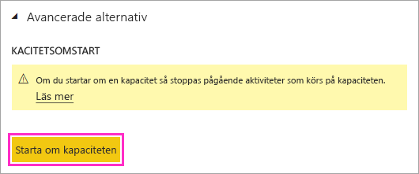
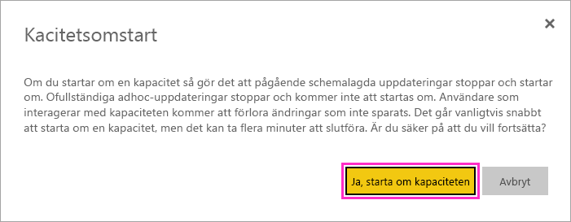

# Starta om en Power BI Premium-kapacitet

Som Power BI-administratör kan du behöva starta om en Premium-kapacitet. I den här artikeln beskrivs hur du startar om en kapacitet och hanterar flera frågor om omstart och prestanda.

## Varför har Power BI det här alternativet?

Power BI ger användare möjligheten att utföra komplexa analyser på enorma mängder data. Tyvärr kan användare orsaka prestandaproblem genom att överbelasta Power BI-tjänsten med jobb, skriva för komplicerade frågor, skapa cirkelreferenser och så vidare.

Delad Power BI-kapacitet ger ett visst skydd mot sådant genom att tillämpa begränsningar på filstorlekar, uppdateringsscheman och andra aspekter av tjänsten. I en Power BI Premium-kapacitet är de flesta sådana begränsningar högre. Till följd av det kan en enda rapport med ett felaktigt DAX-uttryck eller en mycket komplex modell orsaka betydande prestandaproblem. När rapporten bearbetas kan den förbruka alla tillgängliga resurser i kapaciteten. 

Power BI förbättras ständigt när det gäller hur Premium-kapacitetsanvändare skyddas mot sådana problem. Vi ger även administratörer verktyg för att analysera när kapaciteter överbelastas och varför. Mer information finns i vår [korta utbildningssession](https://www.youtube.com/watch?v=UgsjMbhi_Bk&feature=youtu.be) och [längre utbildningssession](https://powerbi.tips/2018/07/). Samtidigt behöver du kunna åtgärda betydande problem när de inträffar. Det snabbaste sättet att åtgärda dessa problem är att starta om kapaciteten.

## Är omstarten säker? Förlorar jag data?

Alla sparade data, definitioner, rapporter och instrumentpaneler i kapaciteten förblir helt intakta efter omstart. När du startar om en kapacitet stoppas pågående schemalagda uppdateringar och ad hoc-uppdateringar tillfälligt av uppdateringsmotorn i de flesta fall. De startas sedan om på grund av den logik för uppdateringsomförsök som är inbyggd i Power BI. Tjänsten provar att göra nya försök med eventuella uppdateringar som påverkats när kapaciteten blir tillgänglig. Uppdateringarnas tillstånd kanske inte ändras i användargränssnittet under omstarten. 

Användare som interagerar med kapaciteten förlorar arbete som inte har sparats när omstartsprocessen körs. De bör uppdatera sina webbläsare när omstarten har slutförts.

## Hur startar jag om en kapacitet?

Starta om en kapacitet med hjälp av följande steg.

1. I Power BI-administrationsportalen, på fliken **Kapacitetsinställningar**, går du till din kapacitet. 

1. Lägg till **CapacityRestart**-*funktionsflaggan* i kapacitets-URL:en: `https://app.powerbi.com/admin-portal/capacities/<YourCapacityId>?capacityRestartButton=true`.

1. Under **Avancerade inställningar** > **KAPACITETSOMSTART** väljer du **Starta om kapaciteten**.

    

1. I dialogrutan **Kapacitetsomstart** väljer du **Ja, starta om kapaciteten**.

    

## Hur förhindrar jag problem i framtiden?

Det bästa sättet att förhindra problem är att utbilda användarna i effektiv datamodellering. Mer information finns i vår [utbildningssession](https://powerbi.tips/2018/07/).

Vi rekommenderar också att du [övervakar dina kapaciteter](service-admin-premium-monitor-capacity.md) regelbundet för att titta efter trender som visar på underliggande problem. Vi planerar regelbundna släpp av övervakningsappen och andra verktyg så att du kan övervaka och hantera kapaciteter effektivare.

## Nästa steg

[Vad är Power BI Premium?](service-premium-what-is.md)

Fler frågor? [Fråga Power BI Community](https://community.powerbi.com/)
