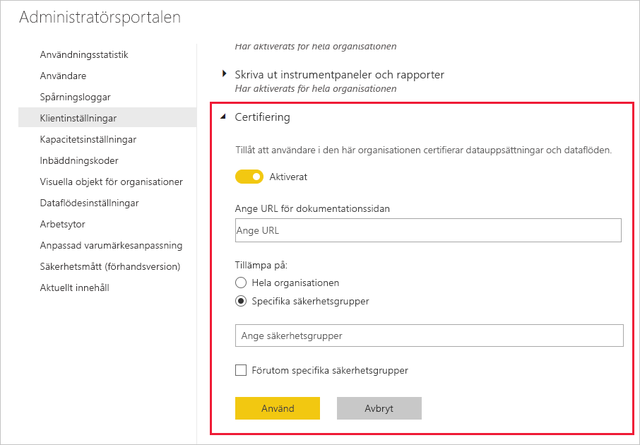

# Konfigurera certifiering för datamängder och dataflöden (förhandsversion)

Din organisation kan certifiera datamängder och dataflöden som är källor till viktig information.

Som administratör för en klientorganisation i Power BI ansvarar du för att konfigurera certifieringsprocessen för din organisation. Det innebär att du måste:
* Aktivera certifiering för klientorganisationen.
* Definiera en lista med grupper och användare som har behörighet att certifiera datamängder och dataflöden.
* För datamängder, att ange webbadressen till organisationens certifieringspolicy för datamängder om det finns en sådan.

Certifieringen av datamängder och dataflöden ingår i processen att *bekräfta* datamängder och dataflöden. Du kan läsa mer i [bekräfta datamängd](../connect-data/service-datasets-promote.md) och [bekräfta dataflöde](../transform-model/service-dataflows-promote-certify.md).

## Konfigurera certifiering

1. Gå till Klientorganisationsinställningar i administratörsportalen.
1. Under avsnittet Inställningar för export och delning expanderar du avsnittet Certifiering.

   

1. Ställ in reglaget på **Aktiverat**.
1. Om du certifierar en datamängd och din organisation har en publicerad certifieringspolicy kan du ange webbadressen till den här. Den här adressen används för länken **Läs mer** i certifieringsavsnittet i dialogrutan med inställningar för [bekräfta dataflöde](../connect-data/service-datasets-promote.md#request-dataset-certification) 
1. Ange vilka användare och grupper som har behörighet att certifiera datamängder och dataflöden. Dessa auktoriserade certifierare kan använda knappen Certifiering i certifieringsavsnittet i dialogrutan med inställningar för att bekräfta [datamängd](../connect-data/service-datasets-promote.md#request-dataset-certification) eller [dataflöde](../transform-model/service-dataflows-promote-certify.md#certify-a-dataflow).
1. Klicka på **Godkänn**.

## Nästa steg
* [Höja upp datamängder](../connect-data/service-datasets-promote.md)
* [Certifiera datamängder](../connect-data/service-datasets-certify.md)
* [Höja upp dataflöden](../transform-model/service-dataflows-promote-certify.md#promote-a-dataflow)
* [Certifiera dataflöden](../transform-model/service-dataflows-promote-certify.md#certify-a-dataflow)
* Har du några frågor? [Fråga Power BI Community](https://community.powerbi.com/)
