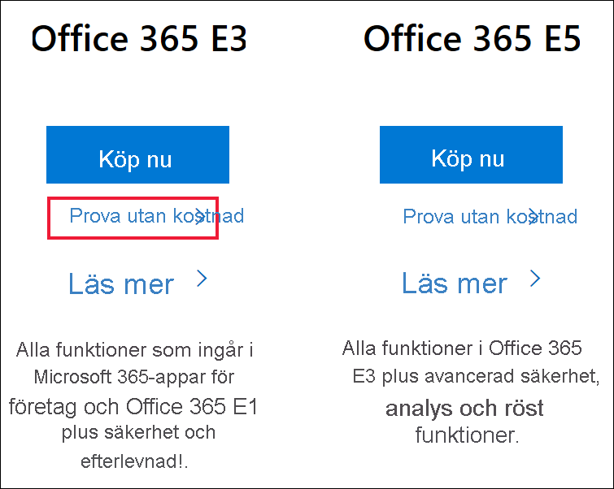
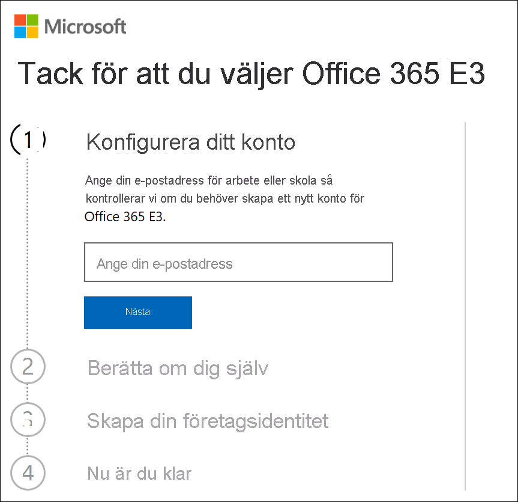
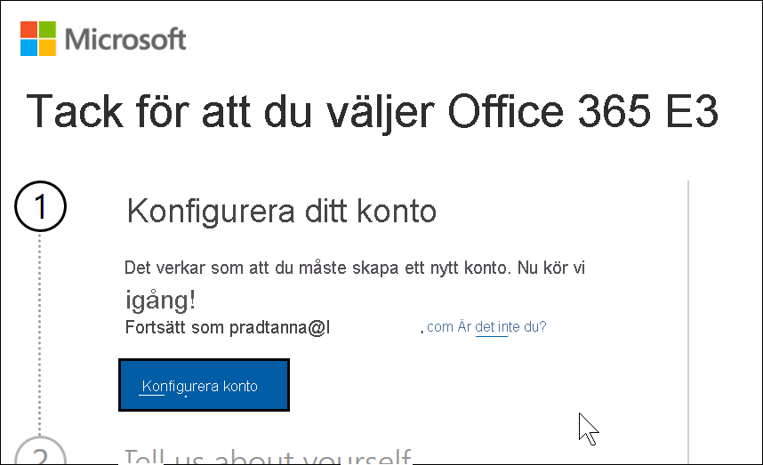
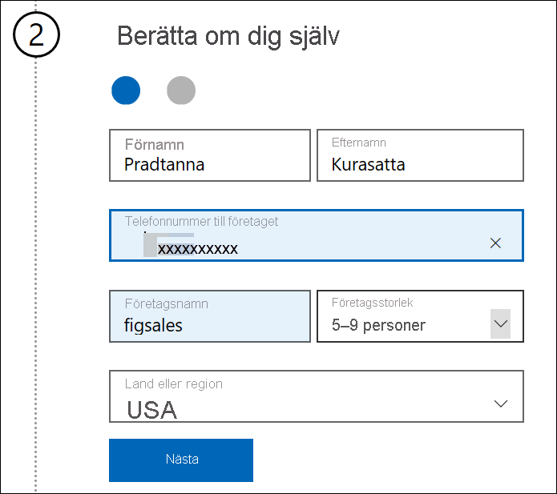
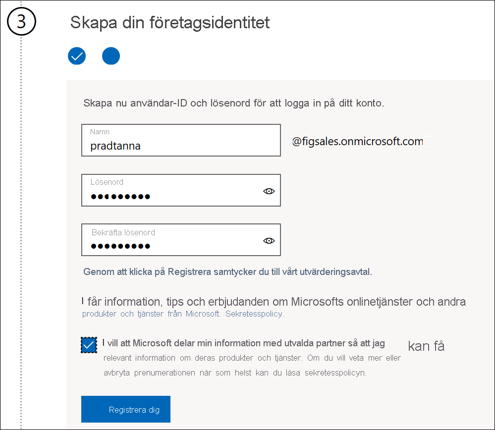
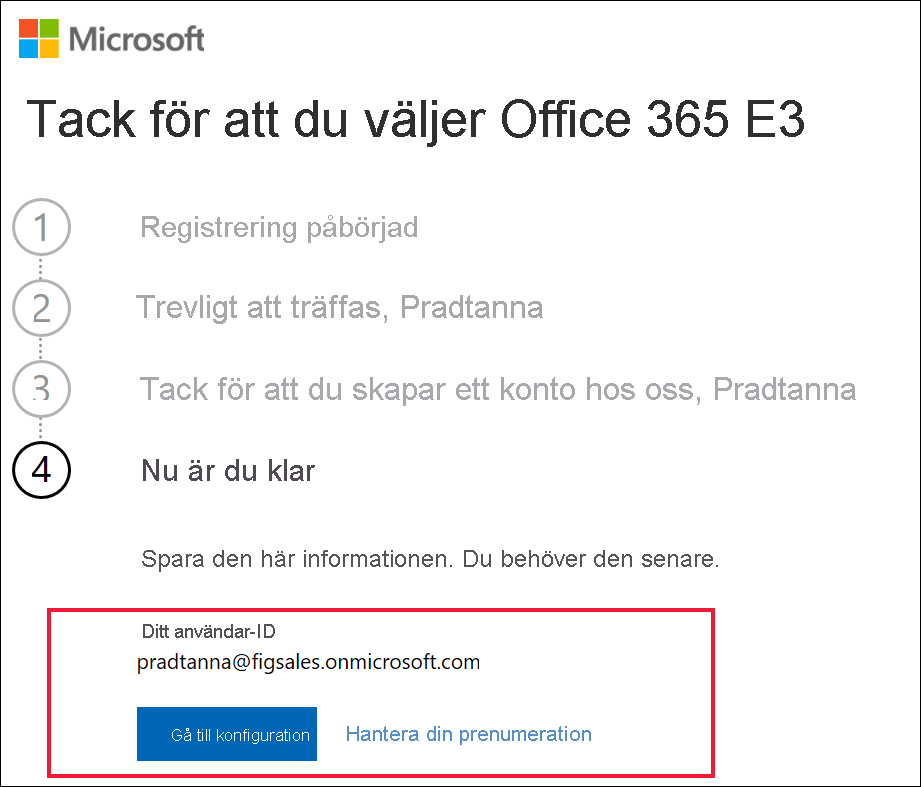

# Registrera dig för Power BI med en ny Microsoft 365-utvärderingsversion

I den här artikeln beskrivs ett alternativt sätt att registrera dig för Power BI, om du inte redan har ett e-postkonto för arbetet eller skolan.

Om du har problem med att registrera dig för Power BI med din e-postadress måste du kontrollera att det är en [e-postadress som kan användas med Power BI](../fundamentals/service-self-service-signup-for-power-bi.md#supported-email-addresses). Om det inte lyckas kan du registrera dig för en Microsoft 365 utvärderingsversion och skapa ett arbetskonto. Använd sedan det nya arbetskontot för att registrera dig för Power BI-tjänsten. Du kommer att kunna använda Power BI även när utvärderingsversionen av Microsoft 365 upphör att gälla.

## Registrera dig för en Microsoft 365-utvärderingsversion av Office
Registrera dig för en Microsoft 365-utvärderingsversion [på Microsoft 365-webbplatsen](https://www.microsoft.com/microsoft-365/business/compare-more-office-365-for-business-plans). Om du inte redan har ett konto kommer Microsoft att vägleda dig genom stegen för att skapa ett. Eftersom kommersiella e-postkonton (som Hotmail och Gmail) inte fungerar med Microsoft 365 måste du skapa ett nytt konto som fungerar.  Det e-postkontot kommer att se ut ungefär så här: *zalan@onmicrosoft.com* .

Om du väljer **Office 365 E5** kommer din utvärderingsversion att innehålla Power BI Pro. Utvärderingstiden för Power BI Pro går ut vid samma tidpunkt som din Office 365 E5-utvärderingsversion, som för närvarande är 30 dagar. Om du i stället väljer **Office 365 E3** kan du registrera dig för en *kostnadsfri* version av Power BI och uppgradera till **Pro** under en 60 dagars utvärderingsperiod. 

1. Ange din e-postadress. Vi säger till om e-postadressen fungerar med Microsoft 365 eller om du behöver skapa en ny e-postadress.  

    Om du behöver en ny e-postadress vägleder vi dig genom de olika stegen. Det första steget är att skapa ett nytt konto. Välj **Konfigurera konto**.

    

2. Ange information om det nya kontot.

    

3. Skapa din nya e-postadress och ditt lösenord. Skapa ett nytt inloggningsnamn som ser ut så här: you@yourcompany.onmicrosoft.com. Det här är inloggningen du använder med ditt nya jobb- eller skolkonto och med Power BI.

    

4. Det är allt.  Nu har du en e-postadress som du kan använda för att registrera dig för Power BI. Fortsätt till [Registrera dig för Power BI-tjänsten som en enskild individ](../service-self-service-signup-for-power-bi.md)

     

    Du kan behöva vänta medan den nya klientorganisationen skapas.

## Att tänka på

Om du har några problem med att logga in med det nya kontot kan du prova att använda en privat webbläsarsession.

Du skapar en ny klientorganisation för organisationen med den här inloggningsmetoden, och du blir administratören för den här klientorganisationen. Mer information finns i [Vad är Power BI-administration?](service-admin-administering-power-bi-in-your-organization.md). Du kan lägga till nya användare i din klientorganisation och sedan dela med dem, enligt beskrivningen i [administratörsdokumentationen för Microsoft 365](https://support.office.com/article/Add-users-individually-to-Office-365---Admin-Help-1970f7d6-03b5-442f-b385-5880b9c256ec).

## Nästa steg

[Vad är Power BI-administration?](service-admin-administering-power-bi-in-your-organization.md)  
[Power BI-licensiering i din organisation](service-admin-licensing-organization.md)  
[Registrera dig själv som enskild individ för Power BI](../fundamentals/service-self-service-signup-for-power-bi.md)

Har du fler frågor? [Fråga Power BI Community](https://community.powerbi.com/)
