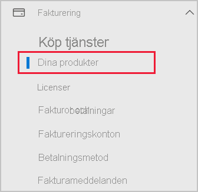
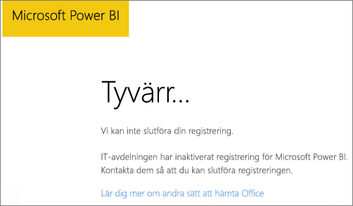

# Lägga till Power BI i en Microsoft 365-partnerprenumeration

Med Microsoft 365 kan företag sälja Microsoft 365 paketerat och integrerat med sina egna lösningar, vilket ger kunderna en enda kontaktpunkt för inköp, fakturering och support.

Om du är intresserad av att lägga till Power BI i din Microsoft 365-prenumeration rekommenderar vi att du kontaktar din partner. Om din partner inte erbjuder Power BI för tillfället kan du använda de olika alternativen nedan.

## Köp Power BI i samarbete med din partner

Om du vill köpa en prenumeration på Power BI Pro eller Power BI Premium kan du arbeta med din partner för se vilka alternativ du har:

* Partnern samtycker till att lägga till Power BI i deras portfölj så att du kan köpa från dem.

* Partnern kan överföra dig till en modell där du kan köpa Power BI direkt från Microsoft eller en annan partner som erbjuder Power BI.

## Köp från Microsoft eller en annan kanal

Beroende på relationen med din partner kan du köpa Power BI direkt från Microsoft eller en annan partner. Du kan kontrollera om du kan lägga till Power BI-prenumerationer i Administrationscenter för Microsoft 365 (kräver medlemskap i rollen global administratör eller faktureringsadministratör).

1. Gå till [Administrationscenter för Microsoft 365](https://admin.microsoft.com/AdminPortal/Home#/homepage).

1. Öppna **Fakturering** i den vänstra menyn, och välj sedan **Dina produkter**:

   

 1. Leta efter **Prenumerationer** enligt bilden nedan. Om du ser **Prenumerationer** kan du skaffa tjänsten hos Microsoft direkt eller kontakta en partner som erbjuder Power BI.

    

    Om du inte ser **Prenumerationer** kan du inte köpa från Microsoft direkt eller från en annan partner.

Om din partner inte erbjuder Power BI och du inte kan köpa direkt från Microsoft eller en annan partner kan du överväga att registrera dig för en kostnadsfri utvärderingsversion.

## Registrera dig för en kostnadsfri utvärderingsversion

Du kan registrera dig för en kostnadsfri utvärderingsversion av Power BI. Om du inte köper Power BI Pro i slutet av utvärderingsperioden har du fortfarande en kostnadsfri licens som erbjuder många av funktionerna i Power BI. Mer information finns i [Registrera dig som enskild individ för Power BI](../fundamentals/service-self-service-signup-for-power-bi.md).

### Aktivera ad hoc-prenumerationer

Som standard är enskild registrering, även kallat ad hoc-prenumeration, inaktiverad. I det här fallet visas ett meddelande när du försöker registrera dig om att: *IT-avdelningen har inaktiverat registrering för Microsoft Power BI*.

Om du vill aktivera ad hoc-prenumerationer kan du kontakta din partner och begära att de aktiverar detta. Om du är administratör för din klient och vet hur man använder Azure Active Directory PowerShell-kommandon, kan du aktivera ad hoc-prenumerationer själv. Om du vill ha mer information följer du stegen i artikeln om att [aktivera eller inaktivera inköp via självbetjäning](service-admin-disable-self-service.md).

## Nästa steg

* [Power BI-licensiering i din organisation](service-admin-licensing-organization.md)
* [Köpa och tilldela Power BI Pro-licenser](service-admin-purchasing-power-bi-pro.md)

Har du fler frågor? [Fråga Power BI Community](https://community.powerbi.com/)