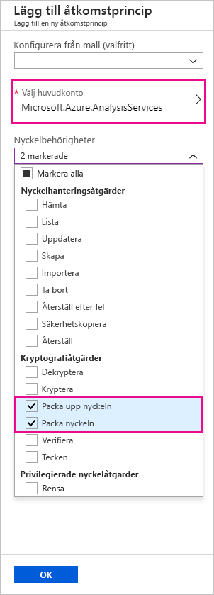
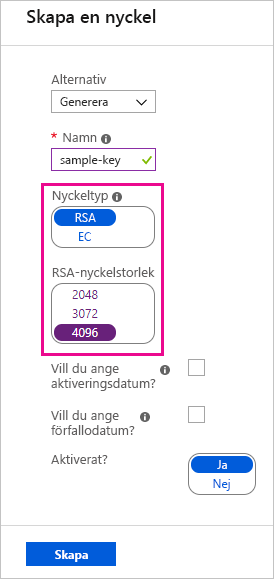
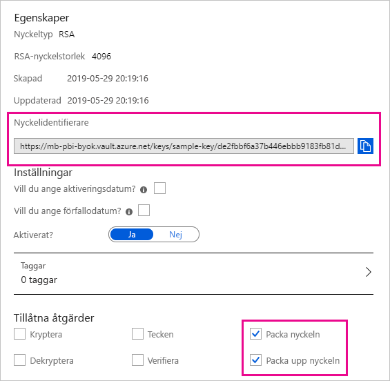

# <a name="bring-your-own-encryption-keys-for-power-bi"></a>Använda egna krypteringsnycklar för Power BI

Power BI krypterar data _i vila_ och _under bearbetning_. Som standard använder Power BI Microsoft-hanterade nycklar till datakrypteringen. I Power BI Premium kan du även använda egna nycklar för data i vila som importeras till en datamängd (lär mer under [Att tänka på med datakällor och lagring](#data-source-and-storage-considerations)). Den här metoden beskrivs ofta som _BYOK_ (Bring Your Own Key).

## <a name="why-use-byok"></a>Varför ska du använda BYOK?

Med BYOK blir det enklare att uppfylla efterlevnadskrav som täcker nyckelhantering med molntjänstleverantören (i det här fallet Microsoft). Med BYOK tillhandahåller du och styr krypteringsnycklarna för dina Power BI-data i vila på appnivå. Det innebär att du kan kontrollera och återkalla organisationens nycklar om du väljer att avsluta tjänsten. När du återkallar nycklarna kan tjänsten inte läsa dina data på 30 minuter.

## <a name="data-source-and-storage-considerations"></a>Att tänka på med datakällor och lagring

Om du vill använda BYOK måste du ladda upp data till Power BI-tjänsten från en PBIX-fil (Power BI Desktop). Du kan inte använda BYOK i följande scenarier:

- Liveanslutning till Analysis Services
- Excel-arbetsböcker (såvida inte data först importeras till Power BI Desktop)
- [Push-överför datauppsättningar](/rest/api/power-bi/pushdatasets)
- [Direktuppspelande datauppsättningar](../connect-data/service-real-time-streaming.md#set-up-your-real-time-streaming-dataset-in-power-bi)
- [Stora modeller](service-premium-large-models.md)

BYOK gäller endast för datamängder. Push-datamängder, Excel-filer och CSV-filer som användare kan ladda upp till tjänsten krypteras inte med din egen nyckel. Du kan se vilka artefakter som lagras på arbetsytan med följande PowerShell-kommando:

```PS C:\> Get-PowerBIWorkspace -Scope Organization -Include All```

> [!NOTE]
> Den här cmdleten behöver Power BI Management Module v1.0.840. Du kan se vilken version du har genom att köra Get-InstalledModule -Name MicrosoftPowerBIMgmt. Installera den senaste versionen genom att köra Install-Module -Name MicrosoftPowerBIMgmt. Du kan läsa mer om cmdleten för Power BI och dess parametrar i [PowerShell-cmdlet-modulen för Power BI](https://docs.microsoft.com/powershell/power-bi/overview).

## <a name="configure-azure-key-vault"></a>Konfigurera Azure Key Vault

I det här avsnittet får du lära dig att konfigurera Azure Key Vault, ett verktyg för att lagra och få åtkomst till hemligheter, som krypteringsnycklar, på ett säkert sätt. Du kan använda ett befintligt nyckelvalv till att lagra krypteringsnycklarna eller så kan du skapa ett nytt särskilt för Power BI.

Anvisningarna i det här avsnittet förutsätter att du har grundläggande kunskaper om Azure Key Vault. Mer information finns i [Vad är en Azure Key Vault?](/azure/key-vault/key-vault-whatis). Konfigurera ditt nyckelvalv så här:

1. Lägg till Power BI-tjänsten som ett huvudnamn för nyckelvalvet med behörighet att packa ihop och packa upp.

1. Skapa en RSA-nyckel med längden 4 096 bitar (eller använd en befintlig nyckel av den här typen) med behörighet att packa ihop och packa upp.

    > [!IMPORTANT]
    > Power BI BYOK stöder bara RSA-nycklar med längden 4 096 bitar.

1. Rekommenderas: Kontrollera att alternativet _mjuk borttagning_ är aktiverat för nyckelvalvet.

### <a name="add-the-service-principal"></a>Lägg till tjänstens huvudnamn

1. Gå till ditt nyckelvalv i Azure-portalen, under **Åtkomstprinciper**, och välj **Lägg till ny**.

1. Under **Välj huvudkonto** söker du efter och väljer Microsoft.Azure.AnalysisServices.

    > [!NOTE]
    > Om du inte hittar Microsoft.Azure.AnalysisServices är det troligt att Azure-prenumerationen som är associerad med ditt Azure Key Vault aldrig har haft en associerad Power BI-resurs. Försök att söka efter följande sträng i stället: 00000009-0000-0000-c000-000000000000.

1. Under **Nyckelbehörigheter** väljer du **Packa upp nyckeln** och **Packa nyckeln**.

    

1. Välj **OK** och sedan **Spara**.

> [!NOTE]
> Om du vill återkalla åtkomsten för Power BI till dina data vid ett senare tillfälle, kan du ta bort åtkomsträttigheterna till tjänstens huvudnamn från Azure Key Vault.

### <a name="create-an-rsa-key"></a>Skapa en RSA-nyckel

1. Under **Nycklar** i nyckelvalvet väljer du **Generera/importera**.

1. Välj RSA som **Nyckeltyp** och 4096 som **RSA-nyckelstorlek**.

    

1. Välj **Skapa**.

1. Under **Nycklar** väljer du den nyckel du skapade.

1. Välj GUID som **Aktuell version** för nyckeln.

1. Kontrollera att både **Packa nyckel** och **Packa upp nyckel** är valda. Kopiera värdet för **Nyckelidentifierare** så att du kan använda det när du aktiverar BYOK i Power BI.

    

### <a name="soft-delete-option"></a>Alternativ för mjuk borttagning

Vi rekommenderar att du aktiverar [mjuk borttagning](/azure/key-vault/key-vault-ovw-soft-delete) för nyckelvalvet så att du inte förlorar några data om du skulle råka ta bort nyckeln eller nyckelvalvet. Du måste använda [PowerShell till att aktivera egenskapen ”mjuk borttagning”](/azure/key-vault/key-vault-soft-delete-powershell) för nyckelvalvet eftersom det här alternativet inte är tillgängligt i Azure-portalen ännu.

När du har konfigurerat Azure Key Vault på rätt sätt kan du aktivera BYOK för klientorganisationen.

## <a name="enable-byok-on-your-tenant"></a>Aktivera BYOK för klientorganisationen

Du aktiverar BYOK på klientorganisationsnivå med [PowerShell](https://www.powershellgallery.com/packages/MicrosoftPowerBIMgmt.Admin) genom att först introducera de krypteringsnycklar du skapade och lagrade i Azure Key Vault för Power BI-klientorganisationen. Sedan tilldelar du krypteringsnycklarna per Premium-kapacitet för kryptering av innehållet i kapaciteten.

### <a name="important-considerations"></a>Att tänka på

Innan du aktiverar BYOK måste du ha följande i åtanke:

- Du kan för närvarande inte inaktivera BYOK när du har aktiverat det. Beroende på vilka parametrar du anger för `Add-PowerBIEncryptionKey` kan du styra hur BYOK ska användas för en eller flera av dina kapaciteter. Du kan däremot inte ångra introduktionen av nycklar för klientorganisationen. Mer information finns under [Aktivera BYOK](#enable-byok).

- Du kan inte _direkt_ flytta en arbetsyta som använder BYOK från en dedikerad kapacitet i Power BI Premium till en delad kapacitet. Först måste du flytta arbetsytan till en dedikerad kapacitet som inte har BYOK aktiverat.

- Om du flyttar en arbetsyta som använder BYOK från en dedikerad kapacitet i Power BI Premium till en delad kapacitet kommer det inte gå att använda rapporter och datamängder eftersom de är krypterade med den nyckeln. För att undvika det här måste du först flytta arbetsytan till en dedikerad kapacitet som inte har BYOK aktiverat.

### <a name="enable-byok"></a>Aktivera BYOK

När du ska aktivera BYOK måste du vara klientorganisationsadministratör för Power BI-tjänsten och vara inloggad med cmdleten `Connect-PowerBIServiceAccount`. Använd sedan [`Add-PowerBIEncryptionKey`](/powershell/module/microsoftpowerbimgmt.admin/Add-PowerBIEncryptionKey) för att aktivera BYOK, som i det här exemplet:

```powershell
Add-PowerBIEncryptionKey -Name'Contoso Sales' -KeyVaultKeyUri'https://contoso-vault2.vault.azure.net/keys/ContosoKeyVault/b2ab4ba1c7b341eea5ecaaa2wb54c4d2'
```

Om du vill lägga till flera nycklar kör du `Add-PowerBIEncryptionKey` med olika värden för -`-Name` och `-KeyVaultKeyUri`. 

Cmdleten tar två växlingsparametrar som påverkar krypteringen för nuvarande och framtida kapaciteter. Som standard är ingen av växlarna inställda:

- `-Activate`: Anger att den här nyckeln ska användas för klientorganisationens alla befintliga kapaciteter i den klientorganisation som inte redan är krypterad.

- `-Default`: Anger att den här nyckeln nu är standard för hela klientorganisationen. När du skapar en ny kapacitet ärver kapaciteten den här nyckeln.

> [!IMPORTANT]
> Om du anger `-Default`, krypteras alla kapaciteter som skapas i klientorganisationen från och med nu med den nyckel som du anger (eller en uppdaterad standardnyckel). Du kan inte ångra standardåtgärden, så du kan inte längre skapa någon Premium-kapacitet i klientorganisationen som inte använder BYOK.

När du har aktiverat BYOK i klientorganisationen anger du krypteringsnyckeln för en eller flera Power BI-kapaciteter:

1. Används [`Get-PowerBICapacity`](/powershell/module/microsoftpowerbimgmt.capacities/get-powerbicapacity) för att hämta det kapacitets-ID som krävs för nästa steg.

    ```powershell
    Get-PowerBICapacity -Scope Individual
    ```

    Cmdleten returnerar utdata som ser ut på följande sätt:

    ```
    Id              : xxxxxxxx-xxxx-xxxx-xxxx-xxxxxxxxxxxx
    DisplayName     : Test Capacity
    Admins          : adam@sometestdomain.com
    Sku             : P1
    State           : Active
    UserAccessRight : Admin
    Region          : North Central US
    ```

1. Använd [`Set-PowerBICapacityEncryptionKey`](/powershell/module/microsoftpowerbimgmt.admin/set-powerbicapacityencryptionkey) för att ange krypteringsnyckeln:

    ```powershell
    Set-PowerBICapacityEncryptionKey -CapacityId xxxxxxxx-xxxx-xxxx-xxxx-xxxxxxxxxxxx -KeyName 'Contoso Sales'
    ```

Du har kontroll över hur BYOK används i klientorganisationen. Om du till exempel vill kryptera en enstaka kapacitet anropar du `Add-PowerBIEncryptionKey` utan `-Activate` eller `-Default`. Anropa sedan `Set-PowerBICapacityEncryptionKey` för den kapacitet du vill aktivera BYOK för.

## <a name="manage-byok"></a>Hantera BYOK

Power BI har ytterligare cmdletar som hjälper dig att hantera BYOK för klientorganisationen:

- Använd [`Get-PowerBICapacity`](/powershell/module/microsoftpowerbimgmt.capacities/get-powerbicapacity) för att hämta nyckeln som en kapacitet använder för närvarande:

    ```powershell
    Get-PowerBICapacity -Scope Organization -ShowEncryptionKey
    ```

- Använd [`Get-PowerBIEncryptionKey`](/powershell/module/microsoftpowerbimgmt.admin/get-powerbiencryptionkey) för att hämta nyckeln som klientorganisationen använder för närvarande:

    ```powershell
    Get-PowerBIEncryptionKey
    ```

- Använd [`Get-PowerBIWorkspaceEncryptionStatus`](/powershell/module/microsoftpowerbimgmt.admin/get-powerbiworkspaceencryptionstatus) för att se om datamängderna på en arbetsyta är krypterade och om krypteringsstatusen är synkroniserad med arbetsytan:

    ```powershell
    Get-PowerBIWorkspaceEncryptionStatus -Name'Contoso Sales'
    ```

    Observera att kryptering aktiveras på kapacitetsnivå, men att du ser krypteringsstatusen på datamängdsnivå för den angivna arbetsytan.

- Använd [`Switch-PowerBIEncryptionKey`](/powershell/module/microsoftpowerbimgmt.admin/switch-powerbiencryptionkey) för att växla (eller _rotera_) versionen av den nyckel som används för kryptering. Cmdleten uppdaterar helt enkelt `-KeyVaultKeyUri` för en nyckels `-Name`:

    ```powershell
    Switch-PowerBIEncryptionKey -Name'Contoso Sales' -KeyVaultKeyUri'https://contoso-vault2.vault.azure.net/keys/ContosoKeyVault/b2ab4ba1c7b341eea5ecaaa2wb54c4d2'
    ```


## <a name="next-steps"></a>Nästa steg

* [PowerShell-cmdlet-modulen för Power BI](https://docs.microsoft.com/powershell/power-bi/overview) 

* [Olika sätt att dela ditt arbete i Power BI](../collaborate-share/service-how-to-collaborate-distribute-dashboards-reports.md)

* [Filtrera en rapport med frågesträngparametrar i URL:en](../collaborate-share/service-url-filters.md)

* [Bädda in med rapportwebbdel i SharePoint Online](../collaborate-share/service-embed-report-spo.md)

* [Publicera på webben från Power BI](../collaborate-share/service-publish-to-web.md)

