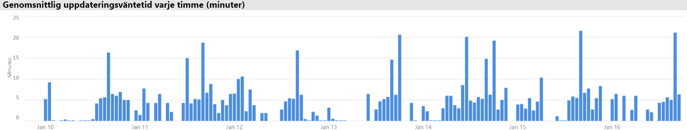

# Premium-kapacitetsscenarier

I den här artikeln beskrivs verkliga scenarier där Power BI Premium-kapaciteter har implementerats. Vanliga problem och utmaningar beskrivs, samt hur du kan identifiera problem och lösa dem:

- [Hålla datauppsättningar uppdaterade](#keeping-datasets-up-to-date)
- [Identifiera datauppsättningar som svarar långsamt](#identifying-slow-responding-datasets)
- [Identifiera orsaker till att datauppsättningar sporadiskt svarar långsamt](#identifying-causes-for-sporadically-slow-responding-datasets)
- [Avgöra om det finns tillräckligt med minne](#determining-whether-there-is-enough-memory)
- [Avgöra om det finns tillräckligt med processor](#determining-whether-there-is-enough-cpu)

Stegen, diagrammen och tabellerna är från **Kapacitetsmåttappen för Power BI Premium** som en Power BI-administratör kommer att ha åtkomst till.

## Hålla datauppsättningar uppdaterade

I det här scenariot utlöstes en undersökning när användare klagat över att rapportdata ibland verkade vara gamla eller ”inaktiva”.

I appen interagerar administratören med det visuella objektet för **Uppdateringar**, och sorterar datauppsättningar via statistiken för **Maximal väntetid** i fallande ordning. Med det visuella objektet kan de se vilka datamängder som har de längsta väntetiderna, grupperade efter arbetsytans namn.

I det visuella objektet **Genomsnittlig uppdateringsväntetid uppdelad i timmar** ser de att väntetiderna vid uppdatering ständigt är som högst runt kl. 16 varje dag.

Det finns flera förklaringar till dessa resultat:

- För många uppdateringsförsök kan ske samtidigt, vilket överskrider de gränser som definierats i kapacitetsnoden. I det här fallet sker sex samtidiga uppdateringar i en P1 med standardminnesallokering.

- Datamängderna som ska uppdateras kan vara för stora för tillgängligt minne (minst dubbla minnet krävs för en fullständig uppdatering).
- Ineffektiv Power Query-logik kan resulterar i en topp av minnesanvändning under uppdateringen av datauppsättningen. I en upptagen kapacitet kan denna topp ibland nå den fysiska gränsen, vilket leder till att uppdateringen misslyckas och potentiellt påverkar andra rapportvisningsåtgärder i kapaciteten.
- Datamängder som ofta efterfrågas och som måste finnas kvar i minnet, kan påverka möjligheten för andra datamängder att uppdateras på grund av begränsat tillgängligt minne.

Vid undersökningen kan Power BI-administratören söka efter:

- Lågt tillgängligt minne vid tidpunkten för datauppdateringen, när tillgängligt minne är mindre än dubbla storleken på datamängden som ska uppdateras.
- Datamängder som inte uppdaterades och inte fanns i minnet före en uppdatering, men som startats för att visa interaktiv trafik under högt belastade uppdateringstider. För att se vilka datamängder som lästes in i minnet vid en specifik tidpunkt, kan Power BI-administratören granska området med datamängder på fliken **Datauppsättningar** i appen. Administratören kan sedan korsfiltrera till en specifik tidpunkt genom att klicka på någon av staplarna i **Inlästa datauppsättningar per timme**. En lokal topp (visas på bilden nedan) anger en timme när flera datamängder lästes in i minnet, vilket kan fördröja starten av schemalagda uppdateringar.
- Ökat antal borttagna datamängder när datauppdateringar är schemalagda att starta. Borttagningarna kan tyda på att det finns hög minnesbelastning som orsakas av att det finns för många olika interaktiva rapporter före uppdateringen. Det visuella objektet **Antal borttagna datauppsättningar och minnesförbrukning per timme** kan innehålla toppar i borttagningar.

Följande bild visar en lokal topp i inlästa datauppsättningar, vilket tyder på interaktiva frågor fördröjde starten av uppdateringarna. Att välja en tidsperiod i det visuella objektet **Inlästa datauppsättningar per timme** kommer att korsfiltrera det visuella objektet **Datauppsättningens storlek**.

Power BI-administratören kan försöka att lösa problemet genom att utföra åtgärder för att säkerställa att det finns tillräckligt med minne för datauppdateringarna genom att börja med att:

- Kontakta datamängdens ägare och be dem att minska och sprida ut schemalagda datauppdateringar.
- Minska datamängdens frågebelastning genom att ta bort onödiga instrumentpaneler eller paneler, särskilt de som framtvingar säkerhet på radnivå.
- Påskynda datauppdateringar genom att optimera Power Query-logiken. Förbättra modelleringen av beräknade kolumner eller tabeller. Minska datamängdernas storlekar eller konfigurera större datamängder för att utföra stegvis datauppdatering.

## Identifiera datamängder som svarar långsamt

I det här scenariot utlöstes en undersökning när användarna klagat på att det tog lång tid att öppna vissa rapporter och att rapporterna ibland slutade svara.

I appen kan Power BI-administratören använda det visuella objektet **Frågevaraktigheter** för att fastställa de sämst presterande datauppsättningarna genom att sortera datauppsättningar efter fallande **Genomsnittlig varaktighet**. Det här visuella objektet visar också antal frågor för datauppsättningen, så du kan se hur ofta datauppsättningarna efterfrågas.

Administratören kan referera till det visuella objektet **Frågevaraktighetsfördelning**, som visar en övergripande fördelning av bucketgrupperad frågeprestanda (< = 30 ms, 0–100 ms) för den filtrerade tidsperioden. I allmänhet anses frågor som tar en sekund eller mindre som dynamiska av de flesta användare. Frågor som tar längre tid tenderar att skapa en uppfattning av dålig prestanda.

Det visuella objektet **Frågevaraktighetsfördelning per timme** låter Power BI-administratören identifiera entimmesperioder när kapacitetsprestanda kan ha uppfattats som dålig. Ju större fältsegment som representerar frågevaraktigheter över en sekund, desto större risk att användare kommer att uppfatta sämre prestanda.

Det visuella objektet är interaktivt och när ett segment av fältet är markerat, korsfiltrerats motsvarande visuell tabell för **Frågevaraktigheter** på rapportsidan för att visa de datauppsättningar som den representerar. Den här korsfiltreringen tillåter Power BI-administratörer att enkelt identifiera vilka datauppsättningar som svarar långsamt.

Följande bild visar ett visuellt objekt filtrerat efter **Frågevaraktighetsfördelning per timme**, som fokuserar på sämst presterande datauppsättningar i buckets om en timma. 

När den sämre presterande datamängden i ett specifikt tidsintervall på en timme identifieras, kan Power BI-administratören undersöka om den sämre prestandan beror på en överbelastad kapacitet, eller på en dåligt utformad datamängd eller rapport. De kan referera till det visuella objektet **Frågeväntetider** och sortera datamängder efter fallande genomsnittlig frågeväntetid. Om en stor del av frågorna väntar, är troligen hög efterfrågan på datamängden orsaken till detta. Om den genomsnittliga frågeväntetiden är betydande (> 100 ms), kan det vara värt att granska datamängden och rapporten för att se om optimeringar kan göras. Exempelvis färre visuella objekt på vissa rapportsidor eller en optimering av DAX-uttrycken.

Det finns flera anledningar till att frågeväntetid byggs upp i datamängder:

- En icke-optimal modelldesign, måttuttryck eller t.o.m. rapportdesign – är alla omständigheter som kan bidra till tidskrävande frågor som förbrukar hög CPU. Detta gör att nya frågor får vänta tills CPU-trådar bli tillgängliga och kan skapa en konvojeffekt (tänkt trafikstockning), som ofta ses under toppar vid kontorstider. Sidan **Frågan väntar** blir den viktigaste resursen för att avgöra om datauppsättningar har höga genomsnittliga frågeväntetider.
- Ett stort antal samtidiga kapacitetsanvändare (hundratals) använder samma rapport eller datauppsättning. Även välutformade datauppsättningar kan prestera dåligt så att en samtidighetströskel överskrids. Detta anges vanligtvis av en enda datamängd som visar ett avsevärt högre värde för frågeantalet än andra datamängder (t.ex. 300 000 frågor för en datamängd jämfört med < 30 000 frågor för alla andra datamängder). Vid en viss tidpunkt kommer frågeväntetiden för den här datamängden att börja minska, vilket kan ses i det visuella objektet **Frågevaraktighet**.
- Många olika datauppsättningar som efterfrågas samtidigt orsakar minnesförslöing eftersom datauppsättningar ofta pendlar mellan att ha minne eller inte. Detta leder till att användare upplever långsam prestanda när datauppsättningen läses in i minnet. För att kontrollera detta kan Power BI-administratören referera till det visuella objektet **Antal borttagna datauppsättningar och minnesförbrukning per timme**, vilket kan visa att ett stort antal datamängder som lästs in i minnet tas bort upprepade gånger.

## Identifiera orsaker till att datamängder ibland svarar långsamt

I det här scenariot påbörjades en undersökning när användarna beskrev att visuella objekt i rapporten ibland tog tid på sig att svara eller inte svarade alls, men ibland svarade de godkänt snabbt.

I appen användes avsnittet **Frågevaraktigheter** för att hitta den orsakande datauppsättningen på följande sätt:

- I det visuella objektet **Frågevaraktigheter** filtrerade administratören datauppsättning för datauppsättning (med start på de översta datauppsättningarna som efterfrågats) och undersökte de korsfiltrerade staplarna i det visuella objektet **Frågevaraktighetsfördelning per timme**.
- När en enda entimmesstapel visade betydande förändringar i förhållandet mellan alla frågevaraktighetsgrupper jämfört med andra entimmesstaplar för datamängden (t.ex. förhållandena mellan färgerna ändrades drastiskt), innebär det att den här datamängden visade en sporadisk förändring i prestandan.
- Entimmesstaplarna visar en oregelbunden del av ineffektiva frågor, och angav ett tidsspann där datauppsättningen påverkades av en störande angränsande effekt, orsakad av andra datauppsättningars aktiviteter.

Bilden nedan visar en timme den 30 januari där det har inträffat en betydande minskning av prestanda för en datauppsättning, vilket anges av storleken på ”(3,10s]” för bucketen för körningsvaraktighet. Genom att klicka på denna entimmesstapel visas alla datamängder som lästs in i minnet under denna tid och således de datamängder som orsakat den störande angränsande effekten.

När ett problematiskt tidsintervall identifieras (t.ex. den 30 januari i bilden ovan), kan Power BI-administratören ta bort alla datamängdsfilter och sedan filtrera enbart efter detta tidsspann för att avgöra vilka datamängder som efterfrågades aktivt under den här tiden. Den datamängd som orsakade den störande angränsande effekten är vanligtvis den mest efterfrågade datamängden eller den med längst genomsnittlig frågevaraktighet.

En lösning på problemet kan vara att distribuera orsakande datauppsättningar över olika arbetsytor på olika Premium-kapaciteter eller i delad kapacitet om datauppsättningens storlek, konsumtionskrav och datauppdateringsmönster stöds.

Omvänt kan också gälla. Power BI-administratören kan identifiera när en datauppsättnings frågeprestanda drastiskt förbättras och leta reda på vad som försvann. Om viss information saknas vid denna tidpunkt, kan detta hjälpa till att peka på vad som orsakar problemet.

## Avgöra om det finns tillräckligt med minne

För att avgöra om det finns tillräckligt mycket minne för kapaciteten för att slutföra sina arbetsbelastningar, kan Power BI-administratörer referera till det visuella objektet **Procent förbrukat minne** i fliken **Datauppsättningar** i appen. **Allt** minne (totalt) representerar det minne som förbrukas av datauppsättningar som är inlästa i minnet, oavsett om de aktivt efterfrågas eller bearbetas. **Aktivt** minne representerar det minne som förbrukats av datauppsättningar som bearbetas aktivt.

I en felfri kapacitet ser det visuella objektet ut så här och visar ett gap mellan Allt (totalt) och Aktivt minne:

I en kapacitet med minnestryck visar samma visuella objekt tydligt att aktivt minne och totalt minne konvergerar, vilket innebär att det inte går att läsa in ytterligare datamängder i minnet vid den tidpunkten. I det här fallet kan Power BI-administratören klicka på **Kapacitetsomstart** (i **Avancerade alternativ** i området för kapacitetsinställningar i administratörsportalen). Omstart av kapaciteten leder till att alla datauppsättningar rensas från minnet så att de kan läsas in i minnet igen såsom krävs (av frågor eller datauppdatering).

## Avgöra om det finns tillräckligt med processor

I allmänhet ska en kapacitets genomsnittliga CPU-användning vara mindre än 80 %. Överskrids detta värde innebär det att kapaciteten närmar sig processormättnad.

Effekterna av processormättnad märks när åtgärder tar längre tid än de ska på grund av att kapaciteten utför många CPU-kontextbyten då den försöker bearbeta alla åtgärder. I en Premium-kapacitet med ett stort antal samtidiga frågor visas detta med långa frågeväntetider. En följd av höga frågeväntetider är långsammare svarstider än vanligt. Power BI-administratören kan enkelt identifiera när processorn är mättad genom att visa det visuella objektet **Väntetidsfördelningar per timme**. Periodiska toppar av frågeväntetider indikerar potentiell processormättnad.

Ett liknande mönster kan ibland identifieras i bakgrundsåtgärder om de bidrar till processormättnad. En Power BI-administratör kan söka efter en regelbunden topp i uppdateringstider för en specifik datamängd, vilket kan tyda på processormättnad vid tidpunkten (troligen på grund av andra pågående uppdateringar av datamängden och/eller interaktiva frågor). I det här fallet avslöjar vyn **System** i appen inte nödvändigtvis att processorn är på 100 %. Vyn **System** visas enligt medelvärde per timme, men processorn kan bli mättad i flera minuter av tunga åtgärder som dyker upp som toppar i väntetider.

Det finns flera olika nyanser för att se effekten av processormättnad. Antalet frågor som väntar är viktigt, frågeväntetid sker alltid i viss omfattning utan att orsaka uppenbar prestandaförsämring. Vissa datauppsättningar (med längre genomsnittlig frågetid, vilket indikerar komplexitet eller storlek) är mer benägna att orsaka effekterna av processormättnad än andra. För att enkelt identifiera dessa datauppsättningar, kan Power BI-administratören söka efter ändringar i färgsammansättning av staplarna i det visuella objektet **Väntetidsfördelningar per timma**. Efter att ha upptäckt ett avvikande fält, kan de leta efter de datauppsättningar som hade frågeväntetid under denna tid och också titta på genomsnittlig frågeväntetid jämfört med genomsnittlig frågevaraktighet. När de här två måtten är av samma storlek och frågearbetsbelastningen för datauppsättningen är icke-trivial, är det troligt att datauppsättningen påverkas av otillräcklig processor.

Detta kan vara särskilt tydligt när en datamängd som används i korta ökningar med höga frågefrekvenser av flera användare (t.ex. i en utbildningssession), resulterar i processormättnad under varje ökning. I det här fallet kan betydande frågeväntetider för den här datauppsättningen uppstå och påverka andra datauppsättningar i kapacitet (störande angränsande effekt).

I vissa fall kan Power BI-administratörer begära att datauppsättningens ägare skapar en mindre föränderlig frågearbetsbelastning genom att skapa en instrumentpanel (som frågar med jämna mellanrum vid alla uppdateringar av datauppsättning efter cachelagrade paneler) i stället för en rapport. Detta kan förhindra toppar när instrumentpanelen läses in. Den här lösningen kanske inte alltid är möjlig för alla verksamhetskrav, men den kan vara ett effektivt sätt att undvika processormättnad, utan att göra ändringar på datauppsättningen.

## Bekräftelser

Den här artikeln är skriven av Peter Myers, Data Platform MVP och oberoende BI-expert på [Bitwise Solutions](https://www.bitwisesolutions.com.au/).

## Nästa steg

> [!div class="nextstepaction"]
> [Övervaka Premium-kapaciteter med appen](service-admin-premium-monitor-capacity.md)    
> [!div class="nextstepaction"]
> [Övervaka kapaciteter i administratörsportalen](service-admin-premium-monitor-portal.md)   

Fler frågor? [Fråga Power BI Community](https://community.powerbi.com/)

||||||