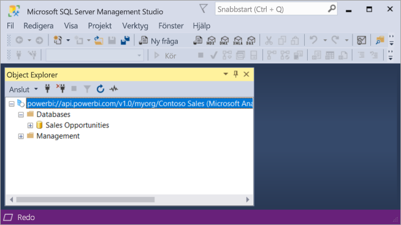
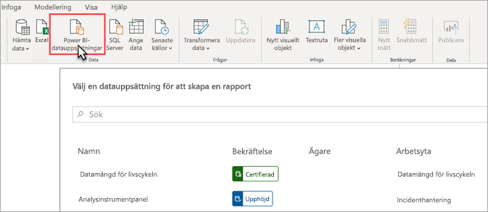
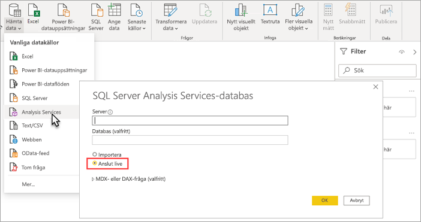

# Datamängdsanslutning med XMLA-slutpunkten (förhandsversion)

Power BI Premium-arbetsytor och -datauppsättningar på kompatibilitetsnivån 1500 och högre stöder öppen plattformsanslutning från Microsoft och klientprogram från tredje part med hjälp av en *XMLA-slutpunkt*.

> [!NOTE]
> Den här funktionen är en **förhandsversion**. Funktioner i förhandsversionen ska inte användas i en produktionsmiljö. Vissa funktioner, support och dokumentation är begränsade.  Mer information finns i [Microsoft Online Services-villkor (OST)](https://www.microsoft.com/licensing/product-licensing/products?rtc=1).

## Vad är en XMLA-slutpunkt?

Power BI Premium använder [XML for Analysis](https://docs.microsoft.com/analysis-services/xmla/xml-for-analysis-xmla-reference?view=power-bi-premium-current)-protokollet (XMLA) för kommunikation mellan klientprogram och den motor som hanterar dina Power BI-arbetsytor och -datamängder. Denna kommunikation sker via det som vanligtvis kallas XMLA-slutpunkter. XMLA är samma kommunikationsprotokoll som används av Microsoft Analysis Services-motorn, som under huven kör Power BI:s semantiska modellering, styrning, livscykel och datahantering.

*Skrivskyddad* anslutning med slutpunkten aktiveras som standard för **Datauppsättningens arbetsbelastning** i en kapacitet. Med skrivskyddad information kan datavisualiseringsprogram och verktyg fråga data i datavisualiseringsmodeller, metadata, händelser och scheman. *Läs- och skrivåtgärder* som använder slutpunkten kan aktiveras för att tillhandahålla ytterligare datauppsättningshantering, styrning, avancerad semantisk modellering, felsökning och övervakning. Med läs- och skrivåtgärder är Power BI Premium-datauppsättningar mer jämförbara med Azure Analysis Services och SQL Server Analysis Services-modellverktyg och -processer i företagsklass.

> [!NOTE]
> Vi rekommenderar att du använder den moderna miljön för arbetsytor, särskilt när du ansluter till dina datauppsättningar med hjälp av XMLA-slutpunkten. Åtgärder som att skapa eller ta bort datauppsättningar stöds inte med klassiska arbetsytor. Information om hur du uppgraderar klassiska arbetsytor till den moderna miljön finns i [Uppgradera klassiska arbetsytor i Power BI](../collaborate-share/service-upgrade-workspaces.md).

## Verktyg för datamodellering och -hantering

Detta är några av de vanligaste verktygen som används med Azure Analysis Services och SQL Server Analysis Services. De stöds nu av Power BI Premium-datauppsättningar:

**Visual Studio med Analysis Services projekt** – även kallat SQL Server Data Tools, eller bara **SSDT**, är ett modellredigeringsverktyg i företagsklass för Analysis Services-tabellmodeller. Analysis Services-projektens tillägg stöds i alla versioner av Visual Studio 2017 och senare, inklusive den kostnadsfria Community-versionen. Tilläggsversion 2.9.6 eller högre krävs för att distribuera tabellmodeller till en Premium-arbetsyta. När du distribuerar till en Premium-arbetsyta måste modellen vara på kompatibilitetsnivån 1500 eller högre. XMLA Read-Write krävs på arbetsbelastningen för datauppsättningar. Läs mer i [Verktyg för Azure Analysis Services](https://docs.microsoft.com/analysis-services/tools-and-applications-used-in-analysis-services?view=power-bi-premium-current).

**SQL Server Management Studio (SSMS)**   – stöder frågor via DAX, MDX och XMLA. Utför detaljerade uppdateringsåtgärder och skript för datauppsättningsmetadata med hjälp av [tabellmodellskriptspråk](https://docs.microsoft.com/analysis-services/tmsl/tabular-model-scripting-language-tmsl-reference) (TMSL). Läsåtkomst krävs för att köra frågor. Läs- och skrivåtkomst krävs för att skriva metadata. Kräver SSMS version 18.4 eller senare. Hämta  [här](https://docs.microsoft.com/sql/ssms/download-sql-server-management-studio-ssms).

**SQL Server Profiler**  – Installeras med SSMS. Det här verktyget tillhandahåller spårning och felsökning av datauppsättningshändelser. Profiler har officiellt tagits ur bruk för SQL Server men ingår fortfarande i SSMS och fortsätter att stödjas för Analysis Services och Power BI Premium. XMLA-skrivskydd krävs. Mer information finns i  [SQL Server Profiler för Analysis Services](https://docs.microsoft.com/analysis-services/instances/use-sql-server-profiler-to-monitor-analysis-services?view=power-bi-premium-current).

**Analysis Services-distributionsguiden**  – Installeras med SSMS. Det här verktyget tillhandahåller distribution av Visual Studio-tabellmodellprojekt till Analysis Services och Power BI Premium-arbetsytor. Den kan köras interaktivt eller från kommandoraden för automatisering. XMLA-läs-/skrivbehörighet krävs. Läs mer i [Distributionsguide för Azure Analysis Services](https://docs.microsoft.com/analysis-services/deployment/deploy-model-solutions-using-the-deployment-wizard?view=power-bi-premium-current).

**PowerShell-cmdlets**  – Analysis Services-cmdletar kan användas för att automatisera data uppsättningshanteringsuppgifter, till exempel uppdateringsåtgärder. XMLA-läs-/skrivbehörighet krävs. Version **21.1.18221** eller senare av [SqlServer PowerShell-modulen](https://www.powershellgallery.com/packages/SqlServer/) krävs. Azure Analysis Services-cmdlets i modulen Az. AnalysisServices stöds inte för Power BI Premium. Läs mer i referensdokumentet [PowerShell för Analysis Services](https://docs.microsoft.com/analysis-services/powershell/analysis-services-powershell-reference?view=power-bi-premium-current).

**Power BI Report Builder**  –Ett verktyg för skapande av sidnumrerade rapporter. Skapa en rapportdefinition som anger vilka data som ska hämtas, var de ska hämtas och hur de ska visas. Du kan förhandsgranska rapporten i Report Builder och sedan publicera den i Power BI-tjänsten. XMLA-skrivskydd krävs. Läs mer i  [Power BI Report Builder](https://docs.microsoft.com/power-bi/report-builder-power-bi).

**Tabular Editor** – Ett verktyg med öppen källkod för att skapa, underhålla och hantera tabellmodeller med en intuitiv, förenklad redigerare. En hierarkisk vy visar alla objekt i tabellmodellen. Objekt ordnas genom att visa mappar med stöd för flervalsegenskaps redigering och markering med DAX-syntax. Läsåtkomst för XMLA krävs för att köra frågor. Läs- och skrivåtkomst krävs för att köra metadata. Läs mer i [tabulareditor.github.io](https://tabulareditor.github.io/).

**DAX Studio**  – ett verktyg med öppen källkod för DAX-redigering, diagnostik, prestandajustering och analys. Funktionerna omfattar objektbläddring, integrerad spårning, analys av frågekörning med detaljerad statistik, DAX-syntax och formatering. Läsåtkomst för XMLA krävs för att köra frågor. Mer information finns på  [daxstudio.org](https://daxstudio.org/).

**ALM Toolkit** – ett verktyg för schemajämförelse med öppen källkod för Power BI-datauppsättningar som oftast används för ALM-scenarier (Application Lifecycle Management). Utför distribution över miljöer och bevara historiska data med stegvis uppdatering. Differentiering och sammanfogning av metadatafiler, grenar och databaser. Återanvänd vanliga definitioner mellan datauppsättningar. Läsåtkomst krävs för att köra frågor. Läs- och skrivåtkomst krävs för att köra metadata. Läs mer i  [alm-toolkit.com](http://alm-toolkit.com/).

**Microsoft Excel**  – Excel-pivottabeller är ett av de vanligaste verktygen för att sammanfatta, analysera, utforska och presentera sammanfattningsdata från Power BI-datauppsättningar. Läsåtkomst krävs för att köra frågor. Klicka-och-kör-versionen av Office-16.0.11326.10000 eller senare krävs.

**Tredje part**  – omfattar program och verktyg för klientdatavisualisering som kan ansluta till, köra frågor mot och förbruka datamängder i Power BI Premium. De flesta verktyg kräver de senaste versionerna av MSOLAP-klientbiblioteken, men vissa kan använda ADOMD. Läs- eller skrivbehörighet till XMLA-slutpunkten beror på åtgärderna.

### Klientbibliotek

Klientprogram kommunicerar inte direkt med XMLA-slutpunkten. I stället använder de *klientbibliotek* som ett abstraktionslager. Detta är samma klientbiblioteksprogram som används för att ansluta till Azure Analysis Services och SQL Server Analysis Services. Microsoft-program som Excel, SQL Server Management Studio (SSMS) och Analysis Services projekttillägg för Visual Studio installerar alla tre klientbiblioteken och uppdaterar dem tillsammans med regelbundna program- och tilläggsuppdateringar. Utvecklare kan också använda klientbiblioteken för att bygga anpassade program. I vissa fall, särskilt med program från tredje part som inte installeras med programmet kan du behöva installera nyare versioner av klientbiblioteken. Klientbibliotek uppdateras varje månad. Mer information finns i  [Klientbibliotek för anslutning till Analysis Services](https://docs.microsoft.com/azure/analysis-services/analysis-services-data-providers).

## Skrivåtgärder som stöds

Datauppsättningens metadata exponeras genom klientbiblioteken baserat på tabellobjektsmodellen (TOM) som utvecklare använder för att bygga anpassade program. Detta möjliggör Visual Studio och verktyg med öppen källkod som Tabular Editor för att tillhandahålla ytterligare datamodellerings- och distributionsfunktioner som stöds av Analysis Services-motorn men som ännu inte stöds i Power BI Desktop. Ytterligare datamodelleringsfunktioner omfattar:

- [Beräkningsgrupper](https://docs.microsoft.com/analysis-services/tabular-models/calculation-groups?view=power-bi-premium-current) för beräkningsåteranvändning och förenklad förbrukning av komplexa modeller.

- [Översättning av metadata](https://docs.microsoft.com/analysis-services/tabular-models/translations-in-tabular-models-analysis-services?view=power-bi-premium-current) för att stödja rapporter och datauppsättningar på flera språk.

- [Perspektiv](https://docs.microsoft.com/analysis-services/tabular-models/perspectives-ssas-tabular?view=power-bi-premium-current) för att definiera fokuserade vyer för verksamhetsdomänspecifika vyer över datauppsättningens metadata.

Säkerhet på objektnivå (OLS) stöds inte ännu i Power BI Premium-datauppsättningar.

## Optimera datauppsättningar för skrivåtgärder

När du använder XMLA-slutpunkten för datauppsättningshantering med skrivåtgärder rekommenderar vi att du aktiverar datauppsättningen för stora modeller. Detta minskar behovet av skrivåtgärder, vilket kan göra dem betydligt snabbare. För datauppsättningar över 1 GB i storlek (efter komprimering) kan skillnaden vara betydande. Läs mer i [Stora modeller i Power BI Premium](service-premium-large-models.md).

## Aktivera läs-/skrivbehörighet i XMLA

Som standard har en Premium-kapacitet inställningen XMLA Endpoint inställd på skrivskyddad. Det innebär att program bara kan fråga datauppsättningen. För att program ska få utföra skrivåtgärder måste egenskapen XMLA Endpoint vara inställd på läs/skriv. Egenskapsinställningen för XMLA-slutpunkten för en kapacitet konfigureras i **Datauppsättningens arbetsbelastning**. Inställningen för XMLA-slutpunkten gäller för *alla arbetsytor och datauppsättningar som* tilldelats till kapaciteten.

### Så här aktiverar du läs- och skrivbehörighet för en kapacitet

1. I administratörs portalen klickar du på **Kapacitets inställningar** > **Power BI Premium** > kapacitets namn.
2. Utöka **Arbetsbelastningar**. I inställningen för **XMLA-slutpunkten** väljer du **läs/skriv**.

    

## Ansluta till en Premium-arbetsyta

Arbetsytor som har tilldelats till en dedikerad kapacitet har en anslutningssträng i URL-format som denna, `powerbi://api.powerbi.com/v1.0/[tenant name]/[workspace name]`.

Program som ansluter till arbetsytan använder URL:en som om den vore ett Analysis Services-servernamn. Till exempel `powerbi://api.powerbi.com/v1.0/contoso.com/Sales Workspace`.

Användare med UPN i samma klientorganisation (inte B2B) kan ersätta klientnamnet med `myorg`. Till exempel,  `powerbi://api.powerbi.com/v1.0/myorg/Sales Workspace`.

B2B-användare måste ange organisationens UPN som klientorganisationsnamn. Till exempel,  `powerbi://api.powerbi.com/v1.0/fabrikam.com/Sales Workspace`.

### Hämta arbetsytans anslutnings-URL

I **Inställningar för arbetsyta** > **Premium** > **Arbetsytans anslutning** klickar du på **Kopiera**.

## Anslutningskrav

### Första katalog

Med vissa verktyg, till exempel SQL Server Profiler, kan du behöva ange en *Första katalog*. Ange en datamängd (databas) på arbetsytan. I dialogrutan **Anslut till server** klickar du på **Alternativ** > **Anslutningsegenskaper** >  och sedan **Anslut till databas** och anger namnet på datauppsättningen.

### Duplicerade namn på arbetsytor

[Nya arbetsytor](../collaborate-share/service-new-workspaces.md) (skapas med den nya arbetsytans miljö) i Power BI inför verifiering för att inte tillåta att arbetsytor skapas eller byter namn på arbetsytor med dubbla namn. Arbetsytor som inte har migrerats kan resultera i dubblerade namn. När du ansluter till en arbetsyta med samma namn som en annan arbetsyta kan det hända att följande fel visas:

**Det går inte att ansluta till powerbi://api.powerbi.com/v1.0/[namn på klientorganisation]/[namn på arbetsyta].**

För att kringgå det här problemet anger du, utöver namnet på arbetsytan, ObjectIDGuid. Det kan du kopiera från arbetsytans objekt-ID i URL:en. Lägg till objekt-ID i anslutnings-URL:en. Exempel:  
”powerbi://api.powerbi.com/v1.0/myorg/Contoso Sales - 9d83d204-82a9-4b36-98f2-a40099093830”.

### Duplicera namn på datamängd

Vid anslutning till en datamängd med samma namn som en annan datamängd på samma arbetsyta lägger du till datamängdens guid i datamängdens namn. Du kan hämta både datauppsättningens namn och guid med anslutning till arbetsytan i SSMS.

### Fördröjning i datamängder som visas

När du ansluter till en arbetsyta kan ändringar från nya, borttagna och omdöpta datauppsättningar ta upp till 5 minuter att visas.

### Datamängder som inte stöds

Följande datauppsättningar är inte tillgängliga med hjälp av XMLA-slutpunkter. Dessa datauppsättningar visas inte under arbetsytan i SSMS eller i andra verktyg:

- Datauppsättningar som bygger på en live-anslutning till Azure Analysis Services eller SQL Server Analysis Services-modell. 
- Datauppsättningar baserade på en Live-anslutning till en Power BI-datauppsättning i en annan arbetsyta. Läs mer i [Introduktion till datamängder på olika arbetsytor](../connect-data/service-datasets-across-workspaces.md).
- Datamängder med push-data med hjälp av REST API.
- Datamängder för Excel-arbetsböcker.

## Säkerhet

Förutom att egenskapen XMLA-slutpunkt har aktiverats med läs- och skrivbehörighet för kapacitetsadministratören, måste inställningen **Exportera data** på Power BI-administratörsportalen, som också krävs för att analysera i Excel, vara aktiverad.

Åtkomst via XMLA-slutpunkten kommer att respektera säkerhetsgrupp medlemskapet på arbetsytans/appens nivå.

Arbetsytans deltagare och högre har skrivbehörighet till datauppsättningen och motsvarar därför Analysis Services-databasadministratörer. De kan distribuera nya data uppsättningar från Visual Studio och köra TMSL-skript i SSMS.

Åtgärder som kräver serveradministratörsbehörighet för Analysis Services (i stället för databasadministratör), till exempel spårning på servernivå och användarpersonifiering med hjälp av anslutningssträngen [EffectiveUserName](https://docs.microsoft.com/analysis-services/instances/connection-string-properties-analysis-services?view=power-bi-premium-current#bkmk_auth) stöds inte i Power BI Premium för tillfället.

Andra användare som har [Kompileringsbehörighet](../connect-data/service-datasets-build-permissions.md) på en datauppsättning motsvarar Analysis Services-databasläsare. De kan ansluta till och bläddra i datauppsättningar för dataanvändning och visualisering. Regler för säkerhet på radnivå (RLS) används och det går inte att visa interna datauppsättnings metadata.

### Modellroller

Datauppsättningens metadata via XMLA-slutpunkten kan skapa, ändra eller ta bort modellroller från en datauppsättning, inklusive att ange säkerhetsfilter på radnivå (RLS). Modellroller i Power BI används endast för RLS. Använd Power BI-säkerhetsmodellen för att kontrollera behörigheter bortom RLS.

Följande begränsningar gäller när du arbetar med datauppsättningsroller via XMLA-slutpunkten:

- **Under den offentliga förhandsversionen kan du inte ange rollmedlemskap för en datauppsättning med hjälp av XMLA-slutpunkten**. Ange i stället rollmedlemmar på sidan Säkerhet på radnivå för en datauppsättning i Power BI-tjänsten.
- Den enda behörigheten för en roll som kan ställas in för Power BI-datauppsättningar är läsbehörighet. Kompileringsbehörighet för en datauppsättning krävs för läsåtkomst via XMLA-slutpunkten, oavsett om det finns datauppsättningsroller. Använd Power BI-säkerhetsmodellen för att kontrollera behörigheter bortom RLS.
- Regler för säkerhet på objektnivå (OLS) stöds inte för närvarande i Power BI.

### Ange autentiseringsuppgifter för datakälla

Metadata som anges via XMLA-slutpunkten kan skapa anslutningar till datakällor, men kan inte ange autentiseringsuppgifter för datakällan. I stället kan du ange autentiseringsuppgifter på sidan datauppsättninginställningar i Power BI-tjänsten.

### Tjänstens huvudnamn

Azure-tjänstens huvudnamn kan användas för att utföra obevakade åtgärder på resurs- och tjänstnivå. Mer information finns i [Automatisera arbetsyte- och datauppsättningsåtgärder i Premium med hjälp av tjänstens huvudnamn](service-premium-service-principal.md).

## Distribuera modellprojekt från Visual Studio (SSDT)

Att distribuera ett tabellmodellprojekt i Visual Studio till en Power BI Premium-arbetsyta är ungefär samma som att distribuera till en Azure- eller SQL Server Analysis Services-server. De enda skillnaderna består av den distributionsserveregenskap som har angetts för projektet och hur autentiseringsuppgifter för datakällan anges så att bearbetningsåtgärder kan importera data från datakällor till den nya datauppsättningen på arbetsytan.

> [!IMPORTANT]
> Under den offentliga förhandsversionen kan rollmedlemskap inte anges av verktyg som använder XMLA-slutpunkten. Om ditt modellprojekt inte kan distribueras kan du kontrollera du att inga användare har angetts i några roller. När modellen har distribuerats anger du användare för datauppsättningsroller i Power BI-tjänsten. Läs mer i [Modellroller](#model-roles) tidigare i den här artikeln.

Om du vill distribuera ett tabellmodellprojekt som skapats i Visual Studio måste du först ange arbetsytans anslutnings-URL i projektets **Distributionsserveregenskap**. Högerklicka på projekt > **Egenskaper** i **Solution Explorer** i Visual Studio. I egenskapen **Server** klistrar du in URL:en för arbetsytans anslutning.

När du har angett en distributionsserveregenskap kan projektet distribueras.

**När den distribueras för första gången** skapas en datauppsättning i arbetsytan med hjälp av metadata från filen model.bim. Som en del av distributionsåtgärden efter det att datauppsättningen har skapats i arbetsytan från modellmetadata kommer det inte att gå att läsa in data i datauppsättningen från datakällor.

Detta går inte eftersom, till skillnad från en distribution till en Azure- eller SQL Server Analysis Server-instans där autentiseringsuppgifter till datakällan begärs som del av distributionen, datakällans autentiseringsuppgifter inte kan bekräftas vid distribution till en Premium-arbetsyta som del av distributionen. I stället kan du ange autentiseringsuppgifterna för datakällan i Power BI-tjänstens inställningar för datauppsättningen när metadatadistributionen har slutförts och datauppsättningen har skapats. I arbetsytan klickar du på **Data uppsättningar** > **Inställningar** > **Autentiseringsuppgifter för datakälla** > **Redigera autentiseringsuppgifter**.

När autentiseringsuppgifterna för datakällan har angetts kan du uppdatera datauppsättningen i Power BI-tjänsten, konfigurera schemalagd uppdatering eller process (uppdatera) från SQL Server Management Studio för att läsa in data till datauppsättningen.

Egenskapen **Bearbetningsalternativ** för distribution som anges i projektet i Visual Studio observeras. Men om en datakälla ännu inte har angett autentiseringsuppgifter i Power BI-tjänsten kommer bearbetningen att misslyckas, även om distributionen av metadata lyckas. Du kan ställa in egenskapen på **Bearbeta inte**, vilket förhindrar ett försök att bearbeta den som en del av distributionen, men du kanske vill återställa egenskapen på **standard** därefter, eftersom det innebär att bearbetning som del av efterföljande distributioner kommer att lyckas eftersom datakällans autentiseringsuppgifter har angetts i datakällas inställningar för den nya datauppsättningen.

## Anslut med SSMS

Att använda SSMS för att ansluta till en arbetsyta är precis som att ansluta till en server för Azure eller SQL Server Analysis Services. Den enda skillnaden är att du anger URL:en för arbetsytan i servernamn och du måste använda **Active Directory – Universal med multifaktorautentisering**.

### Anslut till en arbetsyta med SSMS

1. I SQL Server Management Studio klickar du på **Anslut** > **Anslut till Server**.

2. Välj **Analysis Services** som **Servertyp**. I **Servernamn** anger du arbetsytans URL. I **Autentisering** väljer du **Active Directory - Universal with MFA** (Active Directory – Universal med MFA-stöd), och i **Användarnamn** anger du din organisations användar-ID.

    

När anslutningen är upprättad visas arbetsytan som en Analysis Services-server, och datamängderna på arbetsytan visas som databaser.  

Mer information om hur du använder SSMS för att skriva metadata finns i [Skapa Analysis Services-skript](https://docs.microsoft.com/analysis-services/instances/create-analysis-services-scripts-in-management-studio?view=power-bi-premium-current) och [TMSL (tabellmodellskriptspråk)](https://docs.microsoft.com/analysis-services/tmsl/tabular-model-scripting-language-tmsl-reference?view=power-bi-premium-current).

## Uppdatering av datauppsättning

XMLA-slutpunkten möjliggör en mängd olika scenarier för detaljerade uppdateringsfunktioner med hjälp av SSMS, automatisering med PowerShell, [Azure Automation](https://docs.microsoft.com/azure/automation/automation-intro) och [Azure Functions](https://docs.microsoft.com/azure/azure-functions/functions-overview) med TOM. Du kan till exempel uppdatera vissa historiska partitioner för [stegvis uppdatering](service-premium-incremental-refresh.md) utan att behöva läsa in alla historiska data på nytt.

Uppdateringsåtgärder via XMLA-slutpunkten är inte begränsade till 48 uppdateringar per dag och den [schemalagda uppdateringstidsgränsen](../connect-data/refresh-troubleshooting-refresh-scenarios.md#scheduled-refresh-timeout) tillämpas inte till skillnad från uppdatering i Power BI-tjänsten.

## Dynamiska hanteringsvyer (DMV)

Analysis Services [DMV:er](https://docs.microsoft.com/analysis-services/instances/use-dynamic-management-views-dmvs-to-monitor-analysis-services) ger synlighet för datauppsättningens metadata, härkomst och resursanvändning. DMV:er som är tillgängliga för frågor i Power BI via XMLA-slutpunkten begränsas som mest till de, som kräver databasadministratörsbehörighet. Vissa DMV:er är till exempel inte tillgängliga eftersom de kräver administratörsbehörighet för Analysis Services-servern.

## Datauppsättningar som skapats i Power BI Desktop

### Förbättrade metadata

XMLA-skrivåtgärder för datauppsättningar som skapats i Power BI Desktop och publicerats till en Premium-arbetsyta kräver att förbättrade metadata har aktiverats. Läs mer i [Aktivera utökade datamängdsmetadata](../connect-data/desktop-enhanced-dataset-metadata.md).

> [!CAUTION]
> För närvarande förhindrar en skrivåtgärd på en datauppsättning som skapats i Power BI Desktop att den laddas ned igen som en PBIX-fil. Se till att behålla den ursprungliga PBIX-filen.

### Deklarering av datakälla

När Power BI Desktop ansluter till datakällor och frågar data använder den Power Query M-uttryck som infogade datakälldeklarationer. Trots att det finns stöd för i Power BI Premium-arbetsytor, stöds inte Power Query M inline-deklarationer av data källan av Azure Analysis Services eller SQL Server Analysis Services. I stället kan Analysis Services-verktyg för datamodellering som Visual Studio skapa metadata med *strukturerade* deklarationer av datakällan och/eller *Provider*deklarationer. Med XMLA-slutpunkten har Power BI Premium också stöd för strukturerade datakällor och providers, men inte som en del av Power Query-datakälldeklarationer i Power BI Desktop modeller. Läs mer i [Förstå providers](https://docs.microsoft.com/azure/analysis-services/analysis-services-datasource#understanding-providers).

### Power BI desktop i direktanslutningsläge

Power BI Desktop kan ansluta till en Power BI-tjänsts datauppsättning med hjälp av en live-anslutning. När du använder en liveanslutning behöver inte data replikeras lokalt, vilket gör det enklare för användarna att använda semantiska modeller. Användare kan ansluta på två sätt:

Genom att välja **Power BI-datauppsättningar** och sedan välja en datauppsättning för att skapa en rapport. Detta är det **rekommenderade** sättet för användarna att ansluta live till datauppsättningar. Den här metoden ger en bättre identifieringsupplevelse som visar bekräftelsenivån för datauppsättningar. Användarna behöver inte hitta och hålla reda på URL:er för arbetsytor. För att hitta en datauppsättning skriver användarna bara in datauppsättningens namn eller bläddrar för att hitta den datauppsättning som de letar efter.

Det andra sättet som användarna kan ansluta till är via **Hämta data** > **Analysis Services**, ange ett namn på en Power BI Premium-arbetsyta som en URL, välja **Anslut live**och sedan välja en datauppsättning i navigatorn. I det här fallet använder Power BI Desktop XMLA-slutpunkten för att ansluta live till datauppsättningen som om den vore en Analysis Services-datamodell. 

Organisationer som har befintliga rapporter anslutna till Analysis Services-datamodeller som inte ska migreras till Power BI Premium-datauppsättningar behöver bara ändra servernamnets URL i **Transformera data** > **Inställningar för datakälla**.

> [!NOTE]
> När du använder Power BI Desktop för att ansluta till en Power BI Premium-datauppsättning med hjälp av **Hämta data** > **Analysis Services** och väljer alternativet **Anslut live** under den offentliga förhandsversionen av XMLA-läs-/skrivbehörighet finns inget stöd för att publicera en rapport.

## Granskningsloggar

När program ansluter till en arbetsyta loggas åtkomst via XMLA-slutpunkter i Power BI-spårningsloggarna med följande åtgärder:

|Eget namn på operationen   |Åtgärdsnamn   |
|---------|---------|
|Ansluten till Power BI-datauppsättningen från ett externt program      |  ConnectFromExternalApplication        |
|Begärd uppdatering av Power BI-datauppsättningen från ett externt program      | RefreshDatasetFromExternalApplication        |
|Skapade Power BI-datauppsättningen från ett externt program      |  CreateDatasetFromExternalApplication        |
|Redigerade Power BI-datauppsättningen från ett externt program     |  EditDatasetFromExternalApplication        |
|Tog bort Power BI-datauppsättningen från ett externt program      |  DeleteDatasetFromExternalApplication        |

Läs mer i  [Granska Power BI](service-admin-auditing.md).

## Se även

Har du fler frågor? [Fråga Power BI Community](https://community.powerbi.com/)

