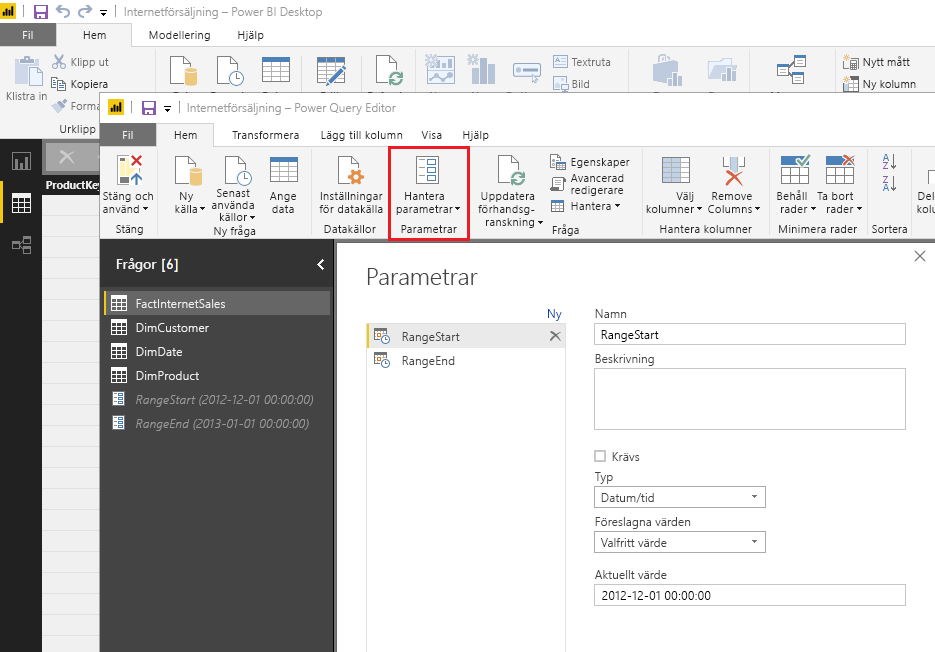
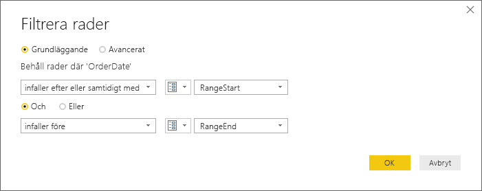
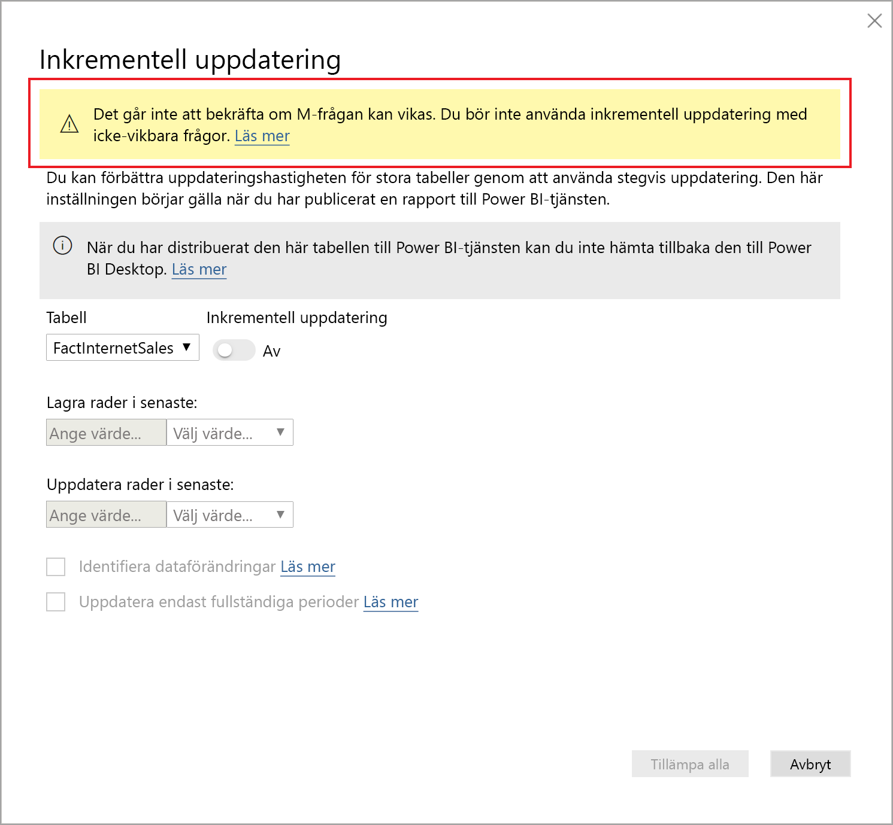
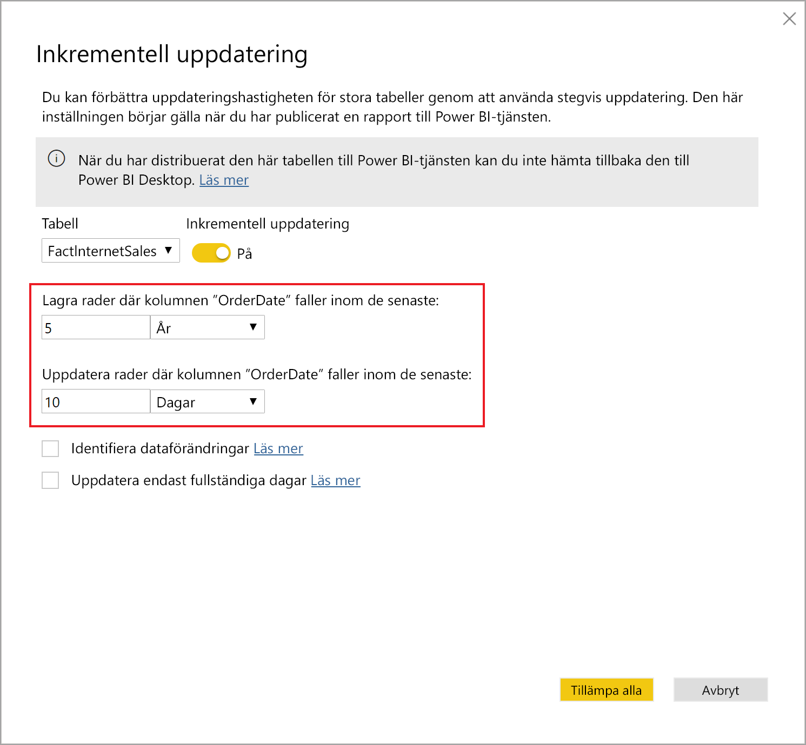
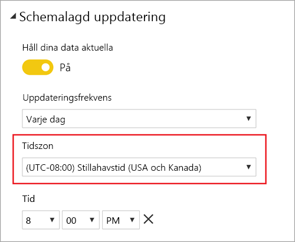
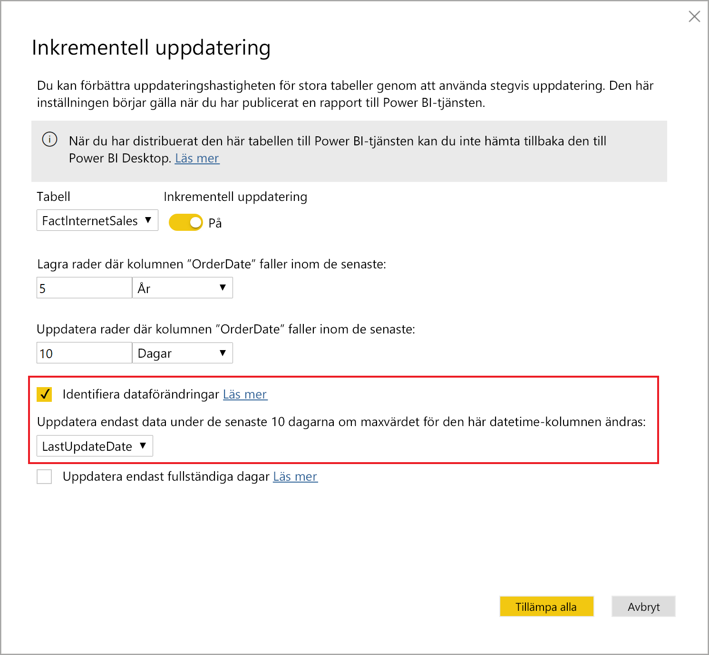
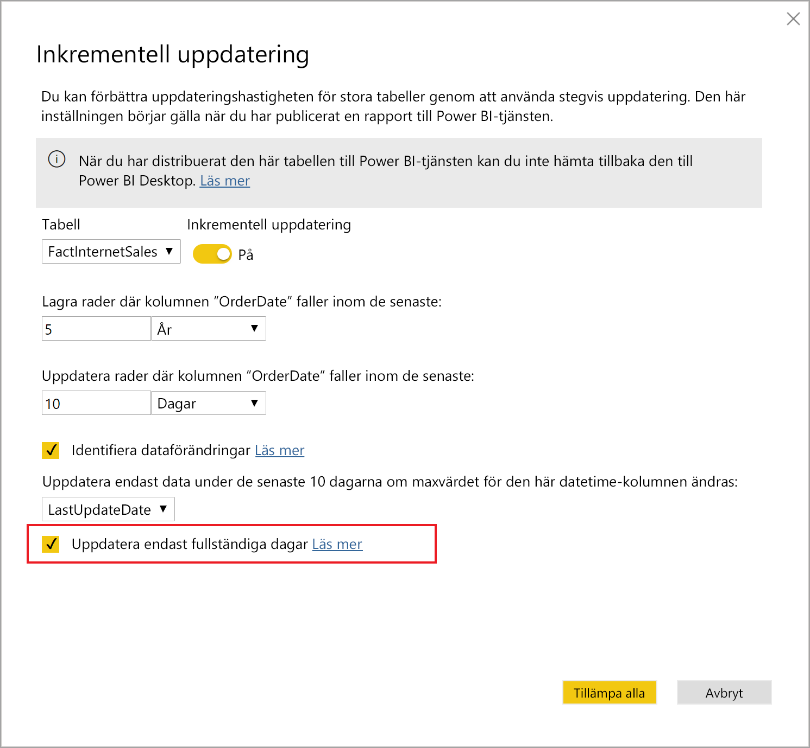

# <a name="incremental-refresh-in-power-bi"></a>Inkrementell uppdatering i Power BI

Inkrementell uppdatering gör att du kan använda mycket stora datamängder i Power BI, vilket medför följande fördelar:

> [!div class="checklist"]
> * **Snabbare uppdateringar** – Endast data som ändras behöver uppdateras. Exempelvis kan en uppdatering göras på de senaste fem dagarna i en datamängd som spänner över tio år.
> * **Mer tillförlitliga uppdateringar** – Det krävs inte längre långvariga anslutningar till instabila källsystem.
> * **Minskad resursförbrukning** – När färre data behöver uppdateras minskar den totala förbrukningen av minne och andra resurser.

> [!NOTE]
> Nu är inkrementell uppdatering tillgängligt för Power BI Pro, Premium samt delade prenumerationer och datamängder. 

## <a name="configure-incremental-refresh"></a>Konfigurera inkrementell uppdatering

Principerna för inkrementell uppdatering definieras i Power BI Desktop och tillämpas när de har publicerats till Power BI-tjänsten.


### <a name="filter-large-datasets-in-power-bi-desktop"></a>Filtrera stora datamängder i Power BI Desktop

Det går inte alltid att använda riktigt stora datamängder i en Power BI Desktop-modell eftersom PBIX-filen begränsas av de minnesresurser som är tillgängliga på datorn. Därför filtreras oftast sådana datamängder när de importeras. Den här typen av filtrering görs oavsett om du använder inkrementell uppdatering eller inte. För inkrementell uppdatering filtrerar du med Power Query-parametrarna för datum och tid.

#### <a name="rangestart-and-rangeend-parameters"></a>Parametrarna RangeStart och RangeEnd

För inkrementell uppdatering filtreras datamängder med Power Query-parametrar för datum och tid med de reserverade, skiftlägeskänsliga namnen **RangeStart** och **RangeEnd**. Dessa parametrar används för att filtrera data som importeras till Power BI Desktop och för att dynamiskt partitionera data i intervall när de har publicerats till Power BI-tjänsten. Parametervärdena ersätts av tjänsten för filtrering av varje partition. Du behöver inte ange dem i inställningarna för datauppsättningen i tjänsten. Efter publicering åsidosätts parametervärdena automatiskt av Power BI-tjänsten.

Välj **Hantera parametrar** i Power Query Editor och definiera parametrarna med standardvärden.



När parametrarna har definierats kan du tillämpa filtret genom att välja menyalternativet **Anpassat filter** för en kolumn.


Se till att raderna filtreras där kolumnvärdet *infaller efter eller är lika med* **RangeStart** och där det infaller *före* **RangeEnd**. Andra filterkombinationer kan resultera i en dubbel räkning av raderna.



> [!IMPORTANT]
> Kontrollera att frågorna har ett likhetstecken (=) i antingen **RangeStart** eller **RangeEnd**, men inte båda. Om det finns ett likhetstecken (=) i båda parametrarna kan en rad uppfylla villkoren för två partitioner, vilket kan leda till duplicerade data i modellen. Exempel:  
> \#"Filtered Rows" = Table.SelectRows(dbo_Fact, each [OrderDate] **>= RangeStart** and [OrderDate] **<= RangeEnd**) kan resultera i duplicerade data.

> [!TIP]
> Datatypen för parametrarna måste vara datum/tid, men de kan konverteras så att de uppfyller datakällans krav. Följande Power Query-funktion konverterar till exempel ett datum/tid-värde så att det liknar en surrogatnyckel i heltalsform med formatet *ååååmmdd*, vilket är vanligt för informationslager. Funktionen kan anropas i filtersteget.
>
> `(x as datetime) => Date.Year(x)*10000 + Date.Month(x)*100 + Date.Day(x)`

Välj **Close and Apply** (Stäng och använd) i Power Query Editor. Du bör ha en delmängd data i Power BI Desktop.

#### <a name="filter-date-column-updates"></a>Filtrera datumkolumnuppdateringar

Filtret för datumkolumnen används för att dynamiskt partitionera data i intervall i Power BI-tjänsten. Inkrementell uppdatering är inte avsedd att stödja fall där den filtrerade datumkolumnen uppdateras i källsystemet. En uppdatering tolkas som en infogning och en borttagning, inte en faktisk uppdatering. Om borttagningen inträffar i det historiska intervallet och inte det inkrementella intervallet hämtas den inte. Detta kan orsaka datauppdateringsfel på grund av konflikter med partitionsnyckel.

#### <a name="query-folding"></a>Frågepartitionering

Det är viktigt att partitionsfilter skickas till källsystemet när frågor skickas för uppdateringsåtgärder. Att skicka ned filtrering innebär att datakällan ska ha stöd för frågepartitionering. De flesta datakällor som stöder SQL-frågor har stöd för frågepartitionering. Datakällor som flata filer, blobar och webbflöden har normalt inte det här stödet. I fall där filtret inte stöds av datakällans serverdel kan den inte skickas ned. I sådana fall kompenserar kombinationsprogrammotorn och tillämpar filtret lokalt, vilket kan kräva att den fullständiga datamängden hämtas från datakällan. Detta kan göra så att inkrementell uppdatering går mycket långsamt, och processen kan få slut på resurser i Power BI-tjänsten eller i den lokala datagatewayen om den används.

Med tanke på de olika nivåerna av stöd för frågepartitionering för varje given datakälla rekommenderar vi att du kontrollerar att filterlogiken ingår i källfrågorna. För att underlätta detta försöker Power BI Desktop utföra den här kontrollen åt dig. Om kontrollen inte kan utföras visas en varning i dialogrutan för inkrementell uppdatering när du definierar principen för inkrementell uppdatering. SQL-baserade datakällor, till exempel SQL, Oracle och Teradata, kan vara beroende av den här varningen. Andra datakällor kanske inte kan göra en kontroll utan att spåra frågor. Om Power BI Desktop inte kan bekräfta visas följande varning. Om du ser den här varningen och vill kontrollera att frågan partitioneras ordentligt kan du använda funktionen för frågediagnostik eller spåra de frågor som tas emot av källdatabasen.

 

### <a name="define-the-refresh-policy"></a>Definiera uppdateringsprincipen

Inkrementell uppdatering är tillgängligt på snabbmenyn för tabeller, förutom för Live-anslutningsmodeller.


#### <a name="incremental-refresh-dialog"></a>Dialogrutan Inkrementell uppdatering

Dialogrutan Inkrementell uppdatering visas. Aktivera dialogrutan med hjälp av växlingsknappen.


> [!NOTE]
> Om Power Query-uttrycket för tabellen inte refererar till parametrarna med reserverade namn, är växlingsknappen inaktiverad.

Rubriktexten förklarar följande:

- Uppdateringsprinciper definieras i Power BI Desktop och tillämpas genom uppdateringsåtgärder i tjänsten.

- Om du laddar ned PBIX-filen som innehåller en princip för inkrementell uppdatering från Power BI-tjänsten, kan den inte öppnas i Power BI Desktop. Även om det kan finnas stöd för detta längre fram bör du ha i åtanke att dessa datamängder kan bli så stora att det är opraktiskt att ladda ned och öppna dem på en vanlig skrivbordsdator.

#### <a name="refresh-ranges"></a>Uppdateringsintervall

I följande exempel definieras en uppdateringsprincip för att lagra data i fem fullständiga kalenderår plus data för det aktuella året fram till det aktuella datumet och stegvis uppdatera tio dagars data. Den första uppdateringsåtgärden läser in historiska data. Efterföljande uppdateringar är inkrementella och (om de har schemalagts att köras dagligen) utför följande åtgärder:

- Lägg till en ny dag med data.

- Uppdatera tio dagar fram till det aktuella datumet.

- Ta bort kalenderår som är äldre än fem år räknat från det aktuella datumet. Om det aktuella datumet exempelvis är den 1 januari 2019 tas år 2013 bort.

Den första uppdateringen i Power BI-tjänsten kan ta längre tid eftersom alla fem fullständiga kalenderår importeras. Efterföljande uppdateringar slutförs på en bråkdel av tiden.




#### <a name="current-date"></a>Aktuellt datum

*Aktuellt datum* baseras på systemdatumet vid tidpunkten för uppdateringen. Om schemalagd uppdatering är aktiverad för datamängden i Power BI-tjänsten tas den angivna tidszonen med i beräkningen när det aktuella datumet fastställs. Både manuellt anropade och schemalagda uppdateringar via Power BI-tjänsten tar hänsyn till tidszon i förekommande fall. En uppdatering som görs 20.00 Pacific Time (USA och Kanada) med angiven tidszon fastställer till exempel aktuellt datumet baserat på Pacific Time, inte GMT (vilket annars skulle vara nästa dag). Uppdateringsåtgärder som inte anropas via Power BI-tjänsten, till exempel [TMSL Refresh-kommandot](https://docs.microsoft.com/analysis-services/tmsl/refresh-command-tmsl?view=power-bi-premium-current) tar inte hänsyn till den schemalagda uppdateringens tidszon



> [!NOTE]
> Definitionen av dessa intervall kanske är allt du behöver. I så fall kan du gå direkt till publiceringssteget nedan. De ytterligare nedrullningsbara avsnitten beskriver avancerade funktioner.

### <a name="advanced-policy-options"></a>Avancerade principalternativ

#### <a name="detect-data-changes"></a>Identifiera dataförändringar

Inkrementell uppdatering av tio dagar är effektivare än en fullständig uppdatering av fem år. Men det går att göra ännu bättre. Om du markerar kryssrutan **Identifiera dataförändringar** kan du välja en datum/tid-kolumn som ska användas för att identifiera och uppdatera endast de dagar då data har ändrats. Detta förutsätter att den här typen av kolumn finns i källsystemet, vilket är vanligt för granskningsändamål. **Det får inte vara samma kolumn som används för att partitionera data med parametrarna RangeStart/RangeEnd.** Maxvärdet i den här kolumnen utvärderas för varje period i det inkrementella intervallet. Om det inte har ändrats sedan den senaste uppdateringen behöver perioden inte uppdateras. I exemplet kan detta ytterligare minska antalet dagar som uppdateras inkrementellt från tio till cirka två.



> [!TIP]
> Den aktuella designen kräver att kolumnen som identifierar dataförändringar är beständig och att den cachelagras i minnet. Överväg att använda någon av följande tekniker för att minska kardinalitet och minnesförbrukning.
>
> Spara endast maxvärdet i den här kolumnen vid tidpunkten för uppdateringen, t.ex. genom att använda en Power Query-funktion.
>
> Minska precisionen till en godtagbar nivå beroende på dina krav på uppdateringsfrekvens.
>
> Definiera en anpassad fråga för att identifiera dataändringar med hjälp av XMLA-slutpunkten och undvik att ha kvar kolumnvärdet helt. Mer information finns i anpassade frågor om att identifiera dataändringar nedan.

#### <a name="only-refresh-complete-periods"></a>Uppdatera endast fullständiga perioder

Anta att din uppdatering är schemalagd att köras 04:00 varje morgon. Om data matas in i källsystemet under dessa fyra timmar kanske du inte vill att de ska registreras. Icke fullständiga dagar saknar relevans med vissa affärsmått, t.ex. antalet fat per dag inom olje- och gasindustrin.

Ett annat exempel är när data uppdateras från ett ekonomisystem där data för den föregående månaden godkänns på kalenderdag tolv i månaden. Du kan ange det inkrementella intervallet till en månad och schemalägga körningen av uppdateringen på den tolfte dagen i månaden. Om du väljer det här alternativet uppdateras exempelvis data från januari den 12 februari.



> [!NOTE]
> Uppdateringsåtgärder i tjänsten körs enligt UTC-tid. Detta kan avgöra det effektiva datumet och påverka fullständiga perioder. Vi planerar att lägga till möjligheten att åsidosätta det effektiva datumet för uppdateringsåtgärder.

## <a name="publish-to-the-service"></a>Publicera till tjänsten

Nu kan du uppdatera modellen. Den första uppdateringen kan ta längre tid eftersom historiska data importeras. Efterföljande uppdateringar går vanligtvis mycket snabbare eftersom de använder inkrementell uppdatering.

## <a name="query-timeouts"></a>Timeout för frågor

Artikeln [Felsöka uppdateringsscenarier](../connect-data/refresh-troubleshooting-refresh-scenarios.md) förklarar hur timeouter kan uppstå i samband med uppdateringsåtgärder i Power BI-tjänsten. Frågor kan också begränsas av datakällans standardvärde för timeout. De flesta relationskällor stöder åsidosättning av timeouter i M-uttrycket. Exempelvis använder uttrycket nedan [SQL Server-funktionen data-access](https://docs.microsoft.com/powerquery-m/sql-database) för att ange värdet till två timmar. Varje period som definieras av principintervallen skickar en fråga som tar hänsyn till kommandots timeout-inställning.

```powerquery-m
let
    Source = Sql.Database("myserver.database.windows.net", "AdventureWorks", [CommandTimeout=#duration(0, 2, 0, 0)]),
    dbo_Fact = Source{[Schema="dbo",Item="FactInternetSales"]}[Data],
    #"Filtered Rows" = Table.SelectRows(dbo_Fact, each [OrderDate] >= RangeStart and [OrderDate] < RangeEnd)
in
    #"Filtered Rows"
```

## <a name="xmla-endpoint-benefits-for-incremental-refresh"></a>XMLA Endpoint-förmåner för stegvis uppdatering

[XMLA-slutpunkten](service-premium-connect-tools.md) för datauppsättningar i en Premium-kapacitet kan aktiveras för läs- och skrivåtgärder, vilket kan ge avsevärda fördelar för stegvis uppdatering. Uppdateringsåtgärder via XMLA-slutpunkten är inte begränsade till [48 uppdateringar per dag](../connect-data/refresh-data.md#data-refresh) och den [schemalagda uppdateringstidsgränsen](../connect-data/refresh-troubleshooting-refresh-scenarios.md#scheduled-refresh-timeout) tillämpas inte, vilket kan vara användbart i stegvisa uppdateringsscenarier.

### <a name="refresh-management-with-sql-server-management-studio-ssms"></a>Uppdateringshantering med SQL Server Management Studio (SSMS)

Med XMLA-slutpunkt med läs- och skrivbehörighet kan SSMS användas för att visa och hantera partitioner som genereras när för stegvisa uppdateringsprinciper tillämpas. Detta gör att du till exempel kan uppdatera en unik historisk partition som inte är i det stegvisa intervallet för att utföra en uppdatering utan att behöva uppdatera alla historiska data. Du kan också använda SSMS för att läsa in historiska data för mycket stora datauppsättningar genom att stegvis lägga till/uppdatera historiska partitioner i batchar.


#### <a name="override-incremental-refresh-behavior"></a>Åsidosätt stegvisa uppdateringar

Med SSMS har du också mer kontroll över hur du anropar stegvisa uppdateringar från att använda [Tabellmodellskriptspråk (TMSL)](https://docs.microsoft.com/analysis-services/tmsl/tabular-model-scripting-language-tmsl-reference?view=power-bi-premium-current) och [Tabellobjektsmodell (TOM)](https://docs.microsoft.com/analysis-services/tom/introduction-to-the-tabular-object-model-tom-in-analysis-services-amo?view=power-bi-premium-current). I SSMS i Object Explorer högerklickar du till exempel på en tabell och väljer menyalternativet **Behandla tabell**. Klicka sedan på knappen **Skript** för att generera ett TMSL Refresh-kommando.


Följande parametrar kan infogas i TMSL Refresh-kommandot för att åsidosätta standardbeteendet för stegvis uppdatering.

- **applyRefreshPolicy** – om en tabell har en definierad stegvis uppdateringsprincip kommer applyRefreshPolicy att avgöra om principen tillämpas eller inte. Om principen inte tillämpas lämnar en fullständig processåtgärd partitionsdefinitioner oförändrade och alla partitioner i tabellen uppdateras helt och hållet. Standardvärdet är True.

- **effectiveDate** – om en princip för stegvis uppdatering används måste du känna till det aktuella datumet för att fastställa rullande fönsterintervall för det historiska området och det stegvisaintervallet. Med parametern effectiveDate kan du åsidosätta det aktuella datumet. Detta är användbart för testning, demonstrationer och affärsscenarier där data stegvis uppdateras till ett historiskt eller framtida datum (till exempel framtida budgetar). Standardvärdet är det aktuella datumet.

```json
{ 
  "refresh": {
    "type": "full",

    "applyRefreshPolicy": true,
    "effectiveDate": "12/31/2013",

    "objects": [
      {
        "database": "IR_AdventureWorks", 
        "table": "FactInternetSales" 
      }
    ]
  }
}
```

Om du vill läsa mer om hur du åsidosätter standardvärdet för stegvis uppdatering med TMSL, se [Uppdateringskommando](https://docs.microsoft.com/analysis-services/tmsl/refresh-command-tmsl?view=power-bi-premium-current).

### <a name="custom-queries-for-detect-data-changes"></a>Anpassade frågor för att identifiera dataändringar

Du kan använda TMSL och/eller TOM om du vill åsidosätta identifierade dataändringsbeteenden. Detta kan inte bara användas för att undvika att den senaste uppdateringskolumnen i cacheminnet i minnet behålls, men det går att aktivera scenarier där en konfigurations-/instruktionstabell förbereds av ETL-processer för att endast flagga de partitioner som behöver uppdateras. Detta kan skapa en effektivare stegvis uppdateringsprocess där endast de perioder som krävs uppdateras, oavsett hur länge sedan datauppdateringarna ägde rum.

PollingExpression är avsedd att vara ett enkelt M-uttryck eller ett namn på en annan M-fråga. Det måste returnera ett skalvärde och kommer att köras för varje partition. Om det returnerade värdet är annorlunda mot den senaste stegvisa uppdateringen flaggas partitionen för fullständig bearbetning.

I följande exempel beskrivs alla 120 månader i det historiska intervallet för ändringar i datumet. Om du anger 120 månader i stället för 10 år är det inte säkert att datakomprimeringen är lika effektiv, men du undviker att behöva uppdatera ett helt år, vilket kan vara dyrare när en månad räcker för en nyändrad förändring.

```json
"refreshPolicy": {
    "policyType": "basic",
    "rollingWindowGranularity": "month",
    "rollingWindowPeriods": 120,
    "incrementalGranularity": "month",
    "incrementalPeriods": 120,
    "pollingExpression": "<M expression or name of custom polling query>",
    "sourceExpression": [
    "let ..."
    ]
}
```

## <a name="metadata-only-deployment"></a>Distribution med endast metadata

När du publicerar en ny version av en PBIX-fil från Power BI Desktop till en arbetsyta i Power BI Premium, uppmanas du att ersätta den befintliga datauppsättningen om det redan finns en datauppsättning med samma namn.


I vissa fall kanske du inte vill ersätta datauppsättningen, särskilt med stegvis uppdatering. Datauppsättningen i Power BI Desktop kan vara mycket mindre än den i tjänsten. Om datauppsättningen i tjänsten har en tillämpad princip för stegvis uppdatering, kan flera år av historiska data gå förlorade om datauppsättningen ersätts. Det kan ta flera timmar att uppdatera alla historiska data vilket kan leda till systemstillestånd för användare.

I stället är det bättre att utföra en distribution med enbart metadata. Detta gör det möjligt att distribuera nya objekt utan att förlora äldre data. Om du till exempel har lagt till några mått kan du välja att endast distribuera de nya måtten utan att behöva uppdatera data, vilket sparar mycket tid.

När XMLA-slutpunkten har konfigurerats för läs-/skrivbehörighet ger den kompatibilitet med verktyg som verkställer detta. ALM Toolkit är till exempel ett schema differentieringsverktyg för Power BI-datauppsättningar och kan bara användas för att utföra distribution av metadata.

Hämta och installera den senaste versionen av ALM Toolkit från [Analysis Services-gitlagringsplatsen](https://github.com/microsoft/Analysis-Services/releases). Dokumentationslänkar och information om support är tillgängliga via menyfliksområdet Hjälp. Om du bara vill utföra en distribution av metadata utför du en jämförelse och väljer den aktiva Power BI Desktop-instansen som källa och den befintliga datauppsättningen i tjänsten som mål. Beakta skillnaderna som visas och hoppa över uppdateringen av tabellen med stegvisa uppdateringsfiler eller använd dialogrutan Alternativ för att bevara partitioner för tabelluppdateringar. Bekräfta valet för att säkerställa integriteten för målmodellen och uppdatera den sedan.


## <a name="see-also"></a>Se även

[Anslutning av datauppsättning med XMLA-slutpunkten](service-premium-connect-tools.md)   
[Felsökning av uppdateringsscenarier](../connect-data/refresh-troubleshooting-refresh-scenarios.md)   
