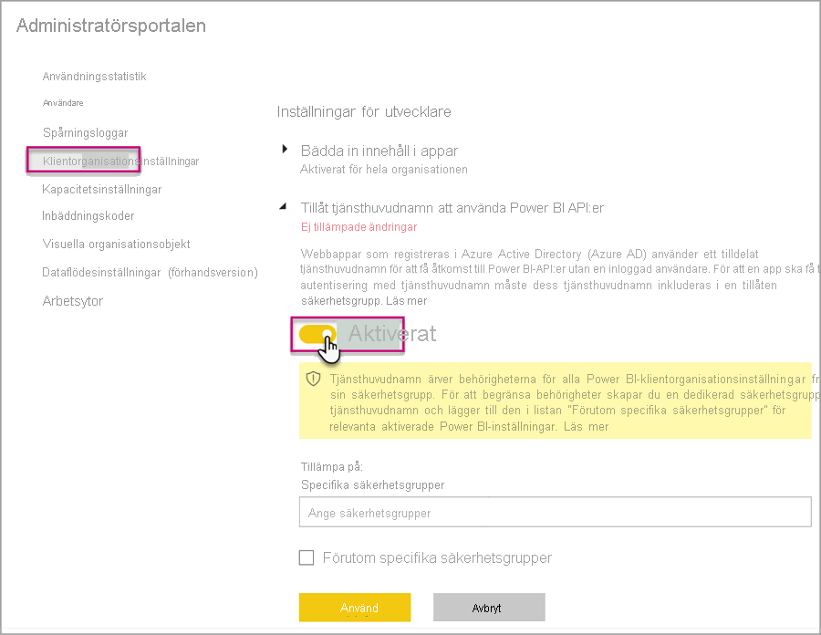
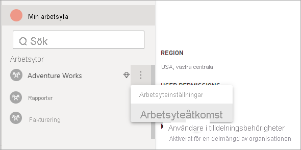

# <a name="automate-premium-workspace-and-dataset-tasks-with-service-principals"></a>Automatisera arbetsyte- och datauppsättningsåtgärder i Premium med hjälp av tjänstens huvudnamn

Tjänstens huvudnamn är en *appregistrering* för Azure Active Directory som du skapar i din klientorganisation för att utföra obevakade åtgärder på resurs- och tjänstnivå. Det är en unik typ av användaridentitet med ett appnamn, ett program-ID, ett klientorganisations-ID och en *klienthemlighet* eller ett certifikat för ett lösenord.

Power BI Premium använder samma funktion för tjänstens huvudnamn som Power BI Embedded. Läs mer i [Bädda in Power BI-innehåll med tjänstens huvudnamn](../developer/embedded/embed-service-principal.md).

I **Power BI Premium** kan tjänstens huvudnamn även användas med [XMLA-slutpunkten](service-premium-connect-tools.md) för att automatisera uppgifter för hantering av datauppsättningar, till exempel etablering av arbetsytor, distribution av modeller och uppdatering av datauppsättningar med:

- PowerShell
- Azure Automatisering
- Azure Logic Apps
- Anpassade klientprogram

Endast [Nya arbetsytor](../collaborate-share/service-new-workspaces.md) har stöd för XMLA-slutpunktsanslutningar med hjälp av tjänstens huvudnamn. Klassiska arbetsytor stöds inte. Tjänstens huvudnamn har bara de behörigheter som krävs för att utföra uppgifter för arbetsytor som det har tilldelats. Behörigheter tilldelas via Arbetsyteåtkomst, ungefär som vanliga UPN-konton.

Skrivåtgärder kräver att [XMLA-slutpunkten är aktiverad för läs- och skrivåtgärder](service-premium-connect-tools.md#enable-xmla-read-write) för kapacitetens **arbetsbelastning för datauppsättningar**. Funktionen för [förbättrat metadataformat](../connect-data/desktop-enhanced-dataset-metadata.md) bör vara aktiverad för datauppsättningar som publiceras från Power BI Desktop.

> [!NOTE]
> Funktionen för XMLA-slutpunkt i Power BI Premium finns som **förhandsversion**. Funktioner i förhandsversionen ska inte användas i en produktionsmiljö. Vissa funktioner, support och dokumentation är begränsade.  Mer information finns i [Microsoft Online Services-villkor (OST)](https://www.microsoft.com/licensing/product-licensing/products?rtc=1).

## <a name="create-a-service-principal"></a>Skapa ett huvudnamn för tjänsten

Tjänstens huvudnamn skapas som en appregistrering på Azure-portalen eller med hjälp av PowerShell. När du skapar tjänstens huvudnamn måste du kopiera och spara appnamnet, program-ID:t (klienten), katalog-ID:t (klientorganisationen) och klienthemligheten separat. Anvisningar för hur du skapar tjänstens huvudnamn finns i:

[Skapa tjänstens huvudnamn – Azure-portalen](https://docs.microsoft.com/azure/active-directory/develop/howto-create-service-principal-portal)   
[Skapa tjänstens huvudnamn – PowerShell](https://docs.microsoft.com/azure/active-directory/develop/howto-authenticate-service-principal-powershell)

## <a name="create-an-azure-ad-security-group"></a>Skapa en Azure AD-säkerhetsgrupp

Tjänstens huvudnamn har som standard åtkomst till alla klientinställningar som de är aktiverade för. Beroende på dina administratörsinställningar kan åtkomsten omfatta vissa säkerhetsgrupper eller hela organisationen.

Om du vill begränsa åtkomsten till tjänstens huvudnamn till särskilda klientorganisationsinställningar kan du bevilja åtkomst till specifika säkerhetsgrupper. Du kan också skapa en dedikerad säkerhetsgrupp för tjänstens huvudnamn och undanta den från önskade klientinställningar. Anvisningar för hur du skapar en säkerhetsgrupp och lägger till tjänstens huvudnamn finns i [Skapa en basgrupp och lägga till medlemmar med hjälp av Azure Active Directory](https://docs.microsoft.com/azure/active-directory/fundamentals/active-directory-groups-create-azure-portal).

## <a name="enable-service-principals"></a>Aktivera tjänstens huvudnamn

Innan du använder tjänstens huvudnamn i Power BI måste en administratör först aktivera åtkomst till tjänstens huvudnamn på Power BI-administratörsportalen.

Gå till Power BI-**administratörsportalen** > **Klientinställningar**, expandera **Tillåt tjänstens huvudkonton att använda Power BI API:er** och klicka sedan på **Aktiverat**. Om du vill tillämpa behörigheter på en säkerhetsgrupp lägger du till gruppnamnet i **Specifika säkerhetsgrupper**.



## <a name="workspace-access"></a>Arbetsyteåtkomst

För att tjänstens huvudnamn ska ha de behörigheter som krävs för att utföra arbetsyte- och datauppsättningsåtgärder i Premium måste du lägga till tjänstens huvudnamn som en medlem eller administratör för arbetsytor. Här beskriver vi hur du använder Arbetsyteåtkomst i Power BI-tjänsten, men du kan även använda [REST-API:et Lägg till gruppanvändare](https://docs.microsoft.com/rest/api/power-bi/groups/addgroupuser).

1. I Power BI-tjänsten väljer du **Mer** > **Arbetsyteåtkomst** för en arbetsyta.

    

2. Sök baserat på programnamn; lägg till tjänstens huvudnamn som **Administratör** eller **Medlem** på arbetsytan.

    

## <a name="connection-strings-for-the-xmla-endpoint"></a>Anslutningssträngar för XMLA-slutpunkten

När du har skapat tjänstens huvudnamn, aktiverat tjänstens huvudnamn för din klientorganisation och lagt till tjänstens huvudnamn till Arbetsyteåtkomst kan du använda det som en användaridentitet i anslutningssträngar med XMLA-slutpunkten. Skillnaden är att du för parametrarna för användar-ID och lösenord anger program-ID:t, klientorganisations-ID:t och programhemligheten.

`Data Source=powerbi://api.powerbi.com/v1.0/myorg/<workspace name>; Initial Catalog=<dataset name>;User ID=app:<appId>@<tenantId>;Password=<app_secret>;`

### <a name="powershell"></a>PowerShell

#### <a name="using-sqlserver-module"></a>Använda SQLServer-modulen

I följande exempel används AppId, TenantId och AppSecret för att autentisera en uppdateringsåtgärd för datauppsättningar:

```powershell
Param (
        [Parameter(Mandatory=$true)] [String] $AppId,
        [Parameter(Mandatory=$true)] [String] $TenantId,
        [Parameter(Mandatory=$true)] [String] $AppSecret
       )
$PWord = ConvertTo-SecureString -String $AppSecret -AsPlainText -Force

$Credential = New-Object -TypeName "System.Management.Automation.PSCredential" -ArgumentList $AppId, $PWord

Invoke-ProcessTable -Server "powerbi://api.powerbi.com/v1.0/myorg/myworkspace" -TableName "mytable" -DatabaseName "mydataset" -RefreshType "Full" -ServicePrincipal -ApplicationId $AppId -TenantId $TenantId -Credential $Credential
```

### <a name="amo-and-adomd"></a>AMO och ADOMD

När du ansluter med klientprogram och webbappar har [AMO- och ADOMD-klientbibliotek](https://docs.microsoft.com/azure/analysis-services/analysis-services-data-providers) version 15.0.2 och senare installerbara paket från NuGet stöd för tjänstens huvudnamn i anslutningssträngar med hjälp av följande syntax: `app:AppID` och lösenord eller `cert:thumbprint`.

I följande exempel används `appID` och `password` för att utföra en uppdateringsåtgärd för modelldatabasen:

```csharp
string appId = "xxx";
string authKey = "yyy";
string connString = $"Provider=MSOLAP;Data source=powerbi://api.powerbi.com/v1.0/<tenant>/<workspacename>;Initial catalog=<datasetname>;User ID=app:{appId};Password={authKey};";
Server server = new Server();
server.Connect(connString);
Database db = server.Databases.FindByName("adventureworks");
Table tbl = db.Model.Tables.Find("DimDate");
tbl.RequestRefresh(RefreshType.Full);
db.Model.SaveChanges();
```

## <a name="next-steps"></a>Nästa steg

[Anslutning av datauppsättning med XMLA-slutpunkten](service-premium-connect-tools.md)  
[Azure Automation](https://docs.microsoft.com/azure/automation)  
[Azure Logic Apps](https://docs.microsoft.com/azure/logic-apps/)  
[REST API:er för Power BI](https://docs.microsoft.com/rest/api/power-bi/)
