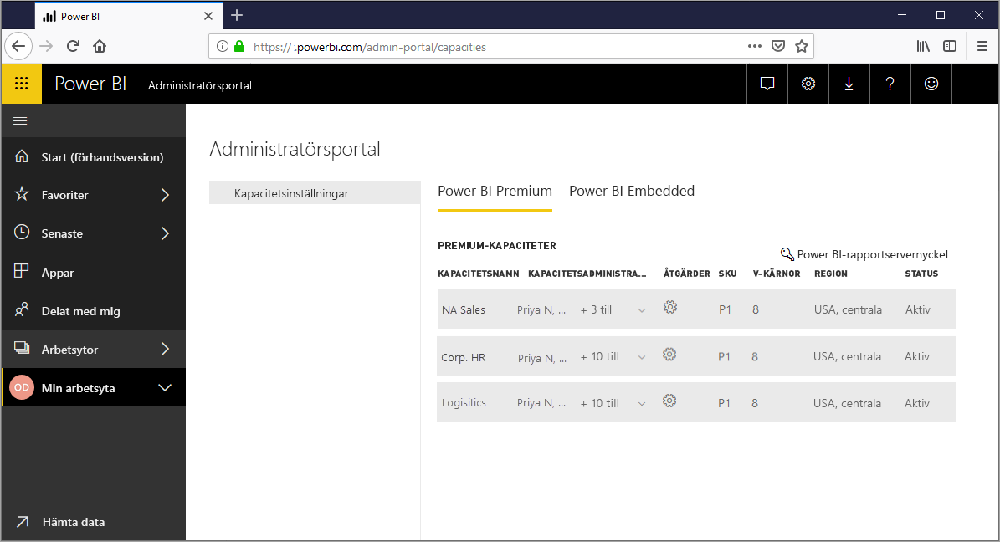
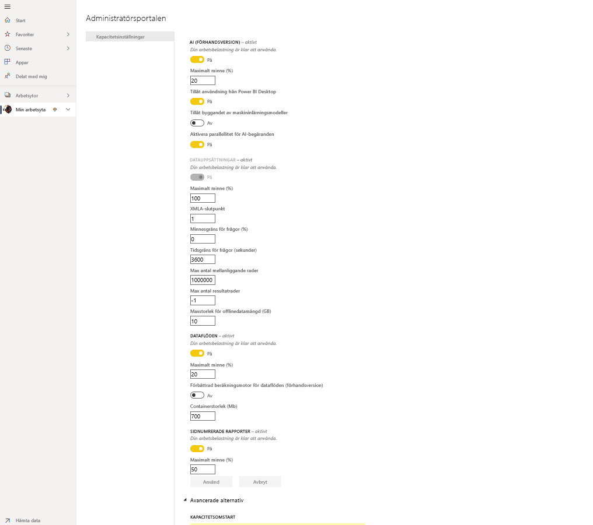
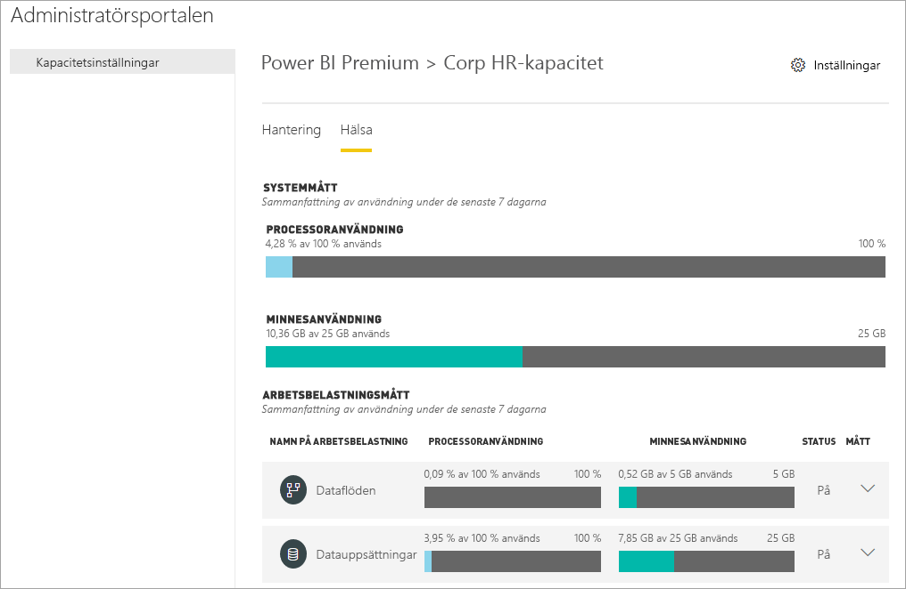
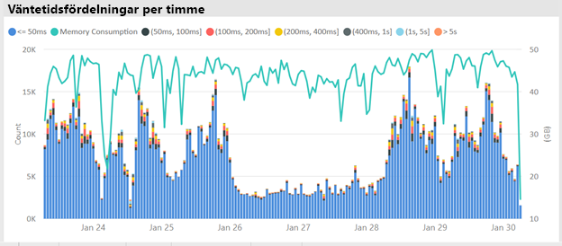
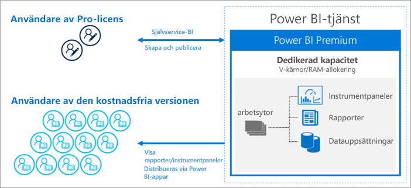

# Vad är Power BI Premium?

Du kan använda Power BI Premium för att få dedikerade och förbättrade resurser för din organisation, så att användare i din organisation kan använda Power BI-tjänsten med bättre prestanda och svarstider. Med en Power BI Premium-prenumeration får du och din organisations användare till exempel åtkomst till:

> [!div class="checklist"]
> * Större skala och bättre prestanda
> * Flexibiliteten att licensiera efter kapacitet
> * Förena självbetjäning och BI för företag
> * Utöka lokal BI med Power BI-rapportservern
> * Stöd för datahemvist per region (Multi-Geo)
> * Dela data med vem som helst utan köpa en licens per användare

 

Den här artikeln introducerar viktiga funktioner i Power BI Premium. Vid behov ges länkar till fler artiklar med mer detaljerad information. Mer information om Power BI Pro och Power BI Premium finns i avsnittet _Jämförelse av Power BI-funktioner_ i [Power BI-prissättning](https://powerbi.microsoft.com/pricing/).

## Prenumerationer och licensiering

Power BI Premium är en prenumeration på klientnivå för Office 365, tillgänglig för två SKU-serier (lagerhållningsenhet):

- **P**-SKU:er (P1–P5) för inbäddning och företagsfunktioner kräver ett månatligt eller årsvis åtagande, faktureras månadsvis och inkluderar en licens för installation av Power BI-rapportservern lokalt.

- **EM**-SKU:er (EM1–EM3) för _organisatorisk_ inbäddning kräver ett årligt åtagande och faktureras månadsvis. EM1- och EM2-SKU:er är endast tillgängliga via planer med volymlicensiering. Du kan inte köpa dem direkt.

En annan metod är att köpa en **Power BI Embedded**-prenumeration i Azure. Det finns en enda **A**-SKU (A1-A6) som inte kräver något åtagande och debiteras per användningstimme för vitmärkning av Power BI i program, portaler och webbplatser eller som ett sätt att testa P- eller EM-kapaciteter. Alla SKU:er levererar virtuella kärnor för att skapa kapaciteter, men EM-SKU:er är begränsade till inbäddning i mindre skala. EM1-, EM2-, A1- och A2-SKU:er med färre än fyra kärnor körs inte på dedikerad infrastruktur.

Även om detta fokuset i den här artikeln ligger på P-SKU:er är mycket av det som beskrivs även relevant för A-SKU:er. Till skillnad från SKU:er för Premium-prenumeration, kräver Azure SKU:er ingen tid för åtagande och de faktureras per timme. De levererar fullständig flexibilitet att aktivera uppskalning, nedskalning, pausa, återuppta och ta bort. 

Azure Power BI Embedded är i stort sett utanför omfånget för den här artikeln, men det beskrivs i avsnittet [Testningsmetoder](service-premium-capacity-optimize.md#testing-approaches) i artikeln Optimera Premium-kapaciteter som ett praktiskt och ekonomiskt alternativ för testning och mätning av arbetsbelastningar. Läs mer om Azure-SKU:er i [Azure Power BI Embedded-dokumentationen](https://azure.microsoft.com/services/power-bi-embedded/).

### Inköp

Power BI Premium-prenumerationer köps av administratörer i Microsoft 365 Administrationscenter. Mer specifikt kan endast globala administratörer eller faktureringsadministratörer köpa SKU:er. När de köps får klienten ett motsvarande antal v-kärnor för att tilldela till kapaciteter, vilket kallas *poolning av v-kärnor*. Köp av en P3 SKU ger till exempel klienten 32 v-kärnor. Mer information finns i [Så här köper du Power BI Premium](service-admin-premium-purchase.md).

## Dedikerade kapaciteter

Med Power BI Premium får du *dedikerade kapaciteter*. Till skillnad från en delad kapacitet där arbetsbelastningar körs på dataresurser som delas med andra kunder är en dedikerad kapacitet för exklusiv användning av en organisation. Den är isolerad med dedikerade resurser som ger pålitlig och konsekvent prestanda för värdbaserat innehåll. Observera att följande resurser lagras i delad kapacitet i stället för din dedikerade kapacitet:

* Excel-arbetsböcker (såvida inte data först importeras till Power BI Desktop)
* [Push-överför datauppsättningar](/rest/api/power-bi/pushdatasets)
* [Direktuppspelande datauppsättningar](../connect-data/service-real-time-streaming.md#set-up-your-real-time-streaming-dataset-in-power-bi)
* [Frågor och svar](../create-reports/power-bi-tutorial-q-and-a.md)

Arbetsytor förvaras i kapaciteter. Varje Power BI-användare har en personlig arbetsyta som kallas **Min arbetsyta**. Du kan skapa fler arbetsytor, så kallade **arbetsytor**, för samarbete och distribution. Som standard skapas arbetsytor, däribland personliga arbetsytor, i den delade kapaciteten. När du har Premium-kapaciteter kan både Mina arbetsytor och arbetsytor tilldelas till Premium-kapaciteter.

### Kapacitetsnoder

Som beskrivs i avsnittet [Prenumerationer och licensiering](#subscriptions-and-licensing) finns det två Power BI Premium SKU-familjer: **EM** och **P**. Alla Power BI Premium-SKU:er är tillgängliga som *kapacitetsnoder*, där var och en representerar en viss mängd resurser som består av processor, minne och lagring. Utöver resurser har varje SKU driftsgränser för antalet DirectQuery-anslutningar och Live Connection-anslutningar per sekund samt antalet uppdateringar av parallella modeller.

Bearbetning uppnås med ett visst antal v-kärnor, jämnt fördelat mellan serverdelen och klientdelen.

**Serverdelens v-kärnor** ansvarar för huvudfunktioner för Power BI, inklusive frågebearbetning, hantering av cache, köra R-tjänster, modelluppdatering och återgivning av rapporter och bilder från serversidan. Serverdelens v-kärnor tilldelas en fast mängd minne som i första hand används för att vara värd för modeller, som även kallas aktiva datamängder.

**Klientdelens v-kärnor** ansvarar för hantering av webbtjänsten, instrumentpanelen och rapportdokument, hantering av åtkomsträttigheter och schemaläggning av API:er, uppladdning och nedladdning samt överlag för allt som rör användarupplevelser.

Lagring är inställd på **100 TB per kapacitetsnod**.

Resurser och begränsningar för varje Premium-SKU (och en A-SKU med motsvarande storlek) beskrivs i följande tabell:

| Kapacitetsnoder | Totalt antal virtuella kärnor | Virtuella kärnor för serverdel | RAM (GB) | Virtuella kärnor för klientdel | DirectQuery/Live Connection (per sek) | Modellens uppdateringsparallellitet |
| --- | --- | --- | --- | --- | --- | --- |
| EM1/A1 | 1 | 0,5 | 3 | 0,5 | 3.75 | 1 |
| EM2/A2 | 2 | 1 | 5 | 1 | 7.5 | 2 |
| EM3/A3 | 4 | 2 | 10 | 2 | 15 | 3 |
| P1/A4 | 8 | 4 | 25 | 4 | 30 | 6 |
| P2/A5 | 16 | 8 | 50 | 8 | 60 | 12 |
| P3/A6 | 32 | 16 | 100 | 16 | 120 | 24 |
| P4 | 64 | 32 | 200 | 32 | 240 | 48 |
| P5 | 128 | 64 | 400 | 64 | 480 | 96 |
| | | | | | | |

> [!NOTE]
> Användning av ett enda större SKU (t.ex. ett P2-SKU) kan vara bättre än att kombinera mindre SKU:er (t.ex. två P1-SKU:er). Du kan till exempel använda större modeller och uppnå bättre parallellitet med P2.

### Kapacitetsarbetsbelastningar

Kapacitetsarbetsbelastningar är tjänster som är tillgängliga för användarna. Som standard har Premium- och Azure-kapaciteterna endast stöd för en datamängdsarbetsbelastning som är associerad med Power BI-frågor som körs. Datamängdsarbetsbelastningen kan inte inaktiveras. Ytterligare arbetsbelastningar kan aktiveras för [AI (Cognitive Services)](https://powerbi.microsoft.com/blog/easy-access-to-ai-in-power-bi-preview/), [dataflöden](../transform-model/service-dataflows-overview.md#dataflow-capabilities-on-power-bi-premium) och [sidnumrerade rapporter](../paginated-reports/paginated-reports-save-to-power-bi-service.md). Dessa arbetsbelastningar stöds endast i Premium-prenumerationer. 

Varje ytterligare arbetsbelastning möjliggör konfiguration av den högsta mängd minne (som en procentandel av den totala mängden tillgängligt minne) som kan användas av arbetsbelastningen. Standardvärden för maximalt minne bestäms av SKU:n. Du kan maximera kapacitetens tillgängliga resurser genom att endast aktivera dessa ytterligare arbetsbelastningar när de används. Du kan även ändra minnesinställningar först när du har fastställt att standardinställningarna inte uppfyller dina kapacitetsresurskrav. Arbetsbelastningar kan aktiveras och konfigureras för en kapacitet av kapacitetsadministratörer med hjälp av **kapacitetsinställningarna** i [administratörsportalen](service-admin-portal.md) eller via [REST-API:erna för kapaciteter](https://docs.microsoft.com/rest/api/power-bi/capacities).  

Mer information finns i [Konfigurera arbetsbelastningar i en Premium-kapacitet](service-admin-premium-workloads.md). 

### Så fungerar kapaciteter

Power BI-tjänsten använder alltid kapacitetsresurser på bästa sätt utan att överskrida de gränser som införts på kapaciteten.

Kapacitetsåtgärder klassificeras som antingen *interaktiva* eller *bakgrund*. Interaktiva åtgärder omfattar renderingsbegäranden och svarar på användarinteraktioner (filtrering, frågor och svar frågor, o.s.v.). I allmänhet är importmodellfrågor minnesresurskrävande, medan frågor med DirectQuery- och Live Connection-modeller är CPU-intensiva. Bakgrundsåtgärder omfattar uppdateringar av dataflöde och importmodeller, och frågecache för instrumentpanelen.

Det är viktigt att förstå att interaktiva åtgärder alltid prioriteras över bakgrundsåtgärder för att ge bästa möjliga användarupplevelse. Om det inte finns tillräckligt med resurser, läggs bakgrundsåtgärder till i en kö för bearbetning när resurser frigörs. Bakgrundsåtgärder, till exempel uppdateringar av datamängd, kan stoppas mitt i processen av Power BI-tjänsten och läggas till i en kö.

Importmodeller måste läsas in helt i minnet så att frågor kan köras mot dem och så att de kan uppdateras. Power BI-tjänsten hanterar minnesanvändning med hjälp av avancerade algoritmer för att garantera maximal användning av det tillgängliga minnet, och kan orsaka överansträngning av kapaciteten: Det är möjligt för en kapacitet att lagra många importmodeller (upp till 100 TB per Premium-kapacitet), när deras sammanlagda disklagring överskrider det minne som stöds (och ytterligare minne krävs för att köra frågor och uppdatera), men inte alla kan läsas in i minnet samtidigt.

Importmodeller läses därför in och tas bort från minnet beroende på användningen. En importmodell läses in när frågor körs mot den (interaktiv åtgärd) och den ännu inte är i minnet, eller när den ska uppdateras (bakgrundsåtgärd).

Borttagning av en modell från minnet kallas *avlägsning*. Det är en åtgärd som Power BI kan utföra snabbt beroende på storleken på modellerna. Om kapaciteten inte har någon minnesbelastning, läses modeller bara in i minnet och finns kvar där. Men om det inte finns tillräckligt med minne för att läsa in en modell måste Power BI-tjänsten först frigöra minne. Den frigör minne genom att identifiera modeller som har inaktiverats av sökmodeller som inte har använts under de senaste tre minuterna \[[1](#endnote-1)\], och avlägsnar dem sedan. Om det inte finns några inaktiva modeller att ta bort, strävar Power BI-tjänsten efter att avlägsna modeller som lästs in för bakgrundsåtgärder. En sista utväg, efter 30 sekunder av misslyckade försök \[[1](#endnote-1)\], är att den interaktiva åtgärden misslyckas. I det här fallet meddelas rapportanvändaren om felet med ett förslag om att försöka igen om en stund. I vissa fall kan modeller tas bort från minnet på grund av serviceåtgärder.

Det är viktigt att påpeka att datamängdsavlägsning är ett normalt och förväntat beteende. Det strävar efter att maximera minnesanvändningen efter inläsning och inaktivera modeller vars kombinerade storlekar kan överstiga tillgängligt minne. Detta är avsiktligt och transparent för rapportanvändarna. Höga avlägsningsfrekvenser innebär inte nödvändigtvis att kapaciteten är otillräckligt resurstilldelad. Detta kan dock bli ett problem om frågans eller uppdaterings svarstid har drabbats på grund av höga avlägsningsfrekvenser.

Uppdateringar av importmodeller är alltid minnesintensiva eftersom modeller måste läsas in i minnet. Det krävs ytterligare minne för bearbetning. En fullständig uppdatering kan ungefär dubbla den mängd minne som krävs av modellen. Detta säkerställer att frågor kan köras mot modellen även när den bearbetas, eftersom frågor skickas till den befintliga modellen tills uppdateringen har slutförts och nya modelldata är tillgängliga. Inkrementell uppdatering kräver mindre minne och kan slutföras snabbare. Det kan således avsevärt minska trycket på kapacitetsresurser. Uppdateringar kan även vara processorintensiva för modeller, särskilt de med komplexa Power Query-omvandlingar eller beräknade tabeller/kolumner som är komplexa eller baseras på stora tabeller.

Uppdateringar såsom frågor kräver att modellen läses in i minnet. Om det inte finns tillräckligt med minne kommer Power BI-tjänsten att försöka ta bort inaktiva modeller, och om det inte är möjligt (alla modeller är aktiva) placeras uppdateringsjobbet i kö. Uppdateringar är vanligtvis mycket CPU-intensiva, till och med mer än frågor. Därför finns kapacitetsbegränsningar på antal samtidiga uppdateringar, inställt på 1,5 gånger antalet serverdelens v-kärnor, avrundat uppåt. Om det finns för många samtidiga uppdateringar, placeras en schemalagd uppdatering i kö. När sådana situationer inträffar, tar det längre tid för uppdateringen att färdigställas. Uppdateringar på begäran, till exempel de som utlöses av en användarbegäran eller ett API-anrop, försöker igen tre gånger \[[1](#endnote-1)\]. Om det fortfarande inte finns tillräckligt med resurser misslyckas uppdateringen.

Avsnittskommentarer:   
\[1\] Kan komma att ändras.

### Regional support

När globala administratörer och Power BI-tjänstadministratörer skapar en ny kapacitet, kan de ange en region där arbetsytor som tilldelats till kapaciteten lagras. Detta kallas **Multi-Geo**. Med Multi-Geo kan organisationer uppfylla kraven på datahemvist genom att distribuera innehåll till datacenter i en viss region, även om den skiljer sig från den region där Office 365-prenumerationen finns. Mer information finns i [Multi-Geo-stöd för Power BI Premium](service-admin-premium-multi-geo.md).

### Kapacitetshantering

Hantering av Premium-kapaciteter innebär skapande eller borttagande av kapaciteter, tilldelning av administratörer, tilldelning av arbetsytor, konfiguration av arbetsbelastningar, övervakning och justeringar för optimering av kapacitetsprestanda. 

Globala administratörer och Power BI-tjänstadministratörer kan skapa Premium-kapaciteter från tillgängliga v-kärnor eller ändra befintliga Premium-kapaciteter. När en kapacitet skapas så anges kapacitetsstorlek och geografisk region, och minst en kapacitetsadministratör tilldelas. 

När kapaciteterna skapas slutförs de flesta administrativa uppgifter i [administrationsportalen](service-admin-portal.md).

Kapacitetsadministratörer kan tilldela kapaciteten arbetsytor, hantera användarbehörigheter och tilldela andra administratörer. Kapacitetsadministratörer kan även konfigurera arbetsbelastningar, justera minnesallokeringar och vid behov starta om en kapacitet för att återställa driften om det sker kapacitetsöverbelastning.

Kapacitetsadministratörer kan även kontrollera att en kapacitet fungerar smidigt. De kan övervaka kapacitetshälsa direkt i administratörsportalen eller med hjälp av appen för Premium-kapacitetsmått.

Läs mer om att skapa kapaciteter, tilldela administratörer och tilldela arbetsytor i [Hantera Premium-kapaciteter](service-premium-capacity-manage.md). Mer information om roller finns i [Administratörsroller relaterade till Power BI](service-admin-administering-power-bi-in-your-organization.md#administrator-roles-related-to-power-bi).

### Övervakning

Övervakning av Premium-kapaciteter ger administratörer en förståelse för hur kapaciteterna presterar. Kapaciteter kan övervakas via administratörsportalen och [appen för Power BI Premium-kapacitetsmått](https://app.powerbi.com/groups/me/getapps/services/capacitymetrics).

Övervakning i portalen ger en snabb överblick med högnivåmått som anger aktuella belastningar och de resurser som används av kapaciteten med genomsnitt över de senaste sju dagarna. 

**Appen för Power BI Premium-kapacitetsmått** ger den mest djupgående informationen om hur kapaciteterna presterar. Appen har en instrumentpanel med information på hög nivå samt mer detaljerade rapporter.

På appens instrumentpanel kan du klicka på en måttcell för att öppna en detaljerad rapport. Rapporter ger djupgående mått- och filtreringsfunktioner för att öka detaljnivån för den viktigaste information som du behöver för att se till att kapaciteterna körs korrekt.

Mer information om övervakning av kapaciteter finns i [Övervakning i administratörsportalen för Power BI](service-admin-premium-monitor-portal.md) och [Övervakning med appen för Power BI Premium-kapacitetsmått](service-admin-premium-monitor-capacity.md).

### Optimera kapaciteter

Det är viktigt att dra maximal nytta av kapaciteterna så att användarna får bästa prestanda och du får det mesta möjliga värdet från din Premium-investering. Genom att övervaka viktiga mått kan administratörer komma fram till det bästa sättet att felsöka flaskhalsar och vidta nödvändiga åtgärder. Mer information finns i [Optimera Premium-kapaciteter](service-premium-capacity-optimize.md) och [Premium-kapacitetsscenarier](service-premium-capacity-scenarios.md).

### REST-API:er kapaciteter

REST-API:er för Power BI innehåller en samling med [kapacitets-API:er](https://docs.microsoft.com/rest/api/power-bi/capacities). Med API:erna kan administratörer programmatiskt hantera många aspekter av dina Premium-kapaciteter, däribland aktivering och inaktivering av arbetsbelastningar, tilldelning av arbetsytor till en kapacitet och mer.

## Stora datamängder

Beroende på SKU:n stöder Power BI Premium uppladdning av Power BI Desktop-modellfiler (.pbix) med en storlek på upp till **10 GB**. När modellen har lästs in kan den publiceras till en arbetsyta som tilldelats till en Premium-kapacitet. Datamängden kan sedan uppdateras till en storlek på upp till **12 GB**.

### Överväganden gällande storlek

Stora datamängder kan vara resurskrävande. Du bör ha minst en P1-SKU för alla datamängder som är större än 1 GB. Även om det kan gå att publicera stora datamängder till arbetsytor som backas upp av A-SKU:er upp till A3, så går det inte att uppdatera dem.

I följande tabell visas rekommenderade SKU:er för .pbix-filöverföring eller publicering i Power BI-tjänsten:

   |SKU  |Storlek på PBIX   |
   |---------|---------|
   |P1    | < 3 GB        |
   |P2    | < 6 GB        |
   |P3, P4, P5    | upp till 10 GB   |

Power BI Embedded-SKU:n A4 motsvarar SKU:n P1, A5 = P2 och A6 = P3. Om du publicerar stora datamängder till A- och EM-SKU:er kan det returnera fel som inte är specifika för modellens storleksbegränsningsfel i den delade kapaciteten. Uppdateringsfel för stora datamängder i A- och EM-SKU:er pekar troligen på tidsgränser.

Om du aktiverar [stora modeller](service-premium-large-models.md) på en datamängd, så gäller fortfarande .pbix-filstorleksbegränsningarna för filöverföring eller publicering. Men med en kombination av stegvis uppdatering och stora modeller kan datamängderna växa sig mycket större än dessa gränser. Med stora modeller begränsas datamängdens storlek endast av kapacitetsstorleken för Power BI Premium.

PBIX-filerna representerar data i ett *mycket komprimerat tillstånd*. Data kommer sannolikt att expandera när de läses in i minnet, och därifrån kan de expandera flera gånger under datauppdateringen.

Schemalagd uppdatering av stora datamängder kan ta lång tid och vara väldigt resurskrävande. Därför är det viktigt att inte schemalägga för många överlappande uppdateringar. Det rekommenderas att [inkrementell uppdatering](service-premium-incremental-refresh.md) konfigureras eftersom det är snabbare och tillförlitligare samt förbrukar färre resurser.

Den inledande rapportbelastningen för stora datamängder kan ta lång tid om det var ett tag sedan datamängden senast användes. En inläsning för längre inläsningsrapporter visar belastningsförloppet.

Då minnes- och tidsbegränsningarna per fråga är mycket högre i Premium-kapaciteten rekommenderar vi att du använder filter och utsnitt för att begränsa visuell information så att bara det som är nödvändigt visas.

## Inkrementell uppdatering

Inkrementell uppdatering utgör en viktig del av att hantera och underhålla stora datamängder i Power BI Premium. Inkrementell uppdatering har många fördelar – till exempel är uppdateringar snabbare eftersom endast data som har ändrats behöver uppdateras. Uppdateringar är mer tillförlitliga eftersom det inte finns något behov av att underhålla långvariga anslutningar till instabila datakällor. Resursförbrukningen är mindre tack vare att färre data behöver uppdateras, vilket minskar den totala förbrukningen av minne och andra resurser. Principerna för inkrementell uppdatering definieras i **Power BI Desktop** och tillämpas när de publiceras till en arbetsyta i en Premium-kapacitet. 

Mer information finns i [Inkrementell uppdatering i Power BI Premium](service-premium-incremental-refresh.md).

## Sidnumrerade rapporter

Sidnumrerade rapporter, som stöds på P1–P3- och A4–A6-SKU:er, baseras på RDL-teknik (Report Definition Language) i SQL Server Reporting Services. De bygger på RDL-teknik, men det är inte samma sak som Power BI-rapportserver, vilket är en nedladdningsbar rapporteringsplattform som du kan installera lokalt och som även ingår i Power BI Premium. Sidnumrerade rapporter formateras för att passar bra på en sida som kan skrivas ut eller delas. Data visas i en tabell, även om tabellen sträcker sig över flera sidor. Med hjälp av det kostnadsfria Windows Desktop-programmet [**Power BI Report Builder**](https://go.microsoft.com/fwlink/?linkid=2086513) skriver användare sidnumrerade rapporter och publicerar dem till tjänsten.

I Power BI Premium är sidnumrerade rapporter en arbetsbelastning som måste aktiveras för en kapacitet med hjälp av administratörsportalen. Kapacitetsadministratörer kan aktivera och sedan ange mängden minne som en procentandel av kapacitetens övergripande minnesresurser. Till skillnad från andra typer av arbetsbelastningar kör Premium sidnumrerade rapporter i ett inneslutet område inom kapaciteten. Det maximala minne som anges för det här området används oavsett om arbetsbelastningen är aktiv eller inte. Standard är 20 %. 

Mer information finns i [Sidnumrerade rapporter i Power BI Premium](../paginated-reports/paginated-reports-report-builder-power-bi.md). Mer information om hur du aktiverar arbetsbelastningen för sidnumrerade rapporter finns i [Konfigurera arbetsbelastningar](service-admin-premium-workloads.md).

## Power BI-rapportserver
 
Power BI-rapportservern ingår i Power BI Premium och är en *lokal* rapportserver med en webbportal. Du kan skapa BI-miljön lokalt och distribuera rapporter bakom organisationens brandvägg. Med rapportservern får användarna åtkomst till de detaljerade, interaktiva rapporteringsfunktionerna för företag i SQL Server Reporting Services. Användare kan utforska visuella data och snabbt identifiera mönster för att kunna fatta snabbare och bättre beslut. Rapportservern ger styrning på dina egna villkor. Om och när det behövs gör Power BI-rapportservern det enkelt att migrera till molnet, där din organisation kan dra nytta av alla funktioner i Power BI Premium.

Läs mer i [Power BI-rapportservern](../report-server/get-started.md).

## Obegränsad innehållsdelning

Med Premium kan alla, både inom och utanför organisationen, se allt ditt Power BI-innehåll såsom däribland sidnumrerade och interaktiva rapporter utan att köpa individuella licenser. 

Premium möjliggör omfattande distribution av innehåll från Pro-användare utan att de mottagare som visar innehållet behöver ha Pro-licenser. Pro-licenser krävs för innehållsskapare. Skapare ansluter till datakällor, modellerar data samt skapar rapporter och instrumentpaneler som paketeras som arbetsyteappar. Användare som saknar Pro-licens kan trots detta få åtkomst till en arbetsyta med Power BI Premium-kapacitet, så länge de har rollen Visare. 

Mer information finns i [Power BI-licensiering](service-admin-licensing-organization.md).

## Analysis Services i Power BI Premium (förhandsversion)

Under huven drivs Power BI Premium-datauppsättningar och arbetsytor av den beprövade **Analysis Services Vertipaq-motorn** från Microsoft. Analysis Services tillhandahåller programmerbarhet samt stöd för klientprogram och verktyg via klientbibliotek och API:er som stöder XMLA-protokollet med öppen standard. Som standard stöder datauppsättningar Power BI Premium-kapacitet *skrivskyddade* åtgärder från Microsoft samt klientprogram och verktyg från tredje part via **XMLA-slutpunkter**. Kapacitetsadministratörer kan också välja att inaktivera eller tillåta *Läs-/skriv-* åtgärder via slutpunkten.

Med skrivskyddad åtkomst kan Microsoft-verktyg som SQL Server Management Studio (SSMS) och SQL Server Profiler samt appar från tredje part såsom DAX-Studio och datavisualiseringsprogram ansluta till och köra frågor mot datamängder med hjälp av XMLA, DAX, MDX, DMV:er och spårningshändelser. Med läs-/skrivåtkomst kan du använda Enterprise Data Modeling-verktyg som Visual Studio med Analysis Services-projekttillägg eller tabellredigeraren med öppen källkod kan distribuera tabellmodeller som en datauppsättning till en Premium-arbetsyta. Och med verktyg som SSMS kan administratörer använda TMSL (tabellmodellskriptspråk) för att ändra skript för metadata och avancerade datauppdateringsscenarier. 

Mer information finns i [Datamängdsanslutning med XMLA-slutpunkten](service-premium-connect-tools.md).

## Nästa steg

> [!div class="nextstepaction"]
> [Hantera Premium-kapaciteter](service-premium-capacity-manage.md)

Har du fler frågor? [Fråga Power BI Community](https://community.powerbi.com/)

