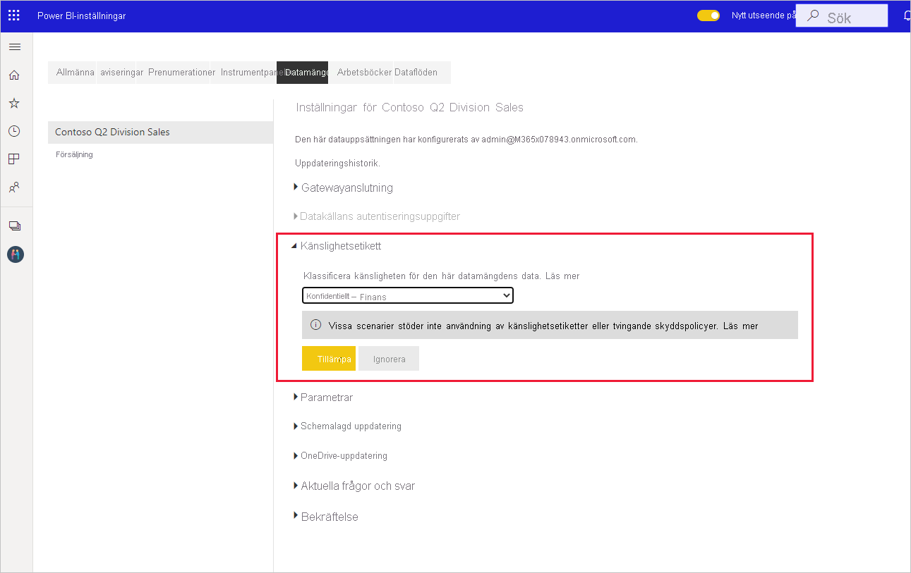

# Så här tillämpar du känslighetsetiketter i Power BI

Microsoft Information Protection-känslighetsetiketter på dina rapporter, instrumentpaneler, datamängder och dataflöden kan skydda känsligt innehåll mot obehörig dataåtkomst och dataläckage. När du märker dina data med rätt känslighetsetiketter ser du till att endast behöriga användare kan komma åt dem. Den här artikeln beskriver hur du tillämpar känslighetsetiketter på ditt innehåll.

Följande krav måste vara uppfyllda för att du ska kunna använda känslighetsetiketter i Power BI:
* Du måste ha en Power BI Pro-licens och redigeringsbehörighet för det innehåll som du vill märka.
* Du måste vara medlem i en säkerhetsgrupp som har behörighet att tillämpa känslighetsetiketter. Mer information finns i [Aktivera känslighetsetiketter i Power BI](./service-security-enable-data-sensitivity-labels.md).
* Alla [licensieringskrav och andra krav](./service-security-enable-data-sensitivity-labels.md#licensing-and-requirements) måste uppfyllas.

Mer information om känslighetsetiketter i Power BI finns i [Känslighetsetiketter i Power BI](service-security-sensitivity-label-overview.md).

## Använda känslighetsetiketter

När dataskydd har aktiverats för din klientorganisation ser du känslighetsetiketter i känslighetskolumnen i listvyn för instrumentpaneler, rapporter, datamängder och dataflöden.

**Så här tillämpar du eller ändrar en känslighetsetikett för en rapport eller instrumentpanel**
1. Klicka på **Fler alternativ (...)** .
1. Välj **inställningar**.
1. Välj lämplig känslighetsetikett i fönstret Inställningar.
1. Spara inställningarna.

Följande bild visar hur du tillämpar en känslighetsetikett på en rapport

**Så här tillämpar du eller ändrar en känslighetsetikett för en datamängd eller ett dataflöde**

1. Klicka på **Fler alternativ (...)** .
1. Välj **inställningar**.
1. Välj lämplig känslighetsetikett i fönstret Inställningar.
1. Tillämpa inställningarna.

Följande två bilder visar hur du tillämpar en känslighetsetikett på en datauppsättning.

Välj **Fler alternativ (...)** och sedan **Inställningar**.

På sidan Inställningar går du till avsnittet för känslighetsetiketter, väljer önskad etikett och klickar på **Använd**.

## Ta bort känslighetsetiketter
Om du vill ta bort en känslighetsetikett från en rapport, en instrumentpanel, en datamängd eller ett dataflöde följer du [samma procedur som används för att tillämpa etiketter](#applying-sensitivity-labels) men väljer **(Ingen)** när du uppmanas att klassificera känsligheten för data. 

## Överväganden och begränsningar

I [Känslighetsetiketter i Power BI](service-security-sensitivity-label-overview.md#limitations) finns en lista med begränsningar för känslighetsetiketter i Power BI.

## Nästa steg

I den här artikeln beskrivs hur du tillämpar känslighetsetiketter i Power BI. De här artiklarna innehåller mer information om dataskydd i Power BI. 

* [Översikt av känslighetsetiketter i Power BI](./service-security-sensitivity-label-overview.md)
* [Aktivera känslighetsetiketter i Power BI](./service-security-enable-data-sensitivity-labels.md)
* [Använda Microsoft Cloud App Security-kontroller i Power BI](./service-security-using-microsoft-cloud-app-security-controls.md)