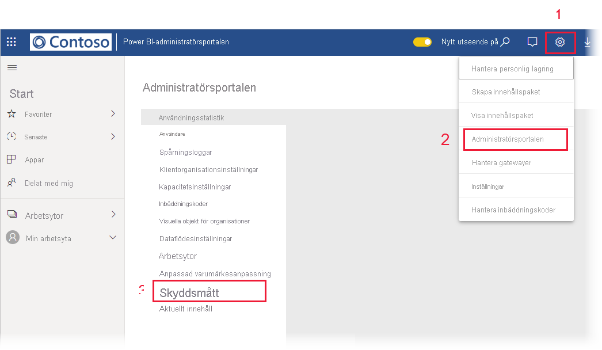

# Dataskyddsmåttrapport (förhandsversion)

## Vad är dataskyddsmåttrapporten?
Dataskyddsmåttrapporten är en dedikerad rapport som [Power BI-administratörer](../admin/service-admin-role.md) kan använda för att övervaka och spåra datas känslighetsetikettanvändning och dess implementering i klientorganisationen.

 
Rapporten innehåller:
* En 100 % stående stapeldiagram sin visar daglig känslighetsetikettanvändning i klientorganisationen under de senaste 7, 30 eller 90 dagarna. Det här diagrammet gör det enkelt att spåra den relativa användningen av olika typer av etiketter över tid.
* Ringdiagram som visar det aktuella läget för användning av känslighetsetiketter i klienten för instrumentpaneler, rapporter, datamängder och dataflöden.
* En länk till Cloud App Security-portalen där Power BI-aviseringar, användare i farozonen, aktivitetsloggar och annan information är tillgänglig. Mer information finns i [Använda Microsoft Cloud App Security-kontroller i Power BI (förhandsversion)](./service-security-using-microsoft-cloud-app-security-controls.md).

Rapporten uppdateras var 24:e timme.

## Visa är dataskyddsmåttrapporten

Du måste ha [rollen Power BI-administratör](../admin/service-admin-role.md) för att kunna öppna och visa rapporten.
Om du vill visa rapporten går du till **Inställningar > Administratörsportalen** och väljer **Säkerhetsmått (förhandsversion)** .

 
 
Första gången du öppnar dataskyddsmåttrapporten kan det ta några sekunder att läsa in den. En rapport och en datamängd som har rätt **dataskyddsmått (genereras automatiskt)** skapas i din privata miljö under ”Min arbetsyta”. Vi rekommenderar inte att du tittar här – det här är inte den fullständiga rapporten. Läs i stället rapporten i administratörsportalen enligt beskrivningen ovan.

> [!CAUTION]
> Ändra inte rapporten eller datamängden på något sätt, eftersom nya versioner av rapporten samlas in från gång till gång och eventuella ändringar som du har gjort i den ursprungliga rapporten skrivs över om du uppdaterar till den nya versionen.

## Rapportuppdateringar

Förbättrade versioner av dataskyddsmåttrapporten släpps regelbundet. När du öppnar rapporten får du en fråga om du vill öppna den nya versionen om en ny version är tillgänglig. Om du säger ”Ja” läses den nya versionen av rapporten in och den gamla versionen skrivs över. Eventuella ändringar som du har gjort i den gamla rapporten och/eller datamängden går förlorade. Du kan välja att inte öppna den nya versionen, men i så fall kommer du inte att ha nytta av den nya versionens förbättringar. 
## Kommentarer och överväganden
* För att dataskyddsmåttrapporten ska genereras ordentligt måste [informationsskydd](./service-security-enable-data-sensitivity-labels.md) must vara aktiverat på klientorganisationen och [känslighetsetiketter bör ha använts](../collaborate-share/service-security-apply-data-sensitivity-labels.md). 
* För att få åtkomst till Cloud App Security-information måste din organisation ha rätt [Cloud App Security-licens](https://docs.microsoft.com/power-bi/admin/service-security-using-microsoft-cloud-app-security-controls#microsoft-cloud-app-security-licensing).
* Om du bestämmer dig för att dela information från dataskyddsmåttrapporten med en användare som inte är Power BI-administratör bör du vara medveten om att den här rapporten innehåller känslig information om din organisation.
* Dataskyddsmåttrapporten är en särskild typ av rapport och visas inte i listorna ”Delat med mig”, ”Senaste” och ”Favoriter”.
* Dataskyddsmåttrapporten är inte tillgänglig för [externa användare (Azure Active Directory B2B-gästanvändare)](../admin/service-admin-azure-ad-b2b.md).
## Nästa steg
* [Dataskydd i Power BI (förhandsversion)](./service-security-data-protection-overview.md)
* [Använda Microsoft Cloud App Security-kontroller i Power BI (förhandsversion)](./service-security-using-microsoft-cloud-app-security-controls.md)
* [Förstå administratörsrollen för Power BI-tjänsten](../admin/service-admin-role.md)
* [Aktivera känslighetsetiketter för data i Power BI](./service-security-enable-data-sensitivity-labels.md)