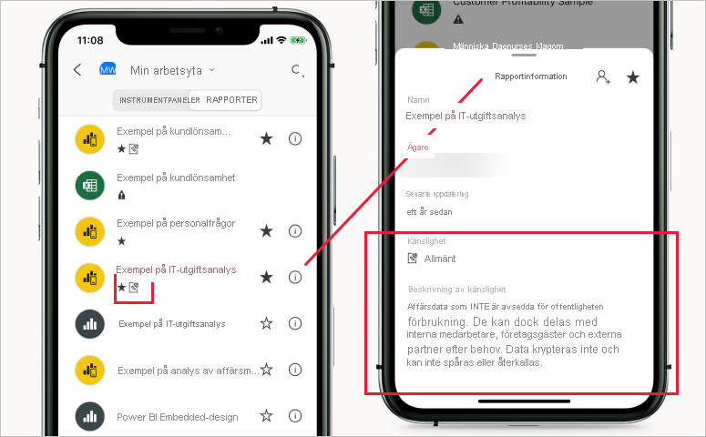

# Känslighetsetiketter i Power BI

I den här artikeln beskrivs funktionerna för [Microsoft Information Protection-känslighetsetiketter](https://docs.microsoft.com/microsoft-365/compliance/sensitivity-labels?view=o365-worldwide) i Power BI. Information om hur du tillämpar känslighetsetiketter på Power BI-rapporter, instrumentpaneler, datamängder och dataflöden finns i [Så här tillämpar du känslighetsetiketter i Power BI](./service-security-apply-data-sensitivity-labels.md). Information om hur du aktiverar känslighetsetiketter för din klientorganisation finns i [Aktivera känslighetsetiketter för data i Power BI](service-security-enable-data-sensitivity-labels.md).

Microsoft Information Protection-känslighetsetiketter ger användarna ett enkelt sätt att klassificera kritiskt innehåll i Power BI utan att hindra produktiviteten eller möjligheten att samarbeta.

Känslighetsetiketter kan tillämpas på datamängder, rapporter, instrumentpaneler och dataflöden. När data exporteras från Power BI till Excel-, PowerPoint- eller PDF-filer tillämpar Power BI automatiskt en känslighetsetikett på den exporterade filen och skyddar den enligt etikettens inställningar för filkryptering. På så sätt skyddas dina känsliga data oavsett var de finns.

Känslighetsetiketter som tillämpas på Power BI-rapporter, instrumentpaneler, datamängder och dataflöden är synliga från många platser i Power BI-tjänsten. Känslighetsetiketter på rapporter och instrumentpaneler visas även i iOS- och Android-mobilapparna för Power BI samt i inbäddade visuella objekt.

En [rapport om skyddsmått](service-security-data-protection-metrics-report.md) som är tillgänglig i Power BI-administratörsportalen ger Power BI-administratörer fullständig insyn i känsliga data i Power BI-klientorganisationen. Dessutom omfattar Power BI-spårningsloggar information för känslighetsetiketter om aktiviteter såsom tillämpning, borttagning och ändring av etiketter samt visning av rapporter, instrumentpaneler och så vidare. Detta ger Power BI- och säkerhetsadministratörer insyn i användningen av känsliga data, vilket främjar övervakning, undersökning och säkerhetsaviseringar.

## Att tänka på

Känslighetsetiketter **påverkar** inte åtkomsten till innehåll i Power BI – åtkomsten till innehåll i Power BI hanteras alltid av Power BI-behörigheter. Etiketterna är synliga, men associerade krypteringsinställningar (som konfigurerats i [Microsoft 365 Security Center](https://security.microsoft.com/) eller [Microsoft 365 Compliance Center](https://compliance.microsoft.com/)) tillämpas inte. De tillämpas endast på data som exporteras till Excel-, PowerPoint- och PDF-filer.

Känslighetsetiketter och filkryptering tillämpas **inte** på andra exportsökvägar än exporter till Excel, PowerPoint och PDF. Administratören av Power BI-klientorganisationen kan inaktivera en eller flera exportsökvägar som inte stöder användning av känslighetsetiketter och associerade filkrypteringsinställningar.

>[!NOTE]
> Användare som beviljas åtkomst till en rapport beviljas åtkomst till hela den underliggande datamängden, såvida inte [säkerhet på radnivå (RLS)](./service-admin-rls.md) begränsar deras åtkomst. Rapportförfattare kan klassificera och märka rapporter med hjälp av känslighetsetiketter. Om känslighetsetiketten har skyddsinställningar tillämpar Power BI dessa skyddsinställningar när rapportdata exporteras till Excel-, PowerPoint- eller PDF-filer. Endast behöriga användare kommer att kunna öppna skyddade filer.

## Så här fungerar känslighetsetiketter i Power BI

När du tillämpar en känslighetsetikett på en instrumentpanel, en rapport, en datamängd eller ett dataflöde i Power BI så fungerar det i princip på samma sätt som när du lägger till en tagg för resursen, med följande fördelar:
* **Anpassningsbar** – du kan skapa kategorier för olika nivåer av känsligt innehåll i organisationen, till exempel Personligt, Offentligt, Allmänt, Konfidentiellt och Mycket konfidentiellt.
* **Klartext** – eftersom etiketten är i klartext är det enkelt för användarna att förstå hur de ska hantera innehållet enligt riktlinjerna för känslighetsetiketter.
* **Beständiga** – När en känslighetsetikett har tillämpats på innehåll följer den med innehållet när det exporteras till Excel-, PowerPoint- och PDF-filer och påverkar hur principer tillämpas och verkställs.

Här är ett snabbt exempel på hur känslighetsetiketter i Power BI fungerar. Bilden nedan visar hur en känslighetsetikett tillämpas på en rapport i Power BI-tjänsten. Därefter visas hur data från rapporten exporteras till en Excel-fil och slutligen hur känslighetsetiketten och dess skydd bevaras i den exporterade filen.

I Microsoft Office-program ser du känslighetsetiketten som en tagg i e-postmeddelandet eller dokumentet, ungefär som i bilden ovan.

Du kan också associera en klassificering med innehållet (som en etikett), som finns kvar och följer med innehållet när det används och delas i hela Power BI. Du kan använda den här klassificeringen till att generera användningsrapporter och se aktivitetsdata för ditt känsliga innehåll. Med hjälp av den här informationen kan du avgöra om det behövs skyddsinställningar senare.

## Arv av känslighetsetiketter när nytt innehåll skapas

När nya rapporter och instrumentpaneler skapas i Power BI-tjänsten ärver de automatiskt den känslighetsetikett som tidigare tillämpades på den överordnade datamängden eller rapporten. Till exempel får en ny rapport som skapas ovanpå en datamängd känslighetsetiketten ”Mycket konfidentiell” automatiskt etiketten ”Mycket konfidentiell” också.

Följande bild visar hur känslighetsetiketten för en datamängd tillämpas automatiskt på en ny rapport som byggs ovanpå datamängden.

>[!NOTE]
>Om känslighetsetiketten av någon anledning inte kan tillämpas på den nya rapporten eller instrumentpanelen kommer Power BI **inte** att blockera skapandet av det nya objektet.

## Känslighetsetiketter och skydd för exporterade data

När data exporteras från Power BI till Excel-, PowerPoint- eller PDF-filer tillämpar Power BI automatiskt en känslighetsetikett på den exporterade filen och skyddar den enligt etikettens inställningar för filkryptering. På så sätt skyddas dina känsliga data oavsett var de finns.

Användare som exporterar en fil från Power BI har behörighet att komma åt och redigera filen enligt inställningarna för känslighetsetiketten. De får inte ägarbehörigheter till filen.

Känslighetsetiketter och skydd tillämpas inte när data exporteras till .csv- eller .pbix-filer, Analysera i Excel eller andra exportsökvägar.

När en känslighetsetikett och skydd tillämpas på en exporterad fil läggs ingen innehållsmarkering till för filen. Om etiketten dock konfigureras att tillämpa innehållsmärkningar tillämpas markeringarna automatiskt av Azure Information Protection-klienten för enhetliga etiketter när filen öppnas i Office-skrivbordsappar. Innehållsmärkningarna tillämpas inte automatiskt när du använder inbyggd märkning för skrivbords-, mobil- eller webbappar. Mer information finns i avsnittet om [innehållsmärkning och kryptering med Office-appar](https://docs.microsoft.com/microsoft-365/compliance/sensitivity-labels-office-apps?view=o365-worldwide#when-office-apps-apply-content-marking-and-encryption).

Exporten misslyckas om det inte går att tillämpa en etikett när data exporteras till en fil. Du kan kontrollera om exporten misslyckades på grund av att det inte gick att tillämpa etiketten. Klicka bara på rapportens eller instrumentpanelens namn i mitten av namnlisten och se om ”Det går inte att läsa in känslighetsetiketten” visas i listrutan som öppnas. Detta kan inträffa på grund av ett tillfälligt systemproblem eller om den tillämpade etiketten har avpublicerats eller tagits bort av säkerhetsadministratören.

## Bevarande av känslighetsetiketter i inbäddade rapporter och instrumentpaneler

Du kan bädda in Power BI-rapporter, instrumentpaneler och visuella objekt i företagsprogram, till exempel Microsoft Teams och SharePoint, eller på en organisations webbplats. När du bäddar in ett visuellt objekt, en rapport eller en instrumentpanel som har en tillämpad känslighetsetikett blir känslighetsetiketten synlig i den inbäddade vyn, och etiketten och dess skydd bevaras när data exporteras till Excel.

Följande inbäddningsscenarier stöds:
* [Bädda in för din organisation](../developer/embedded/embed-sample-for-your-organization.md)
* Microsoft 365-appar (till exempel [Teams](../collaborate-share/service-collaborate-microsoft-teams.md) och [SharePoint](../collaborate-share/service-embed-report-spo.md))
* [Säker URL-inbäddning](../collaborate-share/service-embed-secure.md) (inbäddning från Power BI-tjänsten) 

## Känslighetsetiketter i Power BI-mobilapparna

Känslighetsetiketter kan visas på rapporter och instrumentpaneler i Power BI-mobilappar. En ikon nära rapportens eller instrumentpanelens namn anger att den har en känslighetsetikett, och typen av etikett samt dess beskrivning finns i rapportens eller instrumentpanelens informationsruta.

## Moln som stöds
Känslighetsetiketter stöds endast för klientorganisationer i globala (offentliga) moln, inte för klientorganisationer i exempelvis nationella moln.

## Krav för att använda känslighetsetiketter i Power BI

Innan du kan aktivera och använda känslighetsetiketter i Power BI måste följande förutsättningar vara uppfyllda:
* Känslighetsetiketterna måste vara definierade antingen i [säkerhetscentret för Microsoft 365](https://security.microsoft.com/) eller i [efterlevnadscentret för Microsoft 365](https://compliance.microsoft.com/).
* [Aktivera känslighetsetiketter](service-security-enable-data-sensitivity-labels.md) i Power BI.
* Se till att användarna har [rätt licenser](#licensing).

## Licensiering

* För att använda och visa känslighetsetiketter från Microsoft Information Protection i Power BI behöver du en Premium P1- eller Premium P2-licens för Azure Information Protection. Du kan antingen köpa Microsoft Azure Information Protection separat eller via något av Microsofts licenspaket. Läs mer i [Prissättning för Azure Information Protection](https://azure.microsoft.com/pricing/details/information-protection/).
* Det finns [licenskrav](https://docs.microsoft.com/microsoft-365/compliance/get-started-with-sensitivity-labels#subscription-and-licensing-requirements-for-sensitivity-labels) för att visa och använda etiketter i Office-appar.
* För att tillämpa etiketter på Power BI-innehåll måste användarna dessutom ha en Power BI Pro-licens utöver en av Azure Information Protection-licenserna som anges ovan.

## Skapande och hantering av känslighetsetiketter

Känslighetsetiketter skapas och hanteras antingen i [säkerhetscentret för Microsoft 365](https://security.microsoft.com/) eller i [efterlevnadscentret för Microsoft 365](https://compliance.microsoft.com/).

Om du vill hantera känslighetsetiketter på någon av de här platserna går du till **Klassificering > Känslighetsetiketter**. De här känslighetsetiketterna kan användas i flera Microsoft-tjänster som Azure Information Protection, Office-appar och Office 365-tjänster.

>[!Important]
> Om din organisation använder känslighetsetiketter i Azure Information Protection måste du [migrera](https://docs.microsoft.com/azure/information-protection/configure-policy-migrate-labels) dem till någon av de tidigare angivna tjänsterna för att etiketterna ska kunna användas i Power BI.

## Begränsningar

I den här listan anges några begränsningar för känslighetsetiketter i Power BI:

* Känslighetsetiketter kan bara tillämpas på instrumentpaneler, rapporter, datamängder och dataflöden. För närvarande är de inte tillgängliga för [sidnumrerade rapporter](../paginated-reports/report-builder-power-bi.md) och arbetsböcker.
* Känslighetsetiketter på Power BI-resurser visas i vyerna Arbetsytelista, Ursprung, Favoriter, Senaste och Appar. För närvarande visas inte etiketter i vyn ”Delat med mig”. Men även om du inte ser en etikett som tillämpats på en Power BI-tillgång så gäller den även efter export till Excel-, PowerPoint- eller PDF-format.
* Datakänslighetsetiketter stöds inte för mallappar. Känslighetsetiketter som anges av mallappens skapare tas bort när appen extraheras och installeras, och känslighetsetiketter som lagts till i artefakter i en installerad mallapp av appkonsumenten går förlorade (återställs till ingenting) när appen uppdateras.
* Power BI stöder inte känslighetsetiketter av skyddstyperna [Vidarebefordra inte](https://docs.microsoft.com/microsoft-365/compliance/encryption-sensitivity-labels?view=o365-worldwide#let-users-assign-permissions), [Användardefinierat](https://docs.microsoft.com/microsoft-365/compliance/encryption-sensitivity-labels?view=o365-worldwide#let-users-assign-permissions) och [HYOK](https://docs.microsoft.com/azure/information-protection/configure-adrms-restrictions). Skyddstyperna Vidarebefordra inte och Användardefinierat är etiketter som definieras i [Microsoft 365 Säkerhetscenter](https://security.microsoft.com/) eller [Microsoft 365 Efterlevnadscenter](https://compliance.microsoft.com/).
* Det är inte rekommenderat att tillåta användare att tillämpa överordnade etiketter i Power BI. Om en överordnad etikett tillämpas på innehåll kommer en export av data från det innehållet till en fil (Excel, PowerPoint och PDF) att misslyckas. Mer information finns i avsnittet om [underetiketter (etikettgruppering)](https://docs.microsoft.com/microsoft-365/compliance/sensitivity-labels?view=o365-worldwide#sublabels-grouping-labels).

## Nästa steg

I den här artikeln ges en översikt över dataskyddet i Power BI. De här artiklarna innehåller mer information om dataskydd i Power BI. 

* [Aktivera känslighetsetiketter i Power BI](service-security-enable-data-sensitivity-labels.md)
* [Så här tillämpar du känslighetsetiketter i Power BI](service-security-apply-data-sensitivity-labels.md)
* [Använda Microsoft Cloud App Security-kontroller i Power BI](service-security-using-microsoft-cloud-app-security-controls.md)
* [Rapport om skyddsmått](service-security-data-protection-metrics-report.md)