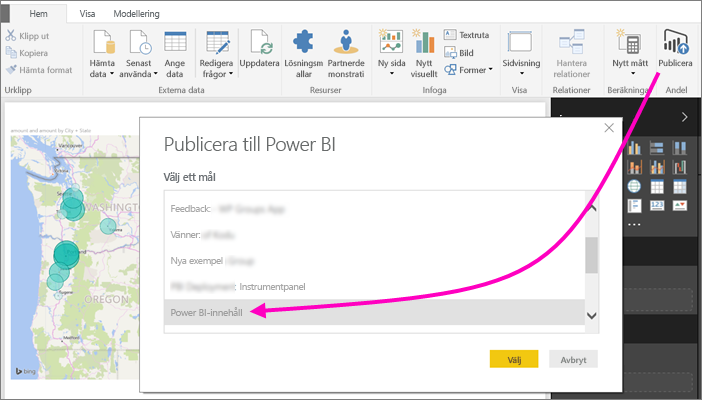
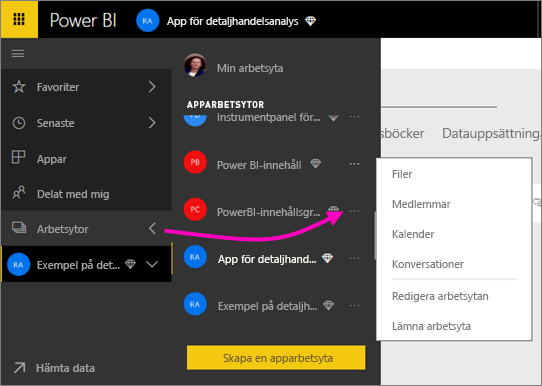
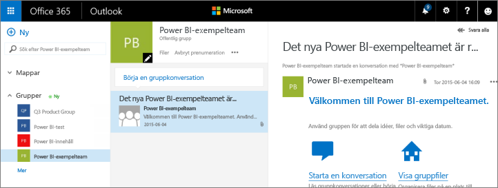

# Samarbeta på en klassisk arbetsyta
Power BI-arbetsytor är bra platser för samarbete med dina kollegor. Där kan ni skapa *appar* genom att arbeta med instrumentpaneler, rapporter och datauppsättningar. Den här artikeln gäller de ursprungliga, *klassiska* arbetsytorna.  

Samarbetet tar inte slut med arbetsytor i Power BI. När du skapar en av de klassiska arbetsytorna i Power BI skapar du automatiskt en Microsoft 365-grupp i bakgrunden. Microsoft 365 erbjuder andra grupptjänster, som att dela filer på OneDrive för företag, föra konversationer i Exchange, använda delade kalendrar och uppgifter osv. Läs mer om [grupper i Microsoft 365](https://support.office.com/article/Create-a-group-in-Office-365-7124dc4c-1de9-40d4-b096-e8add19209e9).

> [!NOTE]
> I de nya arbetsytorna har förhållandet ändrats mellan Power BI-arbetsytor och Microsoft 365-grupper. När du skapar en av de nya arbetsytorna i Power BI skapar du inte längre automatiskt en Microsoft 365-grupp i bakgrunden. Mer information finns i [Skapa de nya arbetsytorna i Power BI](service-create-the-new-workspaces.md).

Du behöver en [Power BI Pro-licens](../fundamentals/service-features-license-type.md) för att skapa en arbetsyta.

## Samarbeta kring Power BI Desktop-filer på en arbetsyta
När du har skapat en Power BI Desktop-fil kan du publicera den på en arbetsyta så att alla på den arbetsytan kan samarbeta i filen.

1. Välj **Publicera** på menyfliksområdet **Start** i Power BI Desktop, välj sedan arbetsytan i rutan **Välj ett mål**.
   
    
2. Välj först pilen bredvid **Arbetsytor** i Power BI-tjänsten > välj arbetsytan.
   
    
3. Välj fliken **Rapporter** och sedan din rapport.
   
    
   
    Här ser det ut som vi vilken annan rapport som helst i Power BI. Du och andra användare på arbetsytan kan ändra rapporten och spara paneler på valfri instrumentpanel.

## Samarbeta i Microsoft 365
Samarbete i Microsoft 365 börjar med den klassiska arbetsytan i Power BI.

1. Välj pilen bredvid **Arbetsytor** i Power BI-tjänsten och välj **Fler alternativ** (…) bredvid namnet på din arbetsyta. 
   
   
2. Från den här menyn kan samarbeta med din grupp på flera sätt: 
   
   * Ha en [gruppkonversation i Microsoft 365](#have-a-group-conversation-in-microsoft-365).
   * [Schemalägg en händelse](#schedule-an-event-on-the-group-workspace-calendar) i kalendern för grupparbetsytan.
   
   Första gången du går till grupparbetsytan i Microsoft 365 kan det ta en liten stund. Vänta mellan 15 och 30 minuter och uppdatera sedan webbläsaren.

## Ha en gruppkonversation i Microsoft 365
1. Välj **Fler alternativ** (...) bredvid arbetsytans namn \> **Konversationer**. 
   
    
   
   E-post- och konversationsplatsen för din grupparbetsyta öppnas i Outlook för Microsoft 365.
   
   
2. Läs mer om [gruppkonversationer i Outlook för Microsoft 365](https://support.office.com/Article/Have-a-group-conversation-a0482e24-a769-4e39-a5ba-a7c56e828b22).

## Schemalägg en händelse i kalendern för grupparbetsytan
1. Välj **Fler alternativ** (...) bredvid arbetsytans namn \> **Kalender**. 
   
   
   
   Kalendern för grupparbetsytan öppnas i Outlook för Microsoft 365.
   
   
2. Läs mer om [gruppkalendrar i Outlook i Microsoft 365](https://support.office.com/Article/Add-edit-and-subscribe-to-group-events-0cf1ad68-1034-4306-b367-d75e9818376a).

## Hantera en klassisk arbetsyta
Om du är ägare eller administratör för en arbetsyta kan du även lägga till eller ta bort medlemmar på arbetsytan. Läs mer om att [hantera en Power BI-arbetsyta](service-manage-app-workspace-in-power-bi-and-office-365.md).

## Nästa steg
* [Publicera appar i Power BI](service-create-distribute-apps.md).
* Har du fler frågor? [Testa Power BI Community](https://community.powerbi.com/).
* Feedback? Besök [Power BI-idéer](https://ideas.powerbi.com/forums/265200-power-bi).
