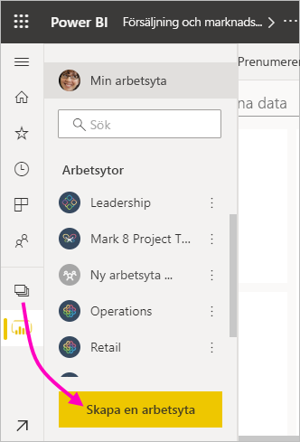
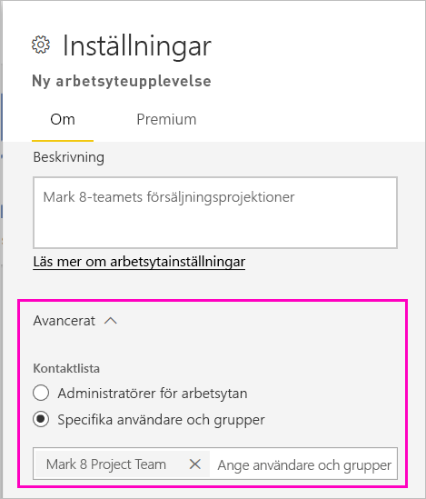
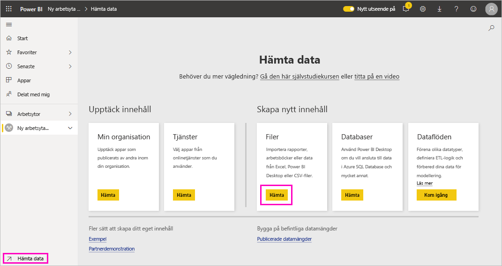
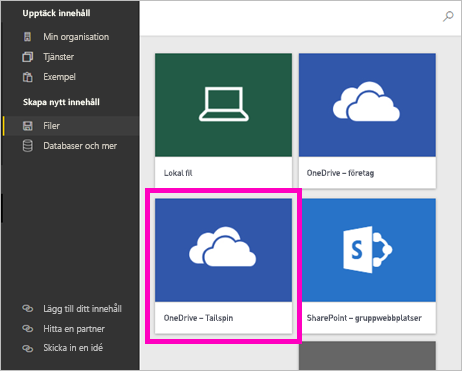
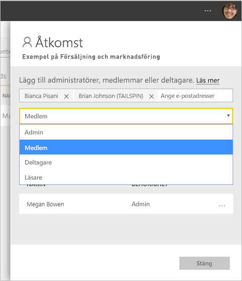

# Skapa de nya arbetsytorna i Power BI

Den här artikeln beskriver hur du skapar en *ny arbetsyta* istället för en *klassisk arbetsyta*. Båda typer av arbetsytor är platser för samarbete kollegor emellan. Här skapar du samlingar av instrumentpaneler, rapporter och sidnumrerade rapporter. Om du vill kan du även paketera samlingen i en *app* och distribuera den till en bredare publik.

Så här skiljer sig de nya arbetsytorna från den gamla. Med de nya arbetsytorna kan du:

- Tilldela arbetsytans roller till användargrupper och individer.
- Skapa en arbetsyta i Power BI utan att skapa en Microsoft 365-grupp.
- Använda mer detaljerade arbetsyteroller för mer flexibel hantering av behörigheter.

:::image type="content" source="media/service-create-the-new-workspaces/power-bi-workspace-sales-marketing.png" alt-text="Exempelarbetsytan Försäljning och marknadsföring":::

Mer bakgrundsinformation finns i artikeln om [nya arbetsytor](service-new-workspaces.md).

Är du redo för att migrera den klassiska arbetsytan? Mer information finns i [Uppgradera klassiska arbetsytor till de nya arbetsytorna i Power BI](service-upgrade-workspaces.md).

> [!NOTE]
> Om du vill inför säkerhet på radnivå (RLS) för Power BI Pro-användare som bläddrar i innehållet i en arbetsyta, kan du tilldela användarna läsarrollen.

## Skapa en av de nya arbetsytorna

1. Börja med att skapa arbetsytan. Välj **Arbetsytor** > **Skapa arbetsyta**.
   
     

2. Du skapar en uppgraderad arbetsyta automatiskt om du inte väljer att **återgå till klassiskt**.
   
     
     
     Om du väljer **Återgå till klassiskt** skapar du en [ klassisk arbetsyta](service-create-workspaces.md) som baseras på en Microsoft 365-grupp.

2. Ge arbetsytan ett unikt namn. Om namnet inte är tillgängligt kan du redigera det för att få fram ett unikt namn.
   
     Appen som du skapar från arbetsytan kommer att ha samma namn och ikon som arbetsytan.
   
1. Här följer några valfria objekt som du kan ställa in för din arbetsyta:

    Överför en **arbetsytebild**. Filerna kan vara i .png- eller .jpg-format. Filstorleken måste vara mindre än 45 KB.
    
    [Lägg till en **Kontaktlista**](#create-a-contact-list). Som standard är arbetsytans administratörer kontakter. 
    
    [Ange en **OneDrive för arbetsyta**](#set-a-workspace-onedrive) om du vill använda en Microsoft 365-grupplagringsplats för filer. 

    Om du vill tilldela arbetsytan till en **Dedikerad kapacitet** går du till fliken **Premium** och väljer **Dedikerad kapacitet**.
     
    

1. Välj **Spara**.

    Power BI skapar arbetsytan och öppnar den. Den visas i listan med arbetsytor som du är medlem i. 

## Skapa en kontaktlista

Du kan ange vilka användare som ska informeras om problem som uppstår i arbetsytan. Som standard informeras alla användare och grupper som angetts som arbetsyteadministratör men du kan lägga till andra personer i *kontaktlistan*. Användare eller grupper som finns med i kontaktlistan visas i användargränssnittet för att hjälpa användarna att få hjälp med arbetsytan.

1. Få åtkomst till den nya inställningen **Kontaktlista** på ett av två sätt:

    I fönstret **Skapa en arbetsyta** första gången du skapar den.

    Välj pilen bredvid **Arbetsytor** i  navigeringsfönstret, välj **Fler alternativ** (…) intill namnet på arbetsytan > **Inställningar för arbetsyta**. Fönstret **Inställningar** öppnas.

    

2. Godkänn **standardadministratörer för arbetsytan** eller lägg till en egen lista över **specifika användare eller grupper** i **Avancerat** > **Kontaktlista**. 

    

3. Välj **Spara**.

## Konfigurera arbetsytans OneDrive

Med arbetsytans OneDrive-funktion kan du konfigurera en Microsoft 365-grupp vars fillagring för SharePoint-dokumentbiblioteket är tillgänglig för arbetsyteanvändarna. Du skapar gruppen först utanför Power BI. 

Power BI synkroniserar inte behörigheter för användare eller grupper, som är konfigurerade med arbetsyteåtkomst, med Microsoft 365-gruppmedlemskapet. Det bästa sättet är att ge den Microsoft 365-grupp vars fillagring du konfigurerar i den här inställningen för Microsoft 365-gruppen [åtkomst till arbetsytan](#give-access-to-your-workspace). Hantera sedan åtkomst till arbetsytan genom att hantera medlemskap i Microsoft 365-gruppen. 

1. Öppna den nya **OneDrive**-inställningen för arbetsytan på något av följande två sätt:

    I fönstret **Skapa en arbetsyta** första gången du skapar den.

    Välj pilen bredvid **Arbetsytor** i  navigeringsfönstret, välj **Fler alternativ** (…) intill namnet på arbetsytan > **Inställningar för arbetsyta**. Fönstret **Inställningar** öppnas.

    

2. Under **Avancerat** > **OneDrive för arbetsytan** anger du namnet på den Microsoft 365-grupp som du skapade tidigare. Skriv bara namnet, inte webbadressen. Power BI hämtar automatiskt OneDrive för gruppen.

    

3. Välj **Spara**.

### Åtkomst till arbetsytans OneDrive-plats

När du har konfigurerat OneDrive-platsen kommer du till den på samma sätt som du kommer till andra datakällor i Power BI-tjänsten.

1. Välj **Hämta data** i navigeringsfönstret och välj sedan **Hämta** i rutan **Filer**.

    

1.  Posten **OneDrive – företag** är din egen OneDrive för företag. Det andra OneDrive är den som du lade till.

    

### Ansluta till appar i nya arbetsytor

Den nya arbetsytan skapar och använder *appar* i stället för innehållspaket. Appar är samlingar av instrumentpaneler, rapporter och datauppsättningar som ansluter till tjänster från tredje part och organisationsdata. Appar gör det enkelt att hämta data från tjänster, till exempel Microsoft Dynamics CRM, Salesforce och Google Analytics.

Med de nya arbetsytorna kan du inte skapa eller använda innehållspaket för organisationen. Be dina interna team att tillhandahålla appar för alla innehållspaket som du använder just nu. 

## Ge åtkomst till din arbetsyta

Alla som har en administratörsroll i en arbetsyta kan ge åtkomst till arbetsytan till andra.

1. Eftersom du är administratör ser du **Åtkomst**, på arbetsytans innehållslista.

    

1. Lägg till säkerhetsgrupper, distributionslistor, Microsoft 365-grupper eller enskilda användare i dessa arbetsytor som administratörer, medlemmar, deltagare eller tittare. En förklaring av de olika rollerna finns i [Roller i de nya arbetsytorna](service-new-workspaces.md#roles-in-the-new-workspaces).

    

9. Välj **Lägg till** > **Stäng**.

## Distribuera en app

Om du vill distribuera officiellt innehåll till en stor målgrupp i din organisation kan du publicera en *app* från din arbetsyta.  När innehållet är färdigt kan du välja vilka instrumentpaneler och rapporter som du vill publicera och sedan publicera det som en app. Du kan skapa en app från varje arbetsyta.

Läs om att [publicera en app från de nya arbetsytorna](service-create-distribute-apps.md).

## Säkerhetsinställningar

Med inställningen **Tillåt deltagare att uppdatera appen för den här arbetsytan** kan administratörer för arbetsytan delegera möjligheten att uppdatera appen för arbetsytan till användare med Deltagare-rollen. Som standard kan endast arbetsytans administratörer och medlemmar publicera och uppdatera appen för arbetsytan. 

När det är aktiverat kan Deltagare:
* Uppdatera app-metadata som namn, ikon, beskrivning, supportwebbplats och färg
* Lägg till eller ta bort objekt som ingår i appen, t.ex. lägga till rapporter eller datauppsättningar
* Ändra appens navigering eller standardobjekt som appen öppnas på

Deltagare kan dock inte:
* Publicera appen för första gången
* Ändra vem som har behörighet till appen

## Nästa steg
* Läs om att [organisera arbete i de nya arbetsytorna i Power BI](service-new-workspaces.md)
* [Skapa klassiska arbetsytor](service-create-workspaces.md)
* [Publicera en app från de nya arbetsytorna i Power BI](service-create-distribute-apps.md)
* Har du några frågor? [Fråga Power BI Community](https://community.powerbi.com/)
