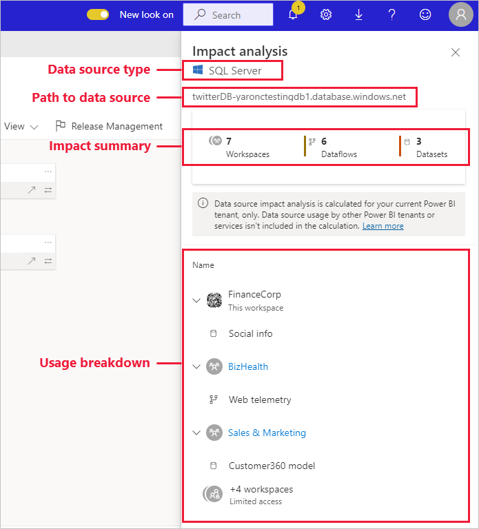

# Påverkansanalys för datakälla

Med påverkansanalys för datakälla kan du se var datakällan används i organisationen. Det kan vara användbart när datakällan tillfälligt eller permanent tas offline, och du vill få en uppfattning om vem som påverkas. Det visar hur många arbetsytor, dataflöden och datamängder som använder datakällan och ger enkel navigering till arbetsytorna där de berörda dataflödena och datamängderna finns så att du kan undersöka ytterligare.

Påverkansanalys för datakälla kan också hjälpa dig att upptäcka dataduplicering i klientorganisationen, som när ett antal olika användare skapar liknande modeller på samma datakälla. Genom att hjälpa dig att identifiera sådana redundanta datamängder och dataflöden stöder påverkansanalys för datakälla målet att ha ”en enda sanningskälla”.

## Utföra påverkansanalys för datakälla

Så här utför du påverkansanalys för datakälla:

1. Gå till den arbetsyta som innehåller den datakälla du är intresserad av och öppna [vyn för dataursprung](service-data-lineage.md).
1. Leta reda på datakällans kort och klicka på påverkansanalysikonen.

    
 
Sidopanelen för påverkansanalys öppnas.

 
* **Typ av datakälla**: Anger typ av datakälla
* **Sökväg till datakälla**: Sökväg till datakällan enligt definitionen i Power BI Desktop. Till exempel är sökvägen i bilden ovan till SQL Server-databasens datakälla anslutningssträngen ”twitterDB-yaronctestingdb1.database.windows.net”, enligt definitionen i Power BI Desktop (visas nedan). Den består av databasnamnet ”twitterDB” och servernamnet ”yaronctestingdb1.database.windows.net”.

    
 
* **Sammanfattning av påverkan**: Visar antalet potentiellt påverkade arbetsytor, dataflöden och datamängder. Det här antalet omfattar arbetsytor du inte har åtkomst till.
* **Användning på detaljnivå**: Visar dig namnen på påverkade dataflöden och datamängder, för varje arbetsyta. Om du vill utforska vidare påverkan på en viss arbetsyta klickar du på arbetsytenamnet för att öppna arbetsytan. I den berörda arbetsytan använder du [påverkansanalys för datamängd](service-dataset-impact-analysis.md) för att se användningsinformationen om anslutna rapporter och instrumentpaneler.

## Sekretess

I sidofönstret för påverkansanalysen ser du bara namnen på de arbetsytor, datamängder och dataflöden du har åtkomst till. Objekt du inte har åtkomst till visas som Begränsad åtkomst. Det här beror på att vissa objektnamn kan innehålla personlig information.
Sammanfattningen av påverkan innehåller alla påverkade dataflöden och datamängder, även dem som finns i arbetsytor du inte har åtkomst till.

## Begränsningar

Påverkansanalys för datakälla stöds inte än för sidnumrerade rapporter, så du kan inte se om datakällan har någon direkt påverkan på dessa typer av rapporter i klientorganisationen.

## Nästa steg

* [Påverkansanalys för en datamängd](service-dataset-impact-analysis.md)
* [Dataursprung](service-data-lineage.md)