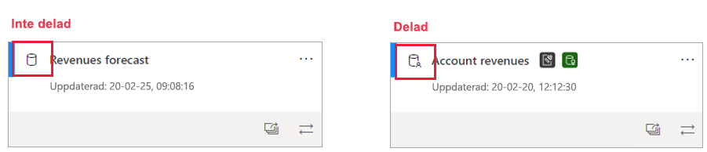
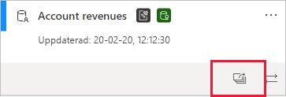
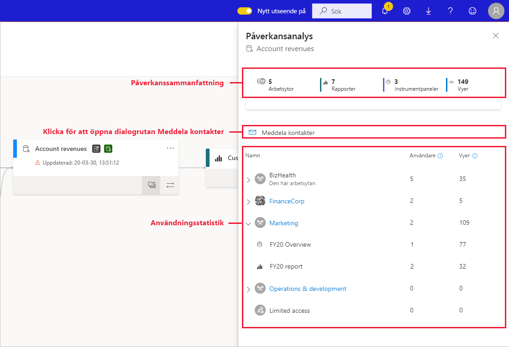
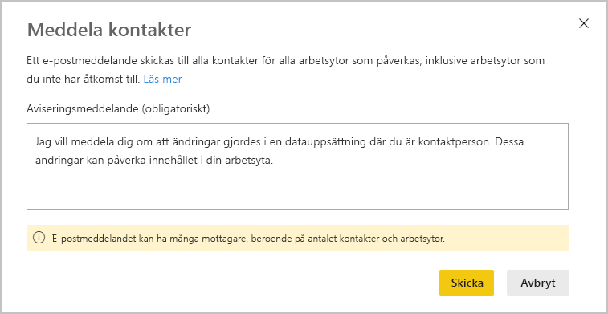
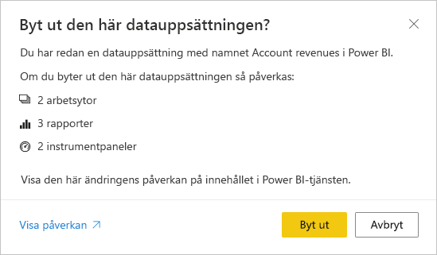

# Effektanalys för datamängd

När du gör ändringar i en datamängd eller överväger att göra det är det viktigt att du kan bedöma effekten som dessa ändringar kommer att ha på rapporter och instrumentpaneler som är beroende av datamängden. **Påverkansanalys för en datamängd** ger dig information som kan hjälpa dig med den här bedömningen.
* Det visar hur många arbetsytor, rapporter och instrumentpaneler som kan påverkas av din ändring och ger enkel navigering till arbetsytorna där de berörda rapporterna och instrumentpanelerna är placerade så att du kan undersöka ytterligare.
* Det visar antalet unika besökare och visningar för de potentiellt påverkade objekten. Det här hjälper dig att avgöra hur det underordnade objektet påverkas som helhet av ändringen. Till exempel är det förmodligen viktigare att undersöka effekterna av en ändring för en rapport som har 20 000 unika användare än att undersöka effekterna av ändringen för en rapport som har tre användare.
* Du får ett enkelt sätt att meddela de aktuella personerna om en ändring du har gjort eller överväger att göra.

Du kan enkelt starta en påverkansanalys för en datamängd från [vyn Dataursprung](service-data-lineage.md).

## Identifiera delade datamängder

Du kan göra en påverkansanalys för en datamängd för både delade och icke-delade datamängder. Det är dock särskilt användbart för datamängder som delas mellan olika arbetsytor, där det är mycket mer komplicerat att få en tydlig bild av underordnade beroenden än för icke-delade datamängder där alla beroenden finns inom samma arbetsyta som själva datamängden.

I ursprungsvyn kan du se skillnaden mellan delade och icke-delade datamängder via ikonen som visas uppe till vänster på kortet för datamängden.

## Utföra påverkansanalys för en datamängd

Du kan utföra påverkansanalys för alla datamängder i en arbetsyta, oavsett om de är delade eller inte. Du kan inte utföra påverkansanalys på externa datamängder som visas i ursprungsvyn, men som i själva verket finns i en annan arbetsyta. Om du vill utföra påverkansanalys på en extern datamängd måste du navigera till källarbetsytan.

Om du vill utföra en påverkansanalys klickar du på påverkansanalysknappen på kortet för datamängden.

Sidopanelen för påverkansanalys öppnas.

* I **sammanfattningen** ser du antalet potentiellt påverkade arbetsytor, rapporter och instrumentpaneler samt det totala antalet visningar för alla underordnade rapporter och instrumentpaneler som är knutna till datamängden.
* Länken **Meddela kontakter** öppnar en dialogruta där du kan skapa och skicka ett meddelande om eventuella datamängdsändringar du gör till kontaktlistorna för de berörda arbetsytorna. 
* I **användningsanalysen** ser du för varje arbetsyta det totala antalet visningar för de potentiellt påverkade rapporterna och instrumentpanelerna på arbetsytan, samt för varje rapport och instrumentpanel det totala antalet användare och visningar, där
   * Användare: Antalet unika användare som visat en rapport eller instrumentpanel.
   * Visningar: Antalet visningar för en rapport eller instrumentpanel

Användningsstatistiken gäller de senaste 30 dagarna exklusive den aktuella dagen. I antalet ingår användning via relaterade appar. De här måtten hjälper dig att förstå hur datamängden används inom klientorganisationen och att bedöma effekten av eventuella ändringar i datamängden.

## Meddela kontakter

Om du har gjort en ändring i en datamängd eller överväger att göra det kan du kontakta de berörda användarna och berätta om den. När du meddelar kontakter skickas ett e-postmeddelande till [kontaktlistorna](../collaborate-share/service-create-the-new-workspaces.md#create-a-contact-list) för de arbetsytor som påverkas. Ditt namn visas i e-postmeddelandet så att kontakterna kan hitta dig och svara i en ny e-posttråd. 

1. Klicka på **Meddela kontakter** i sidofönstret för påverkansanalysen. Du ser dialogrutan Meddela kontakter.

   

1. Skriv lite information om ändringen i textfältet.
1. När meddelandet är klart klickar du på **skicka**.

> [!NOTE]
> Meddela kontakter är inte tillgängligt om datamängden du utför påverkansanalys på finns på en klassisk arbetsyta.

## Sekretess

För att kunna utföra påverkansanalys för en datamängd måste du ha skrivbehörighet för den. I sidofönstret för påverkansanalysen ser du bara namnen på de arbetsytor, rapporter och instrumentpaneler du har behörighet för. Objekt du inte har åtkomst till visas som **Begränsad åtkomst**. Det här beror på att vissa objektnamn kan innehålla personlig information.

Även om du inte har åtkomst till vissa arbetsytor ser du fortfarande en sammanfattning av användningsstatistik för dem, och dina meddelanden till kontakter skickas även till kontaktlistorna för dessa arbetsytor.

## Påverkansanalys från Power BI Desktop

När du gör en ändring i en datamängd i Power BI Desktop och sedan publicerar om den i Power BI-tjänsten visas ett meddelande om hur många arbetsytor, rapporter och instrumentpaneler som kan påverkas av ändringen, och du uppmanas att bekräfta att du vill ersätta den aktuella publicerade datamängden med den du har ändrat. I meddelandet finns också en länk till en fullständig påverkansanalys för datamängden i Power BI-tjänsten, där du kan se mer information och vidta åtgärder för att minimera riskerna med ändringen.

> [!NOTE]
> Informationen i det här meddelandet indikerar bara potentiell effekt – det innebär inte nödvändigtvis att någonting har slutat fungera. Ofta har inte datamängdsändringar någon negativ effekt på underordnade rapporter och instrumentpaneler – du får ändå det här meddelandet som ger insyn i potentiell påverkan.
>
>I meddelandet visas bara antalet arbetsytor om fler än en arbetsyta innehåller rapporter och instrumentpaneler som påverkas.

## Begränsningar

* Användningsstatistik stöds för närvarande inte för klassiska och personliga arbetsytor.

## Nästa steg

* [Introduktion till datamängder mellan arbetsytor (förhandsversion)](../connect-data/service-datasets-across-workspaces.md)
* [Dataursprung](service-data-lineage.md)

