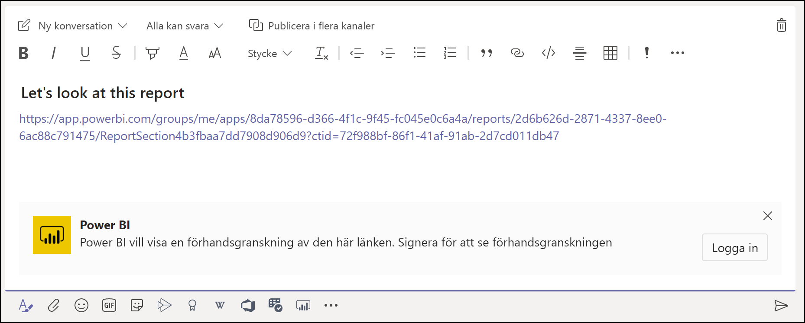
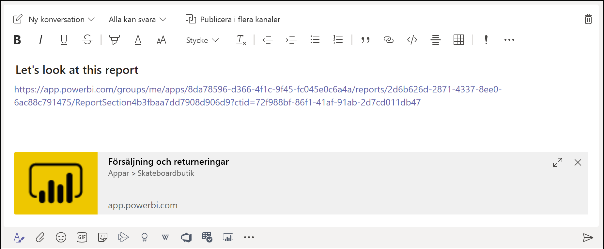

# Bädda in rapporter i Microsoft Teams med fliken Power BI

På den uppdaterade fliken Power BI för Microsoft Teams kan du enkelt bädda in interaktiva rapporter i kanaler och chattar i Microsoft Teams. Använd fliken Power BI för Microsoft Teams till att hjälpa dina kollegor att hitta de data som teamet använder och till att diskutera data i dina Teams-kanaler.  När du klistrar in en länk till dina rapporter, instrumentpaneler och appar i rutan för Microsoft Teams-meddelande, visar länkförhandsvisningen information om dem. Användarna kan lättare förstå vilket objekt som länken tar dem till.

## Krav

För att **fliken Power BI för Microsoft Teams** ska fungera ska du se till att:

- Dina användare har en Power BI Pro-licens, eller att rapporten ligger i en [Power BI Premium-kapacitet (SKU:n EM eller P)](../admin/service-premium-what-is.md) med en Power BI-licens.
- Microsoft Teams har fliken Power BI.
- Användaren har loggat in i Power BI-tjänsten och aktiverat sin Power BI-licens för att kunna använda rapporten.
- Användarna måste ha behörighet att visa rapporten.

För att **länkförhandsvisningar** ska fungera ska du också kontrollera att:
- Användarna uppfyller kraven för att använda fliken Power BI för Microsoft Teams.
- Användarna har loggat in till Power BI Bot-tjänsten. 

## Bädda in rapporten

Följ de här stegen om du vill bädda in rapporten i en kanal eller chatt i Microsoft Teams.

1. Öppna en kanal eller chatt i Microsoft Teams och välj ikonen **+** .

    

2. Välj fliken Power BI.

    

3. Använd alternativen som finns för att välja en rapport från en arbetsyta, en rapport som delats med dig eller från en Power BI-app.

    

4. Namnet på fliken uppdateras automatiskt så att det matchar rapportnamnet, men du kan ändra det. 

5. Tryck på **Spara**.

## Rapporter som stöds för inbäddning på fliken Power BI
Du kan bädda in följande typer av rapporter på fliken Power BI:

- Interaktiva och sidnumrerade rapporter.
- Rapporter från Min arbetsyta, den nya arbetsytemiljön och från klassiska arbetsytor.
- Rapporter i Power BI-appar.

## Hämta en länkförhandsvisning

Följ de här stegen för att hämta en länkförhandsvisning för innehåll i Power BI-tjänsten.

1. Kopiera en länk till en rapport, en instrumentpanel eller en app i Power BI-tjänsten. Du kan kopiera länken från adressfältet i webbläsaren.

2. Klistra in länken i meddelanderutan för Microsoft Teams. Logga in på tjänsten för länkförhandsvisning om du uppmanas att göra det. Du kan behöva vänta några sekunder för att länkförhandsvisningen ska läsas in.

    

3. Den grundläggande länkförhandsvisningen visas efter inloggning.

    

4. Välj ikonen Expandera för att visa det avancerade förhandsvisningskortet.

    

5. Kortet för avancerad länkförhandsvisning visar länken och relevanta åtgärdsknappar

    

6. Skicka meddelandet.

## Bevilja åtkomst till rapporter

När du bäddar in en rapport i Microsoft Teams eller skickar en länk till ett objekt får inte användarna automatiskt behörighet att visa rapporten – du måste [ge användarna tillåtelse att visa rapporten i Power BI](service-share-dashboards.md). Du kan använda en Office 365-grupp för ditt team så att det blir enklare. 

> [!IMPORTANT]
> Se till att granska vem som kan visa rapporten i Power BI-tjänsten och bevilja åtkomst till de som inte visas i listan.

Ett sätt att se till att alla i teamet har åtkomst till rapporterna är att placera rapporterna på en enda arbetsyta i Power BI och ge Office 365-teamet åtkomst till arbetsytan.

## Länkförhandsvisningar 

Länkförhandsvisningar tillhandahålls för följande objekt i Power BI:
- Rapporter
- Instrumentpaneler
- Appar

Tjänsten för länkförhandsvisning kräver att användarna loggar in. Om du vill logga ut väljer du ikonen Power BI längst ned i meddelanderutan och väljer sedan logga ut.

## Starta en konversation

När du lägger till en Power BI-rapportflik i Teams, skapar Teams automatiskt en flikkonversation för rapporten. 

- Välj **Visa flikkonversation** i det övre högra hörnet.

    

    Den första kommentaren är en länk till rapporten. Alla i den Teams-kanalen kan se och diskutera rapporten i konversationen.

    

## Kända problem och begränsningar

- Power BI har inte stöd för samma lokaliserade språk som i Microsoft Teams. Det innebar att den inbäddade rapporten kanske inte är helt lokaliserad.
- Du kan inte bädda in Power BI-instrumentpaneler på fliken Power BI för Microsoft Teams.
- Användare utan någon Power BI-licens eller behörighet till rapporten ser ett meddelande om att innehållet inte är tillgängligt.
- Problem kan också uppstå om du använder Internet Explorer 10. <!--You can look at the [browsers support for Power BI](../consumer/end-user-browsers.md) and for [Office 365](https://products.office.com/office-system-requirements#Browsers-section). -->
- [URL-filter](service-url-filters.md) stöds inte på fliken Power BI för Microsoft Teams.
- I nationella moln är den nya Power BI-fliken inte tillgänglig. Det kan finnas en äldre version som inte stöder de nya funktionerna för arbetsytor eller rapporter i Power BI-appar. 
- När du har sparat fliken kan du inte ändra namnet på fliken via flikinställningarna. Använd alternativet Byt namn för att ändra det.
- Enkel inloggning stöds inte för tjänsten för länkförhandsvisning.
- Länkförhandsvisningar fungerar inte i möteschattar eller privata kanaler.

## Nästa steg
- [Dela en instrumentpanel med kollegor och andra](service-share-dashboards.md)  
- [Skapa och distribuera en app i Power BI](service-create-distribute-apps.md)  
- [Vad är Power BI Premium?](../admin/service-premium-what-is.md)

Har du fler frågor? [Fråga Power BI Community](https://community.powerbi.com/)
