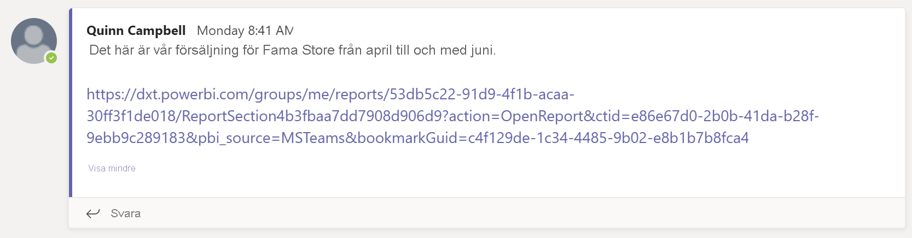
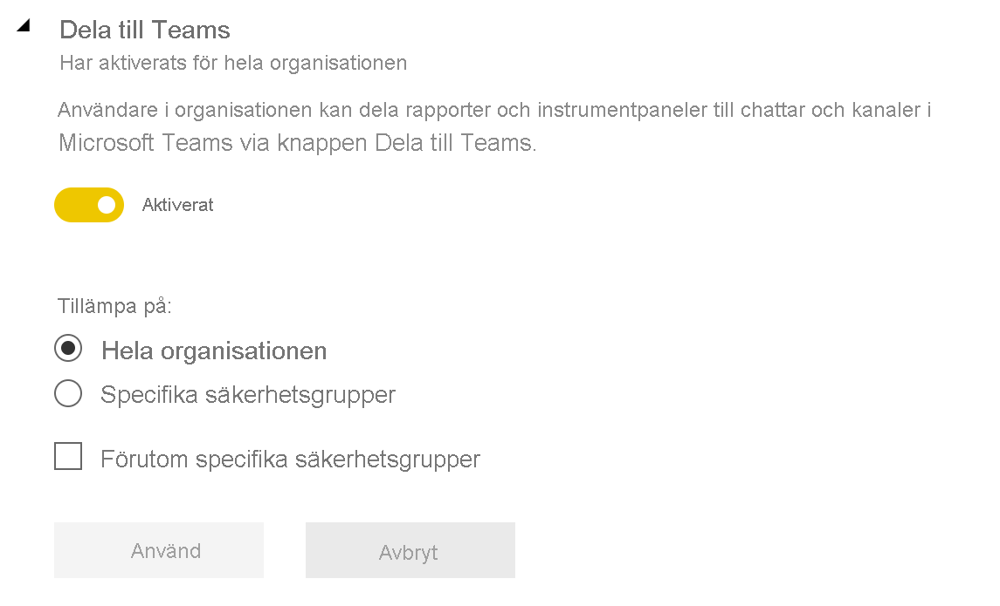

# Samarbeta i Microsoft Teams med Power BI

Med **Power BI**-fliken för Microsoft Teams kan du enkelt bädda in interaktiva rapporter i Microsoft Teams-kanaler och -chattar. Använd **Power BI**-fliken för Microsoft Teams för att hjälpa dina kollegor att hitta de data som teamet använder och till att diskutera data i dina Teams-kanaler. När du klistrar in en länk till dina rapporter, instrumentpaneler och appar i rutan för Microsoft Teams-meddelande, visar länkförhandsvisningen information om länken. Använd **Dela till Teams**-knappar för att snabbt starta konversationer när du visar rapporter och instrumentpaneler i Power BI.

## Krav

För att **Power BI**-fliken för Microsoft Teams ska fungera måste du se till att:

- Dina användare har en Power BI Pro-licens, eller att rapporten ligger i en [Power BI Premium-kapacitet (SKU:n EM eller P)](../admin/service-premium-what-is.md) med en Power BI-licens.
- Microsoft Teams har **Power BI**-fliken.
- Användaren har loggat in i Power BI-tjänsten och aktiverat sin Power BI-licens för att kunna använda rapporten.
- För att kunna lägga till en rapport i Microsoft Teams med **Power BI**-fliken måste du ha minst en Deltagare-roll på arbetsytan där rapporten ska vara. Information om de olika rollerna finns i [Roller i de nya arbetsytorna](service-new-workspaces.md#roles-in-the-new-workspaces).
- För att kunna visa rapporten på **Power BI**-fliken i Microsoft Teams måste användarna ha behörighet att visa rapporten.
- Användare måste vara Microsoft Teams-användare med åtkomst till kanaler och chattar.

För att länkförhandsvisningar ska fungera måste du kontrollera att:

- Användarna uppfyller kraven för att använda **Power BI**-fliken för Microsoft Teams.
- Användare är inloggade på Power BI.

För att **Dela till Team**-knappar ska fungera, se till att:

- Användarna uppfyller kraven för att använda **Power BI**-fliken för Microsoft Teams.
- Användare är inloggade på Power BI.
- Power BI-administratörer inte har inaktiverat klientinställningen **Dela till Teams**.

## Bädda in rapporten

Följ de här stegen om du vill bädda in rapporten i en kanal eller chatt i Microsoft Teams.

1. Öppna en kanal eller chatt i Microsoft Teams och välj **+** -ikonen.

    

1. Välj **Power BI**-fliken.

    

1. Använd de angivna alternativen för att välja en rapport från en arbetsyta eller en Power BI-app.

    

1. Namnet på fliken uppdateras automatiskt så att det matchar rapportnamnet, men du kan ändra det.

1. Välj **Spara**.

## Rapporter som stöds för inbäddning på fliken Power BI

Du kan bädda in följande typer av rapporter på **Power BI**-fliken:

- Interaktiva och sidnumrerade rapporter.
- Rapporter från **Min arbetsyta**, den nya arbetsytemiljön och från klassiska arbetsytor.
- Rapporter i Power BI-appar.

## Hämta en länkförhandsvisning

Följ de här stegen för att hämta en länkförhandsvisning för innehåll i Power BI-tjänsten.

1. Kopiera en länk till en rapport, en instrumentpanel eller en app i Power BI-tjänsten. Du kan kopiera länken från adressfältet i webbläsaren.

1. Klistra in länken i meddelanderutan för Microsoft Teams. Logga in på tjänsten för länkförhandsvisning om du uppmanas att göra det. Du kan behöva vänta några sekunder på att länkförhandsvisningen läses in.

    

1. Den grundläggande länkförhandsvisningen visas efter lyckad inloggning.

    

1. Välj ikonen **Expandera** för att visa det avancerade förhandsvisningskortet.

    

1. Kortet för avancerad länkförhandsvisning visar länken och relevanta åtgärdsknappar.

    

1. Skicka meddelandet.

## Dela till Teams-knappar i Power BI-tjänsten

Följ dessa steg om du vill dela länkar till Microsoft Teams-kanaler och -chattar när du visar rapporter eller instrumentpaneler i Power BI-tjänsten.

1. Använd **Dela till Teams**-knapparna i åtgärdsfältet eller i snabbmenyn för ett specifikt visuellt objekt.

   * **Dela till Teams**-knappen i åtgärdsfältet:

       
    
   * **Dela till Teams**-knappen i den visuella snabbmenyn:
    
      

1. I dialogrutan **Dela till Microsoft Teams** väljer du den kanal eller de personer som du vill skicka länken till. Lägg till ett meddelande om du vill. Du kan bli ombedd att logga in på Microsoft Teams först.

    

1. Välj **Dela** för att skicka länken.
    
1. Länken läggs till i befintliga konversationer eller startar en ny chatt.

    

1. Välj länken för att öppna objektet i Power BI-tjänsten.

1. Om du använde snabbmenyn för ett specifikt visuellt objekt, markeras det visuella objektet när rapporten öppnas.

    
    

## Bevilja åtkomst till rapporter

När du bäddar in en rapport i Microsoft Teams eller skickar en länk till ett objekt får inte användarna automatiskt behörighet att visa rapporten. Du måste [tillåta att användare visar rapporten i Power BI](service-share-dashboards.md). Du kan använda en Microsoft 365-grupp för ditt team så att det blir enklare.

> [!IMPORTANT]
> Se till att granska vem som kan visa rapporten i Power BI-tjänsten och bevilja åtkomst till de som inte visas i listan.

Ett sätt att se till att alla i teamet har åtkomst till rapporterna är att placera rapporterna på en enda arbetsyta i och ge Microsoft 365-gruppen för ditt team åtkomst.

## Länkförhandsvisningar

Länkförhandsvisningar tillhandahålls för följande objekt i Power BI:
- Rapporter
- Instrumentpaneler
- Appar

Tjänsten för länkförhandsvisning kräver att användarna loggar in. Om du vill logga ut väljer du **Power BI** längst ned i meddelanderutan. Välj därefter **Logga ut**.

## Starta en konversation

När du lägger till en Power BI-rapportflik i Microsoft Teams så skapar Teams automatiskt en flikkonversation för rapporten.

- Välj ikonen **Visa flikkonversation** i det övre högra hörnet.

    

    Den första kommentaren är en länk till rapporten. Alla i den Microsoft Teams-kanalen kan se och diskutera rapporten i konversationen.

    
    
## Dela till Teams-klientinställning

Klientinställningen **Dela till Teams** i Power BI admin-portalen gör det möjligt för organisationer att dölja **Dela till Teams**-knappar. När inställningen är inaktiverad visas inte **Dela till Teams**-knappar i åtgärdsfältet eller i snabbmenyer när de visar rapporter och instrumentpaneler i Power BI-tjänsten.

## Kända problem och begränsningar

- Power BI har inte stöd för samma lokaliserade språk som i Microsoft Teams. Det kan innebära att den inbäddade rapporten inte är helt lokaliserad.
- Du kan inte bädda in Power BI-instrumentpaneler på **Power BI**-fliken för Microsoft Teams.
- Användare utan någon Power BI-licens eller behörighet att visa rapporten ser meddelandet Innehållet inte är tillgängligt.
- Du kan uppleva problem om du använder Internet Explorer 10. <!--You can look at the [browsers support for Power BI](../consumer/end-user-browsers.md) and for [Microsoft 365](https://products.office.com/office-system-requirements#Browsers-section). -->
- [URL-filter](service-url-filters.md) stöds inte på **Power BI**-fliken för Microsoft Teams.
- I nationella moln är den nya **Power BI**-fliken inte tillgänglig. Det kan finnas en äldre version som inte stöder den nya arbetsytemiljön eller rapporter i Power BI.
- När du har sparat fliken kan du inte ändra namnet på fliken via flikinställningarna. Använd alternativet **Byt namn** för att ändra det.
- Enkel inloggning stöds inte för tjänsten för länkförhandsvisning.
- Länkförhandsvisningar fungerar inte i möteschattar eller privata kanaler.
- **Dela till Teams**-knapparna kanske inte fungerar om webbläsaren använder strikta sekretessinställningar. Använd alternativet **Upplever du problem? Försök öppna i ett nytt fönster** om dialogrutan inte öppnas på rätt sätt.
- **Dela till Teams** innehåller inte en länkförhandsgranskning.
- Länkförhandsgranskningar och **Dela till Teams** ger inte användare behörighet att visa objektet. Behörigheter måste hanteras separat.
- **Dela till Teams**-knappen är inte tillgänglig i visuella snabbmenyer när en rapportskapare anger alternativet **Mer** till *Av* för det visuella objektet.

## Nästa steg

- [Dela en instrumentpanel med kollegor och andra](service-share-dashboards.md)
- [Skapa och distribuera en app i Power BI](service-create-distribute-apps.md)
- [Vad är Power BI Premium?](../admin/service-premium-what-is.md)

Har du fler frågor? [Fråga Power BI Community](https://community.powerbi.com/).
