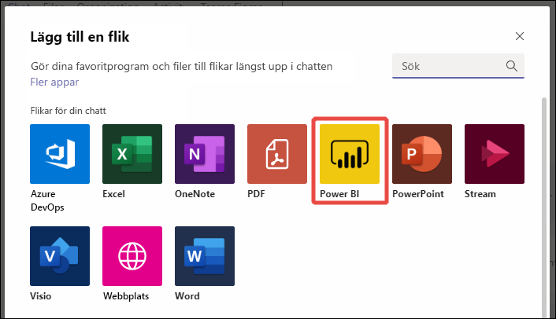
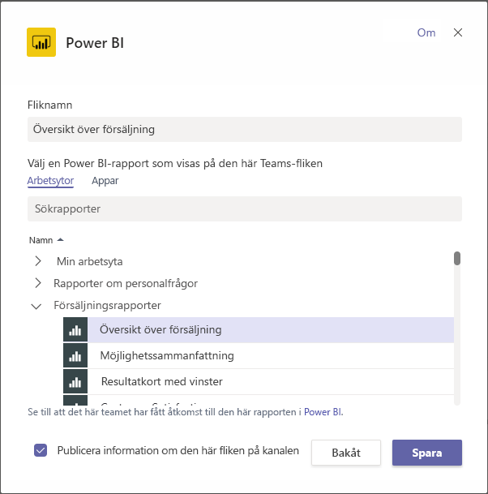

# Bädda in Power BI-innehåll i Microsoft Teams

Du kan enkelt bädda in interaktiva Power BI-rapporter i Microsoft Teams kanaler och chattar. 

## Krav

Säkerställ följande element om du vill använda **Power BI**-fliken i Microsoft Teams:

- Microsoft Teams har **Power BI**-fliken.
- För att kunna lägga till en rapport i Microsoft Teams med **Power BI**-fliken måste du ha minst en Deltagare-roll på arbetsytan där rapporten ska vara. Information om de olika rollerna finns i [Roller i de nya arbetsytorna](service-new-workspaces.md#roles-in-the-new-workspaces).
- För att kunna visa rapporten på **Power BI**-fliken i Microsoft Teams måste användarna ha behörighet att visa rapporten.
- Användare måste vara Microsoft Teams-användare med åtkomst till kanaler och chattar.

Du kan läsa om hur Power BI och Teams fungerar tillsammans, inklusive vilka krav du måste uppfylla, i [Samarbeta i Microsoft Teams med Power BI](service-embed-report-microsoft-teams.md).

## Bädda in en rapport i Teams

Följ de här stegen om du vill bädda in rapporten i en kanal eller chatt i Microsoft Teams.

1. Öppna en kanal eller chatt i Microsoft Teams och välj **+** -ikonen.

    

1. Välj **Power BI**-fliken.

    

1. Använd de angivna alternativen för att välja en rapport från en arbetsyta eller en Power BI-app.

    

1. Namnet på fliken uppdateras automatiskt så att det matchar rapportnamnet, men du kan ändra det.

1. Välj **Spara**.

### Rapporter du kan bädda in på Power BI-fliken

Du kan bädda in följande typer av rapporter på **Power BI**-fliken:

- Interaktiva och sidnumrerade rapporter.
- Rapporter från **Min arbetsyta**, den nya arbetsytemiljön och från klassiska arbetsytor.
- Rapporter i Power BI-appar.

## Starta en konversation

När du lägger till en Power BI-rapportflik i Microsoft Teams så skapar Teams automatiskt en flikkonversation för rapporten.

- Välj ikonen **Visa flikkonversation** i det övre högra hörnet.

    

    Den första kommentaren är en länk till rapporten. Alla i den Microsoft Teams-kanalen kan se och diskutera rapporten i konversationen.

    

## Kända problem och begränsningar

- Du kan inte bädda in Power BI-instrumentpaneler i **Power BI**-fliken för Microsoft Teams.
- [URL-filter](service-url-filters.md) stöds inte på **Power BI**-fliken för Microsoft Teams.
- I nationella moln är den nya **Power BI**-fliken inte tillgänglig. Det kan finnas en äldre version som inte stöder den nya arbetsytemiljön eller rapporter i Power BI.
- När du har sparat fliken ändrar du inte namnet på fliken via flikinställningarna. Använd alternativet **Byt namn** för att ändra det.
- Läs avsnittet [Kända problem och begränsningar](service-collaborate-microsoft-teams.md#known-issues-and-limitations) i artikeln ”Samarbeta i Microsoft Teams” för information om andra problem.

## Nästa steg

- [Samarbeta i Microsoft Teams med Power BI](service-collaborate-microsoft-teams.md)

Har du fler frågor? [Fråga Power BI Community](https://community.powerbi.com/).
