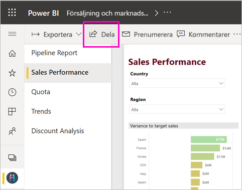
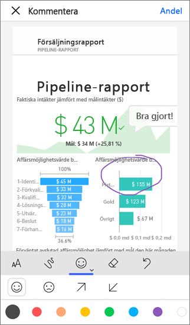
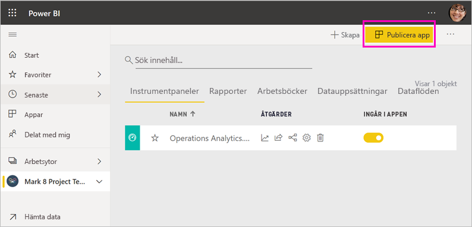
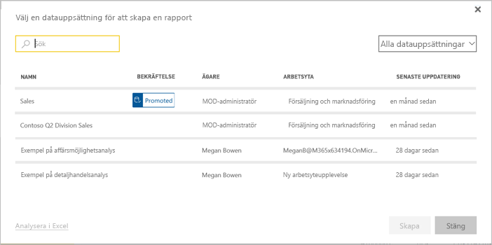

# Olika sätt att samarbeta och dela i Power BI

Du har skapat instrumentpaneler och rapporter. Du vill kanske använda dem för att samarbeta med dina kollegor. Eller så kanske du är redo att distribuera dem i högre grad. Vad är det bästa sättet när du vill samarbeta och dela dem? I den här artikeln jämför vi de olika alternativen.

*Appar i Power BI-tjänsten*

**Samarbeta**

- Samarbeta med kollegor på *arbetsytor* och skapa meningsfulla rapporter och instrumentpaneler.
- Samarbeta i *Microsoft Teams*.

**Distribuera eller dela instrumentpaneler och rapporter**

- *Dela instrumentpaneler eller rapporter* från Min arbetsyta eller någon annan arbetsyta.
- Kommentera och dela från Power BI-*mobilapparna*.
- Paketera instrumentpaneler och rapporter på arbetsytor i *appar* och distribuera dem till en större grupp eller hela organisationen.
- Bädda in rapporter i *säkra portaler* eller på *offentliga webbplatser*.
- Skriv ut rapporter.
- Skapa en *mallapp* som du kan distribuera till externa Power BI-användare via Microsoft AppSource.
 
**Dela data**

- Skapa *delade datamängder* som dina medarbetare kan använda som grund för egna rapporter på sina egna arbetsytor.
- Skapa *dataflöden* som ett sätt att dela en gemensam datakälla.

Oavsett vilket alternativ du väljer för att dela ditt innehåll behöver du en [Power BI Pro-licens](../fundamentals/service-features-license-type.md) eller så måste innehållet finnas i en [Premium-kapacitet](../admin/service-premium-what-is.md). Licenskraven kan variera för de kollegor som visar ditt innehåll, beroende på vilket alternativ du väljer. Det följande avsnittet beskriver detta i större detalj. 

## Samarbeta på en arbetsyta

När grupper arbetar tillsammans behöver de ha åtkomst till samma dokument så att det blir enklare att samarbeta. På arbetsytor i Power BI delar arbetsgrupper ägarskapet och hanteringen av instrumentpaneler, rapporter, datamängder och arbetsböcker. Ibland organiserar Power BI-användare sina arbetsytor utifrån organisationsstrukturer, och i andra fall skapar de dem för särskilda projekt. Andra organisationer använder fortfarande flera arbetsytor för att lagra olika versioner av rapporter eller instrumentpaneler som de använder. 

Arbetsytor ger roller som bestämmer vilka behörigheter dina medarbetare har. Du kan använda dessa roller för att bestämma vem som ska kunna hantera arbetsytan, redigera eller distribuera innehåll eller bara visa innehåll. Läs mer om [roller i de nya arbetsytorna](service-new-workspaces.md#roles-in-the-new-workspaces).

Arbetsytor fungerar dock bättre för samarbete än Min arbetsyta eftersom innehållet kan ägas av flera. Du och hela teamet kan enkelt göra uppdateringar eller ge andra användare åtkomst. Min arbetsyta är bäst lämpat för enskilda användare som lägger till personligt innehåll eller innehåll som används en enstaka gång.

Anta att du har en färdig instrumentpanel som du behöver dela med dina kollegor. Vad är det bästa sättet att ge dem åtkomst till instrumentpanelen? Svaret beror på ett antal faktorer. 

- Om dina kollegor behöver hålla instrumentpanelen uppdaterad eller behöver åtkomst till allt innehåll på arbetsytan så lägg till dem på arbetsytan som medlemmar eller deltagare. 
- Om dina kollegor endast behöver visa innehållet på arbetsytan, så lägg till dem som visningsprogram.
- Om dina kollegor bara behöver se just den instrumentpanelen och inte allt innehåll på arbetsytan, så kan du dela instrumentpanelen med dem direkt.
- Om instrumentpanelen ingår i en uppsättning instrumentpaneler och rapporter som du behöver distribuera till många kollegor, så är det bästa alternativet förmodligen att publicera en *app*.

Läs om hur du kan [skapa de nya arbetsytorna](service-create-the-new-workspaces.md). 

## Samarbeta i Microsoft Teams

Öka det datadrivna samarbetet i din organisation genom att bädda in Power BI-rapporter och sidnumrerade Power BI-rapporter i Microsoft Teams. Power BI-tjänsten har en **Dela i team**-knapp för rapporter. Du kan lägga till separata Power BI-flikar för varje enskild rapport och ge varje flik rapportens namn eller något annat namn. 

När du lägger till en Power BI-rapportflik i Microsoft Teams, så skapar Teams automatiskt en flikkonversation för rapporten. Alla i den Microsoft Teams-kanalen kan se och diskutera rapporten i konversationen. 

:::image type="content" source="media/service-how-to-collaborate-distribute-dashboards-reports/power-bi-teams-conversation-tab.png" alt-text="Microsoft Teams-konversationsflik":::

Läs mer om [samarbete i Microsoft Teams med Power BI](service-collaborate-microsoft-teams.md).

## Dela instrumentpaneler och rapporter

Anta att du har slutfört en rapport i Power BI Desktop och att du vill att andra personer ska ha åtkomst till den. Ett sätt att få åtkomst till den är att *dela* den i Power BI-tjänsten. Du publicerar den till din egen Min arbetsyta eller till någon annan arbetsyta. Kanske skapar du en instrumentpanel som komplement till den, och att du är redo.

Du behöver en Power BI Pro-licens för att kunna skapa instrumentpaneler. De personer som du delar den med behöver en också. I annat fall måste innehållet finnas på en arbetsyta i en [Premium-kapacitet](../admin/service-premium-what-is.md). När du delar en instrumentpanel eller rapport kan mottagarna visa den och interagera med den. Om du ger dem behörighet kan de redigera, kopiera eller dela den med sina kollegor. De ser samma data som visas på instrumentpanelen eller i rapporten. De har till gång till alla data i den underliggande datamängden, såvida inte [säkerhet på radnivå (RLS)](../admin/service-admin-rls.md) tillämpas.

Du kan dela en instrumentpanel med personer utanför din organisation. De kan även visa och interagera med instrumentpanelen eller rapporten, men de kan inte dela den. 

Läs mer om att [dela instrumentpaneler och rapporter](service-share-dashboards.md) från Power BI-tjänsten. Eller läs om hur du kan lägga till ett filter till en länk och [dela en filtrerad vy av rapporten](service-share-reports.md).

## Kommentera och dela från Power BI-mobilapparna

Du kan kommentera på en panel, rapport eller visualisering och sedan dela den med vem som helst med hjälp av Power BI-mobilapparna för iOS- och Android-enheter.

Du delar en ögonblicksbild av panelen, rapporten eller det visuella objektet. Mottagarna ser den exakt som den såg ut när du skickade e-postmeddelandet. E-postmeddelandet innehåller också en länk till instrumentpanelen eller rapporten. Om de har en licens för Power BI Pro, eller om innehållet ligger i en [Premium kapacitet](../admin/service-premium-what-is.md), och du redan har delat innehållet med dem, kan de öppna den. Du kan skicka ögonblicksbilder av paneler till alla, inte bara medarbetare i samma e-postdomän.

Läs mer om att [dela och kommentera paneler, rapporter och visuella objekt](../consumer/mobile/mobile-annotate-and-share-a-tile-from-the-mobile-apps.md) från iOS- och Android-appar.

Du kan också [dela en ögonblicksbild av en panel](../consumer/mobile/mobile-windows-10-phone-app-get-started.md) från Power BI-appen för Windows 10-enheter, men inte kommentera den.

## Distribuera insikter i en app

Anta att du vill distribuera din instrumentpanel till en bred publik i organisationen. Du och dina medarbetare har skapat en *arbetsyta* och skapat och förfinat instrumentpaneler, rapporter och datauppsättningar på arbetsytan. Nu väljer du instrumentpaneler och rapporter och publicerar dem som en *app* – antingen till en grupp eller till hela organisationen.

Apparna är lätta att hitta och installera på Power BI-tjänsten ([https://app.powerbi.com](https://app.powerbi.com)). Du kan skicka en direktlänk till appen till dina företagsanvändare eller de kan söka efter den i AppSource. Om din Power BI-administratör ger dig behörighet kan du installera en app automatiskt på din medarbetares Power BI-konton. Läs mer om hur du kan [publicera en app](service-create-distribute-apps.md).

När de har installerat appen kan de visa den i webbläsaren eller på mobilenheten.

För att användare ska kunna visa din app måste de antingen ha en Power BI Pro-licens eller så måste appen lagras på en Power BI Premium-kapacitet. Läs [Vad är Power BI Premium?](../admin/service-premium-what-is.md) för mer information.

Du kan även publicera appar till dem som är utanför din organisation. De kan visa och interagera med appinnehållet men kan inte dela det med andra. Nu kan du skapa *mallappar* och distribuera dem till valfri Power BI-kund.

## Bädda in rapporter i säkra portaler eller på offentliga webbplatser

### Bädda in i säkra portaler

Du kan bädda in Power BI-rapporter i portaler eller på webbplatser där dina användare förväntar sig att se dem.  
Med alternativen **Bädda in i SharePoint Online** och **Bädda in** i Power BI-tjänsten kan du säkert bädda in rapporter för dina interna användare på ett säkert sätt. Oavsett vilket alternativ du väljer tillämpar Power BI alla behörigheter och gällande datasäkerhet innan användarna kan se innehållet. Personen som visar rapporten måste ha rätt licens.  

- **Bädda in i SharePoint Online** fungerar med Power BI-webbdelen för SharePoint Online. Där får du enkel inloggning med kontroll över hur rapporten bäddas in. Läs mer om att [bädda in i SharePoint Online](service-embed-report-spo.md).
- **Bädda in** fungerar med valfri portal eller webbplats som har stöd för att bädda in innehåll via webbadresser eller en iFrame. Läs mer om alternativet [Bädda in](service-embed-secure.md).

### Publicera till offentliga webbplatser

Med **Publicera på webben** kan du publicera Power BI-rapporter till hela internet genom att bädda in virtuella objekt i blogginlägg, på webbplatser, i sociala medier och i andra former av onlinekommunikation. Alla på Internet kan se dina rapporter och du har ingen kontroll över vem som kan se vad du har publicerat. De behöver inte en licens för Power BI. Du kan bara publicera rapporter som du kan redigera på webben. Du kan inte publicera rapporter på webben om de har delats med dig eller om de finns i en app. Läs mer om hur du kan [publicera på webben](service-publish-to-web.md).

>[!Warning]
>Använd endast [Publicera på webben](service-publish-to-web.md) för att dela innehåll offentligt, inte för intern delning.

## Skriva ut eller spara som PDF eller andra statiska filer

Från Power BI-tjänsten kan du skriva ut alla följande objekt, eller spara dem som PDF eller i ett annat statiskt filformat:

- En hel instrumentpanel
- En ikon på en instrumentpanel
- En rapportsida
- En sidnumrerad rapport
- Ett visuellt objekt från Power BI-tjänsten. 

Du kan bara skriva ut Power BI-rapporterar en sida i taget. Du kan inte skriva ut hela rapporten på samma gång. Läs om hur du kan [skriva ut eller spara en rapport eller instrumentpanel som en statisk fil](../consumer/end-user-print.md).

Sidnumrerade rapporter, å andra sidan, är utformade för att skrivas ut. Läs en [jämförelse av Power BI-rapporter och sidnumrerade rapporter](../paginated-reports/paginated-reports-report-builder-power-bi.md#compare-power-bi-reports-and-paginated-reports) om du vill ha mer information. 

## Skapa och distribuera mallappar

*Mallappar* är utformade för att distribueras offentligt, ofta i Microsoft AppSource. Du skapar en app och kan distribuera den till valfri Power BI-kund praktiskt taget utan kodning. Dina kunder ansluter till sina egna data och skapar instanser av sina egna konton. Läs mer om [mallappar i Power BI](../connect-data/service-template-apps-overview.md).

## Dela en datauppsättning

Vissa personer är helt enkelt bättre på att skapa väl utformade datamodeller av hög kvalitet i sina rapporter. Du kanske är en sådan person. Hela organisationen kan ha nytta av att använda samma väl utformade datamodeller. Det är här som *delade datamängder* kommer in. När du skapar en rapport med en datamodell som alla bör kunna använda kan du spara rapporten i Power BI-tjänsten och ge rätt personer behörighet att använda den. Sedan kan de skapa egna rapporter baserade på din datamängd. På så sätt baserar alla sina rapporter på samma data och ser samma ”version av sanningen”.

Läs mer om att [skapa och använda delade datamängder](../connect-data/service-datasets-across-workspaces.md).

## Skapa dataflöden

*Dataflöden* är en självbetjäningsmetod för att samla data från olika källor och förbereda dem för modellering. Analytiker skapar dataflöden att mata in, transformera och integrera samt för att utöka stordata. De skapar och hanterar dataflöden på arbetsytor i Power BI-tjänsten. Läs mer om [dataförberedelser med självbetjäning för dataflöden](../transform-model/service-dataflows-overview.md).

## Överväganden och begränsningar

- Du kan inte dela rapporter från Power BI Report Server. Däremot kan du skapa [prenumerationer för dig själv och andra](/sql/reporting-services/working-with-subscriptions-web-portal).

## Nästa steg

- [Dela instrumentpaneler med kollegor och andra](service-share-dashboards.md)
- [Skapa och publicera en app i Power BI](service-create-distribute-apps.md)
- [Bädda in en rapport i en säker portal eller på en webbplats](service-embed-secure.md)

Har du feedback till oss? Gå till [Power BI Community-webbplatsen](https://community.powerbi.com/) med dina förslag.

Har du fler frågor? [Prova Power BI Community](https://community.powerbi.com/)
