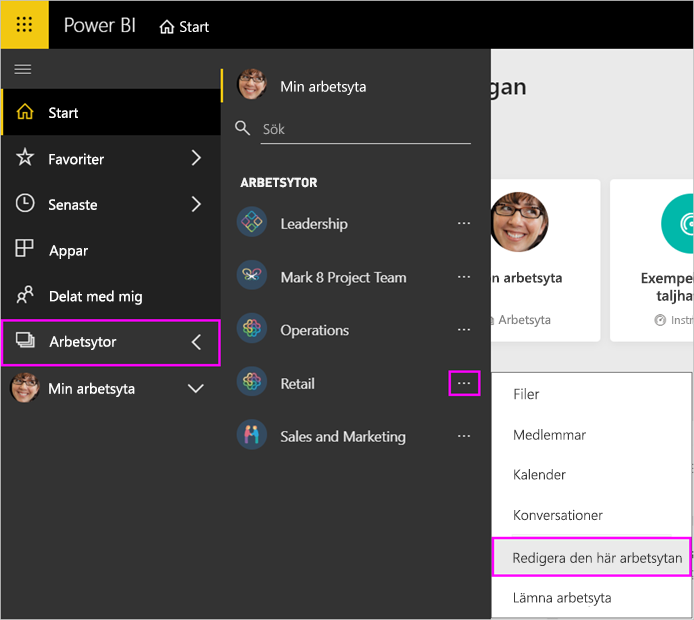
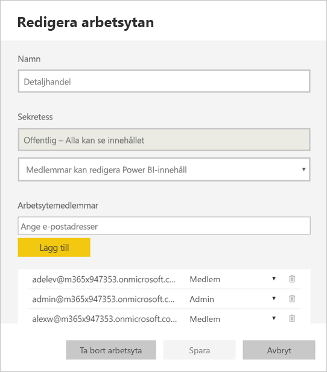
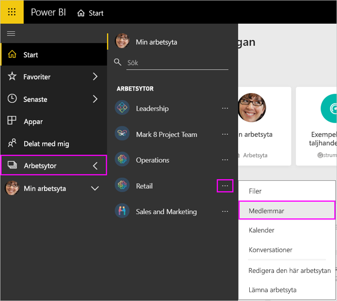

# Hantera din arbetsyta i Power BI och Microsoft 365

Som skapare eller administratör för en [arbetsyta i Power BI](service-create-distribute-apps.md) eller i Microsoft 365 kan du hantera vissa delar av arbetsytan i Power BI. Andra delar hanterar du i Microsoft 365.

> [!NOTE]
> I de nya arbetsytorna har förhållandet ändrats mellan Power BI-arbetsytor och Microsoft 365-grupper. Du kommer inte automatiskt att skapa en Microsoft 365-grupp varje gång du skapar en av de nya arbetsytorna. Läs mer om att [skapa de nya arbetsytorna](service-create-the-new-workspaces.md).

I **Power BI** kan du:

* Lägga till eller ta bort arbetsytans medlemmar, och även göra en medlem i arbetsytan till administratör.
* Redigera arbetsytans namn.
* Ta bort arbetsytan, som också tar bort Microsoft 365-gruppen.

I **Microsoft 365** kan du:

* Lägga till eller ta bort gruppmedlemmar i arbetsytan, och även göra en medlem till ägare.
* Redigera gruppens namn, bild, beskrivning och andra inställningar.
* Se gruppens e-postadress.
* Ta bort gruppen.

Du måste ha en [Power BI Pro-licens](../fundamentals/service-features-license-type.md) för att vara administratör eller medlem i en arbetsyta. Dina appanvändare behöver också en Power BI Pro-licens, om inte arbetsytan ligger i en Power BI Premium-kapacitet. Läs [Vad är Power BI Premium?](../admin/service-premium-what-is.md) för mer information.

## Redigera din arbetsyta i Power BI

1. I Power BI-tjänsten väljer du pilen intill **Arbetsytor** > välj **Fler alternativ** (…) intill namnet på arbetsytan > **Redigera den här arbetsytan**.

   

   > [!NOTE]
   > Du ser bara **Redigera den här arbetsytan** om du är administratör för arbetsytan.

1. Här kan du byta namn på arbetsytan, lägga till eller ta bort medlemmar eller ta bort arbetsytan.

   

1. Välj **Spara** eller **Avbryt**.

## Redigera egenskaper för Power BI-arbetsytor i Microsoft 365

Du kan även redigera olika egenskaper för en arbetsyta direkt i Outlook för Microsoft 365.

### Redigera medlemmarna i arbetsytegruppen

1. Välj pilen bredvid **Arbetsytor** i Power BI-tjänsten > välj **Fler alternativ** (…) bredvid namnet på arbetsytan > **Medlemmar**.

   

   Gruppvyn för arbetsytan öppnas i Outlook för Microsoft 365. Du kan behöva logga in på ditt företagskonto.

1. Välj rollen intill en teammedlems namn för att göra den personen till **Medlem** eller **Ägare**. Välj **X** för att ta bort personen från gruppen.

   

### Lägg till en bild och ange andra egenskaper för arbetsytor

När du distribuerar appen från arbetsytan används bilden du lägger till här för appen. Läs mer under [Lägga till en bild för din Microsoft 365-arbetsyta ](service-create-workspaces.md#add-an-image-to-your-microsoft-365-workspace-optional) i artikeln **Skapa de nya arbetsytorna**.

1. Öppna Outlook för Microsoft 365-vyn av arbetsytan, gå till fliken **Om** och välj **Redigera**.

    
1. Du kan redigera namn, beskrivning och språk för grupprelaterade meddelanden. Du kan även lägga till en bild och ange andra egenskaper här.

   

1. Välj **Spara** eller **Ignorera**.

## Nästa steg

* [Publicera en app i Power BI](service-create-distribute-apps.md)

* Har du fler frågor? [Prova Power BI Community](https://community.powerbi.com/)
