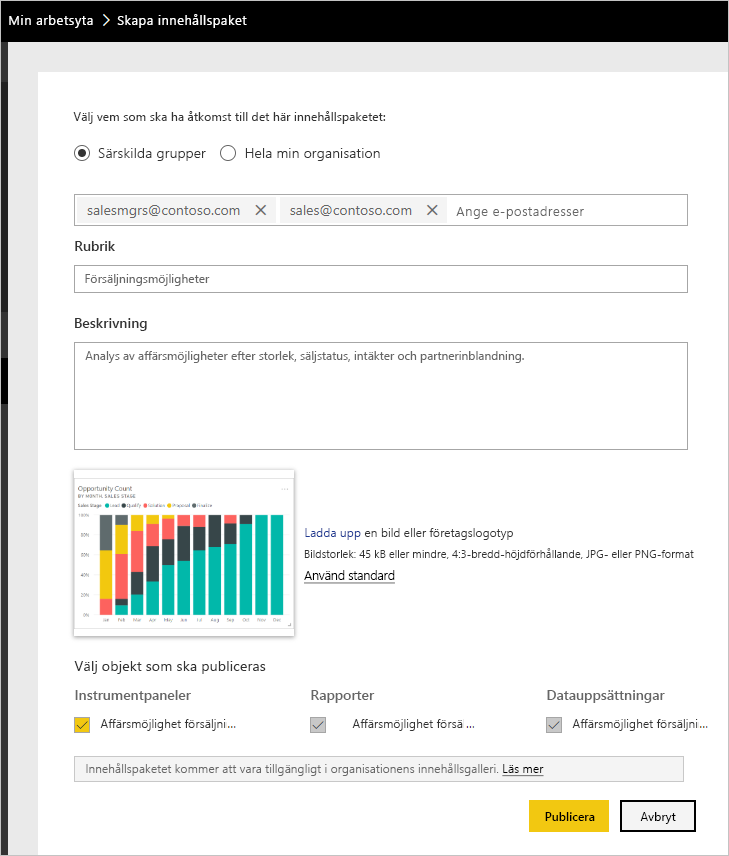
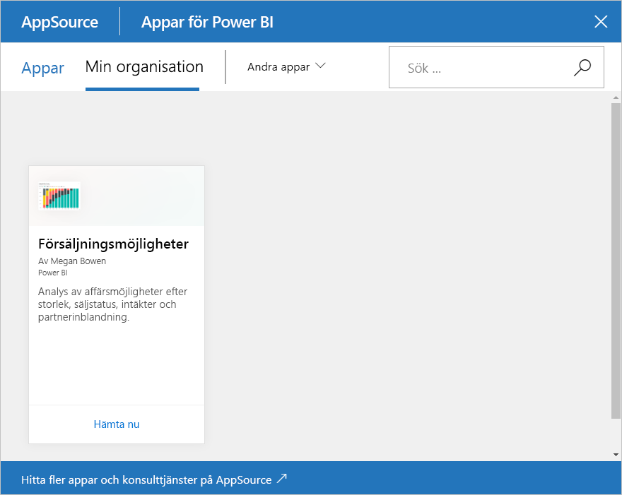

# Självstudie: Skapa och publicera ett organisationsinnehållspaket i Power BI

I den här självstudien skapar du ett organisationsinnehållspaket, ger åtkomst till en specifik grupp och publicerar det i din organisations innehållspaketsbibliotek i Power BI.

Att skapa innehållspaket skiljer sig från att dela instrumentpaneler eller samarbeta om dem i en grupp. Läs [Olika sätt att dela ditt arbete i Power BI](service-how-to-collaborate-distribute-dashboards-reports.md) för att välja det bästa alternativet för din situation.

För att kunna skapa ett organisationsinnehållspaket krävs ett [Power BI Pro-konto](https://powerbi.microsoft.com/pricing) för dig och dina kollegor.

> [!NOTE]
> Du kan inte skapa eller installera innehållspaket för organisationen i den nya arbetsyteupplevelsen. Om du inte har börjat ännu är det här ett bra tillfälle att uppgradera dina innehållspaket till appar. Lär dig [mer om den nya arbetsytan](service-create-the-new-workspaces.md).

## Skapa och publicera ett innehållspaket

Föreställ dig att du är Release Manager på Contoso och förbereder dig inför en ny produktlansering.  Du har skapat en instrumentpanel med rapporter som du vill dela. De kan vara användbara för andra anställda som hanterar lanseringen. Du vill ha en metod för att paketera instrumentpanelen och rapporterna som en lösning som dina kollegor kan använda.

Vill du hänga på? I [Power BI-tjänsten](https://powerbi.com) går du till **Min arbetsyta**. Gå sedan till **Hämta data** > **Exempel** > **Exempel på affärsmöjlighetsanalys** > **Anslut** för att hämta din egen kopia.

1. I navigeringsfönstret väljer du **Arbetsytor** > **Mina arbetsytor**.

1. I det övre navigeringsfönstret väljer du kugghjulsikonen  > **Skapa innehållspaket**.

   

1. I fönstret **Skapa innehållspaket** anger du nedanstående information.  

   Tänk på att din organisations innehållspaketsbibliotek kan fyllas snabbt. Biblioteket kan till slut innehålla hundratals innehållspaket som publicerats för organisationen eller för olika grupper. Lägg tid på att ge ditt innehållspaket ett bra och beskrivande namn, lägga till en detaljerad beskrivning och välja rätt målgrupp.  Använd ord som gör innehållspaketet lätt att hitta vid sökning. Det gör det enklare att hitta i framtiden.

      

    1. Välj **Särskilda grupper**.

    1. Ange fullständiga e-postadresser för enskilda personer, [Microsoft 365-grupper](https://support.office.com/article/Create-a-group-in-Office-365-7124dc4c-1de9-40d4-b096-e8add19209e9), distributionsgrupper eller säkerhetsgrupper. Till exempel: salesmgrs@contoso.com; sales@contoso.com

        Prova att använda din grupps e-postadress för den här självstudien.

    1. Döp innehållspaketet till *Affärsmöjligheter*.

        > [!TIP]
        > Överväg att ta med namnet på instrumentpanelen i namnet på innehållspaketet. På så sätt kan dina kollegor hitta instrumentpanelen enklare när de har anslutit till ditt innehållspaket.

    1. Rekommenderas: Lägg till en beskrivning. Det hjälper dina medarbetare att lättare hitta de innehållspaket som de behöver. Lägg utöver beskrivningen även till nyckelord som dina medarbetare kan använda för att söka efter innehållspaketet. Inkludera kontaktinformation om dina medarbetare har frågor eller behöver hjälp.

    1. Ladda upp en bild eller en logotyp för att göra det enklare för gruppmedlemmarna att hitta innehållspaketet.

        Det går snabbare att leta efter en bild än text. Skärmbilden visar en bild av kolumndiagramspanelen **Antal affärsmöjligheter**.

    1. Välj instrumentpanelen **Exempel på analys av affärsmöjligheter** för att lägga till den till innehållspaketet.

        Power BI lägger automatiskt till associerad rapport och datauppsättning. Du kan lägga till andra, om du vill.

       > [!NOTE]
       > Power BI visar endast de instrumentpaneler, rapporter, datamängder och arbetsböcker som du kan redigera. Därför visar inte appen sådana som delades med dig.

   1. Om du har Excel-arbetsböcker kan se dem under **Rapporter**, med en Excel-ikon. Du kan också lägga till dem i innehållspaketet.

      

      > [!NOTE]
      > Om medlemmar i gruppen inte kan visa Excel-arbetsboken, kan du behöva [dela arbetsboken med dem i OneDrive för företag](https://support.office.com/article/Share-documents-or-folders-in-Office-365-1fe37332-0f9a-4719-970e-d2578da4941c).

1. Välj **Publicera** för att lägga till innehållspaketet till gruppens bibliotek för organisationsinnehållspaket.  

   Ett meddelande visas när det publiceras.

1. När medlemmar i din grupp går till **Hämta data** > **Organisationsinnehållspaket** ser de ditt innehållspaket.

   

   > [!TIP]
   > Den URL som visas i din webbläsare är en unik adress för det här innehållspaketet.  Vill du berätta för dina medarbetare om det här nya innehållspaketet?  Klistra in URL:en i ett e-postmeddelande.

1. När dina gruppmedlemmar väljer **Anslut** kan de [visa och arbeta med ditt innehållspaket](service-organizational-content-pack-copy-refresh-access.md).

## Nästa steg

* [Introduktion till organisationsinnehållspaket i Power BI](service-organizational-content-pack-introduction.md).

* [Hantera, uppdatera och ta bort organisationsinnehållspaket](service-organizational-content-pack-manage-update-delete.md).

* [Publicera en app i Power BI](service-create-distribute-apps.md).

* [Vad är OneDrive för företag?](https://support.office.com/article/What-is-OneDrive-for-Business-187f90af-056f-47c0-9656-cc0ddca7fdc2)

* Har du fler frågor? [Prova Power BI Community](https://community.powerbi.com/)
