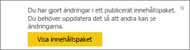
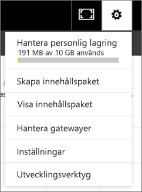

# Hantera, uppdatera och ta bort organisationsinnehållspaket
> [!NOTE]
> Du kan inte skapa innehållspaket för organisationen eller installera dem i den nya arbetsyteupplevelsen. Nu är ett bra tillfälle att uppgradera dina innehållspaket till appar, om du inte har börjat ännu. Lär dig [mer om den nya arbetsytan](service-create-the-new-workspaces.md).
> 

Du kan packa upp och dela dina instrumentpaneler, rapporter, Excel-arbetsböcker och datauppsättningar med dina kollegor som [organisationsinnehållspaket](service-organizational-content-pack-introduction.md). Dina kollegor kan använda dem som de är, eller skapa egna kopior.

Att skapa innehållspaket skiljer sig från att dela instrumentpaneler eller samarbeta om dem i en grupp. Läs [Hur ska jag samarbeta med och dela instrumentpaneler och rapporter?](service-how-to-collaborate-distribute-dashboards-reports.md) för att välja det bästa alternativet för din situation.

Du kan bara utföra vissa uppgifter för organisationsinnehållspaket om du har skapat innehållspaketet:

* Publicera på nytt.
* Begränsa eller expandera åtkomst till innehållspaketet.
* Ange och ändra schemalagd uppdatering.
* Ta bort innehållspaketet.

## Ändra och publicera om en organisations innehållspaket
Om du gör ändringar i det ursprungliga innehållspaketets instrumentpanel, rapport eller Excel-arbetsbok, uppmanas du att publicera om av Power BI. Dessutom kan du som innehållspaketets skapare, uppdatera några av de alternativ som du valde i fönstret Skapa innehållspaket när du skapade det ursprungliga innehållspaketet. 

## Publicera med nytt innehåll
När du gör och sparar en ändring i instrumentpanelen som du inkluderat i ett innehållspaket, påminner Power BI dig om att uppdatera den så att andra kan se ändringarna. Till exempel om du fäster en ny panel eller ändrar namnet på instrumentpanelen.

1. Välj **Visa innehållspaket** i meddelandet.
   
   
2. Eller välj kugghjulsikonen i det övre högra hörnet  och välj **Visa innehållspaketet**.
   
   
   
   Observera varningsikonen .  Den låter dig veta att du har ändrat innehållspaketet på något sätt och att det inte längre matchar det du publicerat.
3. Välj **Redigera**.  
4. Gör nödvändiga ändringar i **Uppdatera innehållspaketet** och välj **Uppdatera**. Ett meddelande om **slutförande** visas.
   
   * För gruppmedlemmar som inte har anpassat innehållspaketet används uppdateringen automatiskt.
   * Medlemmar som har anpassat innehållspaketet får ett meddelande om att det finns en ny version.  De kan gå till AppSource och få det uppdaterade innehållspaketet utan att förlora sin anpassade version.  De har nu 2 versioner: den anpassade versionen och det uppdaterade innehållspaketet.  I den anpassade versionen är alla paneler från det ursprungliga innehållspaketet borta.  Men paneler som fästs från andra rapporter återges fortfarande. Om innehållspaketets ägare tar bort den datauppsättning som innehållspaketet baseras på, så försvinner hela rapporten.  

## Uppdatera målgruppen: utöka eller begränsa åtkomst
En annan ändring som är tillgänglig för innehållspaketets skapare är att utöka och begränsa åtkomsten till innehållspaketet.  Kanske du har publicerat ett innehållspaketet till en bred publik och du vill begränsa åtkomsten till en mindre grupp.  

1. Välj kugghjulsikonen  och välj **Visa innehållspaket**.
2. Välj **Redigera**. 
3. Gör nödvändiga ändringar i **Uppdatera innehållspaketet** och välj **Uppdatera**. Ta till exempel bort den ursprungliga distributionsgruppen i fältet **Specifika grupper** och ersätt den med en annan distributionsgrupp (som har färre medlemmar).
   
   Ett meddelande om slutförande visas.
   
   För alla medarbetare som inte ingår i nytt alias:
   
   * För gruppmedlemmar som inte har anpassat innehållspaketet är instrumentpanelen och de rapporter som är associerade med detta innehållspaket inte längre tillgängliga och innehållspaketet visas inte i navigeringsfönstret.
   * För gruppmedlemmar som har anpassat innehållspaketet kommer alla paneler från det ursprungliga innehållspaketet att vara borta nästa gång de öppnar den anpassade instrumentpanelen.  Men paneler som fästs från andra rapporter återges fortfarande. Det ursprungliga innehållspaketets rapporter och datamängder är inte längre tillgängliga och innehållspaketet visas inte i navigeringsfönstret.   

## Uppdatera en organisations innehållspaket
Som skapare av innehållspaketet kan du [schemalägga en uppdatering av datauppsättningarna](../connect-data/refresh-data.md).  När du skapar och laddar upp innehållspaketet laddas detta uppdateringsschema upp med datauppsättningar. Om du ändrar uppdateringsschemat, måste du publicera om innehållspaketet (se ovan).

## Ta bort en organisations innehållspaket från AppSource
Du kan bara ta bort ett innehållspaketet från AppSource om du har skapat det. Om du har skapat ett innehållspaket för din organisation på en arbetsyta, och sedan bestämmer dig för att ta bort arbetsytan, måste du ta bort innehållspaketet först. Om du tar bort arbetsytan utan att först ta bort innehållspaketet förlorar du all åtkomst till innehållspaketen och måste kontakta Microsoft Support för hjälp. 

> [!TIP]
> Du kan [ta bort anslutningen till ett innehållspaket](service-organizational-content-pack-disconnect.md) som du inte har skapat. Detta tar inte bort innehållspaketet från AppSource.
> 
> 

1. Om du vill ta bort ett innehållspaketet från AppSource går du till arbetsytan där du skapade innehållspaketet, väljer kugghjulsikonen  och väljer **Visa innehållspaket**.
2. Välj **Ta bort \> Ta bort**. 
   
   * För gruppmedlemmar som inte har anpassat innehållspaketet tas instrumentpanelen och de rapporter som är associerade med detta innehållspaketet bort automatiskt. De är inte längre tillgängliga och innehållspaketet visas inte i navigeringsfönstret.
   * För gruppmedlemmar som har anpassat innehållspaketet kommer alla paneler från det ursprungliga innehållspaketet att vara borta nästa gång de öppnar den anpassade instrumentpanelen.  Men paneler som fästs från andra rapporter återges fortfarande. Det ursprungliga innehållspaketets rapporter och datamängder är inte längre tillgängliga och innehållspaketet visas inte i navigeringsfönstret.   

## Nästa steg
* [Introduktion till organisationsinnehållspaket](service-organizational-content-pack-introduction.md)
* [Skapa och distribuera en app i Power BI](service-create-distribute-apps.md) 
* Har du fler frågor? [Prova Power BI Community](https://community.powerbi.com/)

