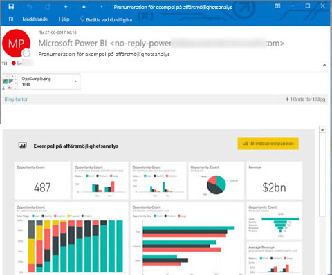
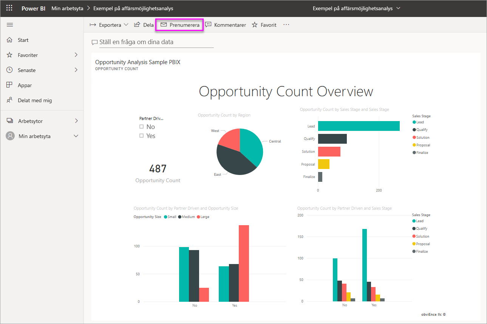
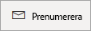
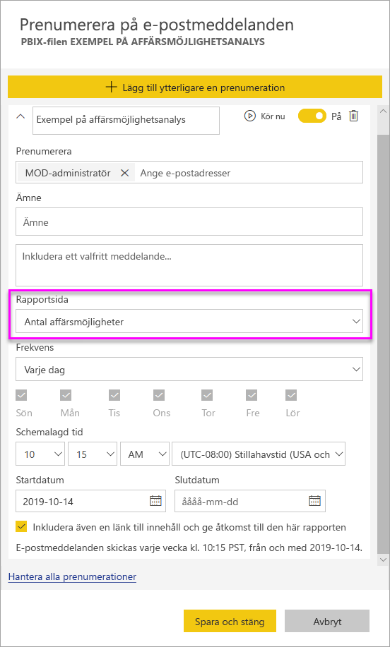

# Skapa en prenumeration åt dig eller andra på rapporter och instrumentpaneler i Power BI-tjänsten

Du kan skapa en prenumeration åt dig själv och dina kollegor på de rapportsidor, instrumentpaneler och sidnumrerade rapporter som är viktigast för er. Med e-postprenumerationer i Power BI kan du göra följande:

- Avgöra hur ofta du vill att Power BI ska skicka e-postmeddelanden till dig: varje dag, varje vecka, varje timme, varje månad eller efter den första datauppdateringen.
- Välja vid vilken tidpunkt du vill ta emot e-postmeddelandet, om du väljer varje dag, varje vecka, varje timme eller varje månad.
- Konfigurera 24 olika prenumerationer per rapport eller instrumentpanel i Power BI.  Det finns ingen gräns för antalet prenumerationer som du kan konfigurera för sidnumrerade rapporter.
- Få ett e-postmeddelande med en bild av rapporten och en länk till rapporten i tjänsten.  Om du väljer den här länken på mobila enheter med installerade Power BI-appar, så startas Power BI-appen, i stället för att öppna rapporten eller instrumentpanelen på Power BI-webbplatsen.
- Ta med den fullständiga rapporten i en bilaga om du prenumererar på en sidnumrerad rapport.
- Skicka e-post till användare utanför klientorganisationen om ditt Power BI-innehåll ligger i en Premium-kapacitet.  Administratörer kan styra vilka som kan skicka e-postprenumerationer till externa användare via de befintliga inställningarna för extern delningskontroll i administrationscentret för Power BI.

 

## Krav

Följande kan **skapa** en prenumeration:

- Användare med Power BI Pro-licens 
- Användare som visar innehåll i en Premium-arbetsyta eller -app kan också prenumerera på innehåll som finns där, även utan Power BI Pro-licens. 

Du behöver inte redigera behörigheter för innehållet (instrumentpanel eller rapport) för att skapa en prenumeration åt dig själv men du måste ha redigeringsbehörigheter för att skapa en åt någon annan.

## Prenumerera på en instrumentpanel, en rapportsida eller en sidnumrerad rapport

Oavsett om du prenumererar på en instrumentpanel, rapport eller sidnumrerad rapport är processen likadan. Du kan använda samma knapp för att prenumerera på Power BI-tjänstens instrumentpaneler och rapporter.

Prenumeration på sidnumrerade rapporter fungerar lite annorlunda. Mer information finns i [Skapa en prenumeration åt dig själv och andra på en sidnumrerad rapport i Power BI-tjänsten](../consumer/paginated-reports-subscriptions.md).
 
.

1. Öppna instrumentpanelen eller rapporten.
2. Välj **Prenumerera** på den översta menyraden, eller välj kuvertikonen .
   
    

1. Aktivera eller inaktivera prenumerationen med det gula skjutreglaget. Om du ställer in skjutreglaget på **Av** så tas inte prenumerationen bort. Om du vill ta bort prenumerationen så väljer du istället papperskorgen.

2. Din e-postadress finns redan i rutan **Prenumerera**. Du kan även lägga till andra e-postadresser i samma domän i prenumerationen. Om rapporten eller instrumentpanelen ligger i en [Premium-kapacitet](https://docs.microsoft.com/power-bi/service-premium-what-is) kan du skapa prenumerationer för andra enskilda e-postadresser och gruppalias, oavsett om de finns i din domän eller inte. Om rapporten eller instrumentpanelen inte ligger i en Premium-kapacitet kan du skapa prenumerationer för andra personer, men då måste de också ha en Power BI Pro-licens. Mer information finns i [Överväganden och felsökning](#considerations-and-troubleshooting) nedan.

3. Fyll i information om **Ämne** och **Meddelande** för e-postmeddelandet.

4. Välj en **Frekvens** för prenumerationen:  **Varje dag**, **Varje timme**, **Varje vecka**, **Varje månad** eller **Efter datauppdatering (en gång per dag)** . Om du bara vill få e-post via prenumerationen på vissa dagar väljer du **Varje timme** eller **Varje vecka** och vilka dagar du vill få den. Om du till exempel bara vill ha e-post via prenumerationen på vardagar väljer du **Varje vecka** och avmarkerar rutorna **Lör** och **Sön**. Om du väljer **Varje månad** anger du den eller de dagar i månaden som du vill få prenumerationsmeddelandet via e-post.

5. Om du väljer **Varje dag**, **Varje timme**, **Varje månad** eller **Varje vecka** kan du även välja en **Schemalagd tid** för prenumerationen. Du kan köra den på heltimme eller 15, 30 eller 45 minuter över. Välj morgon (AM) eller eftermiddag/kväll (PM). Du kan även ange tidszon. Om du väljer **Varje timme** ska du välja **Schemalagd tid** då du vill att prenumerationen ska starta, så körs den varje timme efter det.

6. Som standard är startdatum för prenumerationen det datum du skapar den. Du har möjlighet att välja ett slutdatum. Om du inte anger ett slutdatum är slutdatumet automatiskt ett år efter startdatumet. Du kan ändra det till vilket datum som helst i framtiden (upp till år 9999) när som helst innan prenumerationen avslutas. När en prenumeration når ett slutdatum stoppas den tills du aktiverar den igen. Du får ett eller flera meddelanden innan det schemalagda slutdatumet där du tillfrågas om du vill förlänga den.

    I skärmbilderna nedan ser du att när du prenumererar på en rapport prenumererar du i själv verket på en rapport_sida_. Om du vill prenumerera på flera sidor i en rapport väljer du **Lägg till en till prenumeration** och väljer en annan sida.
     
      

1. (Valfritt) Välj om du vill ta med en länk tillbaka till innehållet i Power BI och om du vill ge användarna åtkomst till det innehåll som prenumerationen gäller.  Om du väljer att ta med en länk ska du även se till att alla användare har åtkomst till rapporten.
2. Välj **Spara och stäng**. Användare som prenumererar får ett e-postmeddelande och en ögonblicksbild eller rapportsida för den frekvens och tid du har valt. Totalt kan du skapa upp till 24 prenumerationer per rapport eller instrumentpanel och kan ange unika mottagare, tider och frekvenser för varje prenumeration. Alla prenumerationer med frekvensen **Efter datauppdatering** inställd för din instrumentpanel eller rapport skickar fortfarande bara ett e-postmeddelande efter den första schemalagda uppdateringen.

    > [!TIP]
    > Vill du skicka e-postmeddelandet från en prenumeration direkt eller på begäran vid valfri tidpunkt? Välj **Kör nu** för prenumerationerna för den instrumentpanel eller rapport du vill skicka. Du får därmed ett meddelande om att ett e-postmeddelande skickas till alla för den specifika prenumerationen. Den här åtgärden räknas inte mot din gräns på 24 schemalagda prenumerationskörningar per dag per rapport eller instrumentpanel. Detta utlöser INTE en datauppdatering av den underliggande datamängden.
    >

## Hantera dina prenumerationer

Endast den person som skapade prenumerationen kan hantera den. Det finns två vägar till skärmen för att hantera dina prenumerationer. Den första är att välja **Hantera alla prenumerationer** i dialogrutan **Prenumerera på e-postmeddelanden** (se steg 4 ovan). Den andra är att välja kugghjulsikonen i Power BI  på den översta menyraden sedan välja **Inställningar**.

Vilka prenumerationer som visas beror på vilken arbetsyta som för närvarande är aktiv. Om du vill se alla dina prenumerationer för alla arbetsytor ska du se till att **Min arbetsyta** är aktiv. Om du vill veta mer om hur arbetsytor fungerar kan du läsa [Arbetsytor i Power BI](service-create-workspaces.md).

En prenumeration avslutas följande fall:

- Pro-licensen upphör att gälla.
- Ägaren tar bort instrumentpanelen eller rapporten.
- Användarkontot som skapade prenumerationen tas bort.

Power BI-administratörer kan använda Power BI-spårningsloggar till att visa information om prenumerationer. I den här informationen ingår bland annat följande:

- Skapad av
- Skapad den
- Innehåll som prenumerationen gäller
- Mottagare
- Frekvens
- Ändrad av/
- Ändringsdatum

## Överväganden och felsökning

### Allmänt

- Precis som med andra BI-produkter är tiden som du anger för din prenumeration den tid då prenumerationen börjar bearbetas.  När rapportbearbetningen är klar placeras prenumerationen i kö och skickas till e-postmottagarna.  Vi bearbetar och levererar alla prenumerationer så snabbt som möjligt. När efterfrågan är hög kan det dock uppstå en fördröjning på grund av mängden prenumerationer som Power BI kan skicka samtidigt. Fördröjningen i bearbetningen och leveransen av rapporter brukar vara högst 15 minuter för kunder. Det kan ta upp till 30 minuter under vissa tider och för klientorganisationer med hög användning.  Ingen leveransfördröjning förväntas överstiga 60 minuter från den tidpunkt då prenumerationen schemalades.  Om fördröjningen ändå är så lång börjar du med att kontrollera att adressen `no-reply-powerbi@microsoft.com` är vitlistad av din e-postleverantör.  Om så är fallet kontaktar du Power BI-supporten.
- E-postprenumerationer för rapporter och instrumentpaneler som använder datamängder med liveanslutning stöds för närvarande inte när du skapar prenumerationer åt andra än dig själv, förutom när det gäller sidnumrerade rapporter. Du kan skapa prenumerationer på en sidnumrerad rapport åt andra via din säkerhetskontext. Läs mer om att [prenumerera på sidnumrerade rapporter](../consumer/paginated-reports-subscriptions.md).
- Power BI pausar automatiskt uppdateringar för datauppsättningar som är associerade med instrumentpaneler och rapporter som inte har besökts på över två månader. Men om du lägger till en prenumeration på en instrumentpanel eller en rapport, så pausas den inte, även om den förblir obesökt.
- Om du inte får någon e-post angående prenumerationen, så kontrollera att ditt UPN (User Principal Name) kan ta emot e-postmeddelanden.
- Om din instrumentpanel eller rapport finns i Premium-kapacitet kan du använda grupp-e-postalias för prenumerationer i stället för att prenumerera kollegor med en e-postadress i taget. Alias baseras på aktuell aktiv katalog.
- Om ditt innehåll inte finns i en Premium-kapacitet kan endast Power BI Pro-användare få e-postprenumerationer. 
- Prenumerationer stöder för närvarande inte bokmärken.

### Instrumentpaneler

- Instrumentpaneler med fler än 25 fästa paneler, eller fyra fästa liverapportsidor, kanske inte återges till fullo i prenumerationsmeddelanden som skickas till användare via e-post. Prenumerationer på instrumentpaneler över detta antal paneler blockeras inte. Däremot betraktas de som ej stödda om du stöter på problem. Överväg att ändra dem därefter så att de omfattas av stöd.
- I sällsynta fall kan e-postprenumerationer ta längre tid än 15 minuter at levereras till mottagarna. Om detta inträffar rekommenderar vi att du kör datauppdateringen och e-postprenumerationen vid olika tider för att säkerställa leverans i tid. Om problemet kvarstår kontaktar du supporten för Power BI.
- För e-postprenumerationer på instrumentpaneler visas inte paneler som har säkerhet på radnivå (RLS) tillämpat.
- För prenumerationer på instrumentpaneler så saknar vissa typer av paneler fortfarande stöd. Detta gäller bland annat: strömningspaneler, videopaneler och paneler för anpassat webbinnehåll.
- Om du delar en instrumentpanel med en kollega utanför din klientorganisation kan du inte skapa en prenumeration till den kollegan *om inte* instrumentpanelen finns i en Premium-arbetsyta eller -app. Om du till exempel är `aaron@contoso.com` kan du dela med `anyone@fabrikam.com`, men du kan ännu inte prenumerera `anyone@fabrikam.com`, och den personen kan inte prenumerera på delat innehåll.

### Rapporter

- För e-postprenumerationer på rapporter kan du skapa en prenumeration åt dig själv om datamängden använder RLS. Du kan inte skapa prenumerationer åt andra på en rapport med säkerhet på radnivå (RLS), förutom när det gäller sidnumrerade rapporter. Du kan skapa prenumerationer på en sidnumrerad rapport åt andra via din säkerhetskontext. Läs mer om att [prenumerera på sidnumrerade rapporter](../consumer/paginated-reports-subscriptions.md).
- Rapportsideprenumerationer är knutna till namnet på rapportsidan. Om du prenumererar på en rapportsida och sedan byter namn på den, måste du återskapa din prenumeration.
- Din organisation kan konfigurera vissa inställningar i Azure Active Directory som begränsar möjligheten att använda e-postprenumerationer i Power BI. Dessa begränsningar inkluderar, men begränsas inte till, att ha multifaktorautentisering eller begränsningar för IP-intervallet vid åtkomst till resurser.
- E-postprenumerationer har inte stöd för så många [anpassade visuella objekt](../developer/power-bi-custom-visuals.md). Det enda undantaget är de anpassade visuella objekt som har [certifierats](../developer/power-bi-custom-visuals-certified.md).
- E-postprenumerationer har för närvarande inte stöd för R-baserade anpassade visuella objekt.
- E-postprenumerationer skickas med rapportens standardfilter och utsnittstillstånd. Inga ändringar av standardinställningarna som du gör efter att du börjar prenumerera visas i e-postmeddelandet. Sidnumrerade rapporter har stöd för den här funktionen och gör att du kan ställa in specifika parametervärden per prenumeration.

## Nästa steg

- [Skapa en prenumeration åt dig själv och andra på en sidnumrerad rapport i Power BI-tjänsten](../consumer/paginated-reports-subscriptions.md)
- Har du fler frågor? [Fråga Power BI Community](https://community.powerbi.com/)    
- [Läs blogginlägget](https://powerbi.microsoft.com/blog/introducing-dashboard-email-subscriptions-a-360-degree-view-of-your-business-in-your-inbox-every-day/)
