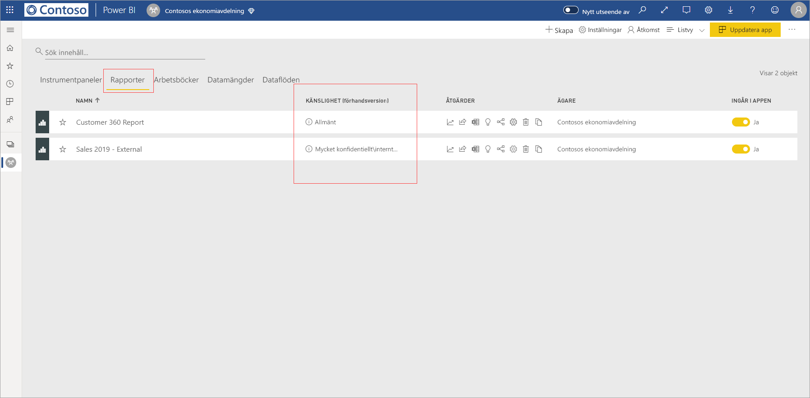
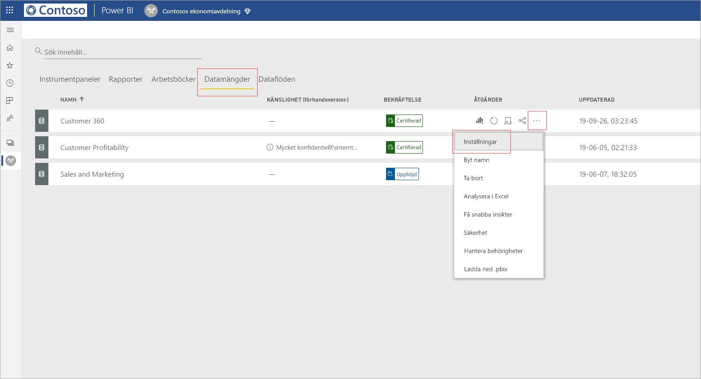
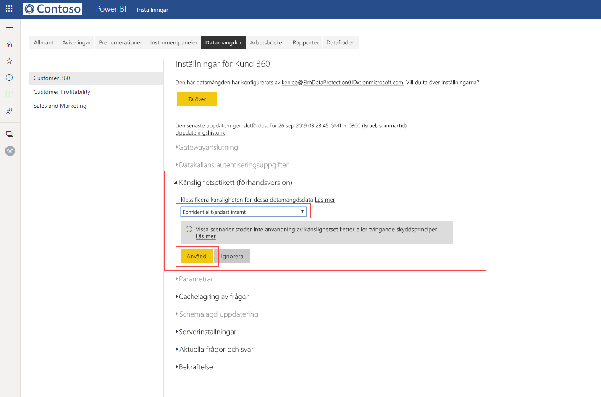
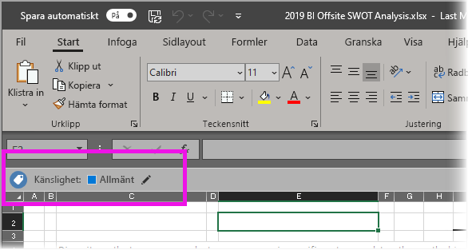

# Använda känslighetsetiketter för data i Power BI

Använd känslighetsetiketter i Microsoft Information Protection med dina rapporter, instrumentpaneler, datauppsättningar och dataflöden för att skydda känsligt innehåll mot obehörig dataåtkomst och dataläckage. När du märker upp dina data med rätt känslighetsetiketter ser du till att endast behöriga användare kan komma åt dem. Den här artikeln beskriver hur du tillämpar känslighetsetiketter på ditt innehåll.

Följande krav måste vara uppfyllda för att du ska kunna använda känslighetsetiketter i Power BI:
* Du måste ha en Power BI Pro-licens och redigeringsbehörighet för det innehåll som du vill märka.
* Du måste vara medlem i en säkerhetsgrupp som har behörighet att tillämpa känslighetsetiketter på data. Mer information finns i [Aktivera känslighetsetiketter för data i Power BI](../admin/service-security-enable-data-sensitivity-labels.md#enable-data-sensitivity-labels).
* Alla [förhandskrav](../admin/service-security-data-protection-overview.md#requirements-for-using-sensitivity-labels-in-power-bi) och [licenskrav](../admin/service-security-data-protection-overview.md#licensing) måste vara uppfyllda.

Mer information om känslighetsetiketter för data i Power BI finns i [Översikt över dataskydd i Power BI](../admin/service-security-data-protection-overview.md).

## Använda känslighetsetiketter

När dataskydd har aktiverats för din klientorganisation ser du känslighetsetiketter i känslighetskolumnen i listvyn för instrumentpaneler, rapporter, datamängder och dataflöden.

**Så här tillämpar du eller ändrar en känslighetsetikett för en rapport eller instrumentpanel**
1. Klicka på **Fler alternativ (...)** .
1. Välj **inställningar**.
1. Välj lämplig känslighetsetikett i fönstret Inställningar.
1. Spara inställningarna.

Följande bild visar hur du tillämpar en känslighetsetikett på en rapport

**Så här tillämpar du eller ändrar en känslighetsetikett för en datamängd eller ett dataflöde**

1. Klicka på **Fler alternativ (...)** .
1. Välj **inställningar**.
1. Välj lämplig känslighetsetikett i fönstret Inställningar.
1. Tillämpa inställningarna.

Följande två bilder visar hur du tillämpar en känslighetsetikett på en datauppsättning.

Välj **Fler alternativ (...)** och sedan **Inställningar**.

På sidan Inställningar går du till avsnittet för känslighetsetiketter, väljer önskad etikett och klickar på **Använd**.

## Ta bort känslighetsetiketter
Om du vill ta bort en känslighetsetikett från en rapport, en instrumentpanel, en datamängd eller ett dataflöde följer du [samma procedur som används för att tillämpa etiketter](#applying-sensitivity-labels) men väljer **(Ingen)** när du uppmanas att klassificera känsligheten för data. 

## Dataskydd i exporterade filer

Dataskyddet som är kopplat till känslighetsetiketter tillämpas bara på data när de exporteras till Excel-, PowerPoint- och PDF-filer. Det kan inte användas med Analysera i Excel, CSV-exporter, nedladdningar av datauppsättningar (.pbix), Power BI-tjänstens Live Connect-funktioner eller andra exportformat. Alternativen för dataexport styrs av Power BI-klientorganisationsadministratörens [exportinställningar](../service-admin-portal.md#export-and-sharing-settings).

När du [exportera data från en rapport](https://docs.microsoft.com/power-bi/consumer/end-user-export) som har en känslighetsetikett till en Excel-, PowerPoint- eller PDF-fil så ärvs känslighetsetiketten av den genererade filen. Känslighetsetiketten syns i filen och åtkomsten till filen begränsas till de som har tillräcklig behörighet.

## Överväganden och begränsningar

I den här listan anges några begränsningar för känslighetsetiketter i Power BI:

**Allmänt**
* Du kan bara tillämpa känslighetsetiketter på instrumentpaneler, rapporter, datamängder och dataflöden. För närvarande är de inte tillgängliga för [sidnumrerade rapporter](../paginated-reports/report-builder-power-bi.md) och arbetsböcker.
* Känslighetsetiketter på Power BI-resurser visas i vyerna Arbetsytelista, Ursprung, Favoriter, Senaste och Appar. För närvarande visas inte etiketter i vyn ”Delat med mig”. Men även om du inte ser en etikett som tillämpats på en Power BI-tillgång så gäller den även efter export till Excel-, PowerPoint- eller PDF-format.
* Känslighetsetiketter stöds bara för klientorganisationer i det globala (offentliga) molnet. Känslighetsetiketter stöds inte för klientorganisationer i andra moln.
* Datakänslighetsetiketter stöds inte för mallappar. Känslighetsetiketter som anges av mallappens skapare tas bort när appen extraheras och installeras, och känslighetsetiketter som lagts till i artefakter i en installerad mallapp av appkonsumenten går förlorade (återställs till ingenting) när appen uppdateras.
* Power BI stöder inte känslighetsetiketter för skyddstyperna [Vidarebefordra inte](https://docs.microsoft.com/microsoft-365/compliance/encryption-sensitivity-labels?view=o365-worldwide#let-users-assign-permissions), [Användardefinierat](https://docs.microsoft.com/microsoft-365/compliance/encryption-sensitivity-labels?view=o365-worldwide#let-users-assign-permissions) och [HYOK](https://docs.microsoft.com/azure/information-protection/configure-adrms-restrictions). Skyddstyperna Vidarebefordra inte och Användardefinierat är etiketter som definieras i [Microsoft 365 Security Center](https://security.microsoft.com/) eller [Microsoft 365 Compliance Center](https://compliance.microsoft.com/).

**Export**
* Etikett- och skyddskontroller tillämpas endast när data exporteras till Excel-, PowerPoint- och PDF-filer. Etikett och skydd tillämpas inte när data exporteras till CSV- eller PBIX-filer, Analysera i Excel eller andra exportsökvägar.
* När du tillämpar en känslighetsetikett och skydd på en exporterad fil, läggs ingen innehållsmärkning till för filen. Om etiketten har konfigurerats att använda innehållsmärkningar tillämpas de dock automatiskt av Azure Information Protection-klienten för enhetliga etiketter när filen öppnas i Office-skrivbordsappar. Innehållsmärkningarna tillämpas inte automatiskt när du använder inbyggd märkning för skrivbords-, mobil- eller webbappar. Mer information finns i avsnittet [om innehållsmärkning och kryptering med Office-appar](https://docs.microsoft.com/microsoft-365/compliance/sensitivity-labels-office-apps?view=o365-worldwide#when-office-apps-apply-content-marking-and-encryption).
* Användare som exporterar en fil från Power BI har behörighet att komma åt och redigera filen enligt inställningarna för känslighetsetiketten. Användaren som exporterar data får inte ägarbehörighet till filen.
* Exporten misslyckas om det inte går att tillämpa en etikett när data exporteras till en fil. Du kan kontrollera om exporten misslyckades på grund av att det inte gick att tillämpa etiketten. Klicka bara på rapportens eller instrumentpanelens namn i mitten av namnlisten och se om ”Det går inte att läsa in känslighetsetiketten” visas i listrutan som öppnas. Detta kan hända om den tillämpade etiketten har avpublicerats eller tagits bort av säkerhetsadministratören, eller på grund av ett tillfälligt systemfel.

## Nästa steg

I den här artikeln beskrivs hur du använder känslighetsetiketter för data i Power BI. De här artiklarna innehåller mer information om dataskydd i Power BI. 

* [Översikt över dataskydd i Power BI](../admin/service-security-data-protection-overview.md)
* [Aktivera känslighetsetiketter för data i Power BI](../admin/service-security-enable-data-sensitivity-labels.md)
* [Använda Microsoft Cloud App Security-kontroller i Power BI](../admin/service-security-using-microsoft-cloud-app-security-controls.md)