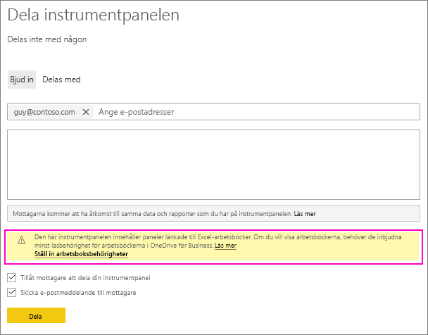
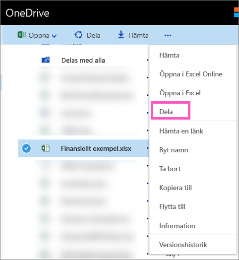

# Dela en Power BI-instrumentpanel som är länkad till en Excel-fil på OneDrive
I Power BI kan du [ansluta till Excel-arbetsböcker på OneDrive för företag](../connect-data/service-excel-workbook-files.md) och fästa paneler på en instrumentpanel från den arbetsboken. När du delar instrumentpanelen eller skapar ett innehållspaket som innehåller instrumentpanelen:

* Dina kolleger kan se panelerna utan att de behöver behörighet för själva arbetsboken. Så du kan skapa ett innehållspaket där du vet att dina kolleger kan se panelerna som skapats från Excel-arbetsboken på OneDrive.
* Om du klickar på panelen öppnas arbetsboken i Power BI. Arbetsboken öppnas bara om dina kolleger har minst [läsbehörighet](https://support.office.com/article/Share-documents-or-folders-in-Office-365-1fe37332-0f9a-4719-970e-d2578da4941c) till arbetsboken på OneDrive för företag.

## Dela en instrumentpanel som innehåller arbetsbokspaneler
Om du vill dela en instrumentpanel som länkar tillbaka till en Excel-arbetsbok på OneDrive för företag, kan du läsa mer i [Dela en instrumentpanel](service-share-dashboards.md). Skillnaden är att du har möjlighet att ändra behörighet för den länkade Excel-arbetsboken innan du delar den.

  

1. Ange e-postadresserna till dina kolleger.
2. Om du vill låta dina kolleger se Excel-arbetsboken från Power BI väljer du **Gå till OneDrive för företag och ställ in arbetsboksbehörigheter**.
3. På OneDrive [ändrar du behörighet](https://support.office.com/article/Share-files-and-folders-and-change-permissions-9fcc2f7d-de0c-4cec-93b0-a82024800c07) efter behov.
4. Välj **Dela**.

>[!NOTE]
>Dina kolleger kommer inte kunna fästa ytterligare paneler i arbetsboken eller göra ändringar i Excel-arbetsboken från Power BI.
> 
> 

## Skapa ett organisationsinnehållspaket med en instrumentpanel som innehåller arbetsbokspaneler
När du [publicerar ett innehållspaket](service-organizational-content-pack-create-and-publish.md) ger du åtkomst till enskilda kolleger eller grupper. När du publicerar ett innehållspaket som innehåller arbetsbokslänkar, kan du välja att ändra behörighet för den länkade Excel-arbetsboken innan du publicerar den.

1. På skärmen **Skapa innehållspaket** anger du e-postadresserna, ger innehållspaketet en rubrik och beskrivning samt laddar upp en bild.
2. Välj den instrumentpanel och/eller rapport som är länkad till Excel-arbetsboken på OneDrive för företag.
   
    
3. Välj **Gå till OneDrive för företag och ställ in arbetsboksbehörigheter**.
4. På OneDrive [ändrar du behörighet](https://support.office.com/article/Share-files-and-folders-and-change-permissions-9fcc2f7d-de0c-4cec-93b0-a82024800c07) efter behov.
5. Välj **Publicera**.

## Dela en instrumentpanel från en Power BI-arbetsyta
Att dela en instrumentpanel från en Power BI-arbetsyta liknar att dela en instrumentpanel från din egen arbetsyta, förutom att filerna finns på en Office 365-webbplatsarbetsyta i stället för i din egna OneDrive för företag. Ändra behörighet för Excel-arbetsboken innan du delar instrumentpanelen med personer utanför arbetsytan.

## Nästa steg
* [Fästa en panel på en Power BI-instrumentpanel från Excel](../create-reports/service-dashboard-pin-tile-from-excel.md)
* [Grundläggande begrepp för designers i Power BI-tjänsten](../fundamentals/service-basic-concepts.md)
* Fler frågor? [Prova Power BI Community](https://community.powerbi.com/)
