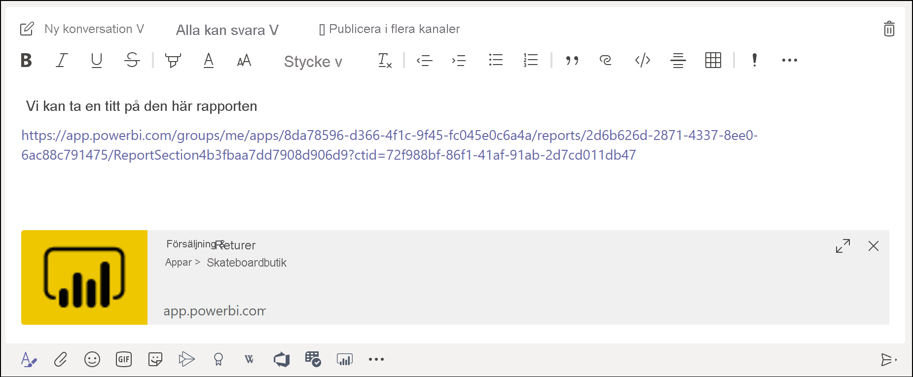

# Hämta en Power BI-länkförhandsvisning i Microsoft Teams

När du klistrar in en länk till dina rapporter, instrumentpaneler och appar i rutan för Microsoft Teams-meddelande, visar länkförhandsvisningen information om länken. Länkförhandsvisningar tillhandahålls för följande objekt i Power BI:

- Rapporter
- Instrumentpaneler
- Appar

Tjänsten för länkförhandsvisning kräver att användarna loggar in. Om du vill logga ut väljer du **Power BI** längst ned i meddelanderutan. Välj därefter **Logga ut**.

Information om hur Power BI och Teams fungerar tillsammans, inklusive vilka krav du måste uppfylla, finns i [Samarbeta i Microsoft Teams med Power BI](service-collaborate-microsoft-teams.md).

## Hämta en länkförhandsvisning

Följ de här stegen för att hämta en länkförhandsvisning för innehåll i Power BI-tjänsten.

1. Kopiera en länk till en rapport, en instrumentpanel eller en app i Power BI-tjänsten. Du kan kopiera länken från adressfältet i webbläsaren.

1. Klistra in länken i meddelanderutan för Microsoft Teams. Logga in på tjänsten för länkförhandsvisning om du uppmanas att göra det. Du kan behöva vänta några sekunder på att länkförhandsvisningen läses in.

    

1. Den grundläggande länkförhandsvisningen visas efter lyckad inloggning.

    

1. Välj ikonen **Expandera** för att visa det avancerade förhandsvisningskortet.

    

1. Kortet för avancerad länkförhandsvisning visar länken och relevanta åtgärdsknappar.

    

1. Skicka meddelandet.

## Kända problem och begränsningar

- Enkel inloggning stöds inte för tjänsten för länkförhandsvisning.
- Länkförhandsvisningar fungerar inte i möteschattar eller privata kanaler.
- Läs avsnittet [Kända problem och begränsningar](service-collaborate-microsoft-teams.md#known-issues-and-limitations) i artikeln ”Samarbeta i Microsoft Teams” för information om andra problem.

## Nästa steg

- [Samarbeta i Microsoft Teams med Power BI](service-collaborate-microsoft-teams.md)

Har du fler frågor? [Fråga Power BI Community](https://community.powerbi.com/).
