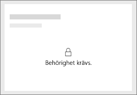
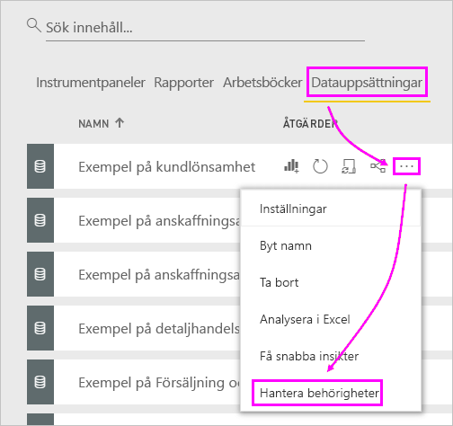
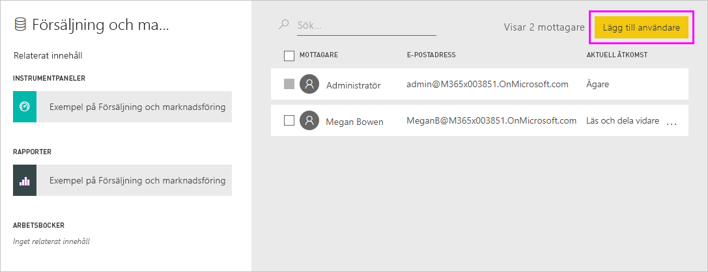

# Felsöka delning av instrumentpaneler och rapporter

Här följer några vanliga problem som kan uppstå när du delar en instrumentpanel eller rapport, eller när någon annan delar med dig. 

## Instrumentpanelsmottagare ser en lås-ikon i en panel

De personer som du delar med kan se en låst panel på en instrumentpanel eller ett meddelande om att ”behörighet krävs” när de försöker visa en rapport.

I så fall behöver ge dem behörighet till den underliggande datauppsättningen.

1. Gå till fliken **Datauppsättningar** i listan med innehåll.

1. Välj ellipsen ( **...** ) intill datamängden och välj sedan **Hantera behörigheter**.

    

1. Välj **Lägg till användare**.

    

1. Ange fullständiga e-postadresser för enskilda användare, distributionsgrupper och säkerhetsgrupper. Du kan inte dela med dynamiska distributionslistor.

    

1. Välj **Lägg till**.

## Jag kan inte dela en instrumentpanel eller en rapport

Om du vill dela en instrumentpanel eller rapport behöver du behörighet att dela det underliggande innehållet, det vill säga relaterade rapporter och datamängder. Om du ser ett meddelande om att du inte kan dela ber du rapportskaparen att ge dig behörighet att dela vidare för dessa rapporter och datamängder.

## Jag har inte åtkomst till en instrumentpanel eller rapport

Om du ser meddelandet Begär åtkomst när du väljer länken till en rapport eller instrumentpanel så har du inte behörighet att visa den. Du måste [begära åtkomst till den](service-request-access.md).

## Nästa steg

- [Dela Power BI-instrumentpaneler och -rapporter med kollegor och andra](service-share-dashboards.md)
- [Hur ska jag samarbeta kring och dela instrumentpaneler och rapporter?](service-how-to-collaborate-distribute-dashboards-reports.md)
-  [Dela en filtrerad Power BI-rapport](service-share-reports.md)
- Har du några frågor? [Prova Power BI Community](https://community.powerbi.com/)
