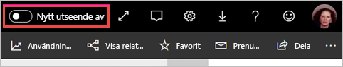
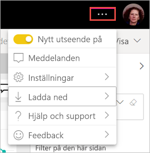

# Välj att använda det ”nya utseendet” för arbetsytor (förhandsversion)

Arbetsytor har ett nytt utseende som sammanfaller med det [nya utseendet](../service-new-look.md) på Power BI-tjänsten. Alla som använder Power BI-tjänsten (app.powerbi.com) kan välja att använda det. När du aktiverar det **nya utseendet** i det svarta rubrikfältet väljer du det nya utseendet för rapporter och arbetsytor. Alla arbetsytor, både klassiska och nya, kan dra nytta av det nya utseendet.

Letar du efter information om det nya utseendet i **Power BI Desktop**? Se [Använda det uppdaterade menyfliksområdet i Power BI Desktop](../desktop-ribbon.md).

## Egenskaper i det nya utseendet

:::image type="content" source="media/service-workspaces-new-look/power-bi-workspace-new-look-numbered.png" alt-text="Det nya utseendet för arbetsytor med bildförklaringsnummer":::

|Tal  |Så här fungerar det |
|---------|---------|
|    | **Hämta data**: Det är enklare att lägga till innehåll till din arbetsyta. Välj knappen **+ Nytt** för att ansluta till data, öppna filer och skapa rapporter, instrumentpaneler och mycket mer.  |
|   | **Vyväxlaren**: Om du vill se anslutningarna mellan dina dataflöden, datamängder, rapporter och instrumentpaneler och deras anslutningar till andra datakällor växlar du mellan vyn **Lista** och vyn **Ursprung**. |
|  | **Söka inom en arbetsyta**: Sök bland allt innehåll på en arbetsyta i den nya sökrutan.  |
|   | **Lista och flikar**: Allt innehåll på en arbetsyta visas i en platt lista med instrumentpaneler, rapporter, datamängder och så vidare som i SharePoint. Du behöver inte längre öppna en arbetsyta och få en potentiellt tom flik för **Instrumentpaneler** som gör att du undrar var innehållet finns. Här är den nya flikordningen:  **Allt**: Visar allt innehåll (instrumentpaneler, rapporter, arbetsböcker, sidnumrerade rapporter, datamängder och dataflöden) på arbetsytan.  **Innehåll**: Samlar ihop allt innehåll som skapats för användning (instrumentpaneler, rapporter, arbetsböcker och sidnumrerade rapporter) på arbetsytan.  **Datamängder + dataflöden**: Samlar ihop alla datamängder och dataflöden på arbetsytan för enkel datahantering. |
|  | **Filter**: För arbetsytor med hundratals artefakter kan du filtrera innehållet i fönstret Filter. När ett filter har tillämpats visas det överst i innehållslistan. |

**Snabbåtgärder**: När du hovrar över innehåll i listan ser du de vanligaste åtgärderna för det objektet, plus andra som finns i menyn **Fler alternativ (...)** .

:::image type="content" source="media/service-workspaces-new-look/power-bi-workspace-new-look-quick-actions.png" alt-text="Snabbåtgärder på den nya arbetsytan":::

## Välj att använda det nya utseendet

Alla användare av Power BI-tjänsten kan välja det nya utseendet. Du behöver bara växla **Nytt utseende av** till **Nytt utseende på**.

Om du vill gå tillbaka till det gamla utseendet växlar du till **av** i . Om du inte ser alternativet kan du välja ellipsmenyn i det övre högra hörnet.

## Nästa steg

- [Använda det uppdaterade menyfliksområdet i Power BI Desktop](../desktop-ribbon.md)
- [Det nya utseendet för Power BI-tjänsten](../service-new-look.md)
- Har du några frågor? [Prova Power BI Community](https://community.powerbi.com/)

