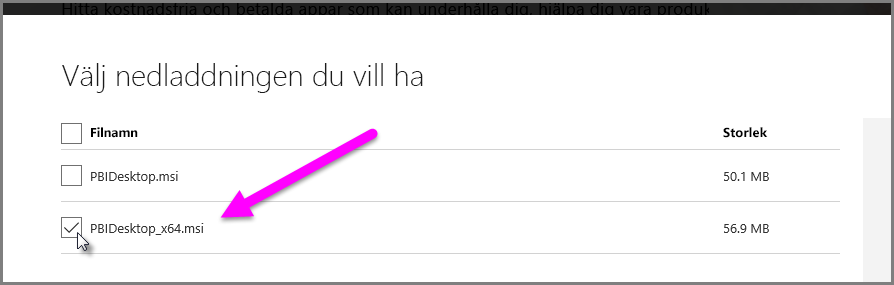

# Felsöka import av Access- och Excel-filer (.xls) i Power BI Desktop

I Power BI Desktop använder både Access-databaser och tidiga versioner av Excel-arbetsböcker (.XLS-filer av typen Excel 97-2003) *Access-databasmotorn*. Det finns tre vanliga situationer som kan förhindra att Access-databasmotorn fungerar korrekt.

## Situation 1: Access-databasmotorn är inte installerad

Om du får ett felmeddelande i Power BI Desktop om att Access-databasmotorn inte är installerad måste du installera antingen 32- eller 64-bitarsversionen av Access-databasmotorn, beroende på din Power BI Desktop-version. Du kan installera Access-databasmotorn från [nedladdningssidan](https://www.microsoft.com/download/details.aspx?id=13255).

>[!NOTE]
>Om antalet bitar för den installerade Access-databasmotorn skiljer sig från Microsoft Office-installation kan inte Office-programmen använda Access-databasmotorn.

## Situation 2: Antalet bitar för Access-databasmotorn (32 eller 64 bitar) är inte samma som för Power BI Desktop-versionen

Den här situationen ofta uppstår när den installerade versionen av Microsoft Office är 32-bitars och versionen av Power BI Desktop installerat 64-bitars. Motsatsen kan också inträffa, och i båda fallen är matchningen ogiltig. Om du använder en Microsoft 365-prenumeration kan du läsa om ett annat problem och en lösning i [situation 3](#situation-3-trouble-using-access-or-xls-files-with-a-microsoft-365-subscription). Något av följande lösningar kan åtgärda versionsmatchningsfelet:

### Lösning 1

Ändra versionen av Power BI Desktop så att den matchar versionen av Microsoft Office-installationen. 

1. Om du vill ändra versionen av Power BI Desktop, avinstallera Power BI Desktop och installera sedan versionen av Power BI Desktop som matchar din Office-installation. 

1. Välj version av Power BI Desktop genom att välja **Avancerade alternativ för nedladdning** på nedladdningssidan för Power BI Desktop.
   
   
   
1. På sidan download väljer du språk och väljer sedan knappen **Hämta**. 
 
1. På skärmen som visas markerar du kryssrutan bredvid PBIDesktop.msi om du vill ha 32-bitarsversionen, eller PBIDesktop_x64.msi om du vill ha 64-bitarsversionen. 

   I följande skärmbild är 64-bitarsversionen vald.
   
   
   
   >[!NOTE]
   >Om du använder 32-bitarsversionen av Power BI Desktop och skapar mycket stora datamodeller kan det uppstå minnesproblem.

### Lösning 2

Ändra Microsoft Office-version så att antalet bitar matchar versionen av Power BI Desktop:

1. Avinstallera Microsoft Office

2. Installera den Office-version som matchar din Power BI Desktop-installation.

### Lösning 3

Om felet uppstår när du försöker öppna en .XLS-fil (en Excel 97-2003-arbetsbok) kan du undvika att använda Access-databasmotorn genom att öppna .XLS-filen i Excel och spara den som en XLSX-fil.

### Lösning 4

Om föregående tre lösningar inte är möjliga kan du installera båda versionerna av Access-databasmotorn. Den här lösningen rekommenderas dock inte. Även om du kan lösa det här problemet för Power Query för Excel och Power BI Desktop genom att installera båda versionerna så uppstår nya fel och problem för program som automatiskt använder den bitversion av Access-databasmotorn som installerades först. 

Så här installerar du båda versionerna av Access-databasmotorn:

1. Installerar du båda versionerna av Access-databasmotorn från [nedladdningssidan](https://www.microsoft.com/download/details.aspx?id=13255). 

1. Kör de båda versionerna av Access-databasmotorn med växeln */passive*. Till exempel:
   
       c:\users\joe\downloads\AccessDatabaseEngine.exe /passive
   
       c:\users\joe\downloads\AccessDatabaseEngine_x64.exe /passive

## Situation 3: Problem med Access- eller .XLS-filer med en Microsoft 365-prenumeration

Om du använder en Microsoft 365-prenumeration, oavsett om det är **Office 2013** eller **Office 2016**, så är providern för Access-databasmotorn registrerad på en virtuell registerplats som *bara* Microsoft Office-processer har åtkomst till. Därför kan inte kombinationsmotorn (som ansvarar för att köra processer som inte hör till Office 365 Excel eller Power BI Desktop) använda providern för Access-databasmotorn.

Du kan komma runt det här genom att [ladda ned och installera den distribuerbara version av Access-databasmotorns](https://www.microsoft.com/download/details.aspx?id=13255) som matchar bitversionen för din Power BI Desktop-installation. Mer information om bitversioner finns längre bak i den här artikeln.

## Andra situationer som kan orsaka importfel

Vi strävar efter att täcka så många problem med åtkomst eller .XLS-filer som möjligt. Om det uppstår ett problem som inte beskrivs i den här artikeln kan du skicka en fråga om problemet till [Power BI-supporten](https://powerbi.microsoft.com/support/). Vi tittar regelbundet på problem som kan påverka många kunder och inkluderar dem i våra artiklar.

