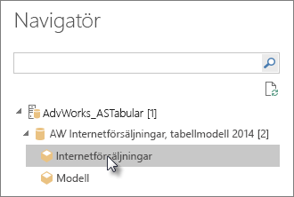
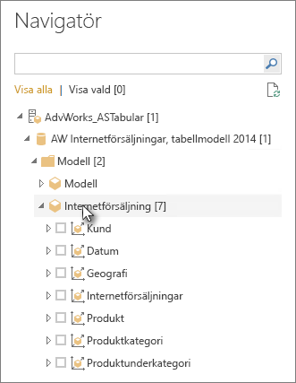

# Ansluta till Analysis Services-tabelldata i Power BI Desktop
Med Power BI Desktop finns det två sätt att ansluta till och hämta data från SQL Server Analysis Services-tabellmodellerna: Utforska genom att använda en liveanslutning eller välj objekt och importera dem till Power BI Desktop.

Låt oss ta en närmare titt.

**Utforska genom att använda en liveanslutning**: När du använder en liveanslutning kommer objekten i din tabellmodell eller ditt perspektiv, som tabeller, kolumner och mått, att visas i listan **Fält** i Power BI Desktop. Du kan använda Power BI Desktops avancerade visualiserings- och rapportverktyg för att utforska din tabellmodell på nya interaktiva sätt.

När du ansluter live importeras inte några data från tabellmodellen till Power BI Desktop. Varje gång du interagerar med en visualisering frågar Power BI Desktop efter tabellmodellen och beräknar resultatet som visas. Du ser alltid de senaste data som är tillgängliga i tabellmodellen, antingen från den senaste bearbetningen eller från Direct Query-tabeller som är tillgängliga i tabellmodellen. 

Kom ihåg att tabellmodeller är mycket säkra. Vilka objekt som visas i Power BI Desktop beror på din behörighet för den tabellmodell du är ansluten till.

När du har skapat dynamiska rapporter i Power BI Desktop kan du dela dem genom att publicera dem på Power BI-webbplatsen. När du publicerar en Power BI Desktop-fil med en liveanslutning till en tabellmodell på Power BI-webbplatsen måste en administratör installera och konfigurera en lokal datagateway. Läs mer i [Lokal datagateway](service-gateway-onprem.md).

**Välja objekt och importera dem till Power BI Desktop**: När du ansluter med det här alternativet kan du välja objekt som tabeller, kolumner och mått i tabellmodellen eller perspektivet och läsa in dem till en Power BI Desktop-modell. Använd Frågeredigeraren i Power BI Desktop till att utforma det du vill ha och modellera data med modelleringsfunktionerna. Eftersom ingen liveanslutning mellan Power BI Desktop och tabellmodellen upprätthålls kan du utforska Power BI Desktop-modellen offline eller publicera den till din Power BI-webbplats.

## Ansluta till en tabellmodell
1. Gå till fliken **Start** i Power BI Desktop och välj **Hämta data** > **Mer** > **Databas**.
   
1. Välj **SQL Server Analysis Services-databas** och sedan **Anslut**.
   
   
3. I fönstret **SQL Server Analysis Services-databas** anger du ett **servernamn**. Välj sedan ett anslutningsläge och väljer **OK**.
   
   
4. Det här steget i **navigatorfönstret** beror på vilket anslutningsläge du har valt:

   - Om du ansluter live väljer du en tabellmodell eller ett perspektiv.
  
      
   - Om du valde att välja objekt och hämta data väljer du en tabellmodell eller ett perspektiv och sedan en viss tabell eller kolumn att läsa in. Om du vill forma dina data före inläsningen väljer du **Redigera frågor** för att öppna Power Query-redigeraren. När du är färdig väljer du **Läs in** för att importera data till Power BI Desktop.

      

## Vanliga frågor och svar
**Fråga:** Behöver jag en lokal datagateway?

**Svar:** Det beror på. Om du använder Power BI Desktop för att ansluta live till en tabellmodell, men inte har för avsikt att publicera till Power BI-webbplatsen, behöver du inte någon gateway. Men om du tänker publicera på din Power BI-webbplats måste du ha en datagateway för att säkerställa skyddad kommunikation mellan Power BI-tjänsten och den lokala Analysis Services-servern. Kontakta administratören för Analysis Services-servern innan du installerar en datagateway.

Om du valde att välja objekt och hämta data importerar du tabellmodelldata direkt till din Power BI Desktop-fil, så ingen gateway behövs.

**Fråga:** Vad är skillnaden mellan att ansluta live till en tabellmodell från Power BI-tjänsten och att ansluta live från Power BI Desktop?

**Svar:** När du ansluter live till en tabellmodell från webbplatsen i Power BI-tjänsten till en Analysis Services-databas lokalt i organisationen måste du ha en lokal datagateway för att skydda kommunikationen mellan dem. När du ansluter live till en tabellmodell från Power BI Desktop behöver du ingen gateway eftersom både Power BI Desktop och Analysis Services-servern du ansluter till körs lokalt i organisationen. Men om du publicerar din Power BI Desktop-fil på Power BI-webbplatsen krävs en gateway.

**Fråga:** Om jag har skapat en live-anslutning kan jag ansluta till en annan datakälla i samma Power BI Desktop-fil?

**Svar:** Nej. Du kan inte utforska realtidsdata och ansluta till en annan typ av datakälla i samma fil. Om du redan har importerat data eller anslutit till en annan datakälla i Power BI Desktop-filen måste du skapa en ny fil och utforska den live.

**Fråga:** Om jag har skapat en live-anslutning, kan jag redigera modellen eller frågan i Power BI Desktop?

**Svar:** Du kan skapa mått på rapportnivå i Power BI Desktop, men alla andra fråge- och modelleringsfunktioner inaktiveras när du utforskar realtidsdata.

**Fråga:** Om jag har skapat en live-anslutning, är den säker?

**Svar:** Ja. Dina aktuella Windows-autentiseringsuppgifter används för att ansluta till Analysis Services-servern. Du kan inte använda grundläggande eller lagrade autentiseringsuppgifter i Power BI-tjänsten eller Power BI Desktop när du utforskar live.

**Fråga:** I navigatören ser jag både en modell och ett perspektiv. Vad är skillnaden?

**Svar:** Ett perspektiv är en viss vy av en tabellmodell. Den kan innehålla enbart specifika tabeller, kolumner eller mått, beroende på det unika dataanalysbehovet. En tabellmodell innehåller alltid minst ett perspektiv som kan omfatta allt i modellen. Om du är osäker på vilket perspektiv du ska välja kan du fråga administratören.

**Fråga:** Finns det några funktioner i Analysis Services som ändrar beteendet för Power BI?

**Svar:** Ja. Beroende på vilka funktioner din tabellmodell använder kan upplevelsen i Power BI Desktop ändras. Några exempel är:
* Du kan se mått i modellen grupperade tillsammans överst i listan **Fält** i stället för längsmed kolumnerna i tabeller. Du kan fortfarande använda dem som vanligt, det är bara lättare att hitta dem på det här sättet.

* Om tabellmodellen innehåller definierade beräkningsgrupper kan du bara använda dem tillsammans med modellmått, inte med implicita mått som du skapar genom att lägga till numeriska fält i ett visuellt objekt. Flaggan **DiscourageImplicitMeasures** kan även ha angetts manuellt för modellen, vilket ger samma resultat. Läs mer i [Beräkningsgrupper i Analysis Services](https://docs.microsoft.com/analysis-services/tabular-models/calculation-groups#benefits).

## Ändra servernamnet efter den första anslutningen
När du har skapat en Power BI Desktop-fil med en liveanslutning för utforskning kan det finnas tillfällen när du vill byta anslutning till en annan server. Exempelvis om du skapade din Power BI Desktop-fil när du anslöt till en utvecklingsserver och innan du publicerar till Power BI-tjänsten vill du byta anslutning till produktionsservern.

Så här ändrar du servernamnet:

1. Välj **Redigera frågor** på fliken **Start**.

2. I fönstret **SQL Server Analysis Services-databas** anger du det nya **servernamnet** och sedan **OK**.

   
## Felsökning 
I den här listan beskrivs alla kända problem vid anslutning till SQL Server Analysis Services (SSAS) eller Azure Analysis Services: 

* **Fel: Det gick inte att läsa in modellschemat**: Det här felet inträffar vanligtvis när användaren som ansluter till Analysis Services inte har åtkomst till databasen eller modellen.

