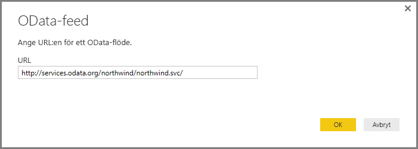
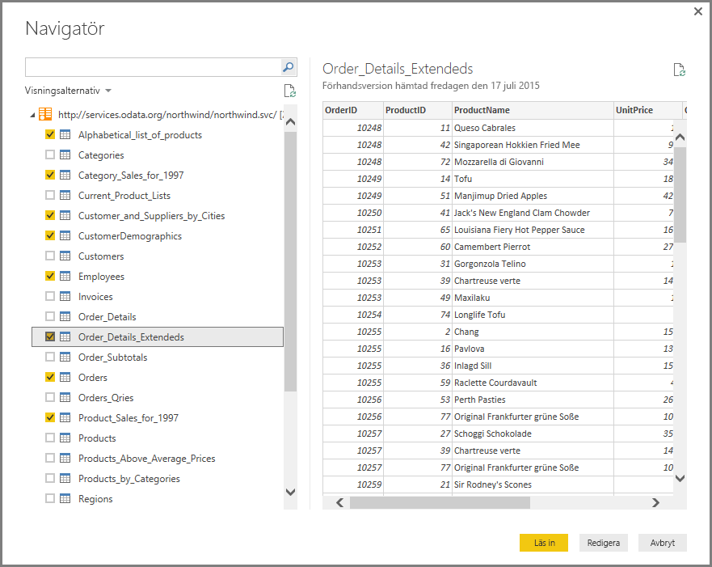
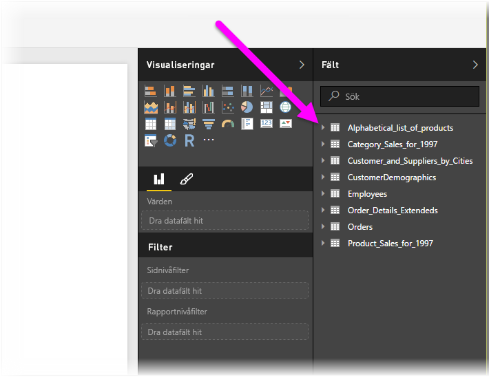

# Ansluta till en OData-feed i Power BI Desktop
I Power BI Desktop kan du ansluta till en **OData**-feed och använda underliggande data precis som andra datakällor i Power BI Desktop.

Om du vill ansluta till en OData-feed-databas, väljer du **Hämta Data > OData-feed** från **Start**-menyfliksområdet i Power BI Desktop.

I fönstret **OData-deed** som visas skriver eller klistrar du in URL:en för din OData-feed i rutan och väljer **OK**.

Power BI Desktop ansluter till OData-feeden och visar tillgängliga tabeller och andra dataelement i fönstret **Navigator**. När du väljer ett element visas en förhandsgranskning av data i fönstret **Navigator**. Du kan använda så många tabeller som du vill importera. Fönstret **Navigator** visar en förhandsgranskning av den markerade tabellen.

Du kan välja knappen **Redigera** knappen, som startar **Frågeredigeraren**, där du kan utforma och transformera data från OData-feeden innan du importerar dem till Power BI Desktop. Eller så kan du välja knappen **Hämta** och importera alla dataelement som du har valt i den vänstra rutan.

När vi väljer **Hämta** importerar Power BI Desktop de valda objekten och visar **Hämtnings**fönstret som visar importförloppet.

När du är klar gör Power BI Desktop de markerade tabellerna och andra dataelement i fönstret **Fält** tillgängliga på höger sida av vyn *Rapporter* i Power BI Desktop.

Och sedan är du klar!

Du är nu redo att använda den importerade informationen från OData-feeden i Power BI Desktop för att skapa visuella objekt och rapporter eller interagera med annan information som du kanske vill ansluta till och importera som andra Excel-arbetsböcker, databaser eller andra datakällor.

## Nästa steg
Det finns alla möjliga sorters data du kan ansluta till med Power BI Desktop. Kolla in följande resurser för mer information om datakällor:

* [Vad är Power BI Desktop?](../fundamentals/desktop-what-is-desktop.md)
* [Datakällor i Power BI Desktop](desktop-data-sources.md)
* [Forma och kombinera data i Power BI Desktop](desktop-shape-and-combine-data.md)
* [Anslut till Excel-arbetsböcker i Power BI Desktop](desktop-connect-excel.md)   
* [Ange data direkt i Power BI Desktop](desktop-enter-data-directly-into-desktop.md)   
