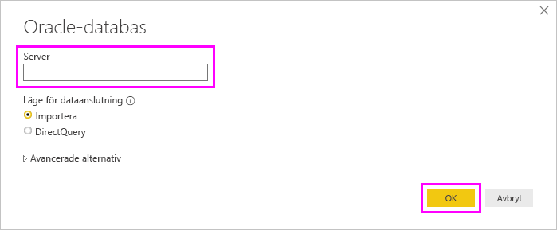

# Ansluta till en Oracle-databas med Power BI Desktop
Anslutning till en Oracle-databas med Power BI Desktop kräver att rätt Oracle-klientprogramvara är installerad på den dator som kör Power BI Desktop. Den Oracle-klientprogramvara du använder beror på vilken version av Power BI Desktop som du har installerat: 32-bitars eller 64-bitars. Det beror också på din version av Oracle Server.

Oracle-versioner som stöds: 
- Oracle Server 9 och senare
- ODAC-programvara (Oracle Data Access Client) 11.2 och senare

> [!NOTE]
> Om du konfigurerar en Oracle-databas för Power BI Desktop, On Premises Data Gateway eller Power BI-rapportserver kan du läsa informationen i artikeln [Oracle-anslutningstyp](https://docs.microsoft.com/sql/reporting-services/report-data/oracle-connection-type-ssrs?view=sql-server-ver15). 

## Så här fastställer du vilken version av Power BI Desktop som är installerad
För att kontrollera vilken version av Power BI Desktop som är installerad väljer du **Arkiv** > **Hjälp** > **Om** och läser sedan raden **Version**. I följande bild är en 64-bitarsversion av Power BI Desktop installerad:

## Installera Oracle-klienten
- För 32-bitarsversionen av Power BI Desktop [laddar du ned och installerar 32-bitars Oracle-klient](https://www.oracle.com/technetwork/topics/dotnet/utilsoft-086879.html).

- För 64-bitarsversionen av Power BI Desktop [laddar du ned och installerar 64-bitars Oracle-klient](https://www.oracle.com/database/technologies/odac-downloads.html).

> [!NOTE]
> Välj en version av Oracle Data Access Client (ODAC) som är kompatibel med din Oracle-server. Till exempel stöder ODAC 12.x inte alltid Oracle Server version 9.
> Välj Windows-installationsprogrammet för Oracle-klienten.
> Under installationen av Oracle-klienten kontrollerar du att du aktiverat *Configure ODP.NET and/or Oracle Providers for ASP.NET at machine-wide level* (Konfigurera ODP.NET och/eller Oracle-providers för ASP.NET på datoromfattande nivå) genom att markera motsvarande kryssruta under installationsguiden. I vissa versioner av Oracle-klientguiden markeras kryssrutan som standard, och i andra inte. Kontrollera att kryssrutan är markerad så att Power BI kan ansluta till Oracle-databasen.

## Anslut till en Oracle-databas
När du har installerat den matchande Oracle-klientdrivrutinen kan du ansluta till en Oracle-databas. Vidta följande steg för att upprätta anslutningen:

1. På fliken **Start** väljer du **Hämta data**. 

2. I fönstret **Hämta data** som visas väljer du **Mer** (om det behövs) och väljer **Databas** > **Oracle-databas** följt av **Anslut**.
   
   
2. I dialogrutan **Oracle-databas** som visas anger du namnet på **Server** och väljer **OK**. Om det krävs ett SID anger du det med formatet: *Servernamn/SID*, där *SID* är det unika namnet på databasen. Om formatet *Servernamn/SID* inte fungerar använder du *Servernamn/tjänstnamn*, där *tjänstnamn* är det alias som du använder för att ansluta.

   

      
3. Om du vill importera data med hjälp av en intern databasfråga anger du frågan i rutan **SQL-instruktion**, som visas när du expanderar avsnittet **Avancerade alternativ** i dialogrutan **Oracle-databas**.
   
   
4. När du har angett informationen för Oracle-databas i dialogrutan **Oracle-databas** (inklusive eventuell valfri information såsom ett SID eller en intern databasfråga) väljer du **OK** för att ansluta.
5. Ange autentiseringsuppgifterna i dialogrutan när du uppmanas om Oracle-databasen kräver autentiseringsuppgifter för databasen.

## Felsökning

Det kan uppstå fel i Oracle om namnsyntaxen är felaktig eller inte har konfigurerats korrekt:

* ORA-12154: TNS: det gick inte att matcha angivet anslutnings-ID.
* ORA-12514: TNS: lyssnaren känner för närvarande inte till tjänsten som begärdes i anslutningsbeskrivningen.
* ORA-12541: TNS: det finns ingen lyssnare.
* ORA-12170: TNS: det uppstod en anslutningstimeout.
* ORA-12504: TNS: lyssnaren har inte angetts SERVICE_NAME i CONNECT_DATA.

Dessa fel kan inträffa antingen om Oracle-klienten inte är installerad eller om den inte har konfigurerats korrekt. Om den är installerad bör du kontrollera att filen tnsnames.ora är korrekt konfigurerad och att du använder rätt net_service_name. Du behöver även se till att net_service_name är samma mellan den dator som använder Power BI Desktop och den dator som kör gatewayen. Mer information finns i [Installera Oracle-klienten](#install-the-oracle-client).

Du kan också stöta på problem med kompatibiliteten mellan Oracle-serverversionen och Oracle Data Access Client-versionen. Vanligtvis vill du att dessa versioner ska matcha, eftersom vissa kombinationer är inkompatibla. Till exempel stöder ODAC 12.x inte Oracle Server version 9.

Om du har laddat ned Power BI Desktop från Microsoft Store kanske du inte kan ansluta till Oracle-databaser på grund av ett problem med en Oracle-drivrutin. Om du påträffar det här problemet returneras följande felmeddelande: *Ingen objektreferens har angetts*. Åtgärda problemet med något av följande steg:

* Ladda ned Power BI Desktop från [Download Center](https://www.microsoft.com/download/details.aspx?id=58494) i stället för Microsoft Store.

* Om du vill använda versionen från Microsoft Store kopierar du oraons.dll från _12.X.X\client_X_ till _12.X.X\client_X\bin_. Här utgör _X_ versions- och katalognummer.

Om felmeddelandet *Ingen objektreferens har angetts* visas i Power BI Gateway när du ansluter till en Oracle-databas följer du anvisningarna i [Hantera din datakälla – Oracle](service-gateway-onprem-manage-oracle.md).

Om du använder Power BI-rapportservern kan du läsa mer i artikeln [Oracle-anslutningstyp](https://docs.microsoft.com/sql/reporting-services/report-data/oracle-connection-type-ssrs?view=sql-server-ver15).
