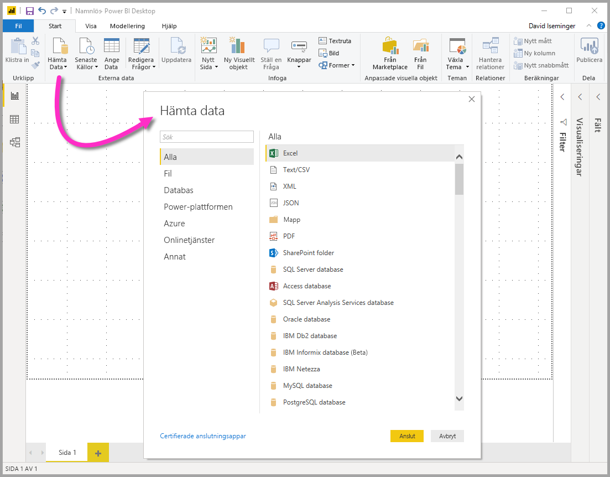
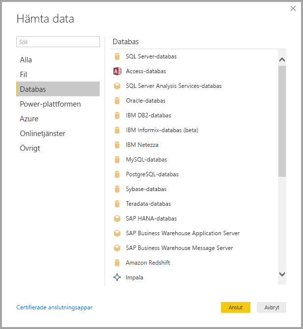
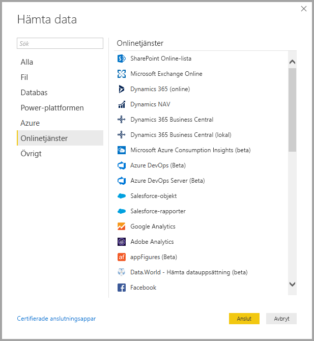

# <a name="data-sources-in-power-bi-desktop"></a>Datakällor i Power BI Desktop

Med Power BI Desktop kan du ansluta till data från många olika källor. En fullständig lista över tillgängliga datakällor finns i [Power BI-datakällor](power-bi-data-sources.md).

Du ansluter till data med hjälp av menyfliksområdet **Start**. Om du vill se menyn för **Mest vanliga** datatyper, väljer du knappetiketten **Hämta data** eller nedåtpilen.


Gå till dialogrutan **Hämta data** genom att visa menyn med **Mest vanliga** datatyper och välj **Mer**. Du kan även öppna dialogrutan **Hämta data** (och kringgå menyn **Mest vanliga**) genom att välja ikonen **Hämta data** direkt.



> [!NOTE]
> Power BI-teamet utökar ständigt de datakällor som är tillgängliga för Power BI Desktop och Power BI-tjänsten. Därför visas ofta tidiga versioner av pågående datakällor markerade med **beta** eller **förhandsversion**. Alla datakällor som har markerats som **Beta** eller **Förhandsversion** har begränsad support och funktionalitet och ska inte användas i produktionsmiljöer. Dessutom kanske datakällor som är markerade som **Beta** eller **Förhandsversion** för Power BI Desktop inte är tillgängliga för användning i Power BI-tjänsten eller andra Microsoft-tjänster förrän datakällan blir allmänt tillgänglig.

> [!NOTE]
> Det finns många dataanslutningar för Power BI Desktop som kräver Internet Explorer 10 (eller senare) för autentisering. 


## <a name="data-sources"></a>Datakällor

Dialogrutan **Hämta data** ordnar datatyperna i följande kategorier:

* Alla
* Fil
* Databas
* Power Platform
* Azure
* Onlinetjänster
* Annat

I kategorin **Alla** finns alla dataanslutningstyper från alla kategorier.

### <a name="file-data-sources"></a>Fildatakällor

I kategorin **Fil** finns följande dataanslutningar:

* Excel
* Text/CSV
* XML
* JSON
* Mapp
* PDF
* SharePoint-mapp

Följande bild visar fönstret **Hämta data** för **Fil**.


### <a name="database-data-sources"></a>Databasens datakällor

Kategorin **Databas** innehåller följande dataanslutningar:

* SQL Server-databas
* Access-databas
* SQL Server Analysis Services-databas
* Oracle-databas
* IBM DB2-databas
* IBM Informix-databas (beta)
* IBM Netezza
* MySQL-databas
* PostgreSQL-databas
* Sybase-databas
* Teradata-databas
* SAP HANA-databas
* SAP Business Warehouse Application Server
* SAP Business Warehouse Message Server
* Amazon Redshift
* Impala
* Google BigQuery
* Vertica
* Snowflake
* Essbase
* AtScale-kuber
* BI-anslutningsapp 
* Data Virtuality LDW (Beta)
* Denodo
* Dremio
* Exasol
* Indexima (Beta)
* InterSystems IRIS (Beta)
* Jethro (Beta)
* Kyligence
* MarkLogic

> [!NOTE]
> Vissa databaskopplingar kräver att du aktiverar dem genom att välja **Arkiv > Alternativ och inställningar > Alternativ** sedan välja **Förhandsversionsfunktioner** och aktivera kopplingen. Om du inte ser några av de kopplingar som nämns ovan och vill använda dem, kontrollerar du dina inställningar för **Förhandsversionsfunktioner**. Observera att alla datakällor som har markerats som *beta* eller *förhandsversion* har begränsad support och funktionalitet och ska inte användas i produktionsmiljöer.

Följande bild visar fönstret **Hämta data** för **Databas**.



### <a name="power-platform-data-sources"></a>Power Platform-datakällor

I **Power Platform**-kategorin finns följande dataanslutningar:

* Power BI-datauppsättningar
* Power BI-dataflöden
* Common Data Service
* Power Platform-dataflöden

Följande bild visar fönstret **Hämta data** för **Power Platform**.


### <a name="azure-data-sources"></a>Azure-datakällor

Kategorin **Azure** innehåller följande dataanslutningar:

* Azure SQL Database
* Azure SQL Data Warehouse
* Azure Analysis Services-databas
* Azure Database for PostgreSQL
* Azure Blob Storage
* Azure Table Storage
* Azure Cosmos DB
* Azure Data Lake Storage Gen2
* Azure Data Lake Storage Gen1
* Azure HDInsight (HDFS)
* Azure HDInsight Spark
* HDInsight Interactive-fråga
* Azure Data Explorer (Kusto)
* Azure Cost Management


Följande bild visar fönstret **Hämta data** för **Azure**.


### <a name="online-services-data-sources"></a>Datakällor för onlinetjänster

Kategorin **Onlinetjänster** innehåller följande dataanslutningar:

* SharePoint Online-lista
* Microsoft Exchange Online
* Dynamics 365 (online)
* Dynamics NAV
* Dynamics 365 Business Central
* Dynamics 365 Business Central (lokal)
* Microsoft Azure Consumption Insights (beta)
* Azure-DevOps (endast kort)
* Azure-DevOps Server (endast kort)
* Salesforce-objekt
* Salesforce-rapporter
* Google Analytics
* Adobe Analytics
* appFigures (beta)
* Data.World – Hämta datauppsättning (beta)
* GitHub (beta)
* LinkedIn Sales Navigator (Beta)
* Marketo (beta)
* Mixpanel (beta)
* Planview Enterprise One – PRM (beta)
* Planview Projectplace (beta)
* QuickBooks Online (beta)
* Smartsheet
* SparkPost (beta)
* SweetIQ (beta)
* Planview Enterprise One – CTM (Beta)
* Twilio (beta)
* tyGraph (beta)
* Webtrends (beta)
* Zendesk (beta)
* Asana (Beta)
* Dynamics 365 Customer Insights (Beta)
* Emigo Data Source
* Entersoft Business Suite (Beta)
* FactSet Analytics (Beta)
* Industrial App Store
* Intune Data Warehouse (Beta)
* Microsoft Graph Security (Beta)
* Product Insights (Beta)
* Quick Base
* TeamDesk (beta)
* Workplace Analytics (Beta)
* Projectplace för Power BI (Beta)
* Webtrends Analytics (Beta)
* Zoho Creator (Beta)

Följande bild visar fönstret **Hämta data** för **Onlinetjänster**.



### <a name="other-data-sources"></a>Andra datakällor

Kategorin **Övrigt** innehåller följande dataanslutningar:

* Webben
* SharePoint-lista
* OData-feed
* Active Directory
* Microsoft Exchange
* Hadoop-fil (HDFS)
* Spark
* Hive LLAP (Beta)
* R-skript
* Python-skript
* ODBC
* OLE DB
* BI360 –Budgeting & Financial Reporting (Beta)
* Cognite Data Fusion (Beta)
* FHIR
* Information Grid (Beta)
* Jamf Pro (Beta)
* MicroStrategy for Power BI
* Paxata
* QubolePresto (Beta)
* Roamler (Beta)
* Siteimprove
* SurveyMonkey (Beta)
* TIBCO (R) Data Virtualization (Beta)
* Vena (Beta)
* Workforce Dimensions (Beta)
* Zucchetti HR Infinity (Beta)
* Tenforce (Smart)List
* Shortcuts Business Insights (Beta)
* Vessel Insight (Beta)
* Tom fråga

Följande bild visar fönstret **Hämta data** för **Övrigt**.


> [!NOTE]
> För tillfället går det inte att ansluta till anpassade datakällor som skyddas med Azure Active Directory.

## <a name="connecting-to-a-data-source"></a>Ansluta till en datakälla

Anslut till en datakälla genom att välja datakällan i fönstret **Hämta data** och välja **Anslut**. I följande bild har **Webb** valts från dataanslutningskategorin **Övrigt**.


Ett fönster för anslutningen visas, specifik för dataanslutningstypen. Om det krävs autentiseringsuppgifter uppmanas du att ange dem. Följande bild visar en URL som anges för att ansluta till en webbdatakälla.


Ange URL:en eller anslutningsinformationen för resursen och välj sedan **OK**. Power BI Desktop ansluter till datakällan och visar tillgängliga datakällor i **Navigatör**.


Läs in datan genom att välja knappen **Läs in** längst ned i fönstret **Navigatör**. Om du vill omvandla eller redigera frågan i Power Query-redigeraren innan du läser in datan, väljer du knappen **Transformera data**.

Det är allt du behöver veta om att ansluta till datakällor i Power BI Desktop! Försök att ansluta till data från våra växande lista med datakällor och kom tillbaka ofta – vi fyller på listan hela tiden.

## <a name="using-pbids-files-to-get-data"></a>Hämta data med PBIDS-filer

PBIDS-filer är Power BI Desktop-filer med en speciell struktur där ett .PBIDS-tillägg visar att det är en Power BI-datakällfil.

Du kan skapa en PBIDS-fil för att effektivisera **Hämta data**-upplevelsen för rapportskapare i din organisation. För att göra det enklare för en ny rapportförfattare att använda PBIDS-filer, rekommenderar vi att en administratör skapar dessa filer för anslutningar som ofta används.

När en författare öppnar en PBIDS-fil, öppnas Power BI Desktop och användaren uppmanas att ange autentiseringsuppgifter för att kunna autentisera och ansluta till den datakälla som anges i filen. Dialogrutan **Navigering** öppnas där användaren måste välja de tabeller från datakällan som ska läsas in i modellen. Användarna kan också behöva välja databas(er), om det inte har angetts några i PBIDS-filen.

Från och med nu kan användaren börja skapa visualiseringar eller välja **Senast använda källor** för att läsa in en ny uppsättning tabeller i modellen.

För närvarande har PBIDS-filer bara stöd för en enda datakälla i en enda fil. Om du anger fler än en datakälla uppstår ett fel.

För att kunna skapa PBIDS-filen måste administratören ange nödvändiga indata för en enskild anslutning. Användaren kan även ange anslutningsläget som antingen DirectQuery eller Import. Om **läget** saknas eller är null i filen, uppmanas användaren som öppnar filen i Power BI Desktop att välja **DirectQuery** eller **Import**.

### <a name="pbids-file-examples"></a>Exempel på PBIDS-filer

Det här avsnittet innehåller några exempel på datakällor som används ofta. PBIDS-filtypen stöder bara dataanslutningar som också stöds i Power BI Desktop, med två undantag: Live Connect och Tom fråga.

PBIDS-filen innehåller *inte* någon autentiserings-, tabell- eller schemainformation.  

Nedanstående kodfragment visar några vanliga exempel på PBIDS-filer, men de är inte fullständiga. För andra datakällor kan du referera till [DSR-formatet (Data Source Reference) för protokoll- och adressinformation](https://docs.microsoft.com/azure/data-catalog/data-catalog-dsr#data-source-reference-specification).

De här exemplen är bara tips, de är inte avsedda att vara heltäckande och inkluderar inte alla anslutningsprogram som stöds i DSR-formatet. Administratörer eller organisationer kan skapa sina egna datakällor med hjälp av de här exemplen som guider och använda dem till att skapa sina egna filer för datakällan.

#### <a name="azure-as"></a>Azure AS

```json
{ 
    "version": "0.1", 
    "connections": [ 
    { 
        "details": { 
        "protocol": "analysis-services", 
        "address": { 
            "server": "server-here" 
        }, 
        } 
    } 
    ] 
}
```

#### <a name="folder"></a>Mapp

```json
{ 
  "version": "0.1", 
  "connections": [ 
    { 
      "details": { 
        "protocol": "folder", 
        "address": { 
            "path": "folder-path-here" 
        } 
      } 
    } 
  ] 
} 
```

#### <a name="odata"></a>OData

```json
{ 
  "version": "0.1", 
  "connections": [ 
    { 
      "details": { 
        "protocol": "odata", 
        "address": { 
            "url": "URL-here" 
        } 
      } 
    } 
  ] 
} 
```

#### <a name="sap-bw"></a>SAP BW

```json
{ 
  "version": "0.1", 
  "connections": [ 
    { 
      "details": { 
        "protocol": "sap-bw-olap", 
        "address": { 
          "server": "server-name-here", 
          "systemNumber": "system-number-here", 
          "clientId": "client-id-here" 
        }, 
      } 
    } 
  ] 
} 
```

#### <a name="sap-hana"></a>SAP HANA

```json
{ 
  "version": "0.1", 
  "connections": [ 
    { 
      "details": { 
        "protocol": "sap-hana-sql", 
        "address": { 
          "server": "server-name-here:port-here" 
        }, 
      } 
    } 
  ] 
} 
```

#### <a name="sharepoint-list"></a>SharePoint-lista

URL:en måste peka på själva SharePoint-webbplatsen och inte på en lista på webbplatsen. Användarna får en navigatör som de kan använda för att välja en eller flera listor från den platsen, där varje lista blir en tabell i modellen.

```json
{ 
  "version": "0.1", 
  "connections": [ 
    { 
      "details": { 
        "protocol": "sharepoint-list", 
        "address": { 
          "url": "URL-here" 
        }, 
       } 
    } 
  ] 
} 
```

#### <a name="sql-server"></a>SQL Server

```json
{ 
  "version": "0.1", 
  "connections": [ 
    { 
      "details": { 
        "protocol": "tds", 
        "address": { 
          "server": "server-name-here", 
          "database": "db-name-here (optional) "
        } 
      }, 
      "options": {}, 
      "mode": "DirectQuery" 
    } 
  ] 
} 
```

#### <a name="text-file"></a>Textfil

```json
{ 
  "version": "0.1", 
  "connections": [ 
    { 
      "details": { 
        "protocol": "file", 
        "address": { 
            "path": "path-here" 
        } 
      } 
    } 
  ] 
} 
```

#### <a name="web"></a>Webben

```json
{ 
  "version": "0.1", 
  "connections": [ 
    { 
      "details": { 
        "protocol": "http", 
        "address": { 
            "url": "URL-here" 
        } 
      } 
    } 
  ] 
} 
```

#### <a name="dataflow"></a>Dataflöde

```json
{
  "version": "0.1",
  "connections": [
    {
      "details": {
        "protocol": "powerbi-dataflows",
        "address": {
          "workspace":"workspace id (Guid)",
          "dataflow":"optional dataflow id (Guid)",
          "entity":"optional entity name"
        }
       }
    }
  ]
}
```

## <a name="next-steps"></a>Nästa steg

Du kan göra många olika saker med Power BI Desktop. Läs följande resurser för mer information om dess möjligheter:

* [Vad är Power BI Desktop?](../fundamentals/desktop-what-is-desktop.md)
* [Frågeöversikt med Power BI Desktop](../transform-model/desktop-query-overview.md)
* [Datatyper i Power BI Desktop](desktop-data-types.md)
* [Forma och kombinera data i Power BI Desktop](desktop-shape-and-combine-data.md)
* [Vanliga frågeuppgifter i Power BI Desktop](../transform-model/desktop-common-query-tasks.md)
