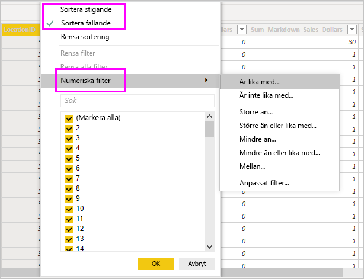

# Arbeta med datavyn i Power BI Desktop

*Datavyn* gör det enklare att inspektera, utforska och förstå data i *Power BI Desktop*-modellen. Det här skiljer sig från hur du visar tabeller, kolumner och data i *Power Query Editor*. I datavyn tittar du på dina data *efter* att de har lästs in i modellen.

> [!NOTE]
> Eftersom datavyn visar data när de har lästs in i modellen visas inte datavyn om alla datakällor är baserade på DirectQuery. 

När du modellerar dina data vill ibland du se vad som faktiskt finns i en tabell eller kolumn utan att skapa ett visuellt objekt på rapportarbetsytan. Du kanske vill se vad som finns på radnivå. Den här möjligheten är särskilt användbar när du skapar mått och beräknade kolumner eller om du behöver identifiera en datatyp eller datakategori.

Nu ska vi titta närmare på några av elementen i datavyn.

1. **Ikon för datavy**. Välj den här ikonen för att öppna datavyn.

2. **Datarutnät**. Det här området visar den valda tabellen och alla kolumner och rader i den. Kolumner som är dolda från *rapportvyn* är nedtonade. Du kan högerklicka på en kolumn för att visa fler alternativ.

3. **Menyfliksområde för modellering**. Här kan du hantera relationer, skapa beräkningar samt ändra datatyp, format och datakategori för en kolumn.

4. **Formelfält**. Ange DAX-formler (Data Analysis Expression) för mått och beräknade kolumner.

5. **Sök**. Sök efter en tabell eller kolumn i modellen.

6. **Fältlista**. Välj en tabell eller kolumn som du vill visa i rutnätet.

## Filtrering i datavyn

Du kan även filtrera och sortera data i datavyn. Varje kolumn har en ikon som anger sorteringsriktningen, om sortering används.

Du kan filtrera enskilda värden eller använda avancerad filtrering baserat på data i kolumnen.

> [!NOTE]
> Om en Power BI-modell har skapats i en annan kultur än ditt aktuella gränssnitt visas sökrutan i användargränssnittet för datavyn endast för textfält. Detta gäller till exempel en modell som skapats med amerikansk engelska och som du sedan visar på spanska.

## Nästa steg

Du kan göra många olika saker med Power BI Desktop. Läs följande resurser för mer information om dess möjligheter:

* [Vad är Power BI Desktop?](../fundamentals/desktop-what-is-desktop.md)
* [Frågeöversikt med Power BI Desktop](../transform-model/desktop-query-overview.md)
* [Datatyper i Power BI Desktop](desktop-data-types.md)
* [Forma och kombinera data i Power BI Desktop](desktop-shape-and-combine-data.md)
* [Vanliga frågeuppgifter i Power BI Desktop](../transform-model/desktop-common-query-tasks.md)
