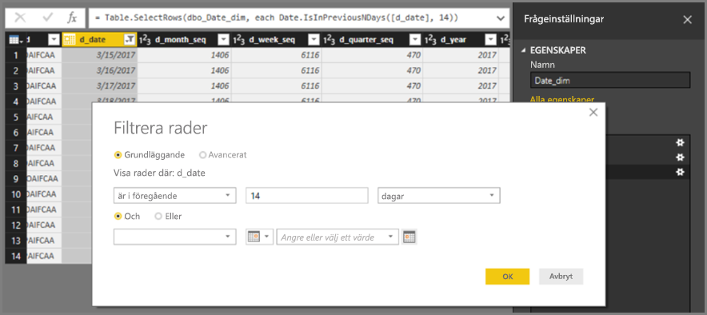
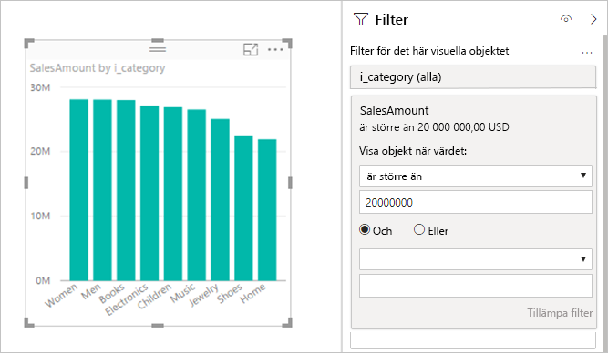
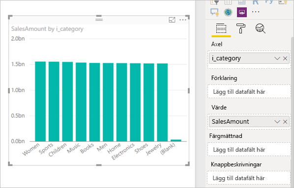

# <a name="about-using-directquery-in-power-bi"></a>Använda DirectQuery i Power BI

Du kan ansluta till alla typer av olika datakällor när du använder *Power BI Desktop* eller *Power BI-tjänsten*, och du kan göra dessa dataanslutningar på olika sätt. Du kan *importera* data till Power BI, vilket är det vanligaste sättet att hämta data på, eller ansluta direkt till data i den ursprungliga källdatabasen, vilket kallas för *DirectQuery*. I den här artikeln beskrivs DirectQuery och dess funktioner:

* Olika anslutningsalternativ för DirectQuery
* Riktlinjer för när du bör använda DirectQuery i stället för import
* Nackdelar med att använda DirectQuery
* Metodtips för att använda DirectQuery

Följ metodtipsen för när du ska använda import i stället för DirectQuery:

* Du bör importera data till Power BI när det är möjligt. När du importerar utnyttjar du den högpresterande frågemotorn i Power BI i en mycket interaktiv och funktionsrik miljö.
* Om det av någon anledning inte fungerar för dig att importera data så bör du använda DirectQuery. Om dina data t.ex. ändras ofta, och rapporterna måste spegla senaste data, då kan DirectQuery vara det bästa alternativet. Det är dock bara praktiskt genomförbart att använda DirectQuery när den underliggande datakällan kan tillhandahålla interaktiva frågor på mindre än 5 sekunder för normala aggregeringar och kan hantera den frågebelastning som genereras. Du bör dessutom noga läsa igenom listan med begränsningar som gäller för användning av DirectQuery.

De funktioner som erbjuds i Power BI för import respektive DirectQuery utvecklas hela tiden. Det kan bland annat gälla att ge större flexibilitet vid användning av importerade data, så att import kan användas i fler fall, och att eliminera några av nackdelarna med att använda DirectQuery. Oavsett vilka förbättringar som görs så är den underliggande datakällans prestanda alltid av största vikt när du använder DirectQuery. Om den underliggande datakällan är långsam så bör du inte använda DirectQuery.

I den här artikeln går vi igenom DirectQuery med Power BI, och *inte SQL Server Analysis Services*. DirectQuery är även en funktion i SQL Server Analysis Services. Mycket av informationen i den här artikeln gäller för den funktionen också. Det finns dock viktiga skillnader. Du kan läsa om DirectQuery med SQL Server Analysis Services i [DirectQuery i SQL Server 2016 Analysis Services](https://download.microsoft.com/download/F/6/F/F6FBC1FC-F956-49A1-80CD-2941C3B6E417/DirectQuery%20in%20Analysis%20Services%20-%20Whitepaper.pdf).

Fokus i den här artikeln är det rekommenderade arbetsflödet för DirectQuery där rapporten skapas i Power BI Desktop, men vi går även igenom direktanslutning i Power BI-tjänsten.

## <a name="power-bi-connectivity-modes"></a>Power BI-anslutningslägen

Power BI ansluter till ett stort antal olika datakällor, bl.a. följande:

* Online-tjänster (Salesforce, Dynamics 365 m.fl.)
* Databaser (SQL Server, Access, Amazon Redshift m.fl.)
* Enkla filer (Excel, JSON, m.fl.)
* Andra datakällor (Spark, webbplatser, Microsoft Exchange, m.fl.)

För dessa källor går det att importera data till Power BI. För vissa är det också möjligt att ansluta med DirectQuery. Du kan se en sammanfattning av vilka källor som har stöd för DirectQuery i [Datakällor som stöds av DirectQuery](power-bi-data-sources.md). Fler källor kommer att bli DirectQuery-kompatibla i framtiden, i synnerhet sådana som kan förväntas leverera bra interaktiva frågeprestanda.

SQL Server Analysis Services är ett specialfall. När du ansluter till SQL Server Analysis Services kan du importera data eller använda en *liveanslutning*. Att använda en liveanslutning fungerar ungefär som DirectQuery. Inga data importeras och du kör frågor mot den underliggande datakällan för att uppdatera ett visuellt objekt. En liveanslutning skiljer sig på många andra sätt, så därför används termen *liveanslutning* istället för *DirectQuery*.

Dessa tre är sätt att ansluta till data: *import*, *DirectQuery* och *liveanslutning*.

### <a name="import-connections"></a>Importanslutningar

När du använder **Hämta data** i Power BI Desktop för att ansluta till en datakälla som SQL Server fungerar anslutningen så här:

* När du använder Hämta data definierar de valda tabeller initialt en fråga som returnerar en uppsättning data. Du kan redigera de här frågorna innan data läses in, till exempel för att tillämpa filter, aggregera data eller koppla ihop olika tabeller.
* Vid inläsningen importeras alla de data som definieras av frågorna till Power BI-cachen.
* När du skapar ett visuellt objekt i Power BI Desktop körs frågor mot importerade data. Power BI-lagringen gör att frågorna körs snabbt. Ändringar i det visuella objektet visas omedelbart.
* Eventuella ändringar i underliggande data visas inte i visuella objekt. Du måste *uppdatera* så att data importeras igen.
* När du publicerar rapporten som en *.pbix-fil* i Power BI-tjänsten skapas en datamängd som laddas upp till Power BI-tjänsten. Importerade data inkluderas i den datauppsättningen. Därefter kan du schemalägga uppdateringar av dessa data och exempelvis importera om data en gång om dagen. Beroende på den ursprungliga datakällans plats kan det vara nödvändigt att konfigurera en lokal datagateway.
* När du öppnar en befintlig rapport i Power BI-tjänsten, eller skapar en ny rapport, så körs en fråga mot dessa data igen vilket garanterar interaktivitet.
* Visuella objekt, eller hela rapportsidor, kan fästas på instrumentpaneler. Panelerna uppdateras automatiskt varje gång den underliggande datamängden uppdateras.

### <a name="directquery-connections"></a>DirectQuery-anslutningar

När du använder **Hämta data** i Power BI Desktop för att ansluta till en datakälla och väljer DirectQuery så fungerar anslutningen så här:

* När du använder Hämta data så väljer du först källan. För relationsdatabaser väljs en uppsättning tabeller där var och en definierar en fråga som logiskt returnerar en uppsättning data. När det gäller flerdimensionella källor som SAP BW väljs bara källan.
* Vid inläsningen importeras dock inga data till Power BI-lagringen. När du skapar ett visuellt objekt skapas i Power BI Desktop så skickas istället frågor till den underliggande datakällan som returnerar nödvändiga data. Hur lång tid det tar att uppdatera det visuella objektet beror på den underliggande datakällans prestanda.
* Eventuella ändringar i underliggande data visas inte direkt i befintliga visuella objekt. Du måste fortfarande uppdatera. Nödvändiga frågor skickas på nytt för varje visuellt objekt och det visuella objektet uppdateras om det behövs.
* När rapporten publiceras till Power BI-tjänsten resulterar det återigen i en datamängd i Power BI-tjänsten, precis som vid import. *Inga data* ingår dock med den datauppsättningen.
* När du öppnar en befintlig rapport i Power BI-tjänsten, eller skapar en ny, körs återigen en fråga mot den underliggande datakällan så att nödvändiga data kan hämtas. Beroende på den ursprungliga datakällans plats kan det vara nödvändigt att konfigurera en lokal datagateway, som kan behövas för importläget om data uppdateras.
* Visuella objekt, eller hela rapportsidor, kan fästas på instrumentpaneler. För att säkerställa att en instrumentpanel öppnas snabbt så uppdateras panelerna automatiskt enligt ett fastlagt schema, exempelvis varje timme. Du kan styra den här uppdateringens frekvens så att den reflekterar hur ofta data ändras, och hur viktigt det är att den senaste informationen visas. När du öppnar en instrumentpanel avspeglar panelerna data som de såg ut vid tiden för den senaste uppdateringen, och inte nödvändigtvis de senaste ändringarna i den underliggande källan. Du kan se till att en öppen instrumentpanel är aktuell genom att uppdatera den.

### <a name="live-connections"></a>Live-anslutningar

När du ansluter till SQL Server Analysis Services kan du välja att importera data från, eller live-ansluta till, den valda datamodellen. Om du väljer att importera så definierar du en fråga mot den externa SQL Server Analysis Services-källan, och data importeras som vanligt. Om du väljer att ansluta live definieras ingen fråga, och hela den externa modellen visas i fältlistan.

Situationen som beskrivs i föregående stycke gäller även när du ansluter till följande källor, förutom att det inte finns något alternativ för att importera data:

* Power BI-datamängder, till exempel när du ansluter till en Power BI-datamängd som tidigare har skapats och publicerats till tjänsten, för att skapa en ny rapport över den.
* Common Data Services.

När rapporter över SQL Server Analysis Services publiceras till Power BI-tjänsten fungerar de ungefär som DirectQuery-rapporter på följande sätt:

* När du öppnar en befintlig rapport i Power BI-tjänsten eller skriver en ny rapport så körs en fråga mot den underliggande SQL Server Analysis Services-källan, och för det kan du behöva en lokal datagateway.
* Instrumentpaneler uppdateras automatiskt enligt ett schema, exempelvis varje timme.

Det finns dock viktiga skillnader. För liveanslutningar skickas till exempel alltid identiteten för användaren som öppnar rapporten till den underliggande SQL Server Analysis Services-källan.

Nu när vi är klara med de här jämförelserna ska vi fokusera helt på DirectQuery i den här artikeln.

## <a name="when-is-directquery-useful"></a>När är DirectQuery användbart?

I den här tabellen beskrivs några situationer där det skulle vara särskilt bra med anslutning via DirectQuery. Den innehåller bland annat fall där det skulle vara fördelaktigt att lämna data i den ursprungliga källan. Beskrivningen innehåller en diskussion om huruvida det angivna scenariot är tillgänglig i Power BI.

| Begränsning | Beskrivning |
| --- | --- |
| Data ändras ofta och det behövs rapportering praktiskt taget i realtid |Du kan uppdatera modeller med importerade data högst en gång per timme (oftare med Power BI Pro-licens eller en Power BI Premium-prenumeration). Om data ändras kontinuerligt och rapporterna måste visar aktuella data så kanske det inte fungerar med importer och schemalagd uppdatering. Du kan strömma data direkt till Power BI, men det finns begränsningar för hur stora datavolymer som stöds. <br/> <br/> Om du använder DirectQuery innebär det i stället att instrumentpanelen alltid visar aktuella data från källan när du öppnar eller uppdaterar en rapport eller instrumentpanel. Du kan också uppdatera instrumentpanelens paneler oftare, ned till var 15:e minut. |
| Data är mycket omfattande |Om det gäller mycket stora datamängder är det inte praktiskt genomförbart att importera allt. Med DirectQuery behöver du inga stora dataöverföringar eftersom frågorna körs på plats. <br/> <br/> Stora mängder data kan dock innebära att frågeprestanda mot den underliggande källan blir lidande, läs mer i avsnittet [Effekter av att använda DirectQuery](#implications-of-using-directquery). Du behöver inte alltid importera samtliga detaljer om dina data. Du kan i stället föraggregera data under importen. I *frågeredigeraren* kan du enkelt föraggregera data under importen. I yttersta fall skulle det gå att importera exakt de aggregerade data som behövs för respektive virtuellt objekt. Även om det är enklast att använda DirectQuery när du hanterar stora datamängder så kan det vara ett alternativ att importera aggregerade data om den underliggande källan är för långsam. |
| Säkerhetsregler definieras i den underliggande datakällan |När data importeras ansluter Power BI till datakällan med den aktuella användarens autentiseringsuppgifter från Power BI Desktop, eller de autentiseringsuppgifter som definierades när den schemalagda uppdateringen konfigurerades från Power BI-tjänsten. När du publicerar och delar en sådan rapport måste du vara noga med att bara dela den med användare som har tillåtelse att se dessa data, eller så måste du definiera säkerhet på radnivå som en del av datamängden. <br/> <br/> Eftersom DirectQuery alltid kör frågor mot den underliggande datakällan skulle den här konfigurationen innebära att du kan använda all eventuell säkerhet från den underliggande källan. För närvarande ansluter dock Power BI alltid till den underliggande källan med samma autentiseringsuppgifter som skulle användas vid import. <br/> <br/> Fram till det att Power BI tillåter att rapportkonsumentens identitet skickas till den underliggande källan så ger inte DirectQuery några fördelar avseende datakällans säkerhet. |
| Begränsningar för datasuveränitet gäller |Vissa organisationer har policyer avseende datasuveränitet, vilket innebär att data inte får lämna organisationens lokaler. En lösning baserad på import skulle i sådana fall utgöra ett uppenbart problem. Men med DirectQuery skulle dessa data finnas kvar i den underliggande datakällan. <br/> <br/> Vissa cacheminnen med data på visuell objektnivå ligger dock kvar i Power BI-tjänsten med DirectQuery, på grund av den schemalagda uppdateringen av panelerna. |
| Den underliggande datakällan är en OLAP-källa som innehåller åtgärder |Om den underliggande datakällan innehåller *mått*, som SAP HANA eller SAP Business Warehouse, så medför import av data andra problem. Det innebär att de data som importeras ligger på en viss aggregeringsnivå, som definieras av frågan. Ta till exempel måtten **TotalFörsäljning** per **Klass**, **År** och **Stad**. Om ett visuellt objekt sedan frågar efter data i ett aggregat på högre nivå, som **TotalFörsäljning** per **År**, aggregerar det aggregatvärdet ytterligare. Den här aggregeringen fungerar bra för additiva mått som **Summa** och **Min**, men den är ett problem för icke-additiva mått som **Genomsnitt** och **DistinktAntal**. <br/> <br/> Om du vill göra det enklare att hämta rätt aggregeringsdata, som behövs för de specifika visuella objekten, direkt från källan så måste du skicka frågorna per visuellt objekt, som i DirectQuery. <br/> <br/> Om du väljer DirectQuery när du ansluter till SAP Business Warehouse (BW), så möjliggör du den här hanteringen av mått. Du kan läsa om SAP BW i [DirectQuery och SAP BW](desktop-directquery-sap-bw.md). <br/> <br/> Men för närvarande behandlar DirectQuery via SAP HANA källan som en relationskälla och fungerar ungefär som en import. Det här beskrivs närmare i [DirectQuery och SAP HANA](desktop-directquery-sap-hana.md). |

Så sammanfattningsvis är DirectQuery att föredra i Power BI i följande situationer med nuvarande funktioner:

* Data ändras ofta och det behövs rapportering praktiskt taget i realtid.
* Hantering av mycket stora datamängder utan att de behöver aggregeras i förväg.
* Begränsningar för datasuveränitet gäller.
* Källan är en flerdimensionell källa som innehåller mått, som SAP BW.

Informationen i listan ovan gäller för användning av enbart Power BI. I stället kan du använda en extern SQL Server Analysis Services- eller Azure Analysis Services-modell till att importera data. Anslut sedan till modellen via Power BI. Även om det krävs ytterligare konfiguration för den här metoden så ger den större flexibilitet. Mycket större datavolymer kan importeras. Det finns ingen begränsning för hur ofta data kan uppdateras.

## <a name="implications-of-using-directquery"></a>Effekter av att använda DirectQuery

Att använda DirectQuery kan ha potentiellt negativa effekter, och några av dem beskrivs i det här avsnittet. Vissa av dessa begränsningar kan variera beroende på vilken källa som används. Vi tar upp begränsningar där det är relevant, och de källor som avviker markant behandlas i separata artiklar.

### <a name="performance-and-load-on-the-underlying-source"></a>Prestanda och belastning på den underliggande källan

När du använder DirectQuery varierar upplevelsen mycket med avseende på den underliggande datakällans prestanda. Om det till exempel tar några sekunder att uppdatera varje visuellt objekt när du har ändrat ett utsnittsvärde så är upplevelsen rimlig. Det kan kännas som att upplevelsen är seg jämfört med det omedelbara svaret när du importerar data till Power BI. Om källans är så långsam att det tar mer än tio sekunder att uppdatera visuella objekt så blir upplevelsen mycket dålig. Frågekörningar kan då till och med misslyckas.

Förutom den underliggande källans prestanda måste du även tänka på källans belastning. Belastningen påverkar systemets prestanda. Varje användare som öppnar en delad rapport och varje panel som uppdateras skickar minst en fråga per visuellt objekt till den underliggande källan. Det här innebär att källan måste kunna hantera en sådan frågebelastning med rimliga prestanda.

### <a name="security-implications-when-combining-data-sources"></a>Säkerhetsaspekter när du kombinerar datakällor

Det är möjligt att använda flera datakällor i en DirectQuery-modell, precis som när du importerar data, med hjälp av funktionen [Sammansatta modeller](../transform-model/desktop-composite-models.md). När du använder flera datakällor är det viktigt att du förstår hur data flyttas fram och tillbaka mellan de underliggande datakällorna, och vilka [säkerhetsrisker](../transform-model/desktop-composite-models.md#security-implications) det innebär.

### <a name="limited-data-transformations"></a>Begränsade datatransformationer

På liknande sätt finns det begränsningar när det gäller vilka datatransformationer som kan användas i Frågeredigeraren. Med importerade data kan du enkelt använda en avancerad uppsättning transformationer för att rensa och transformera data innan du använder dem till att skapa visuella objekt, som att parsa JSON-dokument eller att pivotera data från kolumn- till radform. Dessa transformationer är mer begränsade i DirectQuery.

När du först ansluter till en OLAP-källa som SAP Business Warehouse kan du inte definiera några transformationer alls, utan hela den externa modellen hämtas från källan. För relationskällor som SQL Server kan du fortfarande definiera en uppsättning transformationer per fråga, men transformationerna är begränsade av prestandaskäl.

Sådana transformationer måste tillämpas på varje fråga som körs mot den underliggande källan, snarare än en enda gång vid datauppdatering, så du kan bara använda transformationer som rimligen kan översättas till en enda intern fråga. Om du använder en transformation som är för komplex visas ett fel om att du måste ta bort den eller byta modell till importläge.

Frågan från dialogrutan **Hämta data** eller Frågeredigeraren används dessutom i en select-delsats i de frågor som genereras och skickas för att hämta nödvändiga data för ett visuellt objekt. Frågan som definierats i Frågeredigeraren måste vara giltig i den här kontexten. Detta innebär att du i synnerhet inte kan använda en fråga med vanliga tabelluttryck eller en fråga som anropar lagrade procedurer.

### <a name="modeling-limitations"></a>Modelleringsbegränsningar

Termen *modellering* innebär i den här kontexten att rådata förfinas och berikas som en del av redigeringen av rapporten som använder dem. Exempel:

* Definiera relationer mellan tabeller
* Lägga till nya beräkningar (beräknade kolumner och mått)
* Byta namn på och dölja kolumner och mått
* Definiera hierarkier
* Definiera en kolumns formatering, standardsammanfattning och sorteringsordning
* Grupperings- eller klustringsvärden

Du kan fortfarande göra många av de här modellberikningarna när du använder DirectQuery, och fortfarande gäller principen att rådata berikas för att förbättra senare användning. Vissa modelleringsfunktioner är dock inte tillgängliga, eller begränsade, när du använder DirectQuery. Begränsningar tillämpas vanligtvis för att undvika prestandaproblem. Här visas de begränsningar som är gemensamma för alla DirectQuery-källor. Det kan finnas andra begränsningar för enskilda källor, läs mer under [Nästa steg](#next-steps).

* **Ingen inbyggd datumhierarki:** När du importerar data får alla datum/datetime-kolumner som standard en tillgänglig inbyggd datumhierarki. Om du till exempel importerar en tabell med försäljningsorder som innehåller kolumnen **OrderDate**, och sedan använder **OrderDate** i ett visuellt objekt, så kan du välja lämplig nivå att använda (år, månad, dag). Den här inbyggda datumhierarkin är inte tillgänglig när du använder DirectQuery. Om det finns en tillgänglig **datumtabell** i den underliggande källan, något som är vanligt i många datalager, så kan du använda tidsinformationsfunktionerna i DAX som vanligt.
* **Stöd för datum/tid bara med sekundprecision:** När du använder tidskolumnen i din datauppsättning utfärdar Power BI-bara frågor till den underliggande källan med en detaljnivå på sekunder. Frågor skickas inte till DirectQuery-källan för millisekunder. Ta bort den här delen av tidsvärdena från dina källkolumner.
* **Begränsningar i beräknade kolumner:** Beräknade kolumner är begränsade till att bara kunna hänvisa till värden på andra kolumner i samma tabell, utan att några aggregeringsfunktioner används. Dessutom är de tillåtna skalära DAX-funktionerna, som `LEFT()`, begränsade till de funktioner som kan push-överföras till den underliggande källan. Vilka funktioner det gäller varierar beroende på källans exakta funktioner. Funktioner som saknar stöd visas inte vid automatisk komplettering när du redigerar DAX för en beräknad kolumn, och om du använder dem resulterar det i ett fel.
* **Inget stöd för överordnade-underordnade DAX-funktioner:** I DirectQuery-läge kan du inte använda `DAX PATH()`-familjen med funktioner som normalt hanterar strukturer med överordnade-underordnade element, som i kontoplaner eller organisationshierarkier.
* **Beräknade tabeller stöds inte:** Du kan inte definiera en beräknad tabell med hjälp av ett DAX-uttryck i DirectQuery-läge.
* **Relationsfiltrering:** Läs mer om dubbelriktad filtrering i [Dubbelriktad korsfiltrering](https://download.microsoft.com/download/2/7/8/2782DF95-3E0D-40CD-BFC8-749A2882E109/Bidirectional%20cross-filtering%20in%20Analysis%20Services%202016%20and%20Power%20BI.docx). I det här faktabladet ges exempel i kontexten SQL Server Analysis Services. De grundläggande principerna gäller även för Power BI.
* **Ingen klustring:** När du använder DirectQuery kan du inte använda klustringsfunktionen till att söka efter grupper automatiskt.

### <a name="reporting-limitations"></a>Rapporteringsbegränsningar

Nästan alla rapporteringsfunktioner stöds för DirectQuery-modeller. Så länge som den underliggande källan erbjuder en lämplig prestandanivå kan samma uppsättning visualiseringar användas. Det finns några viktiga begränsningar för några av funktionerna i Power BI-tjänsten när du har publicerat en rapport:

* **Snabbinsikter stöds inte:** Snabbinsikter i Power BI söker snabbt igenom olika delmängder av din datauppsättning samtidigt som en uppsättning avancerade algoritmer används för att identifiera potentiellt intressanta insikter. På grund av de höga kraven på frågeprestanda är inte den här funktionen tillgänglig för datamängder som använder DirectQuery.
* **Frågor och svar stöds inte:** Power BI frågor och svar låter dig utforska dina data med hjälp av intuitiva, naturliga språkfunktioner och få svar i form av tabeller och diagram. Funktionen stöds för närvarande dock inte för datamängder som använder DirectQuery.
* **Utforska i Excel kommer troligen att resultera i sämre prestanda:** Du kan utforska dina data med hjälp av funktionen Utforska i Excel på en datamängd. På så sätt kan du skapa pivottabeller och pivotdiagram i Excel. Även om den här funktionen stöds för datamängder som använder DirectQuery så blir prestanda vanligtvis sämre än om du skapar visuella objekt i Power BI. Om det är viktigt för dig att använda Excel i dina scenarier bör du därför tänka på detta när du avgör om du ska använda DirectQuery.

### <a name="security"></a>Säkerhet

Som vi har diskuterat tidigare i artikeln så använder en rapport i DirectQuery alltid samma fasta autentiseringsuppgifter vid anslutning till den underliggande datakällan när den har publicerats till Power BI-tjänsten. Det här gäller DirectQuery, och inte liveanslutningar till SQL Server Analysis Services som fungerar annorlunda i det här avseendet. Därför måste du omedelbart konfigurera autentiseringsuppgifterna för den användare som ska användas när du har publicerat en DirectQuery-rapport. Innan du konfigurerar autentiseringsuppgifterna så går det inte att öppna rapporten i Power BI-tjänsten.

När du har angett autentiseringsuppgifterna så används de *oavsett vilken användare som öppnar rapporten*. På så sätt fungerar det precis som med importerade data. Varje användare ser samma data, såvida inte säkerhet på radnivå har definierats som en del av rapporten. Därför måste du vara lika uppmärksam när du delar rapporten, ifall det finns några definierade säkerhetsregler för den underliggande datakällan.

### <a name="behavior-in-the-power-bi-service"></a>Beteende i Power BI-tjänsten

I det här avsnittet går vi igenom hur en DirectQuery-rapport fungerar i Power BI-tjänsten. Syftet är att förklara vilken belastning som placeras på den ursprungliga datakällan givet antalet användare som rapporten och instrumentpanelen delas med, rapportens komplexitet och om säkerhet på radnivå har definierats i rapporten.

#### <a name="reports--opening-interacting-with-editing"></a>Rapporter – öppna, interagera med, redigera

När du öppnar en rapport uppdateras alla visuella objekt på sidan som visas. För varje visuellt objekt krävs det normalt minst en fråga till den underliggande datakällan. För en del visuella objekt krävs det mer än en fråga. Ett visuellt objekt kan till exempel visa aggregerade värden från två olika faktatabeller, innehålla ett komplicerat mått eller innehålla totalsummor för icke-additiva mått som Räkna distinkta. Om du flyttar till en ny sida uppdateras de visuella objekten. Vid uppdateringen skickas en ny uppsättning frågor till den underliggande källan.

Varje användaråtgärd i rapporten kan resultera i att visuella objekt uppdateras. Om du till exempel väljer ett annat värde i ett utsnitt måste en ny uppsättning frågor skickas för att uppdatera de berörda visuella objekten. Detsamma gäller om du klickar på något visuellt objekt för att korsmarkera andra visuella objekt, eller ändrar ett filter.

Om du redigerar en ny rapport krävs på motsvarande sätt att frågor skickas för varje steg på vägen mot att ta fram det slutgiltiga visuella objektet.

Det förekommer viss cachelagring av resultat. Uppdateringen av ett visuellt objekt sker direkt om exakt samma resultat har erhållits nyligen. Om säkerhet på radnivå inte är definierad delas inte dessa cacheminnen mellan olika användare.

#### <a name="dashboard-refresh"></a>Uppdatering av instrumentpanelen

Enskilda visuella objekt, eller hela sidor, kan fästas på instrumentpanelen som paneler. Paneler baserade på DirectQuery-datamängder uppdateras automatiskt enligt ett schema. Paneler skickar frågor till datakällan i serverdelen. Som standard uppdateras datamängder en gång i timmen, men du kan konfigurera det här i inställningarna för datamängden från en gång i veckan ned till var 15:e minut.

Om ingen säkerhet på radnivå har definierats i modellen så uppdateras varje panel en gång och resultatet delas mellan alla användare. Annars kan det uppstå stora multiplikativa effekter. För varje panel måste separata frågor per användare skickas till den underliggande källan.

En instrumentpanel med tio paneler som delas av 100 användare, som skapats från en datamängd med DirectQuery och har säkerhet på radnivå, och som konfigurerats att uppdateras var 15:e minut, skulle göra att minst 1 000 frågor skulle skickas var 15:e minut till den ursprungliga källan.

Var mycket försiktig med konfigureringen av uppdateringsschemat när du använder säkerhet på radnivå.

#### <a name="time-outs"></a>Tidsgränser

Enskilda frågor i Power BI-tjänsten har en tidsgräns på fyra minuter. Frågor som tar längre tid än så misslyckas. Vi rekommenderar som sagt att du använder DirectQuery för källor som ger praktiskt taget interaktiva frågeprestanda. Den här gränsen är satt för att undvika problem som kommer av för långa körningstider.

### <a name="other-implications"></a>Andra effekter

Här är några andra effekter av att använda DirectQuery:

* **Om data ändras så måste du uppdatera för att se aktuella data:** Eftersom cacheminnen används så är det inte säkert att det visuella objektet alltid visar aktuella data. Ett visuellt objekt kan t.ex. visa den senaste dagens transaktioner. Om ett utsnitt ändras kan det uppdateras för att visa transaktionerna för de senaste två dagarna. Transaktionerna kan omfatta nyligen inkomna transaktioner. Om du skulle återställa utsnittet till sitt ursprungliga värde skulle det återigen visa det cachelagrade värde som hämtades tidigare.

  Om du väljer **Uppdatera** rensas alla cacheminnen, och alla visuella objekt på sidan uppdateras så att de visar aktuella data.

* **Om data ändras så finns det ingen garanti för konsekvens mellan visuella objekt:** Olika visuella objekt kan uppdateras vid olika tidpunkter, oavsett om de är på samma sida eller olika sidor. Om data i den underliggande källan ändras så finns det följaktligen ingen garanti för att varje visuellt objekt visar data från exakt samma tidpunkt. I själva verket går det inte ens att garantera konsekvens inom samma visuella objekt med tanke på att det ibland faktiskt krävs mer än en fråga för ett enda visuellt objekt, till exempel för att hämta detaljerad information och totalsummor. Att garantera en sådan konsekvens skulle innebära att alla visuella objekt måste uppdateras varje gång som något enskilt visuellt objekt uppdateras, och dessutom skulle kostsamma funktioner som ögonblicksbildisolering behöva användas på den underliggande datakällan.

  Du kan undvika det här problemet genom att välja **Uppdatera** på nytt så att alla visuella objekt på sidan uppdateras. Även om du använder importläge så finns det ett liknande problem med att garantera konsekvens om du importerar data från mer än en tabell.

* **Uppdatering i Power BI Desktop krävs för att återspegla metadata-ändringar:** När du publicerar en rapport så gör **Uppdatera** att de visuella objekten i rapporten uppdateras. Om schemat för den underliggande datakällan har ändrats så tillämpas inte ändringarna automatiskt i de tillgängliga fälten i fältlistan. Om tabeller eller kolumner har tagits bort från den underliggande datakällan kan det leda till att frågorna misslyckas efter en uppdatering. Om du öppnar rapporten i Power BI Desktop och väljer **Uppdatera** så uppdateras fälten i modellen med ändringarna.

* **Begränsning på 1 miljon returnerade rader per fråga:** Det finns en fast gräns på 1 miljon rader när det gäller hur många rader som kan returneras för en enskild fråga till den underliggande datakällan. Den här begränsningen har vanligtvis inga praktiska konsekvenser, och de visuella objekten skulle inte visa så många datapunkter. Gränsen kan dock nås i fall där Power BI inte fullständigt optimerar de frågor som skickas, och det uppstår mellanfrågor som överskrider gränsen. Det kan också inträffa när du skapar ett visuellt objekt, längs vägen mot ett mer rimligt sluttillstånd. Om du till exempel tar med både **Customer** och **TotalSalesQuantity** så skulle gränsen uppnås om det finns fler än 1 miljon kunder och du inte tillämpar något filter.

  Då skulle det här felet returneras: ”Resultatuppsättningen till en fråga riktad till en extern datakälla har överskridit det högsta antalet tillåtna rader, '1000000'.”

* **Det går inte att ändra från importläge till DirectQuery-läge:** Även om det går att växla en modell från DirectQuery-läge till importläge så måste alla nödvändiga data importeras. Det går heller inte att växla tillbaka, främst på grund av de funktioner som inte stöds i DirectQuery-läge. Du kan inte heller växla DirectQuery-modeller över flerdimensionella källor som SAP BW från DirectQuery till import eftersom externa mått behandlas annorlunda.

## <a name="directquery-in-the-power-bi-service"></a>DirectQuery i Power BI-tjänsten

Alla datakällor stöds från Power BI Desktop. Vissa datakällor är också tillgängliga direkt från Power BI-tjänsten. En företagsanvändare kan till exempel använda Power BI för att ansluta till sina data i Salesforce och få en instrumentpanel omedelbart, utan att behöva använda Power BI Desktop.

Endast två av de DirectQuery-aktiverade källorna är tillgängliga direkt i tjänsten:

* Spark
* Azure SQL Data Warehouse

Vi rekommenderar dock att du börjar från Power BI Desktop när du använder DirectQuery med dessa två källor. Anledningen är att många viktiga begränsningar gäller när anslutningen först görs i Power BI-tjänsten. Även om det går bra i början när du startar från Power BI-tjänsten så finns det begränsningar för att förbättra den resulterande rapporten ytterligare. Du kan till exempel inte skapa några beräkningar eller använda många analysfunktioner, eller till och med uppdatera metadata för att återge eventuella ändringar i det underliggande schemat.

## <a name="guidance-for-using-directquery-successfully"></a>Riktlinjer för att använda DirectQuery

Om du tänker använda DirectQuery så kan du få översiktlig vägledning om hur du lyckas bra i det här avsnittet. Riktlinjerna i det här avsnittet har härletts utifrån den användning av DirectQuery som har beskrivits i den här artikeln.

### <a name="back-end-data-source-performance"></a>Prestanda för datakällan i serverdelen

Kontrollera att enkla visuella objekt uppdateras rimligt snabbt. Uppdateringstiden måste vara mindre än 5 sekunder för att det ska kännas rimligt. Om det tar längre än 30 sekunder att uppdatera de visuella objekten är det mycket troligt att det uppstår ytterligare problem när rapporten publiceras. De här problemen kan göra lösningen oanvändbar.

Om frågorna tar lång tid ska du granska de frågor som skickas till den underliggande källan, och orsaken till de långa svarstiderna. Den här artikeln tar inte upp alla de metodtips för optimering som finns för mängden underliggande källor. Här går vi bara igenom några standardtips som gäller för de flesta situationer:

* Relationer baserade på heltalskolumner har vanligtvis bättre prestanda än kopplingar till kolumner med andra datatyper.
* Du bör skapa lämpliga index. Det här innebär i allmänhet att du använder kolumnlagringsindex i de källor som har stöd för dem, som SQL Server.
* Alla nödvändig statistik i källan ska uppdateras.

### <a name="model-design-guidance"></a>Riktlinjer för modelldesign

Ha det här tipset i åtanke när du definierar modellen:

* **Undvik komplexa frågor i Frågeredigeraren.** Frågeredigeraren översätter en komplex fråga till en enda SQL-fråga. Den här enda frågan förekommer i select-delsatsen för alla frågor som skickas till tabellen. Om frågan är komplex kan det resultera i prestandaproblem för varje fråga som skickas. Du kan hämta den faktiska SQL-frågan för en uppsättning steg genom att markera det sista steget i frågeredigeraren och välja **Visa inbyggd fråga** på snabbmenyn.
* **Håll det enkelt.** Åtminstone till en början bör du bara använda enkla aggregat som mått. Om måtten fungerar tillfredsställande kan du definiera mer komplexa mått, men var uppmärksam på deras prestanda.
* **Undvik relationer för beräknade kolumner.** Det här tipset gäller databaser där du behöver göra kopplingar med flera kolumner. Power BI tillåter för närvarande inte att relationer baseras på flera kolumner som FK/PK. Den vanliga lösningen är att sammanfoga kolumnerna med hjälp av en beräknad kolumn och sedan basera kopplingen på den. Även om den här lösningen är rimlig för importerade data så resulterar den i en koppling mot ett uttryck för DirectQuery. Det här gör normalt att du inte kan använda index, och det leder till dåliga prestanda. Det enda sättet att ta sig förbi det här är att materialisera flera kolumner i en enda kolumn i den underliggande databasen.
* **Undvik relationer med kolumner med datatypen uniqueidentifier.** Power BI har inget inbyggt stöd för datatypen `uniqueidentifier`. Om du definierar en relation mellan kolumner av typen `uniqueidentifier` leder det till en fråga med en koppling som inbegriper typomvandling. Även det här leder ofta till dåliga prestanda. Inte förrän det här fallet specifikt har optimerats är den enda lösningen att materialisera kolumner av en annan typ i den underliggande databasen.
* **Dölj till-kolumnen i relationer.** *till*-kolumnen i relationer är ofta primärnyckel för *till*-tabellen. Den här kolumnen bör vara dold. Om den är dold visas den inte i fältlistan och kan inte användas i visuella objekt. Ofta är de kolumner som relationer baseras på i själva verket *systemkolumner*, till exempel surrogatnycklar i ett informationslager. Det är en bra idé att dölja sådana kolumner ändå. Om kolumnen har betydelse kan du införa en beräknad kolumn som är synlig och som har det enkla uttrycket att vara lika med primärnyckeln, som i det här exemplet:

  ```sql  
      ProductKey_PK   (Destination of a relationship, hidden)
      ProductKey (= [ProductKey_PK],   visible)
      ProductName
      ...
  ```

* **Granska all användning av beräknade kolumner och datatypsändringar.** Det är inte nödvändigtvis dåligt att använda sådana funktioner. De leder visserligen till att frågorna som skickas till den underliggande källan innehåller uttryck snarare än enkla kolumnreferenser. Det kan som sagt leda till att inga index används.
* **Undvik att använda dubbelriktad korsfiltrering för relationer.** Användning av dubbelriktad korsfiltrering kan leda till frågeuttryck som inte presterar väl.
* **Experimentera med att ställa in *Anta referensintegritet*.** Inställningen Anta referensintegritet för relationer gör att du kan använda `INNER JOIN`-instruktioner för frågor i stället för `OUTER JOIN`-instruktioner. Det här tipset ger ofta bättre frågeprestanda i allmänhet, även om det beror på datakällans specifika egenskaper.
* **Använd inte relativ datafiltrering i Frågeredigeraren.** Det är möjligt att definiera relativ datumfiltrering i Frågeredigeraren. Du kan t.ex. filtrera fram de rader där datumet infaller under de senaste 14 dagarna.
  
  
  
  Det här filtret översätts dock till ett filter baserat på det fasta datumet, från tidpunkten när frågan skapades. Du ser det här om du visar den interna frågan.
  
  
  
  Det var förmodligen inte det här resultatet du ville ha. Du kan se till att filtret tillämpas baserat på det datum då rapporten körs genom att istället tillämpa filtret i rapporten som ett rapportfilter. För närvarande skulle du göra det här genom att skapa en beräknad kolumn som beräknar antalet förflutna dagar med funktionen `DAX DATE()`, och sedan använda den beräknade kolumnen i ett filter.

### <a name="report-design-guidance"></a>Riktlinjer för rapportdesign

När du skapar en rapport med en DirectQuery-anslutning ska du ha följande tips i åtanke:

* **Överväg att använda alternativ för Frågereduktion:** I Power BI finns alternativ i rapporten om att skicka färre frågor och att inaktivera vissa interaktioner som skulle leda till en dålig upplevelse om de resulterande frågorna tar lång tid att köra. Du kommer åt de här alternativen i Power BI Desktop genom att gå till **Arkiv** > **Alternativ och inställningar** > **Alternativ** och välja **Frågereduktion**.

   

    Via kryssrutorna i **Frågereduktion** kan du inaktivera korsmarkering i hela rapporten. Du kan också visa knappen **Tillämpa** för utsnitts- och filterurval. På så sätt kan du göra många utsnitts- och filterurval innan du tillämpar dem. Inga frågor skickas förrän du väljer knappen **tillämpa** för utsnittet. Dina val kan sedan användas för att filtrera data.

    De här alternativen gäller för rapporten när du interagerar med den i Power BI Desktop. Alternativen gäller även när användarna visar rapporten i Power BI-tjänsten.

* **Använd filter först:** Använd alltid alla tillämpliga filter från början när du skapar ett visuellt objekt. Snarare än att dra in **TotalSalesAmount** och **ProductName** och sedan filtrera på ett visst år kan du till exempel tillämpa filtret på **Year** redan från början. Varje steg när du skapar ett visuellt objekt skickar en fråga. Även om det går att göra ytterligare en ändring innan den första frågan har slutförts så innebär det här fortfarande onödigt stor belastning på den underliggande källan. Om du använder filter tidigt medför det vanligtvis att dessa mellanliggande frågor blir kostnadseffektivare. Om du inte tillämpar filter tidigt kan du även uppnå gränsen på 1 miljon rader.
* **Begränsa antalet visuella objekt på en sida:** När du öppnar en sida eller ändrar ett utsnitt eller filter på sidnivå så uppdateras alla visuella objekt på sidan. Det finns också en gräns för hur många frågor som skickas parallellt. När antalet visuella objekt ökar så uppdateras vissa visuella objekt seriellt, och det gör att det tar längre tid att uppdatera hela sidan. Av det skälet rekommenderar vi att du begränsar antalet visuella objekt på samma sida och i stället använder enklare sidor.
* **Överväg att stänga av interaktion mellan visuella objekt:** Som standard kan visualiseringar på en rapportsida användas för korsfilter och korsmarkeringar i andra visualiseringar på sidan. Om du till exempel **1999** i cirkeldiagrammet så korsmarkeras stapeldiagrammet så att du ser försäljningen per kategori för **1999**.
  
  
  
  När korsfiltrering och korsmarkering används i DirectQuery måste frågor skickas till den underliggande källan. Du bör stänga av interaktionen om det skulle ta orimligt lång tid att svara på användarnas val. Du kan stänga av den här interaktionen. Du kan antingen stänga av interaktionen för hela rapporten, så som beskrevs angående alternativen för frågereduktion, eller från fall till fall. Mer information finns i [Hur visuella objekt korsfiltrerar varandra i en Power BI-rapport](../consumer/end-user-interactions.md).

Förutom tidigare förslag så kan alla de här rapportfunktionerna leda till prestandaproblem:

* **Måttfilter:** Visuella objekt som innehåller mått eller kolumnaggregat kan innehålla filter i dessa mått. Det här visuella objektet visar till exempel **SalesAmount** per **Category**, men bara för de kategorier som har en försäljning över **20 miljoner**.
  
  
  
  Den här metoden gör att två frågor skickas till den underliggande datakällan:
  
  * Den första frågan hämtar kategorierna som uppfyller villkoret, **SalesAmount** större än 20 miljoner.
  * Den andra frågan hämtar sedan nödvändiga data om det visuella objektet, inklusive de kategorier som uppfyller villkoret i `WHERE`-satsen.
  
  Det här fungerar i allmänhet bra om det finns hundratals eller tusentals kategorier, som i det här exemplet. Prestanda kan dock bli sämre om antalet kategorier är betydligt större. Frågan misslyckas om fler än en miljon kategorier uppfyller villkoret. Vi gick igenom gränsen på 1 000 000 rader tidigare.

* **TopN-filter:** Du kan definiera avancerade filter för att endast filtrera de N översta eller understa värdena rangordnade enligt något mått. Du kan till exempel filtrera ut de 10 främsta kategorierna i föregående visuella objekt. Den här metoden gör återigen att två frågor skickas till den underliggande datakällan. Den första frågan returnerar dock alla kategorier från den underliggande källan, och sedan fastställs TopN-värdena utifrån de returnerade resultaten. Beroende på kardinaliteten hos den aktuella kolumnen kan detta leda till prestandaproblem eller frågefel på grund av gränsen på en miljon rader.

* **Medianvärde:** Normalt push-överförs alla aggregeringar som `Sum` och `Count Distinct` till den underliggande källan. Det här gäller dock inte för medianen, eftersom den här aggregeringen normalt inte stöds av den underliggande datakällan. I sådana fall hämtas detaljerade data från den underliggande källan och medianvärdet beräknas från de returnerade resultaten. Den här metoden är rimlig när medianvärdet ska beräknas över ett relativt litet antal resultat. Det kan uppstå prestandaproblem eller frågefel på grund av gränsen på 1 000 000 rader om kardinaliteten är stor. Ett **medianvärde för länders befolkningar** kan till exempel vara rimligt medan ett **medianvärde för försäljningspris** inte är det.

* **Avancerade textfilter (_contains_ och liknande):** När du filtrerar en textkolumn så tillåter avancerad filtrering filter som *contains* och *begins with* osv. Dessa filter kan tveklöst resultera i sämre prestanda för vissa datakällor. Du bör i synnerhet inte använda standardfiltret *contains* om det du behöver är en exakt matchning. Även om resultatet kan vara detsamma, beroende på faktiska data, så kan prestanda variera mycket beroende på användningen av index.

* **Flervalsutsnitt:** Utsnitt tillåter som standard bara enskilda val. Att tillåta flera val i filter kan orsaka prestandaproblem eftersom användaren väljer en uppsättning objekt i utsnittet. Om användaren till exempel väljer 10 produkter av intresse så gör varje nytt val att frågor skickas till källan. Även om användaren kan välja nästa objekt innan frågan slutförs så leder det här till en extra belastning på den underliggande källan.

* **Överväg att inaktivera summor på visuella objekt:** Som standard visar tabeller och matriser summor och delsummor. I många fall skickas separata frågor till underliggande källa för att hämta värden för dessa summor. Det här gäller alltid när du använder *DistinctCount*-aggregering, eller i alla fall när du använder DirectQuery över SAP BW eller SAP HANA. Du bör inaktivera sådana summor i fönstret **Format**.

### <a name="maximum-number-of-connections-option-for-directquery"></a>Alternativ för maximalt antal anslutningar för DirectQuery

Du kan ange maximalt antal anslutningar som DirectQuery ska öppna för varje underliggande datakälla, vilket begränsar antalet frågor som skickas samtidigt till respektive datakälla.

DirectQuery öppnar som standard maximala tio anslutningar samtidigt. Du kan ändra det maximala antalet för den aktuella filen i Power BI Desktop. Gå till **Arkiv** > **Alternativ och inställningar** > **Alternativ**. I avsnittet **Aktuell fil** i det vänstra fönstret väljer du **DirectQuery**.


Inställningen aktiveras endast när det finns minst en DirectQuery-källa i den aktuella rapporten. Värdet gäller för alla DirectQuery-källor och för alla nya DirectQuery-källor som lagts till i samma rapport.

Om du ökar **Maximalt antal anslutningar per datakälla** ser du till att fler frågor, upp till det maximala antal som anges, kan skickas till den underliggande data källan. Det här är användbart när du har många visuella objekt på samma sida, eller om många användare använder en rapport på samma gång. När det maximala antalet anslutningar har nåtts placeras ytterligare frågor i kö tills en anslutning blir tillgänglig. En ökning av gränsvärdet resulterar i ökad belastning på den underliggande källan. Därför är det inte säkert att inställningen förbättrar den allmänna prestandan.

När du publicerar en rapport beror det maximala antalet samtidiga frågor som skickas till den underliggande datakällan även på andra fasta gränser. Gränserna beror på i vilken målmiljö som rapporten är publicerad. Olika miljöer, som Power BI, Power BI Premium och Power BI-rapportserver, kan ha olika gränser.

### <a name="diagnosing-performance-issues"></a>Diagnostisera prestandaproblem

I det här avsnittet beskrivs hur du diagnostiserar prestandaproblem eller hämtar mer detaljerad information så att du kan optimera rapporterna.

Vi rekommenderar att du börjar med att diagnostisera prestandaproblem i Power BI Desktop snarare än i Power BI-tjänsten. Prestandaproblem beror ofta på den underliggande källans prestanda. Det är enklare att identifiera och diagnostisera problem i den mer isolerade miljön i Power BI Desktop. På så sätt eliminerar du initialt en del komponenter, som Power BI Gateway. Om du inte upplever några prestandaproblem i Power BI Desktop kan du undersöka rapporten närmare i Power BI-tjänsten. [Prestandaanalyseraren](../create-reports/desktop-performance-analyzer.md) är ett användbart verktyg för att identifiera problem under den här processen.

Här rekommenderar vi också att du börjar med att försöka isolera problemen till ett enskilt visuellt objekt snarare än till flera visuella objekt på samma sida.

Anta att du har utfört stegen i föregående stycken i det här avsnittet. Nu har vi ett enda visuellt objekt på en sida i Power BI Desktop som fortfarande är långsamt. Använd [prestandaanalyseraren](../create-reports/desktop-performance-analyzer.md) och ta reda på vilka frågor som Power BI Desktop skickar till den underliggande källan. Du kan även visa spårnings- och diagnostikinformation som genereras av den underliggande datakällan. Sådana spårningar kan också innehålla användbar information om hur frågan har körts och hur den kan förbättras.

Även om det inte finns några sådana spårningar från källan så kan du visa de frågor som skickats av Power BI och deras körningstider. Hur du gör beskrivs i nästa avsnitt.

#### <a name="determining-the-queries-sent-by-power-bi-desktop"></a>Fastställa vilka frågor som skickats av Power BI Desktop

Power BI Desktop loggar som standard händelser under en viss session i en spårningsfil med namnet *FlightRecorderCurrent.trc*.

För en del DirectQuery-källor innehåller den här loggen alla frågor som skickas till den underliggande datakällan. Återstående DirectQuery-källor kommer att ingå i framtiden. De här källorna skickar frågor till loggen:

* SQL Server
* Azure SQL Database
* Azure SQL Data Warehouse
* Oracle
* Teradata
* SAP HANA

Du hittar spårningsfilen i *AppData*-mappen för den aktuella användaren:

*\<User>\AppData\Local\Microsoft\Power BI Desktop\AnalysisServicesWorkspaces*

För att hitta mappen väljer du **Arkiv** > **Alternativ och inställningar** > **Alternativ** i Power BI Desktop och sedan **Diagnostik**. Du ser den här dialogrutan:


När du väljer **Öppna kraschdump-/spårmappen** under **Diagnostikalternativ** öppnas följande mapp: *\<User>\AppData\Local\Microsoft\Power BI Desktop\Traces*.

Om du går till mappens överordnade mapp ser du mappen som innehåller *AnalysisServicesWorkspaces*, som innehåller en arbetsytemapp för varje öppen instans av Power BI Desktop. De här mapparna namnges med ett heltalssuffix, till exempel *AnalysisServicesWorkspace2058279583*.

I den här mappen finns mappen *\\data*. Den innehåller spårningsfilen *FlightRecorderCurrent.trc* för den aktuella Power BI-sessionen. Motsvarande arbetsytemapp tas bort när den associerade Power BI Desktop-sessionen avslutas.

Du kan läsa spårningsfiler med verktyget *SQL Server Profiler*. Det ingår i den kostnadsfria nedladdningen av [SQL Server Management Studio](https://msdn.microsoft.com/library/mt238290.aspx).

När du har laddat ned och installerat SQL Server Management Studio så kör du SQL Server Profiler.


Öppna spårningsfilen så här:

1. Välj **Arkiv** > **Öppna** > **Spårningsfil** i SQL Server Profiler.

1. Ange sökvägen till den för tillfället öppna Power BI-sessionens spårningsfil, t.ex.: *C:\Users\<user>\AppData\Local\Microsoft\Power BI Desktop\AnalysisServicesWorkspaces\AnalysisServicesWorkspace2058279583\Data*.

1. Öppna *FlightRecorderCurrent.trc*.

Alla händelser från den aktuella sessionen visas. Här ser du ett kommenterat exempel där olika grupper av händelser har markerats. Varje grupp har följande händelser:

* En `Query Begin`- och en `Query End`-händelse, som representerar start och slut för en DAX-fråga som till exempel genererats av gränssnittet, från ett visuellt objekt eller när en lista med värden fyllts på i filtergränssnittet.
* Ett eller flera par av `DirectQuery Begin`- och `DirectQuery End`-händelser, som representerar att en fråga skickas till den underliggande datakällan inom ramen för utvärderingen av DAX-frågan.

Flera DAX-frågor kan köras parallellt, så händelser från olika grupper kan vara sammanflätade. Du kan använda värdet för `ActivityID` till att avgöra vilka händelser som hör till samma grupp.


Andra kolumner av intresse är följande:

* **TextData:** Textinformation om händelsen. För `Query Begin/End`-händelser är informationen DAX-frågan. För `DirectQuery Begin/End`-händelser är informationen den SQL-fråga som skickas till den underliggande källan. **TextData** för den valda händelsen visas också i regionen längst ned.
* **EndTime:** Tidpunkten när händelsen slutfördes.
* **Duration:** Varaktigheten i millisekunder som krävs för att köra DAX- eller SQL-frågan.
* **Error:** Anger om ett fel har inträffat, och då visas även händelsen i rött.

Några av de mindre intressanta kolumnerna har gjorts smalare i bilden ovan, så att de andra kolumnerna ska synas tydligare.

Vi rekommenderar att du gör så här när du ska samla in en spårning för att diagnostisera potentiella prestandaproblem:

* Öppna en enda Power BI Desktop-session så att du inte blandar ihop olika arbetsytemappar.
* Utför de aktuella åtgärderna i Power BI Desktop. Ta med några ytterligare åtgärder så att du kan vara säker på att de intressanta händelserna hamnar i spårningsfilen.
* Öppna SQL Server Profiler och granska spårningen på det sätt som beskrivs tidigare. Kom ihåg att spårningsfilen tas bort när du stänger Power BI Desktop. Dessutom visas ytterligare åtgärder i Power BI Desktop kanske inte omedelbart. Du bör stänga och öppna spårningsfilen igen för att se de nya händelserna.
* Håll de enskilda sessionerna rimligt små, kanske 10 sekunder med åtgärder snarare än hundratals. Då blir det enklare att tolka spårningsfilen. Det finns också en gräns för spårningsfilens storlek. Om sessionerna är för långa kan tidiga händelser falla bort.

#### <a name="understanding-the-form-of-query-sent-by-power-bi-desktop"></a>Förstå vilken typ av fråga som Power BI Desktop skickar

I det allmänna formatet för de frågor som skapas och skickas av Power BI Desktop används select-delsatser för alla tabeller som refereras. Frågan i Frågeredigeraren definierar select-delsatsen. Låt oss t.ex. anta att följande TPC DS-tabeller finns i SQL Server:


Överväg följande fråga:


Frågan resulterar i följande visuella objekt:



När du uppdaterar det visuella objektet resulterar det i SQL-frågan som visas här. Som du ser finns det tre select-delsatser för `Web Sales`, `Item` och `Date_dim`, som var och en returnerar alla kolumner i respektive tabell även om det visuella objektet bara refererar till fyra kolumner. Frågorna i de skuggade select-delsatserna är resultatet av frågorna som definierats i Frågeredigeraren. Den här användningen av select-delsatser har inte visat sig påverka prestanda hos de datakällor som hittills stöds för DirectQuery. Datakällor såsom SQL Server optimerar bort referenserna till de övriga kolumnerna.

Power BI använder det här mönstret eftersom analytikern kan ange den SQL-fråga som ska användas direkt. Den används alltså i ”befintligt skick” utan någon omskrivning.


## <a name="next-steps"></a>Nästa steg

I den här artikeln beskrivs olika aspekter av DirectQuery som är gemensamma för alla datakällor. Vissa detaljer är specifika för enskilda datakällor. Följande artiklar behandlar olika specifika källor:

* [DirectQuery och SAP HANA](desktop-directquery-sap-hana.md)
* [DirectQuery och SAP BW](desktop-directquery-sap-bw.md)

Du kan läsa mer om DirectQuery i den här resursen:

* [Datakällor som stöds av DirectQuery](power-bi-data-sources.md)
