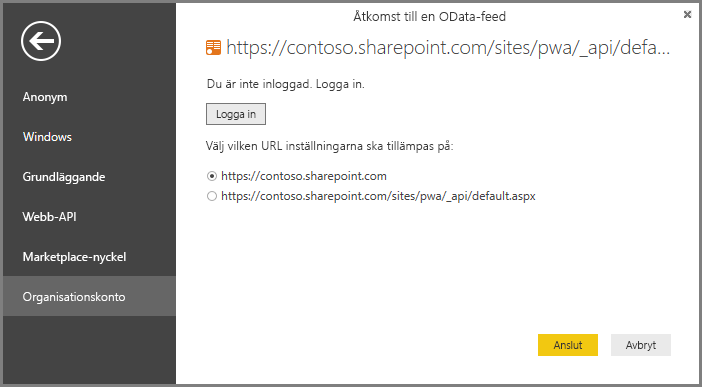

# Ansluta till Project Online-data via Power BI Desktop
Du kan ansluta till data i Project Online via Power BI Desktop.

## Steg 1: Ladda ner Power BI Desktop
1. [Ladda ner Power BI Desktop](https://go.microsoft.com/fwlink/?LinkID=521662), kör sedan installationsprogrammet för att hämta **Power BI Desktop** på din datorn.

## Steg 2: Anslut till Project Online med OData
1. Öppna **Power BI Desktop**.
2. På *välkomstskärmen* väljer du **Hämta data**.
3. Välj **OData-flöde** och välj **Anslut**.
4. Ange adressen för ditt OData-flöde i URL-rutan och klicka sedan på OK.
   
   Om adressen till Project Web App-webbplatsen liknar *https://\<tenantname\>.sharepoint.com/sites/pwa* så blir den adress du anger för OData-flödet *https://\<tenantname\>.sharepoint.com/sites/pwa\_api/Projectdata*.
   
   I det här exemplet använder vi:

    `https://contoso.sharepoint.com/sites/pwa/default.aspx`

5. Power BI Desktop ber dig att autentisera med ditt arbets- eller skolkonto. Välj organisationskonto och ange dina autentiseringsuppgifter.
   
   

Det konto som du använder för att ansluta till OData-flödet måste minst ha åtkomst genom portföljvyn för Project Web App-webbplatsen. 

Härifrån kan du välja vilka tabeller du vill ansluta till och skapa en fråga.  Vill du ha en uppfattning om hur du kommer igång?  Följande blogginlägg visar hur du skapar ett burndown-diagram från dina Project Online-data.  Blogginlägget refererar till att använda Power Query för att ansluta till Project Online, men detta gäller även för Power BI Desktop.

[Skapa burndown-diagram för projekt med hjälp av Power Pivot och Power Query](https://blogs.office.com/2014/03/24/creating-burndown-charts-for-project-using-power-pivot-and-power-query/)

